# System Overview

High-level view of the AI Learning Hub system context — who interacts with what.

```mermaid
flowchart TB
    subgraph Users["👤 Users"]
        Stephen["🧑‍💻 Stephen<br/>(Admin)"]
        Stefania["📊 Stefania<br/>(Analyst)"]
        Friends["👥 Friends<br/>(Users)"]
    end

    subgraph Clients["📱 Client Applications"]
        PWA["🌐 React PWA<br/>(Desktop/Mobile)"]
        Shortcut["📲 iOS Shortcut<br/>(Quick Capture)"]
        Agents["🤖 LLM/AI Agents<br/>(API Consumers)"]
    end

    subgraph Platform["☁️ AI Learning Hub Platform"]
        APIGW["🚪 API Gateway"]

        subgraph APIs["Lambda Functions"]
            CoreAPI["📦 Core APIs<br/>/saves, /projects, /search"]
            AdminAPI["🔧 Admin APIs<br/>/admin/*"]
            AnalyticsAPI["📈 Analytics APIs<br/>/analytics/*"]
        end

        subgraph Async["Async Processing"]
            EB["📡 EventBridge"]
            SF["⚙️ Step Functions<br/>(3 Pipelines)"]
        end

        subgraph Storage["Data Storage"]
            DDB[("🗄️ DynamoDB<br/>(7 Tables)")]
            S3[("📁 S3<br/>(Notes Storage)")]
        end

        subgraph Observability["Observability"]
            CW["📊 CloudWatch<br/>(Metrics + Logs)"]
            XRay["🔍 X-Ray<br/>(Tracing)"]
        end
    end

    subgraph External["🌍 External Services"]
        Clerk["🔐 Clerk<br/>(Authentication)"]
        YouTube["▶️ YouTube API"]
        GitHub["🐙 GitHub API"]
        RSS["📰 RSS Feeds"]
    end

    %% User → Client connections
    Stephen --> PWA
    Stephen --> Agents
    Stefania --> PWA
    Friends --> PWA
    Friends --> Shortcut

    %% Client → API connections
    PWA -->|"JWT Auth"| APIGW
    Shortcut -->|"API Key"| APIGW
    Agents -->|"API Key"| APIGW

    %% API Gateway routing
    APIGW --> CoreAPI
    APIGW --> AdminAPI
    APIGW --> AnalyticsAPI

    %% API → Storage
    CoreAPI --> DDB
    CoreAPI --> S3
    AdminAPI --> DDB
    AnalyticsAPI --> CW

    %% Async flow
    CoreAPI -->|"Events"| EB
    EB --> SF
    SF --> DDB
    SF --> External

    %% Auth
    PWA -.->|"OAuth"| Clerk
    APIGW -.->|"Verify JWT"| Clerk

    %% Observability
    APIs --> CW
    APIs --> XRay

    %% Styling
    classDef user fill:#e1f5fe,stroke:#01579b
    classDef client fill:#f3e5f5,stroke:#4a148c
    classDef api fill:#e8f5e9,stroke:#1b5e20
    classDef storage fill:#fff3e0,stroke:#e65100
    classDef external fill:#fce4ec,stroke:#880e4f

    class Stephen,Stefania,Friends user
    class PWA,Shortcut,Agents client
    class CoreAPI,AdminAPI,AnalyticsAPI api
    class DDB,S3 storage
    class Clerk,YouTube,GitHub,RSS external
```

## Key Relationships

| From | To | Mechanism |
|------|-----|-----------|
| PWA | API Gateway | Clerk JWT in Authorization header |
| iOS Shortcut | API Gateway | API Key in x-api-key header |
| LLM Agents | API Gateway | API Key in x-api-key header |
| API Gateway | Clerk | JWT verification |
| Core APIs | EventBridge | Entity change events |
| Step Functions | External APIs | URL enrichment |
