# User Flows

User interaction flows for mobile (iOS Shortcut) and desktop (PWA) entry points.

## Mobile Quick Capture Flow

The critical path — must complete in <3 seconds (excluding cold start).

## Desktop Web Flow

Full-featured web application experience.

```mermaid
sequenceDiagram
    autonumber
    participant User as 👤 User
    participant PWA as 🌐 React PWA
    participant Clerk as 🔐 Clerk
    participant API as 🚪 API Gateway
    participant Auth as 🔐 JWT Authorizer
    participant Lambda as ⚡ Lambda Functions
    participant DDB as 🗄️ DynamoDB
    participant S3 as 📁 S3

    User->>PWA: Open app

    alt Not logged in
        PWA->>Clerk: Redirect to login
        Clerk-->>PWA: JWT token
    end

    Note over PWA: JWT stored in memory

    User->>PWA: View saves list
    PWA->>API: GET /saves<br/>Authorization: Bearer [jwt]
    API->>Auth: Verify JWT
    Auth->>Clerk: Validate token
    Clerk-->>Auth: Claims (userId, role)
    Auth-->>API: userId in context

    API->>Lambda: Invoke
    Lambda->>DDB: Query (saves table)
    DDB-->>Lambda: Items
    Lambda-->>API: 200 OK { items: [...] }
    API-->>PWA: Response
    PWA-->>User: Display saves grid

    User->>PWA: Click project, edit notes
    PWA->>API: PUT /projects/:id/notes<br/>{ content: "# My notes..." }
    API->>Lambda: Invoke
    Lambda->>S3: PutObject (markdown)
    Lambda->>DDB: Update notesS3Key
    Lambda-->>API: 200 OK
    API-->>PWA: Response
    PWA-->>User: ✅ Notes saved
```

## Android Web Share Target Flow

Progressive enhancement for Android users.

```mermaid
sequenceDiagram
    autonumber
    participant User as 👤 Android User
    participant App as 📱 Any App
    participant Share as 📤 Share Sheet
    participant PWA as 🌐 PWA (installed)
    participant SW as ⚙️ Service Worker
    participant API as 🚪 API Gateway

    User->>App: Long press link
    App->>Share: Open share sheet
    Share->>PWA: Share to "AI Learning Hub"

    PWA->>SW: Intercept share target POST

    alt Online
        SW->>API: POST /saves { url }
        API-->>SW: 201 Created
        SW-->>PWA: Success
        PWA-->>User: ✅ Saved!
    else Offline
        SW->>SW: Queue in IndexedDB
        SW-->>PWA: Queued for sync
        PWA-->>User: 📶 Will save when online

        Note over SW: Later, when online...
        SW->>API: POST /saves { url }
        API-->>SW: 201 Created
    end
```

## User Flow Summary

| Flow | Entry Point | Auth Method | Target Latency |
|------|-------------|-------------|----------------|
| Mobile Capture | iOS Shortcut | API Key | <3 seconds |
| Desktop Browse | React PWA | Clerk JWT | <1 second |
| Android Share | PWA Share Target | Clerk JWT | <3 seconds |
| Agent Integration | Direct API | API Key | <1 second |
