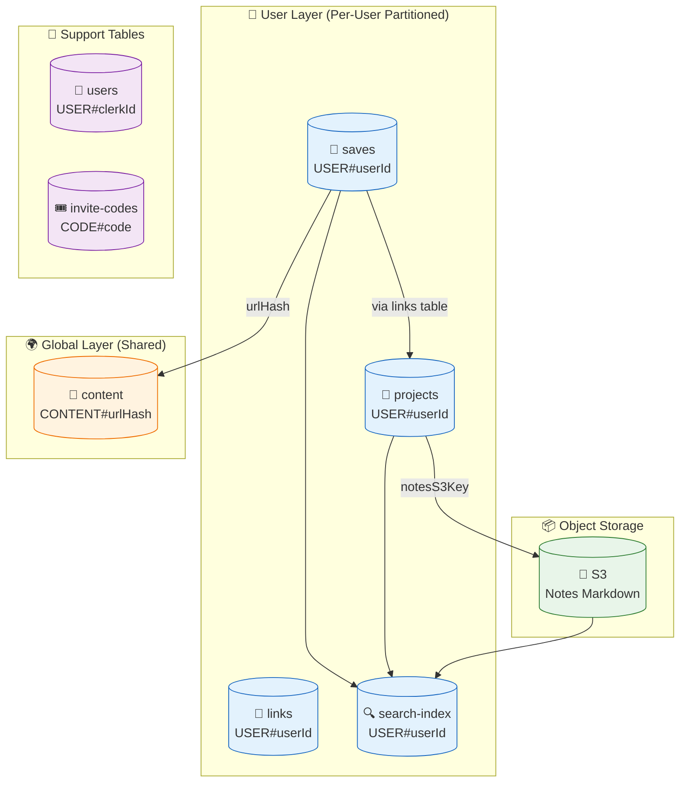
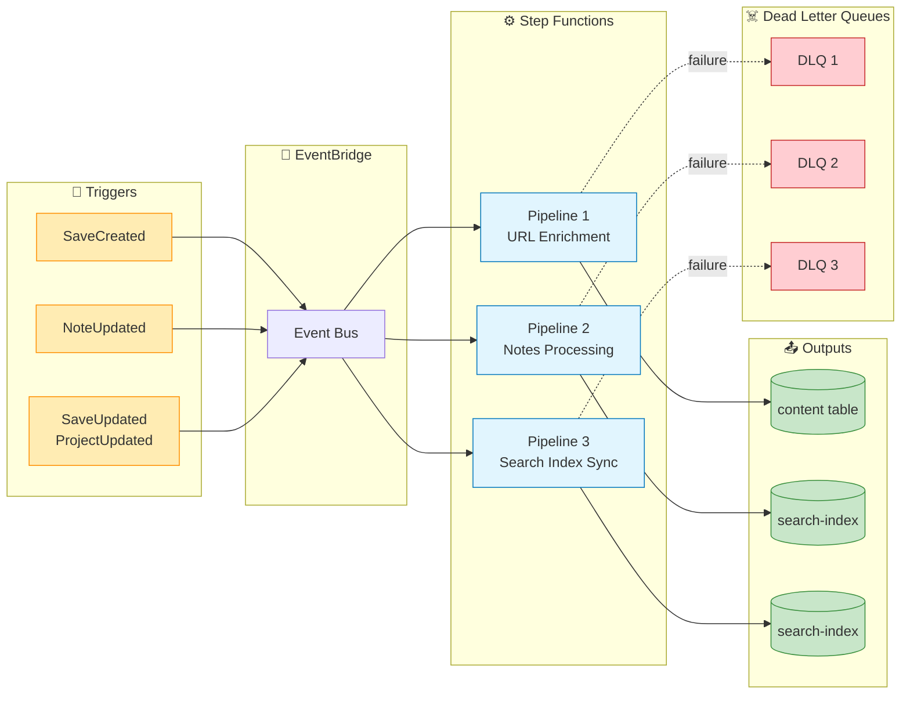
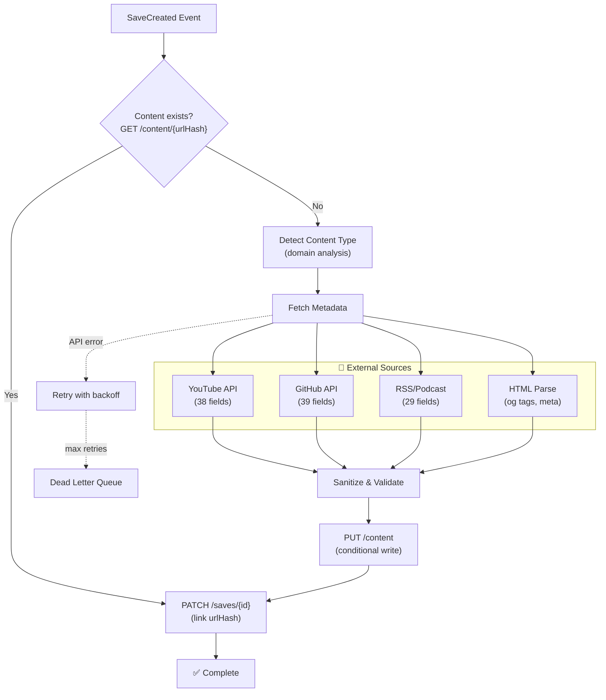
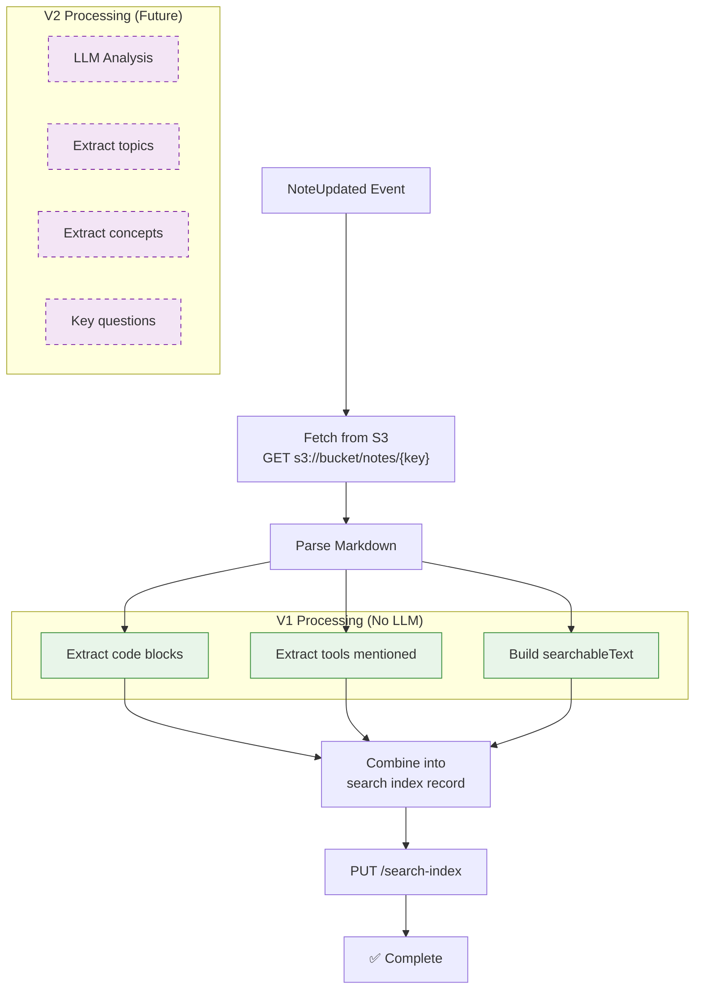
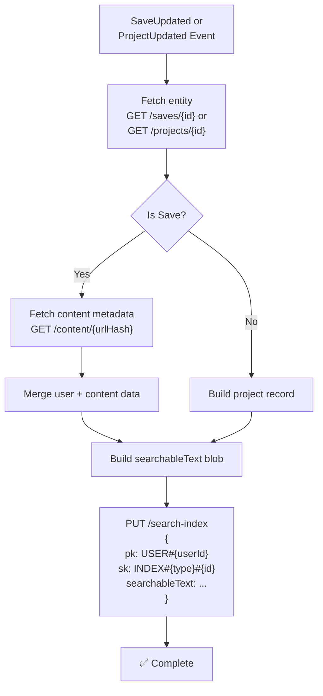

# Data & Pipeline Flow

How data moves through the system — from user actions to enriched, searchable content.

## Data Architecture Overview



## Three Async Processing Pipelines

Each pipeline is independent — failures in one don't affect others.



## Pipeline 1: URL Enrichment (Detailed)



## Pipeline 2: Notes Processing



## Pipeline 3: Search Index Sync



## Data Flow Summary

| Event | Pipeline | Input | Output | External Calls |
|-------|----------|-------|--------|----------------|
| SaveCreated | URL Enrichment | URL | content table | YouTube, GitHub, RSS |
| NoteUpdated | Notes Processing | S3 key | search-index | None |
| SaveUpdated | Search Index Sync | Save ID | search-index | None |
| ProjectUpdated | Search Index Sync | Project ID | search-index | None |

## Failure Isolation

```
┌─────────────────────────────────────────────────────────┐
│           PIPELINE FAILURE ISOLATION                     │
├─────────────────────────────────────────────────────────┤
│                                                          │
│  YouTube API down?                                       │
│  └─▶ URL Enrichment fails → DLQ                         │
│  └─▶ Notes Processing continues ✓                        │
│  └─▶ Search Index Sync continues ✓                       │
│  └─▶ User's saves still work ✓                           │
│                                                          │
│  S3 temporarily unavailable?                             │
│  └─▶ Notes Processing fails → DLQ                        │
│  └─▶ URL Enrichment continues ✓                          │
│  └─▶ Search Index Sync continues ✓                       │
│  └─▶ User's saves still work ✓                           │
│                                                          │
└─────────────────────────────────────────────────────────┘
```
