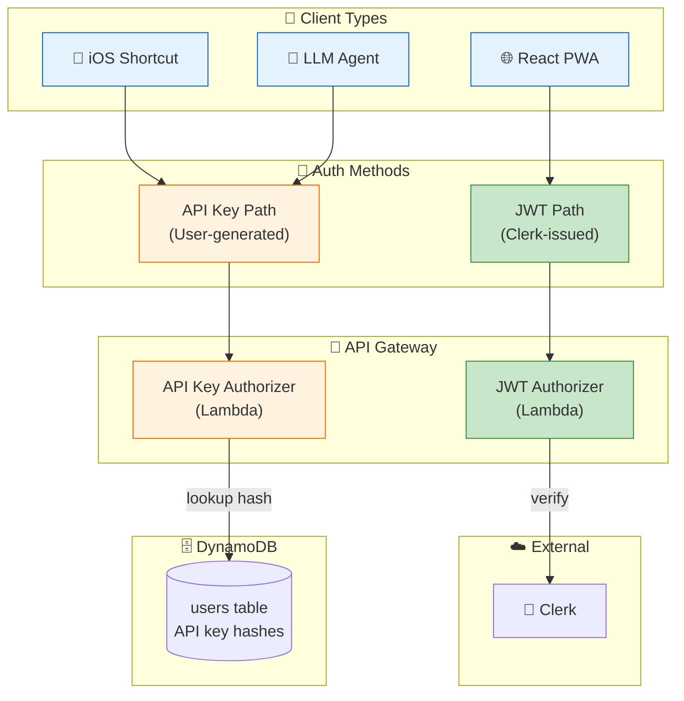
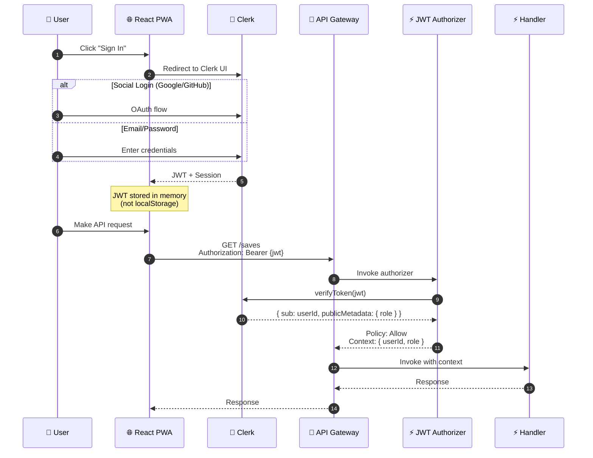
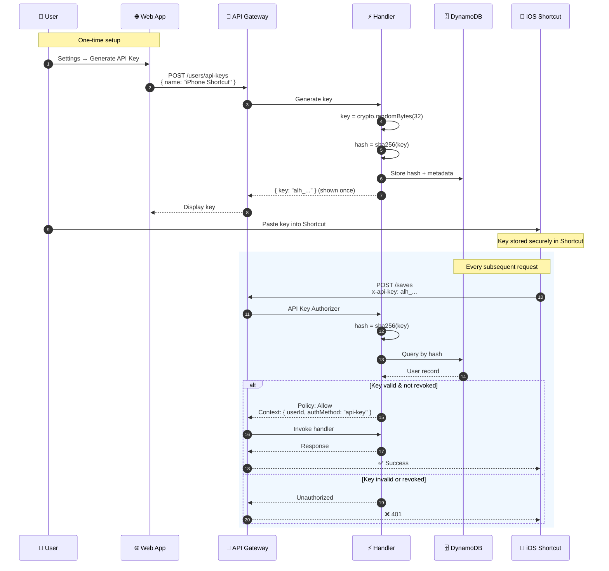
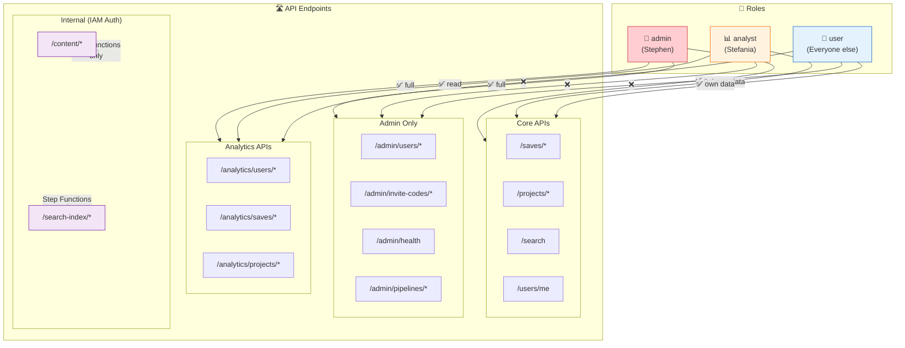
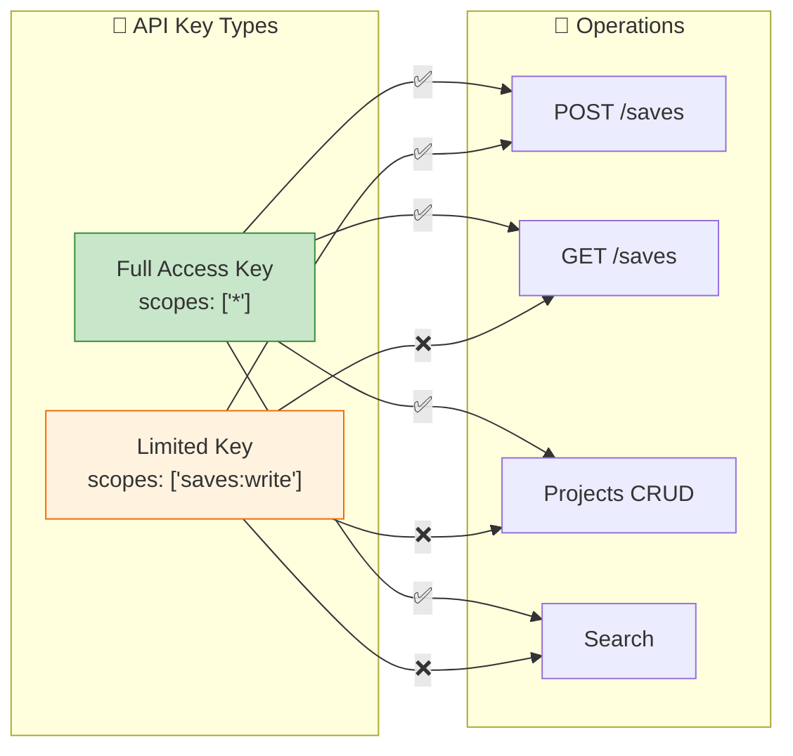

# Authentication & Access Control

How authentication works across different client types and how access is controlled.

## Two Authentication Paths



## JWT Authentication Flow (Web App)



## API Key Authentication Flow (Shortcut/Agents)



## Role-Based Access Control



## API Key Scopes



## Access Control Summary

| Path | Admin | Analyst | User | API Key | Step Function |
|------|-------|---------|------|---------|---------------|
| `/saves/*` | ✅ own | ✅ own | ✅ own | ✅ (scoped) | ❌ |
| `/projects/*` | ✅ own | ✅ own | ✅ own | ✅ (scoped) | ❌ |
| `/search` | ✅ own | ✅ own | ✅ own | ✅ (scoped) | ❌ |
| `/users/me` | ✅ | ✅ | ✅ | ✅ | ❌ |
| `/admin/*` | ✅ | ❌ | ❌ | ❌ | ❌ |
| `/analytics/*` | ✅ | ✅ | ❌ | ❌ | ❌ |
| `/content/*` | ❌ | ❌ | ❌ | ❌ | ✅ (IAM) |
| `/search-index/*` | ❌ | ❌ | ❌ | ❌ | ✅ (IAM) |

## Security Boundaries

```
┌─────────────────────────────────────────────────────────┐
│                  SECURITY BOUNDARIES                     │
├─────────────────────────────────────────────────────────┤
│                                                          │
│  User Data Isolation:                                    │
│  └─▶ Every user query partitioned by USER#{userId}      │
│  └─▶ Cannot access other users' data                    │
│  └─▶ Enforced at application layer + DynamoDB PK        │
│                                                          │
│  API Key Security:                                       │
│  └─▶ Keys shown once, never stored plaintext            │
│  └─▶ SHA256 hash stored in DynamoDB                     │
│  └─▶ Keys can be revoked instantly                      │
│  └─▶ lastUsedAt tracked for audit                       │
│                                                          │
│  Internal APIs:                                          │
│  └─▶ IAM auth only (SigV4)                              │
│  └─▶ No user-facing access                              │
│  └─▶ Step Function role has explicit permissions        │
│                                                          │
└─────────────────────────────────────────────────────────┘
```
