# Observability & Analytics

How metrics flow from events to dashboards to agent-consumable APIs.

## Observability Stack Overview

```mermaid
flowchart TB
    subgraph Sources["📊 Metric Sources"]
        Lambda["⚡ Lambda Functions"]
        APIGW["🚪 API Gateway"]
        SF["⚙️ Step Functions"]
        DDB["🗄️ DynamoDB"]
    end

    subgraph Collection["📥 Collection Layer"]
        EMF["📝 Embedded Metrics<br/>(EMF)"]
        Logs["📋 Structured Logs"]
        XRay["🔍 X-Ray Traces"]
        SFMetrics["📈 Built-in Metrics"]
    end

    subgraph CloudWatch["☁️ CloudWatch"]
        Metrics["📊 Metrics"]
        LogsInsights["🔍 Logs Insights"]
        Alarms["🚨 Alarms"]
    end

    subgraph Dashboards["📺 Dashboards"]
        OpsDash["🔧 Operational<br/>(4 dashboards)"]
        AnalyticsDash["📈 Analytics<br/>(5 dashboards)"]
    end

    subgraph Consumers["🤖 Consumers"]
        Admin["👤 Admin<br/>(Stephen)"]
        Analyst["📊 Analyst<br/>(Stefania)"]
        Agents["🤖 LLM Agents"]
    end

    subgraph APIs["🛣️ Analytics APIs"]
        AnalyticsEndpoints["/analytics/*<br/>(28 endpoints)"]
    end

    %% Sources → Collection
    Lambda --> EMF
    Lambda --> Logs
    Lambda --> XRay
    APIGW --> Logs
    APIGW --> XRay
    SF --> SFMetrics
    SF --> XRay
    DDB --> Metrics

    %% Collection → CloudWatch
    EMF --> Metrics
    Logs --> LogsInsights
    SFMetrics --> Metrics

    %% CloudWatch → Dashboards
    Metrics --> OpsDash
    Metrics --> AnalyticsDash
    LogsInsights --> AnalyticsDash

    %% CloudWatch → Alarms
    Metrics --> Alarms
    Alarms -->|"P1: SMS"| Admin
    Alarms -->|"P2: Email"| Admin

    %% Dashboards → Consumers
    OpsDash --> Admin
    AnalyticsDash --> Admin
    AnalyticsDash --> Analyst

    %% Analytics API path
    Metrics --> AnalyticsEndpoints
    LogsInsights --> AnalyticsEndpoints
    AnalyticsEndpoints --> Agents
    AnalyticsEndpoints --> Admin
    AnalyticsEndpoints --> Analyst

    %% Styling
    classDef source fill:#e3f2fd,stroke:#1565c0
    classDef collection fill:#fff3e0,stroke:#ef6c00
    classDef cw fill:#f3e5f5,stroke:#7b1fa2
    classDef consumer fill:#c8e6c9,stroke:#388e3c
    classDef api fill:#ffecb3,stroke:#ff8f00

    class Lambda,APIGW,SF,DDB source
    class EMF,Logs,XRay,SFMetrics collection
    class Metrics,LogsInsights,Alarms cw
    class Admin,Analyst,Agents consumer
    class AnalyticsEndpoints api
```

## Embedded Metrics Format (EMF) Pattern

```mermaid
sequenceDiagram
    autonumber
    participant Lambda as ⚡ Lambda
    participant EMF as 📝 EMF
    participant CW as ☁️ CloudWatch
    participant Dash as 📺 Dashboard
    participant API as 🛣️ Analytics API
    participant Agent as 🤖 Agent

    Lambda->>Lambda: Handle request

    Lambda->>EMF: metrics.putMetric('SavesCreated', 1)
    Lambda->>EMF: metrics.setDimensions({<br/>  contentType: 'youtube',<br/>  userId: 'user_123'<br/>})

    Note over EMF: Outputs structured JSON<br/>to stdout

    EMF-->>CW: Auto-ingested by<br/>CloudWatch agent

    Note over CW: Metrics available<br/>within ~1 minute

    CW-->>Dash: Real-time visualization

    Agent->>API: GET /analytics/saves/by-type
    API->>CW: Query metrics
    CW-->>API: { youtube: 42, podcast: 17 }
    API-->>Agent: JSON response
```

## Structured Logging Pattern

```mermaid
flowchart LR
    subgraph Lambda["⚡ Lambda Handler"]
        Log["logger.info({<br/>  action: 'save_created',<br/>  userId: 'user_123',<br/>  saveId: 'save_456',<br/>  contentType: 'youtube',<br/>  durationMs: 127<br/>})"]
    end

    subgraph CloudWatch["☁️ CloudWatch Logs"]
        LogGroup["/aws/lambda/saves-api"]
    end

    subgraph Insights["🔍 Logs Insights"]
        Query["fields @timestamp, userId, action<br/>| filter action = 'save_created'<br/>| stats count() by contentType"]
    end

    subgraph Analytics["📊 Analytics API"]
        Endpoint["GET /analytics/saves/by-type"]
    end

    Lambda --> LogGroup
    LogGroup --> Query
    Query --> Endpoint
```

## X-Ray Distributed Tracing

## Tiered Alerting System

## Analytics Data Flow (API-First)

```mermaid
flowchart TB
    subgraph Events["📊 Events"]
        SaveEvents["SaveCreated<br/>SaveUpdated"]
        ProjectEvents["ProjectCreated<br/>ProjectUpdated"]
        AuthEvents["Login<br/>API Key Used"]
        SearchEvents["SearchPerformed"]
    end

    subgraph Processing["⚡ Processing"]
        EMF["EMF Metrics"]
        Logs["Structured Logs"]
    end

    subgraph Storage["☁️ CloudWatch"]
        MetricsStore["Metrics<br/>(15 months)"]
        LogsStore["Logs<br/>(30 days)"]
    end

    subgraph Analytics["🛣️ Analytics API"]
        subgraph UserMetrics["User Metrics"]
            U1["GET /analytics/users/summary"]
            U2["GET /analytics/users/active"]
            U3["GET /analytics/users/retention"]
        end

        subgraph SaveMetrics["Save Metrics"]
            S1["GET /analytics/saves/volume"]
            S2["GET /analytics/saves/by-type"]
            S3["GET /analytics/saves/by-domain"]
        end

        subgraph ProjectMetrics["Project Metrics"]
            P1["GET /analytics/projects/volume"]
            P2["GET /analytics/projects/activity"]
        end
    end

    subgraph Consumers["🤖 API Consumers"]
        Agents["LLM/AI Agents"]
        Dashboards["Custom Dashboards"]
        Automation["Automation Scripts"]
    end

    Events --> Processing
    Processing --> Storage

    Storage --> UserMetrics
    Storage --> SaveMetrics
    Storage --> ProjectMetrics

    Analytics --> Consumers

    %% Styling
    classDef api fill:#c8e6c9,stroke:#388e3c

    class U1,U2,U3,S1,S2,S3,P1,P2 api
```

## Dashboard Organization

### Operational Dashboards (4)

```mermaid
flowchart LR
    subgraph Ops["🔧 Operational Dashboards"]
        D1["📊 API Health<br/>• Request rate<br/>• Error rate<br/>• Latency p50/p95/p99"]

        D2["⚙️ Pipeline Status<br/>• Executions/hour<br/>• Success rate<br/>• DLQ depth"]

        D3["🗄️ Database Health<br/>• Read/Write capacity<br/>• Throttling events<br/>• Item counts"]

        D4["💰 Cost Tracking<br/>• Lambda invocations<br/>• DynamoDB RCU/WCU<br/>• S3 storage"]
    end
```

### Analytics Dashboards (5)

```mermaid
flowchart LR
    subgraph Analytics["📈 Analytics Dashboards"]
        D1["👥 User Engagement<br/>• DAU/WAU/MAU<br/>• Session duration<br/>• Feature usage"]

        D2["📦 Content Metrics<br/>• Saves by type<br/>• Top domains<br/>• Enrichment success"]

        D3["📁 Project Activity<br/>• Active projects<br/>• Saves per project<br/>• Status distribution"]

        D4["📚 Tutorial Funnel<br/>• saved → started<br/>• started → completed<br/>• Completion rate"]

        D5["🔍 Search Analytics<br/>• Query volume<br/>• Zero results<br/>• Top terms"]
    end
```

## Analytics API → Agent Integration

## Summary

| Layer | Component | Purpose |
|-------|-----------|---------|
| Collection | EMF | Custom metrics from Lambda |
| Collection | Structured Logs | Query-able event logs |
| Collection | X-Ray | Distributed tracing |
| Storage | CloudWatch Metrics | Time-series data (15 months) |
| Storage | CloudWatch Logs | Event logs (30 days) |
| Alerting | CloudWatch Alarms | Tiered notifications |
| Visualization | Dashboards | Real-time monitoring |
| API | /analytics/* | Programmatic access for agents |

**Key Principle (ADR-014):** Analytics APIs exist for agent consumption, not just human dashboards. Every metric accessible via dashboard is also accessible via API.
