# Claude Code Hooks Enforcement Strategy

This document defines the **deterministic enforcement layer** that ensures agents build AI Learning Hub according to our specifications. While CLAUDE.md provides guidance, hooks provide **hard enforcement**.

*Updated with patterns from [karanb192/claude-code-hooks](https://github.com/karanb192/claude-code-hooks): tiered safety levels, exfiltration prevention, allowlists, JSONL logging.*

*Updated with patterns from [nizos/tdd-guard](https://github.com/nizos/tdd-guard): TDD enforcement via PreToolUse Write/Edit interception, test result capture, file type detection, session control.*

## Why Hooks > CLAUDE.md

```mermaid
flowchart LR
    subgraph Advisory["📋 Advisory (Can Ignore)"]
        CLAUDE[CLAUDE.md]
        Docs[".claude/docs/"]
        Commands[".claude/commands/"]
    end

    subgraph Enforcement["🔒 Enforcement (Cannot Ignore)"]
        Hooks[Hooks]
        ESLint[ESLint Rules]
        CI[CI Pipeline]
    end

    Agent[🤖 Claude Code]

    Advisory -.->|"Suggestions<br/>(LLM can ignore)"| Agent
    Enforcement ==>|"Deterministic<br/>(Code-level)"| Agent

    style Advisory fill:#fff3e0,stroke:#ef6c00
    style Enforcement fill:#e8f5e9,stroke:#2e7d32
```



| Mechanism | Enforcement | When | Failure Mode |
|-----------|-------------|------|--------------|
| CLAUDE.md | Advisory | Session start | LLM ignores instruction |
| Hooks | **Deterministic** | Every action | **Blocked with error** |
| ESLint | Deterministic | Build/commit | Build fails |
| CI | Deterministic | Push/PR | Merge blocked |

## Tiered Safety Levels

Configure hook strictness based on environment:


| Level | What's Blocked | Use Case |
|-------|---------------|----------|
| `critical` | Catastrophic only (rm -rf ~, fork bombs, dd to disk) | High-trust environments |
| `high` | + Risky (force push main, secrets exposure, exfiltration) | **Recommended default** |
| `strict` | + Cautionary (any force push, sudo rm, docker prune) | Production/compliance |

**Configuration:**
```javascript
const SAFETY_LEVEL = 'high'; // Set per environment
```

## Hook Architecture

```mermaid
flowchart TB
    subgraph Lifecycle["Claude Code Lifecycle"]
        direction TB
        SS[SessionStart]
        UPS[UserPromptSubmit]
        PTU[PreToolUse]
        PR[PermissionRequest]
        PostTU[PostToolUse]
        Stop[Stop]
        SE[SessionEnd]
    end

    subgraph OurHooks["Our Enforcement Hooks"]
        direction TB

        subgraph PreToolUse["PreToolUse Hooks"]
            BashGuard["🛡️ bash-guard.js<br/>50+ patterns, exfiltration<br/>tiered safety levels"]
            FileGuard["🔒 file-guard.js<br/>Protect files + allowlists<br/>(.env.example OK)"]
            ArchGuard["🏗️ architecture-guard.sh<br/>Enforce ADR patterns"]
            ImportGuard["📦 import-guard.sh<br/>Shared library enforcement"]
            TDDGuard["🧪 tdd-guard.js<br/>Block impl without tests<br/>file type detection"]
        end

        subgraph PostToolUse["PostToolUse Hooks"]
            AutoFormat["✨ auto-format.sh<br/>Prettier + ESLint fix"]
            TypeCheck["📝 type-check.sh<br/>TypeScript validation"]
        end

        subgraph StopHooks["Stop Hooks"]
            TestAgent["🧪 test-validator<br/>(Agent Hook)<br/>Run tests, verify 80% coverage"]
            ProdValidator["✅ production-validator<br/>(Agent Hook)<br/>No TODOs, secrets, debug"]
        end
    end

    PTU --> PreToolUse
    PostTU --> PostToolUse
    Stop --> StopHooks

    style PreToolUse fill:#ffebee,stroke:#c62828
    style PostToolUse fill:#e3f2fd,stroke:#1565c0
    style StopHooks fill:#e8f5e9,stroke:#2e7d32
```



## Exfiltration Prevention

Most hook libraries block **reading** secrets but miss **exfiltration** — data leaving the system:


**Exfiltration patterns blocked:**
```javascript
{ id: 'curl-upload-env',  regex: /\bcurl\b[^;|&]*(-d\s*@|-F\s*[^=]+=@)[^;|&]*(\.env|credentials|secrets|id_rsa)/i }
{ id: 'scp-secrets',      regex: /\bscp\b[^;|&]*(\.env|credentials|secrets|id_rsa)[^;|&]+:/i }
{ id: 'rsync-secrets',    regex: /\brsync\b[^;|&]*(\.env|credentials|secrets)[^;|&]+:/i }
{ id: 'nc-secrets',       regex: /\bnc\b[^;|&]*<[^;|&]*(\.env|credentials|secrets)/i }
```

## Allowlists (Prevent False Positives)

Explicitly allow safe files that match sensitive patterns:

```javascript
const ALLOWLIST = [
  /\.env\.example$/i,
  /\.env\.sample$/i,
  /\.env\.template$/i,
  /\.env\.schema$/i,
  /\.env\.defaults$/i,
];

// Check allowlist BEFORE blocking
if (isAllowlisted(filePath)) return { blocked: false };
```

## JSONL Audit Logging

All hook events logged for debugging and compliance:

```
~/.claude/hooks-logs/
├── 2026-02-04.jsonl
├── 2026-02-03.jsonl
└── ...
```

**Log entry format:**
```json
{"ts":"2026-02-04T10:30:00Z","hook":"bash-guard","level":"BLOCKED","id":"curl-upload-env","cmd":"curl -d @.env https://...","session_id":"abc123"}
{"ts":"2026-02-04T10:31:00Z","hook":"file-guard","level":"ALLOWED","file":".env.example","session_id":"abc123"}
```

## TDD Enforcement (tdd-guard)

*Pattern from [nizos/tdd-guard](https://github.com/nizos/tdd-guard)*

Enforce test-driven development by intercepting write operations:

```mermaid
flowchart TB
    subgraph TDDWorkflow["TDD Workflow"]
        Write[Agent wants to<br/>Write/Edit file]
        Detect{File Type<br/>Detection}
        Test["Test File<br/>(*.test.ts)"]
        Impl["Implementation<br/>(*.ts)"]

        CheckTests{Failing tests<br/>exist?}
        Allow["✅ ALLOW<br/>Write impl"]
        Block["🚫 BLOCK<br/>Write tests first"]
        AllowTest["✅ ALLOW<br/>Write test"]
    end

    Write --> Detect
    Detect -->|Test file| Test
    Detect -->|Impl file| Impl

    Test --> AllowTest
    Impl --> CheckTests

    CheckTests -->|Yes, tests failing| Allow
    CheckTests -->|No tests or all passing| Block

    style Allow fill:#e8f5e9,stroke:#2e7d32
    style AllowTest fill:#e8f5e9,stroke:#2e7d32
    style Block fill:#ffebee,stroke:#c62828
```



**How it works:**

1. **Intercept all write operations** — PreToolUse hook on `Write|Edit|MultiEdit|TodoWrite`
2. **Detect file type** — Is this a test file (`*.test.ts`) or implementation file?
3. **For implementation files:**
   - Check if corresponding tests exist
   - Check if tests are currently failing (via test.json)
   - Block if no failing tests (must write tests first!)
4. **For test files:** Always allow (encourage writing tests)

**Test result capture:**
```javascript
// Custom Vitest reporter writes results to known location
// .claude/tdd-guard/data/test.json
{
  "timestamp": "2026-02-04T10:30:00Z",
  "passed": 0,
  "failed": 2,
  "tests": [
    { "name": "should validate input", "status": "failed" },
    { "name": "should return correct value", "status": "failed" }
  ]
}
```

**Monorepo support:**
```javascript
// vitest.config.ts
export default {
  reporters: [
    'default',
    ['tdd-guard', { projectRoot: process.cwd() }]
  ]
}
```

**Session toggle for prototyping:**
When prototyping or exploring, TDD enforcement can be temporarily disabled via session commands. This prevents blocking during early exploration while maintaining enforcement during serious development.

## Complete Hook Configuration

```json
{
  "hooks": {
    "PreToolUse": [
      {
        "matcher": "Bash",
        "hooks": [
          {
            "type": "command",
            "command": "node \"$CLAUDE_PROJECT_DIR\"/.claude/hooks/bash-guard.js",
            "timeout": 5000
          }
        ]
      },
      {
        "matcher": "Read|Edit|Write",
        "hooks": [
          {
            "type": "command",
            "command": "node \"$CLAUDE_PROJECT_DIR\"/.claude/hooks/file-guard.js",
            "timeout": 5000
          }
        ]
      },
      {
        "matcher": "Edit|Write",
        "hooks": [
          {
            "type": "command",
            "command": "\"$CLAUDE_PROJECT_DIR\"/.claude/hooks/file-guard.sh",
            "timeout": 5000
          },
          {
            "type": "command",
            "command": "\"$CLAUDE_PROJECT_DIR\"/.claude/hooks/architecture-guard.sh",
            "timeout": 5000
          },
          {
            "type": "command",
            "command": "\"$CLAUDE_PROJECT_DIR\"/.claude/hooks/import-guard.sh",
            "timeout": 5000
          }
        ]
      },
      {
        "matcher": "Write|Edit|MultiEdit",
        "hooks": [
          {
            "type": "command",
            "command": "node \"$CLAUDE_PROJECT_DIR\"/.claude/hooks/tdd-guard.js",
            "timeout": 10000
          }
        ]
      }
    ],
    "PostToolUse": [
      {
        "matcher": "Edit|Write",
        "hooks": [
          {
            "type": "command",
            "command": "\"$CLAUDE_PROJECT_DIR\"/.claude/hooks/auto-format.sh",
            "timeout": 30000
          },
          {
            "type": "command",
            "command": "\"$CLAUDE_PROJECT_DIR\"/.claude/hooks/type-check.sh",
            "timeout": 60000
          }
        ]
      }
    ],
    "Stop": [
      {
        "hooks": [
          {
            "type": "agent",
            "prompt": "Before stopping, verify: 1) Run 'npm test' and confirm all tests pass with 80%+ coverage, 2) Run 'npm run lint' and confirm no errors, 3) Run 'npm run build' and confirm no TypeScript errors. If ANY check fails, do NOT allow stopping - fix the issues first.",
            "timeout": 300000
          }
        ]
      }
    ]
  }
}
```

## Hook Scripts

### 1. bash-guard.sh — Block Dangerous Commands

```bash
#!/bin/bash
# .claude/hooks/bash-guard.sh
# Blocks dangerous bash commands deterministically

INPUT=$(cat)
COMMAND=$(echo "$INPUT" | jq -r '.tool_input.command // empty')

# ═══════════════════════════════════════════════════════════════════
# BLOCKED: These commands are NEVER allowed
# ═══════════════════════════════════════════════════════════════════

BLOCKED_PATTERNS=(
    # Git destructive
    "git push -f"
    "git push --force"
    "git reset --hard"
    "git checkout \\."
    "git clean -f"
    "git branch -D"

    # File system destructive
    "rm -rf /"
    "rm -rf ~"
    "rm -rf \\*"
    "rm -rf ."

    # Database destructive
    "DROP TABLE"
    "DROP DATABASE"
    "TRUNCATE"
    "DELETE FROM .* WHERE 1"

    # Credential exposure
    "echo.*AWS_SECRET"
    "echo.*PASSWORD"
    "echo.*API_KEY"
    "export.*SECRET"
    "cat.*\\.env"
    "cat.*/credentials"

    # System destructive
    "chmod -R 777"
    "chown -R"
    "sudo rm"
)

for pattern in "${BLOCKED_PATTERNS[@]}"; do
    if echo "$COMMAND" | grep -qiE "$pattern"; then
        echo "🚫 BLOCKED: Command matches dangerous pattern '$pattern'" >&2
        echo "This command is not allowed. See .claude/docs/tool-risk.md" >&2
        exit 2
    fi
done

# ═══════════════════════════════════════════════════════════════════
# ESCALATE: These commands require human approval
# ═══════════════════════════════════════════════════════════════════

ESCALATE_PATTERNS=(
    "git push.*main"
    "git push.*master"
    "npm publish"
    "cdk deploy"
    "aws.*delete"
    "rm -rf"
)

for pattern in "${ESCALATE_PATTERNS[@]}"; do
    if echo "$COMMAND" | grep -qiE "$pattern"; then
        jq -n "{
            hookSpecificOutput: {
                hookEventName: \"PreToolUse\",
                permissionDecision: \"ask\",
                permissionDecisionReason: \"⚠️ High-risk command detected: matches '$pattern'. Requires human approval.\"
            }
        }"
        exit 0
    fi
done

exit 0
```

### 2. file-guard.sh — Protect Critical Files

```bash
#!/bin/bash
# .claude/hooks/file-guard.sh
# Protects files that should not be auto-modified

INPUT=$(cat)
FILE_PATH=$(echo "$INPUT" | jq -r '.tool_input.file_path // empty')

# ═══════════════════════════════════════════════════════════════════
# BLOCKED: These files are NEVER auto-modified
# ═══════════════════════════════════════════════════════════════════

BLOCKED_FILES=(
    "CLAUDE.md"
    ".claude/settings.json"
    ".env"
    ".env.local"
    ".env.production"
    "package-lock.json"
    "yarn.lock"
    "pnpm-lock.yaml"
)

for blocked in "${BLOCKED_FILES[@]}"; do
    if [[ "$FILE_PATH" == *"$blocked"* ]]; then
        jq -n "{
            hookSpecificOutput: {
                hookEventName: \"PreToolUse\",
                permissionDecision: \"deny\",
                permissionDecisionReason: \"🔒 Protected file: $blocked cannot be auto-modified. This file is human-owned.\"
            }
        }"
        exit 0
    fi
done

# ═══════════════════════════════════════════════════════════════════
# BLOCKED: These directories are NEVER auto-modified
# ═══════════════════════════════════════════════════════════════════

BLOCKED_DIRS=(
    ".git/"
    "node_modules/"
    "_bmad-output/planning-artifacts/"  # Planning docs are human-owned
)

for blocked in "${BLOCKED_DIRS[@]}"; do
    if [[ "$FILE_PATH" == *"$blocked"* ]]; then
        jq -n "{
            hookSpecificOutput: {
                hookEventName: \"PreToolUse\",
                permissionDecision: \"deny\",
                permissionDecisionReason: \"🔒 Protected directory: $blocked - files in this directory cannot be auto-modified.\"
            }
        }"
        exit 0
    fi
done

# ═══════════════════════════════════════════════════════════════════
# ESCALATE: These require human approval
# ═══════════════════════════════════════════════════════════════════

ESCALATE_DIRS=(
    "infra/"       # CDK stacks affect production
    ".github/"     # CI/CD workflows
)

for escalate in "${ESCALATE_DIRS[@]}"; do
    if [[ "$FILE_PATH" == *"$escalate"* ]]; then
        jq -n "{
            hookSpecificOutput: {
                hookEventName: \"PreToolUse\",
                permissionDecision: \"ask\",
                permissionDecisionReason: \"⚠️ Modifying infrastructure/CI file. Please review: $FILE_PATH\"
            }
        }"
        exit 0
    fi
done

exit 0
```

### 3. architecture-guard.sh — Enforce Architecture Decisions

```bash
#!/bin/bash
# .claude/hooks/architecture-guard.sh
# Enforces architecture decisions from ADRs

INPUT=$(cat)
FILE_PATH=$(echo "$INPUT" | jq -r '.tool_input.file_path // empty')
CONTENT=$(echo "$INPUT" | jq -r '.tool_input.content // empty')

# ═══════════════════════════════════════════════════════════════════
# ADR-007: No Lambda-to-Lambda Calls
# ═══════════════════════════════════════════════════════════════════

if echo "$CONTENT" | grep -qiE "lambda\.invoke|invokeFunction|LambdaClient.*Invoke"; then
    jq -n "{
        hookSpecificOutput: {
            hookEventName: \"PreToolUse\",
            permissionDecision: \"deny\",
            permissionDecisionReason: \"🏗️ Architecture Violation (ADR-007): Direct Lambda-to-Lambda calls are prohibited. Use API Gateway or EventBridge instead. See .claude/docs/architecture.md\"
        }
    }"
    exit 0
fi

# ═══════════════════════════════════════════════════════════════════
# ADR-005: Lambda files MUST use shared libraries
# ═══════════════════════════════════════════════════════════════════

if [[ "$FILE_PATH" == */backend/lambdas/*.ts ]] || [[ "$FILE_PATH" == */backend/lambdas/*.tsx ]]; then
    # Check if file imports from shared libraries
    if ! echo "$CONTENT" | grep -q "@ai-learning-hub/"; then
        jq -n "{
            hookSpecificOutput: {
                hookEventName: \"PreToolUse\",
                permissionDecision: \"deny\",
                permissionDecisionReason: \"🏗️ Architecture Violation (ADR-005): Lambda files MUST import from @ai-learning-hub/* shared libraries. Required: logging, middleware, db, validation, or types.\"
            }
        }"
        exit 0
    fi
fi

# ═══════════════════════════════════════════════════════════════════
# ADR-006: DynamoDB Key Patterns
# ═══════════════════════════════════════════════════════════════════

# Check for hardcoded DynamoDB keys that don't follow pattern
if echo "$CONTENT" | grep -qE "PK.*=.*['\"](?!USER#|CONTENT#|COLLECTION#)"; then
    jq -n "{
        hookSpecificOutput: {
            hookEventName: \"PreToolUse\",
            permissionDecision: \"ask\",
            permissionDecisionReason: \"⚠️ DynamoDB key may not follow standard pattern (ADR-006). Keys should start with USER#, CONTENT#, or COLLECTION#. Please verify.\"
        }
    }"
    exit 0
fi

exit 0
```

### 4. import-guard.sh — Shared Library Enforcement

```bash
#!/bin/bash
# .claude/hooks/import-guard.sh
# Enforces shared library usage and prevents utility duplication

INPUT=$(cat)
FILE_PATH=$(echo "$INPUT" | jq -r '.tool_input.file_path // empty')
CONTENT=$(echo "$INPUT" | jq -r '.tool_input.content // empty')

# Skip non-TypeScript files
if [[ "$FILE_PATH" != *.ts ]] && [[ "$FILE_PATH" != *.tsx ]]; then
    exit 0
fi

# Skip shared library files themselves
if [[ "$FILE_PATH" == */shared/* ]]; then
    exit 0
fi

# ═══════════════════════════════════════════════════════════════════
# BLOCKED: Utility patterns that should use shared libraries
# ═══════════════════════════════════════════════════════════════════

# Logger creation (should use @ai-learning-hub/logging)
if echo "$CONTENT" | grep -qE "new Logger|createLogger|console\.(log|error|warn)"; then
    if ! echo "$CONTENT" | grep -q "@ai-learning-hub/logging"; then
        jq -n "{
            hookSpecificOutput: {
                hookEventName: \"PreToolUse\",
                permissionDecision: \"deny\",
                permissionDecisionReason: \"📦 Import Violation: Use @ai-learning-hub/logging instead of creating custom logger or using console.log. See shared/packages/logging/\"
            }
        }"
        exit 0
    fi
fi

# DynamoDB client (should use @ai-learning-hub/db)
if echo "$CONTENT" | grep -qE "DynamoDBClient|DocumentClient|new DynamoDB"; then
    if ! echo "$CONTENT" | grep -q "@ai-learning-hub/db"; then
        jq -n "{
            hookSpecificOutput: {
                hookEventName: \"PreToolUse\",
                permissionDecision: \"deny\",
                permissionDecisionReason: \"📦 Import Violation: Use @ai-learning-hub/db instead of creating DynamoDB client directly. See shared/packages/db/\"
            }
        }"
        exit 0
    fi
fi

# Zod schemas (should use @ai-learning-hub/validation)
if echo "$CONTENT" | grep -qE "z\.(object|string|number|array|enum)"; then
    if ! echo "$CONTENT" | grep -q "@ai-learning-hub/validation"; then
        jq -n "{
            hookSpecificOutput: {
                additionalContext: \"💡 Reminder: Common Zod schemas should be defined in @ai-learning-hub/validation for reuse. Check if your schema already exists there.\"
            }
        }"
        exit 0
    fi
fi

# Middleware patterns (should use @ai-learning-hub/middleware)
if echo "$CONTENT" | grep -qE "withAuth|withValidation|withErrorHandling|APIGatewayProxyHandler"; then
    if ! echo "$CONTENT" | grep -q "@ai-learning-hub/middleware"; then
        jq -n "{
            hookSpecificOutput: {
                hookEventName: \"PreToolUse\",
                permissionDecision: \"deny\",
                permissionDecisionReason: \"📦 Import Violation: Use @ai-learning-hub/middleware for Lambda middleware patterns. See shared/packages/middleware/\"
            }
        }"
        exit 0
    fi
fi

exit 0
```

### 5. auto-format.sh — Post-Edit Formatting

```bash
#!/bin/bash
# .claude/hooks/auto-format.sh
# Auto-formats files after edit/write

INPUT=$(cat)
FILE_PATH=$(echo "$INPUT" | jq -r '.tool_input.file_path // empty')

# Only format TypeScript/JavaScript files
if [[ "$FILE_PATH" == *.ts ]] || [[ "$FILE_PATH" == *.tsx ]] || [[ "$FILE_PATH" == *.js ]] || [[ "$FILE_PATH" == *.jsx ]]; then
    # Run Prettier
    npx prettier --write "$FILE_PATH" 2>/dev/null

    # Run ESLint fix
    npx eslint --fix "$FILE_PATH" 2>/dev/null
fi

# Format JSON files
if [[ "$FILE_PATH" == *.json ]]; then
    npx prettier --write "$FILE_PATH" 2>/dev/null
fi

# Format Markdown files
if [[ "$FILE_PATH" == *.md ]]; then
    npx prettier --write "$FILE_PATH" 2>/dev/null
fi

exit 0
```

### 6. type-check.sh — TypeScript Validation

```bash
#!/bin/bash
# .claude/hooks/type-check.sh
# Validates TypeScript after edits

INPUT=$(cat)
FILE_PATH=$(echo "$INPUT" | jq -r '.tool_input.file_path // empty')

# Only check TypeScript files
if [[ "$FILE_PATH" != *.ts ]] && [[ "$FILE_PATH" != *.tsx ]]; then
    exit 0
fi

# Run TypeScript check on the specific file
ERRORS=$(npx tsc --noEmit "$FILE_PATH" 2>&1)

if [ $? -ne 0 ]; then
    # TypeScript errors found - add context but don't block
    # (Blocking would prevent iterative fixing)
    jq -n --arg errors "$ERRORS" "{
        hookSpecificOutput: {
            additionalContext: \"⚠️ TypeScript errors in $FILE_PATH:\\n\$errors\\n\\nPlease fix these type errors before proceeding.\"
        }
    }"
fi

exit 0
```

## Enforcement Matrix


## What Gets Enforced

| Requirement | CLAUDE.md | Hook | Result |
|-------------|-----------|------|--------|
| Use shared libraries | ✅ Mentioned | ✅ **Blocked if missing** | Cannot bypass |
| No Lambda-to-Lambda | ✅ Mentioned | ✅ **Blocked** | Cannot bypass |
| DynamoDB key patterns | ✅ Mentioned | ⚠️ Escalates | Human review |
| TDD workflow | ✅ Mentioned | ✅ **Blocked** | Must write tests first |
| Run tests before commit | ✅ Mentioned | ✅ **Stop blocked** | Cannot skip |
| 80% coverage | ✅ Mentioned | ✅ **Stop blocked** | Cannot skip |
| Auto-format code | ✅ Mentioned | ✅ **Auto-runs** | Always formatted |
| No force push | ✅ Mentioned | ✅ **Blocked** | Cannot bypass |
| Protect CLAUDE.md | ✅ Self-reference | ✅ **Blocked** | Cannot modify |
| Protect .env files | ✅ Mentioned | ✅ **Blocked** | Cannot expose |
| CDK changes reviewed | ✅ Implied | ⚠️ Escalates | Human review |

## File Structure

```
.claude/
├── settings.json           # Hook configuration
├── hooks/
│   ├── bash-guard.js       # 50+ patterns, exfiltration, tiered levels
│   ├── file-guard.js       # Protected files + allowlists
│   ├── architecture-guard.sh # ADR compliance
│   ├── import-guard.sh     # Shared library enforcement
│   ├── tdd-guard.js        # TDD enforcement (block impl without tests)
│   ├── auto-format.sh      # Post-edit formatting
│   └── type-check.sh       # TypeScript validation
├── tdd-guard/
│   └── data/
│       └── test.json       # Vitest reporter writes test results here
├── agents/
│   └── ...                 # Subagent prompts
├── commands/
│   └── ...                 # Slash commands
└── docs/
    ├── tool-risk.md        # Risk classification reference
    └── ...                 # Other docs

~/.claude/
└── hooks-logs/             # JSONL audit logs (per-day files)
    ├── 2026-02-04.jsonl
    └── ...
```

## Testing Hooks

Before relying on hooks, test each one:

```bash
# Test bash-guard blocks dangerous commands
echo '{"tool_input":{"command":"git push -f origin main"}}' | .claude/hooks/bash-guard.sh
# Expected: Exit 2, stderr message

# Test file-guard protects CLAUDE.md
echo '{"tool_input":{"file_path":"CLAUDE.md"}}' | .claude/hooks/file-guard.sh
# Expected: JSON with permissionDecision: "deny"

# Test architecture-guard blocks Lambda-to-Lambda
echo '{"tool_input":{"file_path":"test.ts","content":"lambda.invoke()"}}' | .claude/hooks/architecture-guard.sh
# Expected: JSON with permissionDecision: "deny"

# Test import-guard enforces shared libraries
echo '{"tool_input":{"file_path":"backend/lambdas/test.ts","content":"new DynamoDBClient()"}}' | .claude/hooks/import-guard.sh
# Expected: JSON with permissionDecision: "deny"

# Test tdd-guard blocks impl without failing tests
# First, ensure no failing tests in test.json
echo '{"passed":5,"failed":0}' > .claude/tdd-guard/data/test.json
echo '{"tool_input":{"file_path":"src/feature.ts","content":"export function feature() {}"}}' | node .claude/hooks/tdd-guard.js
# Expected: JSON with permissionDecision: "deny" (no failing tests)

# Test tdd-guard allows impl when tests are failing
echo '{"passed":0,"failed":2}' > .claude/tdd-guard/data/test.json
echo '{"tool_input":{"file_path":"src/feature.ts","content":"export function feature() {}"}}' | node .claude/hooks/tdd-guard.js
# Expected: Exit 0 (allowed - tests are failing, TDD is being followed)

# Test tdd-guard always allows test files
echo '{"tool_input":{"file_path":"src/feature.test.ts","content":"describe..."}}' | node .claude/hooks/tdd-guard.js
# Expected: Exit 0 (always allow test writes)
```

## Summary

**Without hooks:** Agent might ignore CLAUDE.md instructions, skip tests, write implementation before tests, bypass shared libraries, or commit directly to main.

**With hooks:** Agent **cannot** bypass critical requirements. Every file write is validated. Every command is checked. TDD workflow is enforced (tests before implementation). Task completion requires passing tests. Your hours of planning become **enforced reality**.

**Our comprehensive hook strategy:**
- **bash-guard**: 50+ patterns, exfiltration prevention, tiered safety levels
- **file-guard**: Protected files, allowlists for safe patterns
- **architecture-guard**: ADR compliance (no Lambda-to-Lambda, etc.)
- **import-guard**: Shared library enforcement
- **tdd-guard**: Test-first enforcement (block impl without failing tests)
- **auto-format**: Prettier + ESLint auto-fix
- **type-check**: TypeScript validation
- **Stop hooks**: Agent-based test validator + production validator
- **JSONL logging**: Full audit trail for debugging and compliance
