# Agentic Development Workflow

This document describes how Claude Code and its subagents are used to **build** AI Learning Hub — not the product's runtime architecture.

## Overview: Two Contexts

```mermaid
flowchart TB
    subgraph DevTime["🛠️ DEVELOPMENT TIME (What Epic 1 Enables)"]
        direction TB
        Human["👤 Human Developer"]
        CC["🤖 Claude Code"]

        subgraph Subagents["Specialist Subagents"]
            CR["code-reviewer"]
            TE["test-expert"]
            DB["debugger"]
            AR["architect"]
            PV["production-validator"]
        end

        subgraph DevArtifacts["Development Artifacts"]
            Code["Source Code"]
            Tests["Tests"]
            Docs["Documentation"]
        end

        Human <--> CC
        CC <--> Subagents
        CC --> DevArtifacts
    end

    subgraph RunTime["⚡ RUNTIME (What V1 Product Does)"]
        direction TB
        User["👤 End User"]
        API["API Gateway"]
        Lambda["Lambda Functions"]
        DDB["DynamoDB"]

        User --> API --> Lambda --> DDB
    end

    DevArtifacts -.->|"deploys to"| RunTime

    style DevTime fill:#e8f5e9,stroke:#2e7d32
    style RunTime fill:#e3f2fd,stroke:#1565c0
```

## Development Workflow: Story Implementation

How Claude Code and subagents work together to implement a story:

## Subagent Relationships & Responsibilities

```mermaid
flowchart TB
    subgraph ClaudeCode["🤖 Claude Code (Orchestrator)"]
        direction TB
        Planning["📋 Planning<br/>(Plan Mode)"]
        Execution["⚡ Execution<br/>(Code/Edit)"]
        Coordination["🔄 Coordination<br/>(Delegates to Subagents)"]
    end

    subgraph Specialists["Specialist Subagents"]
        direction TB

        subgraph ReadOnly["🔒 Read-Only Access"]
            CR["🔍 code-reviewer<br/>─────────────<br/>Model: Sonnet<br/>Tools: Read, Grep, Glob<br/>─────────────<br/>• Security analysis<br/>• Pattern compliance<br/>• Code quality"]

            PV["✅ production-validator<br/>─────────────<br/>Model: Sonnet<br/>Tools: Read, Grep, Glob<br/>─────────────<br/>• TODO detection<br/>• Debug statements<br/>• Hardcoded secrets"]
        end

        subgraph EditAccess["✏️ Edit Access"]
            TE["🧪 test-expert<br/>─────────────<br/>Model: Sonnet<br/>Tools: Read, Write, Edit, Bash<br/>─────────────<br/>• TDD workflow<br/>• Test generation<br/>• Coverage analysis"]

            DB["🐛 debugger<br/>─────────────<br/>Model: Opus<br/>Tools: Read, Edit, Bash, Grep<br/>─────────────<br/>• Root cause analysis<br/>• Systematic debugging<br/>• Fix implementation"]

            AR["🏗️ architect<br/>─────────────<br/>Model: Opus<br/>Tools: Read, Write, Edit<br/>─────────────<br/>• System design<br/>• ADR creation<br/>• Pattern decisions"]
        end
    end

    ClaudeCode --> CR
    ClaudeCode --> PV
    ClaudeCode --> TE
    ClaudeCode --> DB
    ClaudeCode --> AR

    subgraph Context["📚 Shared Context Layer"]
        CLAUDE["CLAUDE.md<br/>(Essential rules)"]
        DOCS[".claude/docs/<br/>(Progressive disclosure)"]
        PROGRESS["progress.md<br/>(Session continuity)"]
    end

    ClaudeCode --> Context
    Specialists --> Context

    style ReadOnly fill:#fff3e0,stroke:#ef6c00
    style EditAccess fill:#e3f2fd,stroke:#1565c0
```

## Epic 1 Story Flow

How the 14 Epic 1 stories build the agentic development foundation:

## Context Preservation Strategy

How context flows across sessions and stories:

```mermaid
flowchart TB
    subgraph SessionN["Session N"]
        Work1["Work on Story 3.1"]
        Update1["Update progress.md"]
        Commit1["Commit to Git"]
    end

    subgraph SessionN1["Session N+1"]
        Load2["Load CLAUDE.md"]
        Read2["Read progress.md"]
        Continue2["Continue Story 3.1"]
    end

    subgraph Persistence["Persistence Layer"]
        Git["📁 Git Repository<br/>─────────────<br/>• Source code<br/>• .claude/ configs<br/>• progress.md files"]

        GitHub["🐙 GitHub<br/>─────────────<br/>• Issues (stories)<br/>• PRs (reviews)<br/>• Actions (CI/CD)"]
    end

    Work1 --> Update1 --> Commit1
    Commit1 --> Git
    Git --> Load2
    Load2 --> Read2 --> Continue2

    Git <--> GitHub

    Note1["No RAG, S3, or SQL needed<br/>for development context.<br/>Git IS the context store."]

    style Persistence fill:#f3e5f5,stroke:#7b1fa2
```

## What We're NOT Building (Clarification)

