# /bmad-bmm-auto-epic Workflow Diagram

## Overview

This diagram visualizes the autonomous epic implementation workflow with multi-agent code review loop.

## Main Workflow

## Multi-Agent Code Review Loop (Phase 2.5)

```mermaid
flowchart TD
    Start([Enter Review Loop]) --> InitRound[Round = 1]
    InitRound --> SpawnReviewer

    SpawnReviewer[Spawn Reviewer Agent<br/>Fresh Context]
    SpawnReviewer --> RunCodeReview[Run /bmad-bmm-code-review]
    RunCodeReview --> CreateFindings[Create Findings Document<br/>docs/.../findings-round-N.md]

    CreateFindings --> CountFindings{MUST-FIX<br/>Count?}

    CountFindings -->|0| Clean[✅ Clean State!]
    Clean --> UpdatePR[Add Review Summary to PR]
    UpdatePR --> ExitLoop([Exit Loop: Success])

    CountFindings -->|> 0| CheckRound{Round < 3?}

    CheckRound -->|Yes| SpawnFixer[Spawn Fixer Agent<br/>With Context]
    SpawnFixer --> ReadFindings[Read Findings Document]
    ReadFindings --> FixIssues[Fix Each Issue<br/>Critical → Important → Minor]
    FixIssues --> RunTestsAfterFix[Run Tests After Each Fix]
    RunTestsAfterFix --> CommitFixes[Commit Fixes<br/>fix: address review round N]
    CommitFixes --> IncrementRound[Round++]
    IncrementRound --> SpawnReviewer

    CheckRound -->|No| MaxRounds[❌ Max Rounds Exceeded]
    MaxRounds --> UpdateStatus[Mark as blocked-review<br/>in sprint-status.yaml]
    UpdateStatus --> EscalateHuman[Escalate to Human]

    EscalateHuman --> HumanChoice{Human<br/>Choice?}
    HumanChoice -->|Manual Fix| ManualWork[Human Fixes Issues]
    ManualWork --> ExitLoop2([Exit Loop: Manual])
    HumanChoice -->|Accept Anyway| AcceptWithIssues[Mark Complete with Issues]
    AcceptWithIssues --> ExitLoop3([Exit Loop: Accepted])
    HumanChoice -->|One More Round| OverrideLimit[Override Limit]
    OverrideLimit --> SpawnReviewer

    style Start fill:#e1e5ff
    style ExitLoop fill:#e1f5e1
    style ExitLoop2 fill:#fff4e1
    style ExitLoop3 fill:#ffe8f0
    style Clean fill:#e1f5e1
    style MaxRounds fill:#ffe1e1
    style SpawnReviewer fill:#e8f0ff
    style SpawnFixer fill:#ffe8f0
```

## Review Findings Document Structure

## Agent Roles and Separation

## Dependency Graph Example

## State Transitions

## Integration Checkpoint Flow

```mermaid
flowchart TD
    Start([Story with Dependents Complete]) --> GetChanges[Get Actual Changed Files<br/>via git diff]
    GetChanges --> FindDependents[Find Dependent Stories]
    FindDependents --> CheckOverlaps[Check File Overlaps]

    CheckOverlaps --> HasOverlap{File<br/>Overlaps?}
    HasOverlap -->|Yes| WarnOverlap[⚠️ Warn: File Overlap]
    HasOverlap -->|No| CheckTypes

    WarnOverlap --> CheckTypes[Check Type/Interface Changes]
    CheckTypes --> HasTypeChange{Type<br/>Changes?}

    HasTypeChange -->|Yes| WarnTypes[⚠️ Warn: Type Changes]
    HasTypeChange -->|No| RunAcceptance

    WarnTypes --> RunAcceptance[Re-run Acceptance Tests]
    RunAcceptance --> TestsPass{Tests<br/>Pass?}

    TestsPass -->|No| Error[❌ Escalate: Tests Failing]
    TestsPass -->|Yes| Green[✅ Green: Continue]

    Error --> End([Human Decision])
    Green --> End

    style Start fill:#ffe8f0
    style Green fill:#e1f5e1
    style Error fill:#ffe1e1
    style WarnOverlap fill:#fff4e1
    style WarnTypes fill:#fff4e1
```

## Coverage Gate Logic

```mermaid
flowchart TD
    Start([Tests Complete]) --> GetCoverage[Extract Coverage from Test Results]
    GetCoverage --> CheckGate{Coverage<br/>Gate Type?}

    CheckGate -->|no-decrease| ComparePrevious[Compare with Previous Coverage]
    CheckGate -->|min-N%| CheckMin[Check if >= N%]
    CheckGate -->|story-override| UseStoryGate[Use coverage_gate from Story YAML]

    ComparePrevious --> Decreased{Coverage<br/>Decreased?}
    Decreased -->|Yes| Fail1[❌ Fail: Coverage Decreased]
    Decreased -->|No| Pass1[✅ Pass: Coverage OK]

    CheckMin --> BelowMin{Below<br/>Min?}
    BelowMin -->|Yes| Fail2[❌ Fail: Below Minimum]
    BelowMin -->|No| Pass2[✅ Pass: Above Minimum]

    UseStoryGate --> CheckGate

    Fail1 --> StopHook[Stop Hook Blocks Completion]
    Fail2 --> StopHook
    Pass1 --> AllowContinue[Allow Story to Continue]
    Pass2 --> AllowContinue

    style Pass1 fill:#e1f5e1
    style Pass2 fill:#e1f5e1
    style Fail1 fill:#ffe1e1
    style Fail2 fill:#ffe1e1
```

## Key Features Summary

### ✅ Safety Invariants
- Never auto-merge PRs (human review required)
- Never bypass hooks (TDD, architecture, shared libs enforced)
- Never force push (standard git push only)
- Never skip tests (coverage gates enforced)

### 🔄 Multi-Agent Architecture
- **Agent 1**: Epic orchestrator (main context)
- **Agents 2-7**: Review/fix cycles (fresh context per review)
- **Separation**: Reviewers have NO implementation context (prevents bias)
- **Handoff**: Findings documents as protocol between agents

### 📊 Quality Convergence
- Max 3 review rounds per story
- Clean state: 0 MUST-FIX findings (Minor issues acceptable)
- Escalation: Human intervention after round 3
- Metrics: Review rounds, findings fixed, convergence rate tracked

### 🎯 Integration Checkpoints
- Triggered after stories with dependents
- Validates file overlaps, type changes, acceptance criteria
- Auto-escalates complex conflicts to human

### 🔄 State Management
- Primary: State file (orchestration decisions)
- Secondary: sprint-status.yaml, GitHub issues/PRs
- Resumable: `--resume` picks up from exact point
- Conflict resolution: State file wins for control flow
