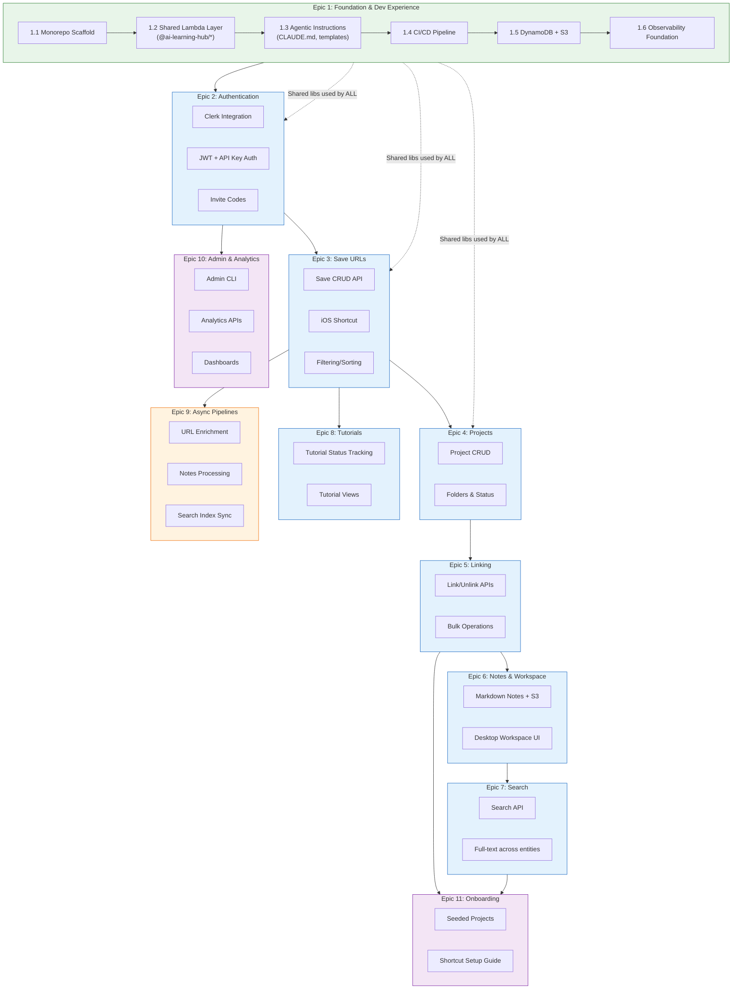

---
stepsCompleted:
  - step-01-validate-prerequisites
inputDocuments:
  - _bmad-output/planning-artifacts/prd.md
  - _bmad-output/planning-artifacts/architecture.md
  - _bmad-output/planning-artifacts/diagrams/01-system-overview.md
  - _bmad-output/planning-artifacts/diagrams/02-user-flows.md
  - _bmad-output/planning-artifacts/diagrams/03-data-pipeline-flow.md
  - _bmad-output/planning-artifacts/diagrams/04-authentication-access.md
  - _bmad-output/planning-artifacts/diagrams/05-observability-analytics.md
---

# ai-learning-hub - Epic Breakdown

## Overview

This document provides the complete epic and story breakdown for ai-learning-hub, decomposing the requirements from the PRD and Architecture into implementable stories.

## Requirements Inventory

### Functional Requirements

**User Management (9 FRs)**
- FR1: Users can sign up using social authentication (Google)
- FR2: Users can sign in using existing social authentication
- FR3: Users can sign out from all devices
- FR4: Users can view and edit their profile settings
- FR5: Users can generate API keys for programmatic access
- FR6: Users can revoke API keys immediately
- FR7: Users can generate capture-only API keys (limited to POST /saves only)
- FR8: Users can redeem invite codes during signup
- FR9: Existing users can generate invite codes to share

**Save Management (10 FRs)**
- FR10: Users can save URLs from any source (web, mobile share sheet, API)
- FR11: Users can view all their saves in a unified list
- FR12: Users can filter saves by resource type (podcast, blog, video, tutorial, etc.)
- FR13: Users can filter saves by project linkage (linked, unlinked)
- FR14: Users can search saves by title and source
- FR15: Users can delete saves
- FR16: Users can edit save metadata (title, notes, type)
- FR17: System automatically enriches saves with metadata (title, favicon, description)
- FR18: Users can view saves in three domain views (Resource Library, Tutorial Tracker, My Projects)
- FR19: Users can sort saves by date saved, date last accessed, or title

**Project Management (13 FRs)**
- FR20: Users can create new projects
- FR21: Users can view all their projects
- FR22: Users can edit project details (name, description, status)
- FR23: Users can delete projects
- FR24: Users can organize projects into folders
- FR25: Users can change project status (exploring, building, paused, completed)
- FR26: Users can add Markdown notes to projects
- FR27: Users can view and edit project notes with Markdown rendering
- FR28: Users can tag projects with custom tags
- FR29: Users can filter projects by status
- FR30: Users can filter projects by folder
- FR31: Users can search projects by name and tags
- FR32: Users can sort projects by date created, date modified, or title

**Resource-Project Linking (6 FRs)**
- FR33: Users can link saves to projects
- FR34: Users can unlink saves from projects
- FR35: Users can view all saves linked to a specific project
- FR36: Users can view which projects a save is linked to
- FR37: Users can link multiple saves to a project in a single action (desktop only)
- FR38: Users can link a save to multiple projects

**Tutorial Lifecycle (5 FRs)**
- FR39: Users can mark a save as a tutorial
- FR40: Users can track tutorial status (saved, started, in-progress, completed)
- FR41: Users can view all tutorials across projects
- FR42: Users can filter tutorials by status
- FR43: Users can add completion notes to tutorials

**Mobile Capture (4 FRs)**
- FR44: Users can save URLs via iOS Shortcut (share sheet integration)
- FR45: Users can save URLs via PWA share target (Android)
- FR46: Mobile save confirms success within 3 seconds
- FR47: Users can quick-save without opening the full app

**Desktop Workspace (4 FRs)**
- FR48: Users can view project workspace with linked resources and notes side-by-side
- FR49: Users can paste LLM conversations into project notes
- FR50: Users can view project screenshots optimized for sharing
- FR51: Users can manage all projects from a single dashboard

**Search & Discovery (4 FRs)**
- FR52: Users can perform full-text search across saves
- FR53: Users can perform full-text search across project names and tags
- FR54: Search results display within 2 seconds
- FR55: Users can search within project notes

**Onboarding (4 FRs)**
- FR56: New users see seeded starter projects with curated resources
- FR57: Users can explore starter projects without commitment
- FR58: Users can fork starter projects to customize
- FR59: Onboarding guides users through iOS Shortcut setup

**Admin & Operations (4 FRs)**
- FR60: Operators can view user activity via admin CLI
- FR61: Operators can view system health via admin CLI
- FR62: Operators can view analytics via admin CLI
- FR63: Operators can manage rate limits via configuration

**User Feedback (4 FRs)**
- FR64: System provides visual confirmation when save completes successfully
- FR65: System displays clear error messages when operations fail
- FR66: System displays helpful empty states when no content exists
- FR67: System indicates offline status when network unavailable

**Notes Processing (2 FRs)**
- FR68: System processes project notes via Processing API for search indexing
- FR69: Search queries processed note content via Search API

**Agentic Development Support (12 FRs)**
- FR70: Project includes CLAUDE.md (<200 lines) with essential commands, structure, conventions, and NEVER/ALWAYS rules
- FR71: Project includes .claude/ directory with progressive disclosure documentation, organized by topic
- FR72: Project includes custom slash commands for common workflows (fix-issue, create-lambda, create-component, run-tests, deploy)
- FR73: Project includes Claude Code hooks for auto-formatting after edits and blocking dangerous commands
- FR74: Each story includes progress.md template for session continuity; each epic has a summary progress file
- FR75: Implementation uses plan.md files as technical specs that persist across sessions
- FR76: GitHub issue templates structured for agent consumption (clear scope, acceptance criteria, related files, testing requirements)
- FR77: PR template includes checklist for agent-generated code review (security scan, test coverage, shared library usage, pattern compliance)
- FR78: Branch naming and commit conventions documented in CLAUDE.md and enforced via commit hooks
- FR79: CI pipeline includes agent-specific security scanning (OWASP dependency check, secrets detection, SAST)
- FR80: Shared library usage enforced via ESLint rules — imports must come from @ai-learning-hub/*
- FR81: Test requirements explicitly specified in each story with minimum coverage thresholds

### NonFunctional Requirements

**Performance (5 NFRs)**
- NFR-P1: Mobile save latency < 3 seconds (E2E test)
- NFR-P2: API response time (95th percentile) < 1 second (CloudWatch metrics)
- NFR-P3: Search response time < 2 seconds (E2E test)
- NFR-P4: Web app Time to Interactive < 4 seconds (Lighthouse)
- NFR-P5: Search index sync lag < 15 minutes (CloudWatch custom metric)

**Security (9 NFRs)**
- NFR-S1: Data encryption at rest - All user data encrypted (DynamoDB default encryption)
- NFR-S2: Data encryption in transit - TLS 1.2+ everywhere (CloudFront config, API Gateway settings)
- NFR-S3: API key storage - One-way hash, not recoverable (Security test)
- NFR-S4: Per-user data isolation - No cross-user data access possible (Integration tests, IAM review)
- NFR-S5: SSRF protection - Block private IPs, 5 second timeout, scheme validation (Security tests in CI)
- NFR-S6: Markdown sanitization - Allowlist-only rendering (Security tests)
- NFR-S7: Secrets management - All secrets in Parameter Store/Secrets Manager (CDK Nag)
- NFR-S8: API key redaction - Keys never in logs (Log audit)
- NFR-S9: Rate limit abuse protection - IP-based secondary limits (Integration test)

**Reliability (7 NFRs)**
- NFR-R1: API error rate < 1% (CloudWatch metrics)
- NFR-R2: Monthly uptime 99% excluding planned maintenance (CloudWatch synthetic)
- NFR-R3: Data durability - No data loss (DynamoDB PITR enabled)
- NFR-R4: Incident detection to alert < 5 minutes (Alarm configuration)
- NFR-R5: Mean time to recovery < 2 hours during waking hours (Incident log)
- NFR-R6: Deployment rollback < 10 minutes (CDK rollback test)
- NFR-R7: User data consistency - User sees own writes immediately (Strong consistency on user reads)

**Integration (3 NFRs)**
- NFR-I1: External API failure handling - Graceful degradation, retry with backoff (Integration tests)
- NFR-I2: YouTube API quota management - Respect limits, queue-based retry (Enrichment monitoring)
- NFR-I3: API contract stability - OpenAPI spec from tests, additive changes only (Contract tests in CI)

**Observability (5 NFRs)**
- NFR-O1: Request tracing - Correlation IDs via X-Ray (X-Ray service map)
- NFR-O2: Structured logging - JSON logs with correlation IDs (CloudWatch Logs Insights)
- NFR-O3: Alerting tiers - Critical (phone), Warning (email), Info (dashboard) (Alert configuration)
- NFR-O4: Dashboard coverage - 4 operational + 5 analytics dashboards (Dashboard checklist)
- NFR-O5: Alert actionability - Critical alerts include runbook link (Alert template review)

**Cost (3 NFRs)**
- NFR-C1: Monthly infrastructure cost < $50 at boutique scale (Billing alerts)
- NFR-C2: Cost per active user < $4/user/month (Cost allocation tags)
- NFR-C3: Billing alerts at $30, $40, $50 (AWS Budgets)

**User Experience Quality (1 NFR)**
- NFR-UX1: Graceful degradation - Clear error messages with retry option, no silent failures (E2E error scenario tests)

### Additional Requirements

**From Architecture Document:**

**Starter Template / Custom Scaffold (ADR-011, ADR-012)**
- Architecture specifies CUSTOM SCAFFOLD (no existing starter matches requirements)
- Must implement: Multi-table DynamoDB (7 tables), Multi-stack CDK (15+ stacks), EventBridge + Step Functions (3 pipelines), Clerk auth, 80% test coverage from day 1
- Project structure defined: /infra, /frontend, /backend workspaces

**Infrastructure Requirements (ADR-001 through ADR-006)**
- 7 DynamoDB tables with 10 GSIs
- Multi-stack CDK decomposition (core, auth, api, workflows, observability, pipeline)
- EventBridge + Step Functions for all async processing
- Lambda per concern architecture
- No Lambda-to-Lambda calls (all through API Gateway or EventBridge)
- Lambda Layers for shared code (ADR-015)

**Data Architecture (ADR-001, ADR-009, ADR-010)**
- Two-layer data model: User Layer (per-user partitioned) + Content Layer (global)
- Eventual consistency accepted between layers
- Search operates on processed substrate, not raw text
- S3 for large Markdown notes storage

**Three Processing Pipelines (ADR-003)**
- Pipeline 1: URL Enrichment (SaveCreated → content table)
- Pipeline 2: Notes Processing (NoteUpdated → search-index)
- Pipeline 3: Search Index Sync (SaveUpdated/ProjectUpdated → search-index)
- Each pipeline independent with own DLQ

**Authentication (ADR-013)**
- Clerk for all auth (JWT for web, API keys for Shortcut/agents)
- JWT Authorizer Lambda + API Key Authorizer Lambda
- Role-based access: admin, analyst, user
- Internal APIs use AWS IAM auth (Step Functions)

**API Specification**
- Core APIs: /saves, /projects, /folders, /search, /users
- Internal APIs: /content, /search-index (IAM auth only)
- Admin APIs: /admin/* (admin role only)
- Analytics APIs: /analytics/* (admin + analyst roles)
- Standardized error handling (ADR-008)
- API-first design philosophy (ADR-014)

**Observability Requirements**
- Embedded Metrics Format (EMF) for custom metrics
- Structured logging with correlation IDs
- X-Ray distributed tracing
- 4 operational dashboards + 5 analytics dashboards
- Tiered alerting (P1: SMS, P2: Email, P3: Dashboard)

**CI/CD Pipeline (ADR-007)**
- GitHub Actions with mandatory test gates
- Lint & Format → Type Check → Unit Tests (80% gate) → CDK Synth → Integration Tests → Contract Tests → Deploy Dev → E2E Tests (6 persona paths) → Deploy Prod
- CDK Nag for security/best-practice scanning

**Cold Start Acceptance (ADR-016)**
- Accept cold start latency in V1 (2-5 seconds first request)
- No provisioned concurrency in V1 (cost constraint)
- Document in user onboarding

**From Diagrams:**

**User Flow Requirements (02-user-flows.md)**
- Mobile Quick Capture Flow: Share sheet → iOS Shortcut → API → DynamoDB → EventBridge (< 3 seconds)
- Desktop Web Flow: PWA → Clerk auth → API Gateway → Lambda → DynamoDB/S3
- Android Web Share Target Flow: PWA share target → Service Worker → offline queue support

**Data Flow Requirements (03-data-pipeline-flow.md)**
- User Layer tables partitioned by USER#{userId}
- Content table partitioned by CONTENT#{urlHash}
- Pipeline failure isolation (one pipeline failure doesn't affect others)

**Access Control Requirements (04-authentication-access.md)**
- Two auth paths: JWT (web) and API Key (Shortcut/agents)
- API key scopes: full access ['*'] or limited ['saves:write']
- Security boundaries: user data isolation, API key hashing, internal API IAM auth

**Analytics Requirements (05-observability-analytics.md)**
- Analytics APIs for agent consumption (28 endpoints)
- CloudWatch Logs Insights queries for analytics
- Metrics retention: 15 months (metrics), 30 days (logs)

### FR Coverage Map

| FR | Epic | Description |
|----|------|-------------|
| FR1-FR9 | Epic 2 | User auth, API keys, invite codes |
| FR10-FR16 | Epic 3 | Save CRUD, filtering, metadata |
| FR17 | Epic 9 | Automatic enrichment |
| FR18 | Epic 8 | Tutorial Tracker view |
| FR19 | Epic 3 | Save sorting |
| FR20-FR25 | Epic 4 | Project CRUD, folders, status |
| FR26-FR27 | Epic 6 | Project notes |
| FR28-FR32 | Epic 4 | Project tags, filtering, sorting |
| FR33-FR38 | Epic 5 | Save-project linking |
| FR39-FR43 | Epic 8 | Tutorial lifecycle |
| FR44-FR47 | Epic 3 | Mobile capture |
| FR48-FR51 | Epic 6 | Desktop workspace |
| FR52-FR55 | Epic 7 | Search across entities |
| FR56-FR59 | Epic 11 | Onboarding, seeded content |
| FR60-FR63 | Epic 10 | Admin CLI |
| FR64-FR67 | Epic 3 | User feedback (confirmations, errors) |
| FR68-FR69 | Epic 9 | Notes processing, search indexing |
| FR70-FR73 | Epic 1 | Agentic project configuration (CLAUDE.md, .claude/, commands, hooks) |
| FR74-FR75 | Epic 1 | Agentic memory & context (progress.md, plan.md) |
| FR76-FR78 | Epic 1 | Agentic GitHub workflow (issue templates, PR checklist, conventions) |
| FR79-FR81 | Epic 1 | Agentic quality & safety (security scanning, lint rules, test requirements) |

---

## Cross-Cutting Constraints

**These constraints apply to ALL epics and stories:**

### 1. Shared Library Usage (MANDATORY)

Every Lambda function MUST import from `@ai-learning-hub/*` shared utilities:

| Package | Purpose | Required For |
|---------|---------|--------------|
| `@ai-learning-hub/logging` | Structured logging with X-Ray | All Lambdas |
| `@ai-learning-hub/middleware` | Auth, error handling, validation | All API Lambdas |
| `@ai-learning-hub/db` | DynamoDB client + query helpers | All data access |
| `@ai-learning-hub/validation` | Zod schemas for request/response | All API Lambdas |
| `@ai-learning-hub/types` | Shared TypeScript types | All code |

**Enforcement:** CI pipeline fails if shared libraries not used (lint rules + import checks)

### 2. Agentic Development Compliance (MANDATORY)

AI agents building stories MUST:
- Read `CLAUDE.md` before starting any work
- Follow patterns in `docs/ARCHITECTURE.md`
- Use templates in `/backend/functions/_template/`
- Complete PR checklist in `.github/pull_request_template.md`
- Reference issue numbers in commits

**Enforcement:** PR template checklist, CI validation

### 3. Test Coverage (MANDATORY)

- 80% minimum coverage (CI-enforced gate)
- All new code must have tests
- E2E tests for user-facing features

### 4. Architectural Patterns (MANDATORY)

Per ADRs:
- No Lambda-to-Lambda calls (ADR-005)
- Standardized error responses (ADR-008)
- API-first design (ADR-014)
- All async via EventBridge + Step Functions (ADR-003)

---

## Epic Rationale

### Why These Epics?

| Epic | Why It Exists | Why This Order |
|------|---------------|----------------|
| **1. Foundation** | Nothing works without infrastructure. Custom scaffold required (ADR-011/012). Shared libraries prevent duplication. Agentic instructions keep agents on rails. | Must be first — everything depends on it |
| **2. Auth** | Users can't do anything without accounts. API keys enable iOS Shortcut and agent access. | Must follow Foundation — needs tables, Clerk integration |
| **3. Saves** | Core value prop: save URLs fast. Maya's primary journey. Mobile capture is the hook. | First user-facing value. Proves the platform works. |
| **4. Projects** | Organization layer. Marcus's need. No value without saves existing first. | Builds on Saves — projects organize saves |
| **5. Linking** | The "save-to-build" philosophy. Connects resources to projects. Core differentiator. | Requires both Saves and Projects to exist |
| **6. Notes/Workspace** | Deep work capability. Marcus's "living notebook." Desktop-focused. | Builds on Projects — notes belong to projects |
| **7. Search** | Discovery across all content. Useless without content to search. | Requires Saves, Projects, Notes to have content |
| **8. Tutorials** | Learning progress tracking. Priya's conversion journey. | Parallel to Projects — uses same saves |
| **9. Pipelines** | Intelligence layer. Enrichment makes saves valuable. Search indexing makes search work. | Can start after Saves exist; enhances all content |
| **10. Admin** | Operational control. Stephen's incident response. Stefania's analytics. | Requires data to exist to monitor/analyze |
| **11. Onboarding** | New user experience. Priya's first impression. Reduces blank-slate problem. | Requires full system to create meaningful starter content |

### Why This Flow?

The flow follows the **user value chain**:

1. **Foundation** → Platform exists
2. **Auth** → Users exist
3. **Saves** → Content enters the system (capture)
4. **Projects** → Content gets organized (structure)
5. **Linking** → Content connects to outcomes (purpose)
6. **Notes** → Thinking is captured (depth)
7. **Search** → Content is discoverable (access)
8. **Tutorials** → Learning is tracked (progress)
9. **Pipelines** → Content gets smarter (intelligence)
10. **Admin** → System is observable (operations)
11. **Onboarding** → New users succeed (growth)

### Epic Dependency Diagram



---

## Epic List

### Epic 1: Project Foundation & Developer Experience
**Goal:** Establish the technical foundation AND developer experience (human + agentic) so all subsequent work follows consistent patterns.

**User Outcome:** Developers (human and AI agents) have a deployable, tested foundation with shared libraries, agentic instructions, and CI/CD ensuring quality from day 1.

**Key Deliverables:**
- Monorepo scaffold (infra, frontend, backend workspaces)
- Shared Lambda Layer with `@ai-learning-hub/*` utilities
- CLAUDE.md (<200 lines) and progressive disclosure documentation
- Custom slash commands for common workflows
- Claude Code hooks for guardrails (auto-format, block dangerous commands)
- GitHub issue/PR templates for agent consumption
- CI/CD pipeline with quality gates (80% coverage, CDK Nag, lint, security scanning)
- DynamoDB tables (7) and S3 buckets
- Observability foundation (X-Ray, structured logging)

**Stories:**
| Story | Description |
|-------|-------------|
| 1.1 | Monorepo scaffold (infra, frontend, backend workspaces with npm workspaces) |
| 1.2 | Shared Lambda Layer (@ai-learning-hub/logging, middleware, db, validation, types) |
| 1.3 | CLAUDE.md and progressive disclosure documentation (.claude/docs/) |
| 1.4 | Custom slash commands for workflows (.claude/commands/) |
| 1.5 | Claude Code hooks for guardrails (.claude/settings.json) |
| 1.6 | GitHub issue/PR templates for agents (.github/ISSUE_TEMPLATE/, pull_request_template.md) |
| 1.7 | CI/CD pipeline with quality gates + agent security scanning |
| 1.8 | DynamoDB tables and S3 buckets (core infrastructure) |
| 1.9 | Observability foundation (X-Ray, structured logging, EMF metrics) |

**FRs covered:** FR70, FR71, FR72, FR73, FR74, FR75, FR76, FR77, FR78, FR79, FR80, FR81
**NFRs covered:** NFR-S1, NFR-S2, NFR-S7, NFR-R3, NFR-R6, NFR-O1, NFR-O2, NFR-C1, NFR-C3

---

### Epic 2: User Authentication & API Keys
**Goal:** Users can sign up, sign in, and generate API keys for programmatic access.

**User Outcome:** Users have accounts, can authenticate via web (JWT) or API key (Shortcut/agents), and manage their access credentials. Invite-only access controlled via codes.

**FRs covered:** FR1, FR2, FR3, FR4, FR5, FR6, FR7, FR8, FR9
**NFRs covered:** NFR-S3, NFR-S4, NFR-S8, NFR-S9

---

### Epic 3: Save URLs (Core CRUD)
**Goal:** Users can save URLs from any source and view/manage their saves.

**User Outcome:** Users can save URLs via web, iOS Shortcut, or API; view saves in a list; edit, delete, filter, and sort. Mobile capture completes in <3 seconds.

**FRs covered:** FR10, FR11, FR12, FR13, FR14, FR15, FR16, FR19, FR44, FR45, FR46, FR47, FR64, FR65, FR66, FR67
**NFRs covered:** NFR-P1, NFR-P2, NFR-UX1

---

### Epic 4: Project Management
**Goal:** Users can create and manage projects with folders, status, and tags.

**User Outcome:** Users can create projects, organize into folders, track status (exploring/building/paused/completed), and apply tags for organization.

**FRs covered:** FR20, FR21, FR22, FR23, FR24, FR25, FR28, FR29, FR30, FR32
**NFRs covered:** NFR-R7

---

### Epic 5: Resource-Project Linking
**Goal:** Users can link saves to projects, creating the "save-to-build" connection.

**User Outcome:** Users can link/unlink saves to projects, view linked resources per project, see which projects a save belongs to, and bulk-link on desktop.

**FRs covered:** FR33, FR34, FR35, FR36, FR37, FR38

---

### Epic 6: Project Notes & Desktop Workspace
**Goal:** Users can write Markdown notes in projects and use the full desktop workspace.

**User Outcome:** Users can add/edit Markdown notes (including pasting LLM conversations), view project workspace with linked resources and notes side-by-side, and manage all projects from a dashboard.

**FRs covered:** FR26, FR27, FR48, FR49, FR50, FR51
**NFRs covered:** NFR-P4

---

### Epic 7: Search & Discovery
**Goal:** Users can search across all their content — saves, projects, and notes.

**User Outcome:** Users can perform full-text search across saves, projects, and notes; results display within 2 seconds.

**FRs covered:** FR52, FR53, FR54, FR55
**NFRs covered:** NFR-P3, NFR-P5

---

### Epic 8: Tutorial Tracking
**Goal:** Users can mark saves as tutorials and track their learning progress.

**User Outcome:** Users can designate saves as tutorials, track status (saved→started→completed), view all tutorials, filter by status, and add completion notes.

**FRs covered:** FR18, FR39, FR40, FR41, FR42, FR43

---

### Epic 9: Async Processing Pipelines
**Goal:** System automatically enriches saves and processes notes for search.

**User Outcome:** Saved URLs get enriched with metadata (title, favicon, description); notes become searchable; search index stays in sync automatically.

**FRs covered:** FR17, FR68, FR69
**NFRs covered:** NFR-I1, NFR-I2, NFR-I3

---

### Epic 10: Admin & Analytics
**Goal:** Operators can monitor system health and user analytics.

**User Outcome:** Stephen can view user activity, system health, and manage rate limits via CLI; Stefania can view analytics dashboards and APIs.

**FRs covered:** FR60, FR61, FR62, FR63
**NFRs covered:** NFR-O3, NFR-O4, NFR-O5, NFR-R1, NFR-R2, NFR-R4, NFR-R5

---

### Epic 11: Onboarding & Seeded Content
**Goal:** New users get a guided experience with starter projects.

**User Outcome:** New users see seeded starter projects with curated resources; can explore and fork them; guided through iOS Shortcut setup.

**FRs covered:** FR56, FR57, FR58, FR59

---

## Agentic Development Support (RESEARCH COMPLETE)

**Status:** Research completed February 2026. Full findings in `docs/research/ai-coding-agent-best-practices.md`.

**Research Sources:** HumanLayer, Cursor, Addy Osmani (Google), Anthropic, Builder.io, AGENTS.md spec, academic papers, Claude Code documentation.

### Key Research Findings

**1. Keep Instructions Lean (<300 lines)**
- LLMs can follow ~150-200 instructions consistently
- Claude Code's system prompt uses ~50 instructions, leaving limited headroom
- Monolithic docs (Architecture.md at 2000+ lines) degrade agent performance

**2. Use Progressive Disclosure**
- Don't load everything upfront
- Create topic-specific reference files loaded on-demand
- `.claude/docs/` with focused documents by topic

**3. Start Fresh Sessions Often**
- Context window performance degrades as it fills
- Each task should start a new session with clean context

**4. Memory Files Are Critical**
- `progress.md` — Per-story session continuity (what's done, blocked, next)
- `plan.md` — Technical spec as long-term memory
- Per-epic summary progress files aggregate story progress
- These survive across sessions and enable handoffs

**5. TDD Works Better with Agents**
- Write failing tests first, then implement
- Gives agents clear success signals
- Research shows higher completion rates with TDD approach

**6. AI Code Has 3x More Vulnerabilities**
- Stanford study: AI-assisted code has significantly more security issues
- Extra security review required for agent-generated code
- SAST, secrets detection, OWASP dependency check in CI

**7. Custom Commands Enable Workflows**
- `.claude/commands/` with task-specific prompts
- Examples: `/project:fix-github-issue 42`, `/project:create-lambda name`
- Reduces context overhead and ensures consistency

**8. Hooks Provide Deterministic Guardrails**
- Auto-lint/format after edits (reduces noise)
- Block dangerous commands (medium friction selected)
- Pre-commit validation

### Decisions Made

| Question | Decision |
|----------|----------|
| Accept expanded FRs (12 vs 3)? | **Yes** — FR70-FR81 accepted |
| Memory file strategy? | **Per-story progress.md + per-epic summary** |
| Hook friction level? | **Medium** — Auto-format + block dangerous commands |
| Custom commands scope? | **Comprehensive (10+)** — All common workflows |
| CLAUDE.md modification? | **Human-only** — Requires human approval to modify |

### Recommended File Structure

```
ai-learning-hub/
├── CLAUDE.md                    # <200 lines, essential only, human-owned
├── .claude/
│   ├── commands/
│   │   ├── fix-github-issue.md
│   │   ├── create-component.md
│   │   ├── create-lambda.md
│   │   ├── run-tests.md
│   │   └── deploy.md
│   ├── docs/                    # Progressive disclosure
│   │   ├── architecture.md      # Condensed from full doc
│   │   ├── database-schema.md
│   │   ├── api-patterns.md
│   │   └── testing-guide.md
│   └── settings.json            # Hooks configuration
├── .github/
│   ├── ISSUE_TEMPLATE/
│   │   ├── story.md             # Agent-friendly story template
│   │   └── bug.md
│   └── pull_request_template.md # AI code review checklist
└── docs/
    ├── progress/
    │   └── epic-1.md            # Epic-level progress summary
    └── stories/
        └── 1.1/
            ├── progress.md      # Story-level session continuity
            └── plan.md          # Technical spec
```

### Hooks Configuration (Medium Friction)

```json
{
  "hooks": {
    "PostToolUse": [
      {
        "matcher": "Edit|Write",
        "command": "npm run lint:fix --silent",
        "description": "Auto-format after edits"
      }
    ],
    "PreToolUse": [
      {
        "matcher": "Bash",
        "command": ".claude/scripts/validate-command.sh \"$COMMAND\"",
        "description": "Block dangerous commands (force push, rm -rf, etc.)"
      }
    ]
  }
}
```

### Impact Summary

- **FR count:** Expanded from 3 to 12 FRs (FR70-FR81)
- **Epic 1 stories:** Expanded from 6 to 9 stories
- **CLAUDE.md:** New structure (<200 lines, essential only)
- **Progressive disclosure:** `.claude/docs/` replaces monolithic loading
- **Memory strategy:** Per-story progress.md + per-epic summary
- **Quality gates:** Agent-specific security scanning in CI

<!-- Repeat for each epic in epics_list (N = 1, 2, 3...) -->

<!-- Stories will be added in Step 3 after epic structure is approved -->
