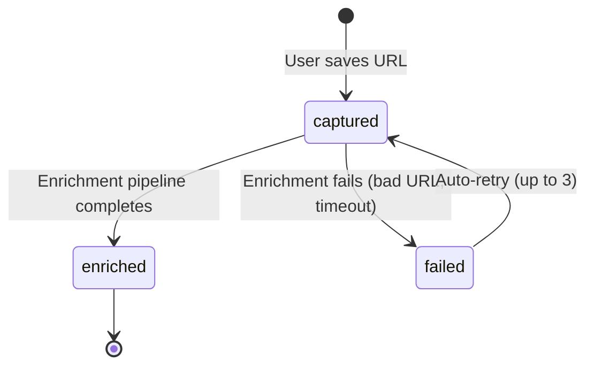
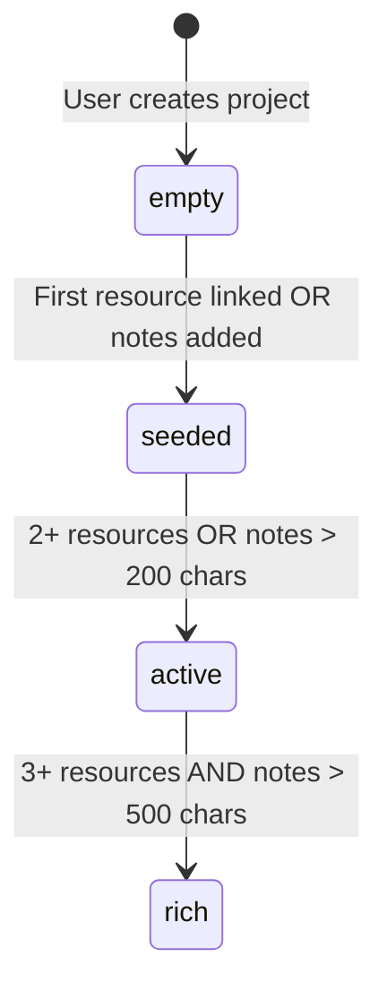
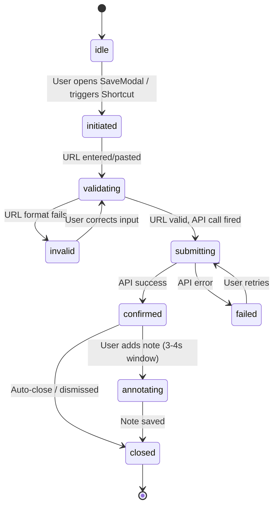
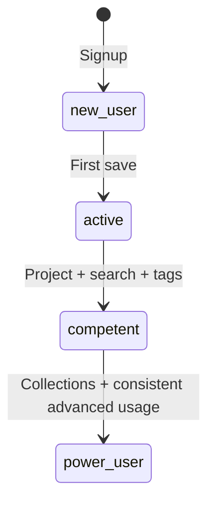
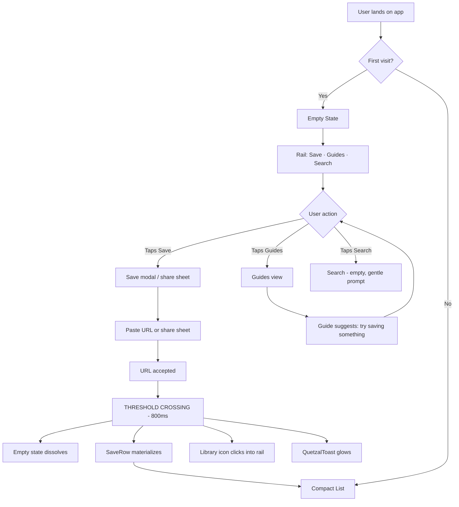
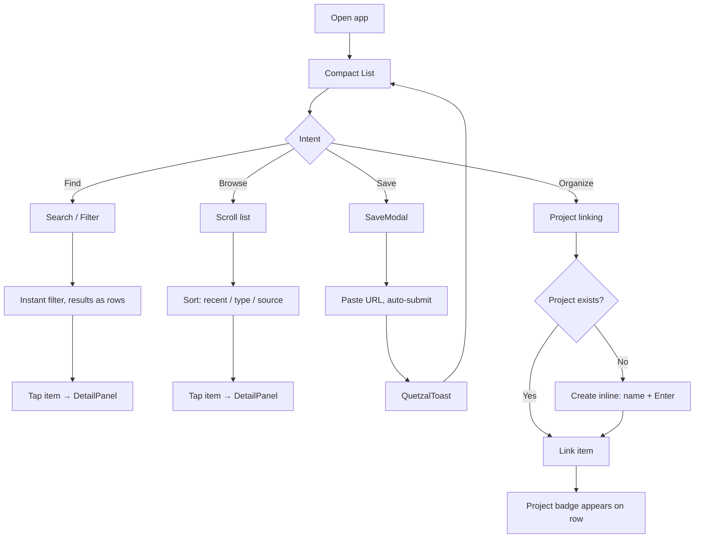
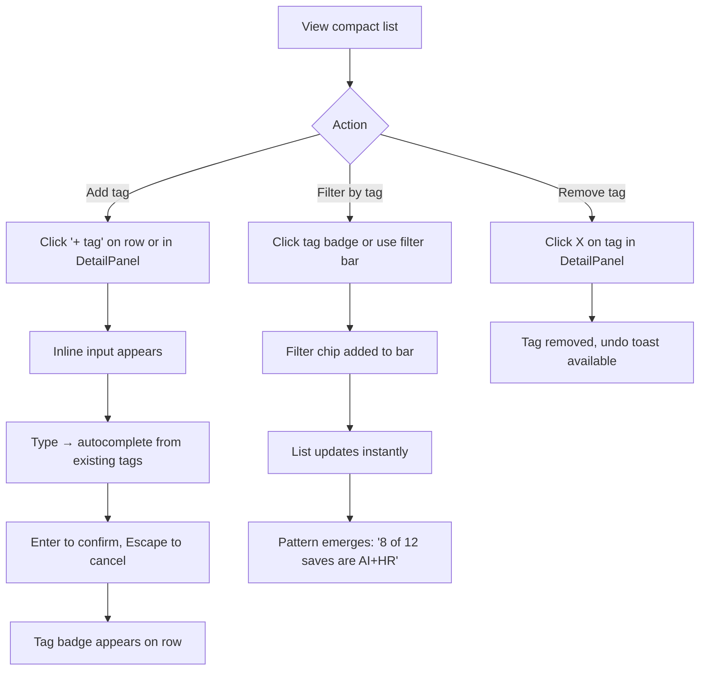
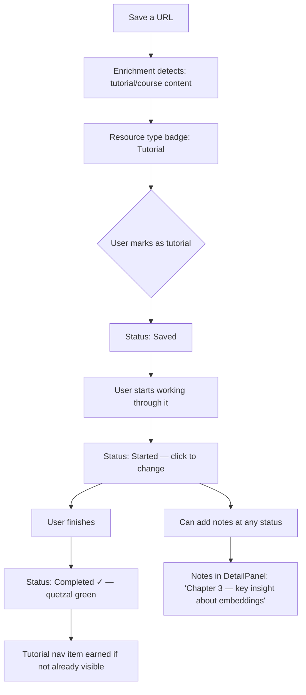
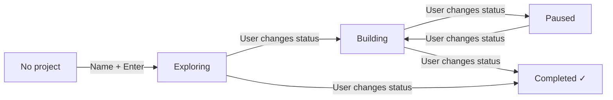

# UX Design Specification — AI Learning Hub

**Author:** Stephen
**Date:** 2026-03-09
**Version:** 2.0 (restructured from workflow output)

---

## 1. Product Thesis

### What This Is

AI Learning Hub is a **save-to-build platform** for AI/GenAI practitioners. Existing tools optimize for the wrong endpoint — read-later apps assume consumption, PKM tools assume organization. AI Learning Hub assumes **building**. Every saved resource implicitly asks: "What will you build with this?"

### The Three-Act Experience

| Act | Action | User Mindset | Design Priority |
|-----|--------|-------------|-----------------|
| **Save** | Capture a URL from any context in under 3 seconds | "Get this out of my head" | Speed, zero friction, relief |
| **Find** | Look up what you saved — search, filter, browse | "Where is that thing?" | Instant search, good filtering, recognition over recall |
| **Build** | Create projects, link saves, add notes, track tutorials | "I'm making something with all this" | Depth, organization, the living notebook |

Every user enters through Save. Find is where they stay. Build is where we want to take them — but only when they're ready.

### Architecture Implications

- **API-first:** The API is the product. Web UIs are convenience layers. All capabilities are API-accessible before they get a UI.
- **Two-layer data model:** User layer (saves, projects, links) + content layer (enriched metadata). Enables V2 collective intelligence without explicit sharing.
- **V1 scope:** Complete save → project → link loop. Invite-only, boutique scale (10-20 users), no monetization.

### Design Identity — Confident, Not Performative

The app knows what it is. It doesn't announce itself with flashy animations or trendy gradients. It's confident the way a well-made tool is confident — it works, it feels good, and it doesn't need to explain itself.

| Confident | Trying Too Hard | Staid |
|-----------|----------------|-------|
| Clean typography that breathes | Custom fonts and animated headlines | Times New Roman on white |
| Subtle transitions that feel intentional | Parallax scrolling and particle effects | No transitions at all |
| One accent color used with purpose | Gradient everything, color everywhere | Monochrome gray |
| "Saved." | "Your URL has been saved successfully!" | "Request processed" |
| Undo instead of "Are you sure?" | Confirmation dialogs with emoji | No safety net |

**The voice:** A capable colleague who respects your time.
- "Saved." — not "Great job saving that URL!"
- "Couldn't reach that URL." — not "Oops! Something went wrong."
- "3 saves match" — not "We found 3 results for your search query!"
- "Offline. Changes saved locally." — not "It looks like you've lost your internet connection!"

The app believes in the user. It doesn't explain things twice, gate features behind tutorials, or celebrate basic actions.

---

## 2. User Archetypes

### Why Archetypes, Not Personas

Personas describe fictional people. Archetypes describe **behavioral patterns** that map to design decisions. A single user may shift between archetypes — Maya is a Commute Capturer on the train and a Weekend Builder on Saturday morning.

### The Commute Capturer

**Behavior:** Saves 1-3 URLs per day from phone, always from another app (podcast, LinkedIn, browser). Never opens AI Learning Hub directly on mobile. Two taps, done.

**Needs:**
- Save completes in under 3 seconds without leaving the source app
- Zero required fields — URL is enough
- Confidence the save won't be lost (instant confirmation)
- Optional context capture ("from standup re: automation") for future self

**Pain points:** Anything that interrupts flow. Categories, tags, project selection at capture time. Loading screens. Authentication prompts.

**Design implications:** SaveModal must be paste-and-go. iOS Shortcut / share sheet must be bulletproof. Mobile capture flow is a separate, optimized path — not a responsive version of the desktop experience.

**Represents:** Maya (primary), Priya (sporadic)

### The Weekend Builder

**Behavior:** Sits down at desktop for 10-60 minute sessions. Creates projects, links saves from the week, pastes Claude conversations into notes. Information-dense workflow.

**Needs:**
- See all recent saves at a glance (compact list, scannable)
- Create and manage projects without ceremony (name + Enter)
- Link multiple saves to a project efficiently (batch selection)
- Rich notes editing with good Markdown rendering (code blocks, headers, paste-friendly)
- Side-by-side view: resources on one side, notes on the other

**Pain points:** Switching between views to complete a single workflow. Slow interactions. Modals that break flow. Poor Markdown rendering. Not enough information density.

**Design implications:** Desktop layout optimized for depth. Research Desk (split pane) for project workspace. Keyboard shortcuts for power efficiency. CommandPalette for fast navigation.

**Represents:** Marcus (primary), Maya (Saturday sessions)

### The Gradual Explorer

**Behavior:** Saves sporadically (1-2/week). Browses occasionally. Doesn't create projects for weeks. Eventually discovers a pattern in their saves and creates their first project.

**Needs:**
- Welcome at every stage — zero saves, five saves, fifty saves
- No pressure to organize, link, or create projects
- Pattern visibility through filtering (discovers themes in own saves)
- Seeded starter projects as inspiration (not obligation)
- Clear path from "saver" to "builder" when ready

**Pain points:** Feeling behind. Guilt about unlinked saves. Too many options too soon. Empty-feeling interface early on.

**Design implications:** Progressive disclosure is critical. Empty states must invite, not accuse. Unlinked saves are fuel waiting for a spark, not incomplete tasks. The interface must feel equally welcoming at save #2 and save #50.

**Represents:** Priya (primary)

### The Automator

**Behavior:** Generates API keys, builds shell aliases and agents. Interacts with AI Learning Hub programmatically. Never opens the web UI after initial setup.

**Needs:**
- Clean, predictable API with good error messages
- Rate limit transparency (headers, backoff)
- Scoped API keys (capture-only for shortcuts, full for agents)
- API documentation as the primary reference

**Pain points:** Inconsistent API contracts. Undocumented behavior. Unclear error responses. Rate limits that don't self-describe.

**Design implications:** API key management in settings (simple, clear). API docs as a Guide. The web UI doesn't need to serve this archetype beyond setup.

**Represents:** Dev (primary)

### Archetype ↔ Design System Map

| Archetype | Primary Surface | Primary Act | Key Components |
|-----------|----------------|-------------|----------------|
| Commute Capturer | iOS Shortcut / PWA share target | Save | SaveModal (mobile), QuetzalToast |
| Weekend Builder | Desktop PWA | Build | Research Desk, DetailPanel, CommandPalette, VirtualList |
| Gradual Explorer | Mobile + Desktop PWA | Find (then Build) | EmptyState, NavRail (earned interface), Guides |
| Automator | API / CLI | Save + Find (programmatic) | Settings (API key management) |

---

## 3. Core UX Principles

Seven principles that govern every design decision. When principles conflict, higher-numbered principles yield to lower-numbered.

### 1. Capture Is Sacred

Nothing slows down saving a URL. The save action is the entry point for all value — every millisecond of friction costs saves that never happen. When in doubt, optimize for capture speed.

### 2. Evolve Immediately

The first save triggers visible interface evolution. Don't wait for 5 saves or a week of usage. A single interaction demonstrates that this app responds to you. Even a one-save user should walk away impressed.

### 3. Respect the Casual

Not every user is a power user on day one. Priya saves for weeks before creating a project, and that's fine. The UI feels welcoming at every stage without pressuring users toward behaviors they're not ready for.

### 4. Content Teaches, Not Chrome

The user's saves, projects, and notes are the primary UX feedback mechanism. A rich project page communicates progress better than any badge. A filtered saves list reveals patterns better than any recommendation engine.

### 5. Undo Over Permission

Trust the user. Let them act, then offer undo. Confirmation dialogs communicate distrust. Undo respects agency. The undo toast is our safety net — it must be bulletproof.

### 6. The Interface Breathes

Navigation items are **earned** through use and **graduated** when the user demonstrates competency. The interface expands and contracts based on who you are right now. This is progressive disclosure in both directions.

### 7. Professional Enough to Screenshot

Every view a user might share — project pages, saves lists, tutorial progress — should look polished and intentional. Maya's VP moment and Marcus's interview prep are real use cases.

### Anti-Patterns (Never Do These)

| Anti-Pattern | What To Do Instead |
|-------------|-------------------|
| Feature tour on first login | Let the interface teach through threshold crossings |
| Hamburger menus hiding primary nav | Visible nav that grows with usage |
| Modals for everything | Inline editing, sheets, one modal only (SaveModal) |
| Toast notification overload | Toast only for: save confirmation, undo, Tier 4 errors |
| Dashboard as home screen | Saves list IS the home |
| "Getting started" checklists | Seeded content + progressive disclosure |
| Gamification (badges, streaks, points) | Content richness as its own reward |
| Pro tips, motivational messages | Skeleton screens, silence, confidence |

---

## 4. Emotional Design Targets

### Primary Emotional Goals

| Goal | Description | Design Translation |
|------|-------------|-------------------|
| **Friendly** | Approachable, warm without being childish | Clean UI, plain language, no jargon in chrome |
| **Supportive** | Available when needed, invisible when not | Contextual hints, smart defaults, undo over confirmation |
| **Calm** | Never overwhelming, never rushed | White space, minimal options per screen, no notification pressure |
| **Competent** | Users feel capable and in control | Obvious next actions, clear feedback, predictable behavior |

**Word-of-mouth emotion by archetype:**
- Commute Capturer: "You have to see how fast this is" (delight in speed)
- Weekend Builder: "This actually captures how I think" (recognition of depth)
- Gradual Explorer: "I didn't even realize I was building something" (surprise at self-discovery)

### Threshold Crossings

The most emotionally powerful moments are **transitions**. The app subtly evolves at key thresholds:

| Threshold | Trigger | What Changes | Emotional Effect |
|-----------|---------|-------------|-----------------|
| **"I'm here"** | Signup complete | Seeded projects visible, simple save field prominent | "This is approachable" |
| **"I'm using this"** | First save | Immediate evolution — list materializes, Library icon clicks into place in rail, quetzal toast glows | "Oh neat, it responded to me" |
| **"I'm organizing"** | First project created | Projects appears in nav, linking affordances surface | "The app just grew" |
| **"I'm connecting"** | First link | Project shows linked resources, save shows project badge — visible both directions | "These pieces connect" |
| **"I'm learning"** | First tutorial marked | Tutorial status tracking surfaces | "It tracks my learning too" |
| **"I'm power-using"** | Bulk selection, tags, folders | Keyboard shortcuts hint, bulk operations, folder management | "There's depth here" |

**The first threshold (first save) is the signature moment.** 800ms transformation: empty state dissolves, first SaveRow materializes, Library icon clicks into the rail like a lock engaging, QuetzalToast appears with subtle glow — the feather catching light. Worth investing animation polish. Screen-recordable.

### Progressive Graduation (The Breathing Interface)

Navigation items are earned through use and graduated when no longer needed:

**Phase 1 — New User**
Rail: `Save` · `Guides` · `Search`

**Phase 2 — Active User** (after first save)
Rail: `Save` · `Guides` · `Search` · `Library`

**Phase 3 — Competent User** (behavioral signals: project created, search used, tags applied)
Rail: `Save` · `Search` · `Library` · `Projects`
Guides migrates to subtle `?` icon at bottom of rail.

**Phase 4 — Power User**
Rail: `Save` · `Search` · `Library` · `Projects` · `Collections` · `Tags`
Guides accessible via search/settings only. Maximum density, minimum ceremony.

**Graduation signals are behavioral, not numeric:**
- Created a project → understands organization
- Used search effectively → knows how to find things
- Used tags or filters → power user behavior

**Contextual re-surfacing:** When a user enters unfamiliar territory (new feature), a subtle inline "Guide available" link appears in context — not in the nav. Respect expertise in known areas; offer help where they're new.

### Error Emotion Tiers

| Tier | Type | User Experience | Example |
|------|------|----------------|---------|
| **1: Invisible** | System handles silently | User never knows | Enrichment retry, search index lag, token refresh |
| **2: Gentle friction** | User notices a delay | Skeleton shows longer, subtle top loading bar | Slow network, cold start latency |
| **3: Recoverable** | User needs to act | Inline message near failed action | Invalid URL, session expired, validation error |
| **4: Real problem** | User might lose something | Toast notification — the ONE time toast is for errors | Save fails after retry, offline while editing |

Most sessions should only see Tier 1 and Tier 3. If users hit Tier 4 regularly, we have a backend problem.

### The Emotion of Return

When a user returns after hours or days:
- No "Welcome back!" banners
- No notification counts or "X things happened"
- No changelogs or "What's new" modals
- Most recent saves at the top, enriched and ready
- Projects exactly as left

The app did its job while you were gone. Pick up where you left off.

### Visual Distinctiveness Formula

| Context | Approach |
|---------|----------|
| Daily use (compact list, nav, search) | **Restrained.** Fast, dense, professional. The workhorse doesn't show off. |
| Transition moments (threshold crossings) | **Bold.** Precise, alive, signature animations. The personality lives here. |
| Content rendering (notes, project views, guides) | **Beautiful.** Premium typography, syntax highlighting, clean spacing. |
| Background operations (loading, errors, sync) | **Invisible.** Skeleton states, silent retries, error tiers. |

---

## 5. Information Architecture

### View Hierarchy

```
AI Learning Hub
├── Home (Library)              ← Default view. Compact list of all saves.
│   ├── Filter bar (type, project, tags, status, date)
│   └── SaveRow → DetailPanel (slide-in)
├── Projects                    ← Earned after first project created
│   ├── Project list (compact)
│   └── Project View (Research Desk)
│       ├── Linked resources (left pane)
│       └── Notes editor (right pane)
├── Guides                      ← Visible until graduated, then recedes
│   ├── Getting started
│   ├── iOS Shortcut setup (P0)
│   └── Persona-driven journey guides
├── Search                      ← Always visible. Cross-entity.
│   └── Results grouped: Saves, Projects, Guides
├── Settings                    ← Bottom of rail
│   ├── Profile
│   ├── API keys
│   ├── Appearance (dark mode toggle)
│   └── Help / Guides (graduated destination)
└── CommandPalette (⌘K)        ← Overlay. Searches + actions. Always available.
```

### URL Structure

```
/                       → Home (Library / saves list)
/saves/:id              → Save detail (or DetailPanel open on Home)
/projects               → Projects list
/projects/:id           → Project view (Research Desk)
/projects/:id/notes     → Project notes (deep link)
/guides                 → Guides index
/guides/:slug           → Individual guide
/settings               → Settings
/settings/api-keys      → API key management
```

### Content Taxonomy

**Entities and their relationships:**

```
Save (core entity)
├── Has: title, URL, source domain, resource type, tags, notes, status
├── Belongs to: User
├── Links to: 0-N Projects (many-to-many via Links)
└── Enriched by: Content layer (metadata, favicon, description)

Project (organizing entity)
├── Has: name, description, status, tags, folder, notes (Markdown)
├── Belongs to: User
├── Contains: 0-N linked Saves
└── Status lifecycle: exploring → building → paused → completed

Link (relationship entity)
├── Connects: Save ↔ Project
└── Has: linked date, optional position/order

Collection (future, Epic 4+)
├── Curated grouping of Saves
└── Independent of Projects

Tag (cross-cutting)
├── Applied to: Saves and Projects
└── User-created, no predefined taxonomy
```

### Three Domain Views, One Data Model

Resource Library, Tutorial Tracker, and My Projects are **perspectives** on the same entities:

| View | Shows | Filter |
|------|-------|--------|
| Home (Library) | All saves | Default: all. Filter by type, project, tags. |
| Projects | Projects + their linked saves | Grouped by project. Status-filterable. |
| Tutorials | Saves marked as tutorials | Filter: resource type = tutorial. Status tracking. |

These are not separate data stores — they're filtered views of the same compact list and project entities. The navigation reflects this: Library is the default, Projects and Tutorials are earned views that appear when relevant content exists.

### Nav Rail as IA Expression

The nav rail is the physical expression of the information architecture. It starts minimal and grows:

| Rail Item | When Visible | Maps To |
|-----------|-------------|---------|
| Save | Always | SaveModal (primary action) |
| Guides | Until graduated | /guides |
| Search | Always | Search overlay / /search |
| Library | After first save (earned) | / (Home) |
| Projects | After first project (earned) | /projects |
| Collections | After first collection (earned, future) | /collections |
| Tags | After tag usage (earned) | Tag filter view |
| Settings | Always (bottom) | /settings |
| Help `?` | After Guides graduates (bottom) | /guides (same destination, subtle icon) |

---
## 6. System State Model

This section defines the object states that drive UI behavior — the bridge between UX intent and engineering implementation. Without it, developers write `if (save.title)` when the real logic is `if (resource.state === 'enriched')`.

### The Knowledge-to-Building Pipeline

```
         Internet
            │
            ▼
      ┌───────────┐
      │  Capture   │     iOS Shortcut / PWA / Desktop
      │ (save URL) │
      └─────┬─────┘
            │
            ▼
      ┌───────────┐
      │  Resource  │     captured → enriched (automatic)
      │ (knowledge)│     + orthogonal flags: linked?, tutorial?, archived?
      └─────┬─────┘
            │
     enrichment / tagging (automatic)
     linking / discovery (user-driven)
            │
            ▼
      ┌───────────┐
      │  Project   │     Content state: empty → seeded → active → rich
      │ (build     │     User status: exploring / building / paused / completed
      │  context)  │
      └─────┬─────┘
            │
      linked resources + notes
            │
            ▼
      ┌───────────┐
      │ Workspace  │     Research Desk: resources + notes side-by-side
      │ (thinking  │     The "screenshot moment"
      │ + creating)│
      └─────┬─────┘
            │
            ▼ (V3 — not a V1 entity)
      ┌───────────┐
      │  Artifact  │     Published learning trail
      │ (output)   │
      └───────────┘
```

**Three core objects:**

| Object   | Role               | V1 Status                                                          |
| -------- | ------------------ | ------------------------------------------------------------------ |
| Resource | Captured knowledge | Primary entity                                                     |
| Project  | Build context      | Primary entity                                                     |
| Artifact | Published output   | V3 future — V1 "output" lives inside the Project workspace (notes) |

**The graph, not a folder system:**

```
[Resource A] ──┐
               │
[Resource B] ──┼────► [Project X] ────► Workspace (notes + linked resources)
               │
[Resource C] ──┘
               │
               └────► [Project Y] ────► Workspace
```

Multiple resources connect to multiple projects. This is a knowledge graph. That distinction is the entire product thesis.

### 6.1 Resource Lifecycle

A resource has **one primary state** (enrichment lifecycle) and **multiple orthogonal flags** that can be independently set. This is not a single state machine — it's a primary state plus independent dimensions.

#### Primary State (automatic — enrichment pipeline)



| State      | Description                                                    | SaveRow Rendering                                                | Available Actions                                    |
| ---------- | -------------------------------------------------------------- | ---------------------------------------------------------------- | ---------------------------------------------------- |
| `captured` | URL saved, enrichment pending                                  | URL as title, skeleton metadata, generic link icon               | Open URL, delete, add note, link to project          |
| `enriched` | Metadata extracted (title, description, favicon, type, domain) | Real title, domain badge, type-specific icon, auto-detected tags | All: edit metadata, tag, link, filter, tutorial mark |
| `failed`   | Enrichment failed after retries                                | URL as title, subtle warning icon, "metadata unavailable"        | Same as captured + manual "retry enrichment"         |

**Critical UX rule:** A `captured` resource is fully usable. It appears in the list immediately (optimistic update). Enrichment is a bonus, not a gate. Never block actions on enrichment status.

#### Orthogonal Flags (user-controlled, independent of primary state)

| Flag       | Type    | Values                                        | Set By                  | UI Implication                                               |
| ---------- | ------- | --------------------------------------------- | ----------------------- | ------------------------------------------------------------ |
| `linked`   | Derived | true if 1+ project links exist                | User links/unlinks      | Project badge(s) on SaveRow                                  |
| `tutorial` | Enum    | `none` \| `saved` \| `started` \| `completed` | User marks explicitly   | Status indicator. `completed` = quetzal green check          |
| `archived` | Boolean | true/false                                    | User archives           | Hidden from default Library. Visible with "Archived" filter. |
| `tags`     | Array   | string[]                                      | User or auto-enrichment | Tag badges on SaveRow. Filterable.                           |

**Why orthogonal:** A resource can simultaneously be `enriched` + linked to 2 projects + `tutorial:started` + tagged `[rag, embeddings]`. Engineers must model these as separate fields, not a single `status` enum.

#### State to Component Rendering

```
// Primary state determines metadata display
if resource.primaryState == 'captured':
    SaveRow.title     = truncate(resource.url)
    SaveRow.metadata  = <Skeleton />
    SaveRow.typeIcon  = genericLinkIcon

if resource.primaryState == 'enriched':
    SaveRow.title     = resource.enrichedTitle
    SaveRow.metadata  = resource.domain + resource.resourceType
    SaveRow.typeIcon  = typeSpecificIcon(resource.resourceType)

if resource.primaryState == 'failed':
    SaveRow.title     = truncate(resource.url)
    SaveRow.metadata  = "Metadata unavailable"
    SaveRow.icon     += subtleWarning

// Orthogonal flags layer on top
if resource.linked:
    SaveRow.badges   += resource.projectNames.map(ProjectBadge)

if resource.tutorial != 'none':
    SaveRow.status    = TutorialStatusIndicator(resource.tutorial)

if resource.archived:
    SaveRow.visible   = false  // unless archived filter active
```

### 6.2 Project Lifecycle

Projects have **two parallel state dimensions** — one automatic (derived from contents), one manual (set by user).

#### Content State (automatic, derived from project contents)



| Content State | Condition                          | UI Behavior                                                               |
| ------------- | ---------------------------------- | ------------------------------------------------------------------------- |
| `empty`       | No linked resources, no notes      | Show empty state prompts: "Link a save" / "Start writing." No split pane. |
| `seeded`      | 1 linked resource OR has notes     | Show Research Desk layout. One pane may feel sparse — OK.                 |
| `active`      | 2+ resources OR substantial notes  | Full Research Desk. All workspace tools available.                        |
| `rich`        | 3+ resources AND substantial notes | Screenshot-worthy state. The "show your VP" moment.                       |

**Content state drives layout decisions.** Don't show the split-pane Research Desk for an `empty` project — it feels hollow. Show gentle prompts instead.

#### User Status (explicit, user-controlled)

| Status      | Meaning                            | Visual Treatment                           | Transition          |
| ----------- | ---------------------------------- | ------------------------------------------ | ------------------- |
| `exploring` | Gathering resources, not committed | Neutral muted badge                        | Default on creation |
| `building`  | Actively working                   | Indigo badge, slightly emphasized          | User clicks status  |
| `paused`    | On hold                            | Dimmed text, reduced opacity               | User clicks status  |
| `completed` | Done                               | Quetzal green badge + check (brand moment) | User clicks status  |

Any status can transition to any other — no enforced sequence. One-click inline on status badge.

#### Content x Status Matrix

|            | exploring             | building                           | paused            | completed                              |
| ---------- | --------------------- | ---------------------------------- | ----------------- | -------------------------------------- |
| **empty**  | Normal (just created) | Unusual — prompt to link resources | Odd but allowed   | Meaningless — no content to "complete" |
| **seeded** | Getting started       | Working on it                      | Took a break      | Quick project, done                    |
| **active** | Researching broadly   | In the flow                        | Deprioritized     | Solid completion                       |
| **rich**   | Deep research phase   | Peak productivity                  | Substantial pause | The ideal — screenshot + green check   |

### 6.3 Capture Flow States

The capture flow (SaveModal / iOS Shortcut) is a micro state machine that prevents subtle bugs like metadata appearing after save, notes not attaching correctly, or UI flicker on slow fetch.



| State        | Duration        | UI                                                              | Component State        |
| ------------ | --------------- | --------------------------------------------------------------- | ---------------------- |
| `idle`       | —               | SaveModal closed                                                | No modal rendered      |
| `initiated`  | Instant         | Modal opens, URL field auto-focused, keyboard visible on mobile | `isOpen: true`         |
| `validating` | < 100ms         | Inline URL format check                                         | `isValidating: true`   |
| `invalid`    | Until corrected | Red border + "That doesn't look like a URL"                     | `error: 'invalid_url'` |
| `submitting` | < 1s            | Optimistic: save appears in list. Modal shows brief spinner.    | `isSubmitting: true`   |
| `confirmed`  | 3-4s            | QuetzalToast glows. Optional "+ Add note" appears.              | `isConfirmed: true`    |
| `annotating` | User-controlled | Note field visible, Enter to submit                             | `isAnnotating: true`   |
| `failed`     | Until action    | Toast: "Couldn't save. Tap to retry."                           | `error: 'api_error'`   |
| `closed`     | —               | Return to previous context                                      | `isOpen: false`        |

**Optimistic update:** `submitting` adds the save to the list _before_ API confirms. On API failure, rollback with error toast. Users perceive instant saves.

### 6.4 User Interface State (Earned Interface)

The overall UI is a state machine driven by the `useEarnedInterface` hook:



| UI State     | Nav Rail             | Guides Visibility    | CommandPalette Commands            |
| ------------ | -------------------- | -------------------- | ---------------------------------- |
| `new_user`   | Save, Guides, Search | Prominent (rail)     | "New save", "Open guides"          |
| `active`     | + Library            | Prominent (rail)     | + "Search saves", "Filter by type" |
| `competent`  | + Projects           | Subtle (? at bottom) | + "New project", "Link to project" |
| `power_user` | + Collections, Tags  | Settings/search only | + "New collection", "Manage tags"  |

**Persistence:** State stored server-side (user milestones table), synced across devices.
**Reversibility:** User can pin/unpin rail items, overriding automatic state.

### 6.5 Cross-Object State Transitions

These transitions form the measurable funnel — where the product leaks users:

```
Resource transitions (system health + engagement):
  captured -> enriched              Enrichment pipeline health
  enriched -> linked                Save-to-project engagement
  enriched -> tutorial:started      Learning engagement
  tutorial:started -> completed     Tutorial completion rate

Project transitions (depth + maturity):
  empty -> seeded                   Project activation
  seeded -> active                  Project growth
  active -> rich                    Project maturity (screenshot-ready)

UI transitions (user growth):
  new_user -> active                Onboarding success (did they save?)
  active -> competent               Adoption (did they organize?)
  competent -> power_user           Retention (did they go deep?)

Capture transitions (friction):
  initiated -> confirmed            Capture success rate
  initiated -> failed               Capture failure rate (alert if > 2%)
```

**Agent automation rules (V2+):**

```
if resource.linked AND project.contentState == 'seeded':
    suggest related unlinked resources with matching tags

if resource.tutorial == 'started' AND daysSince(lastAccess) > 14:
    surface in "Pick up where you left off"

if user.uiState == 'active' AND saves.count > 5 AND projects.count == 0:
    subtle prompt: "Seeing a pattern in your saves?"
```

States are how agents reason about systems. Every state transition is a hook for intelligent behavior.

---
## 7. Interaction Flows

### Flow 1: First Save & Threshold Crossing

**Archetypes:** Gradual Explorer, Commute Capturer
**Goal:** Empty screen → first save → interface evolution



**Error recovery:**
- Invalid URL → inline validation: "That doesn't look like a URL"
- Network failure → toast with retry: "Couldn't save. Tap to retry."
- Duplicate URL → "You already saved this" with link to existing item

### Flow 2: Library Growth & Daily Use

**Archetypes:** Weekend Builder, Commute Capturer (browsing)
**Goal:** Find things, link to projects, grow library



**SaveRow anatomy:**
```
[Type icon]  Title of Resource               [domain.com]  [tag] [tag]  [3d ago]
             project badge · tutorial status (if applicable)
```

**Daily patterns:**
- Maya's morning: Open → scan 3-4 recent saves → tap one → back. 30 seconds.
- Marcus's deep session: Open → create project → search saves → link 4 items → notes. 10 minutes.

### Flow 3: Tagging & Filtering

**Archetypes:** Weekend Builder, Gradual Explorer (discovery moment)



### Flow 4: Tutorial Lifecycle

**Archetypes:** Weekend Builder, Gradual Explorer



**Tutorial status transitions:** `saved → started → completed` (one-click, inline on the row)

### Flow 5: Search & CommandPalette

**Compact list filter bar:**
- Sits above list, always visible when items exist
- Filters: type, project, tags, status, date range
- Additive chips — click to add, X to remove
- Instant re-render on every change

**CommandPalette (`⌘K`):**
- Searches: save titles, URLs, tags, project names, guide titles
- Results grouped: Saves, Projects, Guides, Actions
- Arrow keys to navigate, Enter to select, Escape to close
- Recent searches on empty query
- Fuzzy matching: "rag pipe" → "RAG Pipeline Architecture"
- Composable command registry — modules register commands dynamically
- Commands reflect earned state: can't search "projects" until Projects is active

**Empty search results:**
- Friendly: "Nothing matches that. Try different keywords?"
- If filtering, suggest removing a filter
- Never a sad face, never bare "no results found"

### Keyboard Shortcuts

| Shortcut | Action |
|----------|--------|
| `⌘K` / `Ctrl+K` | Open CommandPalette |
| `/` | Focus search/filter |
| `n` | New save (SaveModal) |
| `p` | New project |
| `j` / `k` | Navigate list items (vim-style) |
| `Enter` | Open selected item in DetailPanel |
| `Escape` | Close any overlay, deselect |
| `⌘Z` / `Ctrl+Z` | Undo last destructive action (within 8s) |
| `?` | Show shortcut reference |

Not discoverable at first. CommandPalette is the discovery mechanism — type "shortcuts" in `⌘K`.

### Overlay Hierarchy

| Layer | Component | When |
|-------|-----------|------|
| Modal | SaveModal | URL capture only. **One modal in the entire app.** |
| Sheet (slide-in) | DetailPanel | Full resource details, notes, project detail |
| Inline | Everything else | Tags, linking, status changes, renaming |

Principle: The fewer layers, the more confident the UI feels.

### Undo Toast Pattern

Replaces confirmation dialogs everywhere:
- Position: bottom-center
- Duration: 8 seconds, progress bar depleting
- Single prominent "Undo" button
- Action executes immediately, reversible for 8s (soft delete)
- Persists across route changes
- `⌘Z` / `Ctrl+Z` also triggers undo during window
- Must be bulletproof — we removed confirmation dialogs, so this is the only safety net

---

## 8. Component System

### Design System: shadcn/ui + Tailwind CSS + Radix

Ownership-based — components copied into the repo, not installed as a package. Full control to modify without fighting a library. Radix handles accessibility (keyboard nav, focus management, ARIA). Tailwind co-locates styles. AI coding agents understand this stack extremely well.

### Visual Design Tokens

```
Colors (Dual-Accent — Indigo Ink + Quetzal Green):

Light Mode:
  --background:       hsl(0, 0%, 100%)          White
  --background-alt:   hsl(220, 14%, 96%)        Cool gray (alternating rows)
  --foreground:       hsl(224, 71%, 4%)          Near-black
  --muted:            hsl(220, 9%, 46%)          Secondary text
  --muted-lighter:    hsl(220, 13%, 91%)         Borders, dividers
  --accent:           hsl(239, 84%, 57%)         Indigo Ink (UI accent)
  --accent-soft:      hsl(239, 84%, 57%, 0.1)   Indigo hover/selected
  --brand:            hsl(162, 83%, 34%)         Quetzal Green (brand)
  --brand-soft:       hsl(162, 83%, 34%, 0.1)   Quetzal success bg
  --destructive:      hsl(0, 84%, 60%)           Red (delete only)

Dark Mode:
  --background:       hsl(224, 71%, 4%)          Deep near-black
  --background-alt:   hsl(220, 13%, 10%)         Lifted cards
  --foreground:       hsl(210, 20%, 98%)         Off-white
  --muted:            hsl(220, 9%, 55%)          Lifted gray
  --muted-lighter:    hsl(220, 13%, 20%)         Subtle borders
  --accent:           hsl(239, 84%, 70%)         Indigo lifted
  --accent-soft:      hsl(239, 84%, 70%, 0.12)  Indigo hover
  --brand:            hsl(162, 83%, 48%)         Quetzal lifted
  --brand-soft:       hsl(162, 83%, 48%, 0.12)  Quetzal bg
  --destructive:      hsl(0, 84%, 65%)           Red lifted

Typography:
  Font: Inter (fallback: ui-sans-serif, system-ui, -apple-system, sans-serif)
  Weights: 400 (body), 500 (titles), 600 (headings, buttons). No bold, no light.
  Scale: xs(12px), sm(14px), base(16px), lg(18px), xl(20px), 2xl(24px)

Spacing: 4px base (Tailwind default)
Border radius: rounded-md (6px) — not sharp, not bubbly
Shadows: minimal — one subtle shadow for elevated elements
Transitions: 150-200ms, opacity + transform only
Icons: Lucide (bundled with shadcn), 24px nav / 16px inline

Dark mode: prefers-color-scheme default, manual toggle override, localStorage persistence
```

### Quetzal Green Usage Rules

Used **surgically** — rare enough to feel special:
- Save confirmation toast (primary brand moment)
- Success states (project created, tutorial completed)
- Logo mark
- Guide accents (storefront pages)
- **Never** buttons, backgrounds, borders, hover states, navigation
- Indigo and Quetzal never appear as adjacent interactive elements

Inspired by the Resplendent Quetzal feather — emerald green shifting through teal into indigo. Both colors on the same spectrum. Thematic depth: Quetzalcoatl = Mesoamerican god of learning and knowledge.

### Button Hierarchy

| Level | Style | Color | Usage |
|-------|-------|-------|-------|
| Primary | Solid fill | Indigo Ink | One per view: "Save", "Create Project", "Link" |
| Secondary | Outline/ghost | Indigo border | Supporting: "Cancel", "Add Tag", "Filter" |
| Destructive | Solid fill | Red | Delete, unlink. Always paired with undo toast. |
| Ghost | Text only | Muted | Tertiary: "Show more", navigation links |

### Custom Components

| Component | Type | Tier | Description |
|-----------|------|------|-------------|
| **SaveRow** | Custom | 1 | Core atom. Type icon · title · domain · tags · timestamp. States: default, hover (quick-actions fade in), selected (checkbox + indigo bg), expanded (inline preview). |
| **VirtualList** | Wrapper (@tanstack/react-virtual) | 1 | Windowed rendering. Must scroll smoothly at 500+ items. |
| **NavRail** | Custom | 1 | 48-56px slim rail. Earned/graduated item slots. State machine. |
| **SaveModal** | Custom | 1 | Paste-and-go. URL only required. `onPaste` auto-submits (500ms debounce). |
| **EmptyState** | Custom | 1 | Per-view warm empty states. Dissolves on first threshold crossing. |
| **QuetzalToast** | Styled Toast | 1 | Brand green check with subtle glow. The feather catching light. |
| **DetailPanel** | Styled Sheet | 2 | Slide-in, preserves list context. Metadata, tags, notes, project links. |
| **CommandPalette** | Styled Command | 2 | `⌘K`. Composable registry. Commands reflect earned state. |
| **useEarnedInterface** | React hook | 3 | Nav visibility, graduation state, competency tracking, command registration. |

**Not custom components:**
- ProjectBadge → shadcn Badge variant, one line of Tailwind
- GuidesView → page/route, not reusable component
- ThresholdTransition → CSS utilities + useEarnedInterface hook

### shadcn Components Used

Button, Input, Dialog, Dropdown Menu, Tooltip, Avatar, Badge, Separator, Tabs, Toggle, Scroll Area, Toast, Sheet, Command, Skeleton

Adopted per-epic as needed. No upfront component library build.

### Implementation Tiers

**Tier 1 — Can't demo without (Sprint 1):** SaveRow, VirtualList, NavRail, SaveModal, EmptyState, QuetzalToast
**Tier 2 — Daily use (Sprint 2):** DetailPanel, CommandPalette
**Tier 3 — Earned interface infra (layers in):** useEarnedInterface, threshold animations, graduation logic

---

## 9. Mobile Capture System

### Why This Section Exists

Mobile capture is the primary acquisition hook. Maya's 5-second save is how users discover the product's value. If this flow is clunky, slow, or unreliable, the entire three-act experience collapses — there's nothing to Find or Build.

### Capture Paths

| Path | Platform | Trigger | Steps | Target |
|------|----------|---------|-------|--------|
| **iOS Shortcut** | iPhone/iPad | Share sheet → "Save to ALH" | 2 taps | `POST /saves` with capture-scoped API key |
| **PWA Share Target** | Android | Share sheet → "AI Learning Hub" | 2 taps | Service worker intercepts, calls API |
| **PWA Direct** | Any mobile browser | Open app → tap Save → paste URL | 3 taps | SaveModal (full-screen sheet on mobile) |
| **Desktop** | Desktop browser | `n` shortcut or Save button → paste URL | 2 actions | SaveModal (centered modal) |

### iOS Shortcut Flow (P0 — Critical Path)

```
┌──────────────────────────────────────────────────────────┐
│  USER IN ANY APP (podcast app, Safari, LinkedIn, etc.)   │
│                                                          │
│  1. Tap Share button                                     │
│  2. Tap "Save to AI Learning Hub" shortcut               │
│                                                          │
│  ┌─────────────────────────────────────┐                 │
│  │  iOS Shortcut executes:             │                 │
│  │  - Extracts shared URL              │                 │
│  │  - Calls POST /saves               │                 │
│  │  - Auth: capture-scoped API key     │                 │
│  │  - Body: { url: "<shared_url>" }    │                 │
│  │  - Shows banner: "Saved ✓"          │                 │
│  └─────────────────────────────────────┘                 │
│                                                          │
│  3. User is back in original app. Never left.            │
│     Total time: < 3 seconds.                             │
└──────────────────────────────────────────────────────────┘
```

**Setup requirements:**
- User generates a capture-scoped API key from Settings → API Keys
- User installs the iOS Shortcut (we provide a download link + step-by-step guide)
- Shortcut appears in their share sheet automatically
- One-time setup, ~2 minutes with the guide

**Error handling in Shortcut:**
- Network failure → Shortcut shows: "Couldn't save. Try again later." (iOS native alert)
- Auth failure → "API key expired. Generate a new one in Settings." (links to app)
- Duplicate URL → API returns success with existing save ID (idempotent, no user-facing error)

**Why iOS Shortcut, not native app:**
- V1 is PWA, no App Store presence
- Shortcuts can call REST APIs directly
- Share sheet integration is native-feeling
- Limitation: requires manual setup (the onboarding guide is P0)

### PWA Share Target Flow (Android)

```
1. User taps Share in any Android app
2. "AI Learning Hub" appears in share sheet (registered via web app manifest)
3. User taps it
4. Service worker intercepts the share intent
5. URL extracted → POST /saves (authenticated via session)
6. Brief in-app confirmation screen: "Saved ✓" with optional "+ Add note"
7. User taps back → returns to source app
```

**Difference from iOS:** Android share target is session-authenticated (user must be logged into PWA), not API-key-based. The PWA must be installed ("Add to Home Screen") for share target to register.

### Optional Context Capture

After any mobile save, a brief micro-interaction:

```
┌─────────────────────────────┐
│  ✓ Saved                    │
│  [+ Add a note          ]   │
│                             │
│  Disappears in 3-4 seconds  │
└─────────────────────────────┘
```

- Single-line text field, appears for 3-4 seconds, disappears if ignored
- Preserves emotional context: "from standup re: automation"
- Saturday Maya thanks Monday Maya for the note
- Never required, never blocks the save

### Mobile-Specific SaveModal

When save is initiated from within the PWA on mobile:

```
┌──────────────────────────┐
│  ← Save a Resource       │  Full-screen sheet
│                          │  (slides up from bottom)
│  ┌────────────────────┐  │
│  │ Paste or type URL  │  │  Auto-focused, keyboard open
│  └────────────────────┘  │
│                          │
│  + Add to project        │  Collapsed by default
│  + Add tags              │  Collapsed by default
│  + Add a note            │  Collapsed by default
│                          │
│         [Cancel] [Save]  │  44px touch targets
│                          │
└──────────────────────────┘
```

- Full-screen sheet, not centered modal (touch targets need space)
- URL field auto-focused with keyboard
- Paste event triggers auto-submit (500ms debounce, Escape or tap Cancel to abort)
- Optional fields collapsed — never visible unless user wants them

### Offline Save (V1)

- Service worker detects offline state
- Save queued in IndexedDB
- Subtle top banner: "Offline. Changes saved locally."
- When connectivity returns: queued saves submitted, banner clears
- User never sees a failure — the save always "works" from their perspective

### iOS Shortcut Setup Guide (P0 Content)

This guide is the single highest-priority piece of documentation:

1. Open AI Learning Hub on desktop
2. Go to Settings → API Keys → Generate Capture Key
3. Copy the key
4. Tap the "Install Shortcut" link (opens Shortcuts app)
5. Paste your API key when prompted
6. Done — "Save to AI Learning Hub" now appears in your share sheet

**Guide design:** Persona-driven (Maya), screenshot-heavy, under 2 minutes to complete. Available at `/guides/ios-shortcut-setup`. Public, no auth required.

---

## 10. Project Workspace UX

### Why This Section Exists

The project workspace is the screenshot moment. When Maya shows her VP, when Marcus interviews for a GenAI SA role — this is the view they share. "Research desk" is the concept. This section makes it concrete.

### Project Lifecycle



**Status transitions:** One click on status badge in project list or project view. Dropdown shows options. Visual evolution:

| Status | Visual Treatment |
|--------|-----------------|
| Exploring | Neutral — muted badge, standard weight |
| Building | Active — indigo badge, slightly emphasized |
| Paused | Dimmed — muted text, reduced opacity |
| Completed | Quetzal green badge + check ✓ (brand moment) |

### Project Creation

Three entry points, same pattern: **name field + Enter**

1. **SaveModal:** "+ Add to project" → type new name → Enter
2. **CommandPalette:** `⌘K` → "New project" → type name → Enter
3. **Projects view:** "+" button → type name → Enter

No description required. No folder required. No wizard. Create now, enrich later from the project view. This aligns with "Capture Is Sacred" — project creation should be as frictionless as saving a URL.

### The Research Desk (Desktop Layout)

```
┌──────────────────────────────────────────────────────────────┐
│  ← Projects    Knowledge Graph RAG Experiment    [Building ▾]│
├────────────────────────────┬─────────────────────────────────┤
│  Linked Resources (4)      │  Project Notes                  │
│                            │                                 │
│  [📄] GraphRAG Tradeoffs   │  # Architecture Decision        │
│       graphrag.dev · 3d    │                                 │
│  [🎬] Multi-Model Routers  │  After evaluating three         │
│       youtube.com · 5d     │  approaches, I'm going with     │
│  [📦] Agent Framework      │  hybrid retrieval because...    │
│       github.com · 1w      │                                 │
│  [📄] Hybrid Retrieval     │  ## Claude Conversation         │
│       arxiv.org · 2d       │                                 │
│  ─────────────────────     │  ```                            │
│  + Link a save             │  Me: Should I use GraphRAG      │
│                            │  for this use case?             │
│  Unlinked saves (2)        │                                 │
│  [subtle, browsable]       │  Claude: Let's think through    │
│                            │  the tradeoffs...               │
│                            │  ```                            │
│                            │                                 │
│                            │  [Edit] [Full screen]           │
├────────────────────────────┴─────────────────────────────────┤
│  Tags: rag · knowledge-graph · embeddings                    │
└──────────────────────────────────────────────────────────────┘
```

**Left pane — Linked Resources:**
- Compact list rows (same SaveRow component as Library)
- Shows only resources linked to this project
- "+ Link a save" action at bottom — opens search to find and link existing saves
- Optional: show "Unlinked saves" section below — subtle, browsable, for quick linking
- Drag to reorder (future, not V1)

**Right pane — Notes:**
- Full Markdown editor with live preview
- Optimized for pasting Claude/LLM conversations (large text blocks, code fences)
- Syntax highlighting in code blocks
- Clean heading hierarchy, proper spacing
- "Edit" toggles between rendered view and editor
- "Full screen" expands notes to full width (hides resources pane)

**Top bar:**
- Back navigation to Projects list
- Project name (editable inline — click to rename)
- Status badge (click to transition)
- Description (expandable, below name — click to add/edit)

### Mobile Project View

```
┌──────────────────────────┐
│  ← Knowledge Graph RAG   │
│  [Building ▾]            │
│                          │
│  ┌────────────────────┐  │
│  │ Resources │ Notes  │  │  Tab switcher
│  └────────────────────┘  │
│                          │
│  [📄] GraphRAG Tradeoffs │
│       graphrag.dev · 3d  │
│  [🎬] Multi-Model Routers│
│       youtube.com · 5d   │
│  [📦] Agent Framework    │
│       github.com · 1w    │
│                          │
│  + Link a save           │
│                          │
└──────────────────────────┘
```

- Stacked layout with tab switcher: Resources | Notes
- Same SaveRow component, touch-optimized
- Notes editor: full-width, single column
- No split pane on mobile — not enough space

### Project Linking UX

**Linking a save to a project (from Library):**
1. Hover over SaveRow → quick-action icon: "Add to project"
2. Click → inline dropdown of existing projects + "New project" option
3. Select project → project badge appears on the row immediately
4. Or: select multiple rows (checkbox mode) → batch link to project

**Linking from within a project:**
1. Click "+ Link a save" in Resources pane
2. Search/browse overlay appears (filtered to unlinked saves)
3. Click saves to link them — they appear in the Resources list instantly
4. Close overlay

**Unlinking:**
1. In project Resources pane, hover over linked save → "Unlink" action
2. Click → save removed from project, undo toast available
3. Save remains in Library — unlinking doesn't delete

### Notes Editing

**Markdown features supported:**
- Headings (H1-H4), bold, italic, strikethrough
- Code blocks with syntax highlighting (fenced with language hint)
- Inline code
- Bullet lists, numbered lists
- Links (auto-linked URLs)
- Blockquotes
- Horizontal rules
- Tables (basic)

**Optimized for LLM conversation paste:**
- Large paste operations complete without lag (2000+ word blocks)
- Code fences render correctly when pasted from Claude/ChatGPT
- Conversation-style formatting (Me: / Claude:) renders cleanly
- No maximum note length in V1

**Editor UX:**
- Default: rendered Markdown view
- Click "Edit" or click anywhere in notes area → switches to editor
- Auto-save on blur (no explicit save button needed)
- Click outside or press Escape → returns to rendered view

---

## 11. Empty State Design

### Philosophy

Empty states are the first impression. They communicate the product's personality before the user has created anything. In AI Learning Hub, empty means **potential**, not absence.

Every empty state has:
1. A warm, inviting visual or message
2. One clear action (not three CTAs)
3. No guilt, no pressure, no "you haven't done anything yet"

### Empty States by View

#### Home (Library) — First Visit

```
┌──────────────────────────────────────────────┐
│                                              │
│         Save anything you're learning.       │
│         We'll take it from here.             │
│                                              │
│              [Save your first URL]           │
│                                              │
│  ─ ─ ─ ─ ─ ─ ─ ─ ─ ─ ─ ─ ─ ─ ─ ─ ─ ─ ─   │
│                                              │
│  Starter projects to explore:                │
│                                              │
│  📁 Build a Custom GPT                       │
│  📁 AI Automation for Your Day Job           │
│  📁 Build a RAG Pipeline                     │
│                                              │
└──────────────────────────────────────────────┘
```

- Primary message: short, confident, no exclamation marks
- Single CTA button (Save your first URL)
- Seeded starter projects below the fold — inspiration, not obligation
- Seeded projects look real (have descriptions, linked resources)

#### Home (Library) — After Saves, No Projects

```
┌──────────────────────────────────────────────┐
│  Filter: [All ▾]  Sort: [Recent ▾]          │
│                                              │
│  [📄] GraphRAG Deep Dive      arxiv.org  2d  │
│  [🎬] Agent Orchestration     yt.com     4d  │
│  [🎙] AI Podcast Ep. 42      spotify    1w  │
│                                              │
│  ─ ─ ─ ─ ─ ─ ─ ─ ─ ─ ─ ─ ─ ─ ─ ─ ─ ─ ─   │
│                                              │
│  Seeing a pattern in your saves?             │
│  [Create a project] to connect them.         │
│                                              │
└──────────────────────────────────────────────┘
```

- This is NOT an empty state — it's a **gentle prompt** below real content
- Appears after 3+ unlinked saves, subtle, dismissible permanently
- Never says "you should" — says "seeing a pattern?"
- Disappears once first project is created

#### Projects — Before First Project

```
┌──────────────────────────────────────────────┐
│                                              │
│        Projects connect your saves           │
│        to what you're building.              │
│                                              │
│           [Create your first project]        │
│                                              │
│  Your saves are the raw material.            │
│  Projects are where they become something.   │
│                                              │
└──────────────────────────────────────────────┘
```

- Only visible when user navigates to Projects (earned nav item)
- Warm, concise, one CTA
- The subtext communicates the save-to-build philosophy without being preachy

#### Search — No Results

```
┌──────────────────────────────────────────────┐
│  Search: "kubernetes operators"              │
│                                              │
│  Nothing matches that.                       │
│  Try different keywords?                     │
│                                              │
│  [If filtering: "Try removing the            │
│   'tutorial' filter"]                        │
│                                              │
└──────────────────────────────────────────────┘
```

- Not an error state. Friendly, helpful.
- Suggests action (different keywords, remove filter)
- No sad face, no illustration, no "oops"

#### Project View — No Linked Resources

```
┌──────────────────────────────────────────────┐
│  ← Knowledge Graph RAG    [Exploring ▾]      │
├──────────────────────┬───────────────────────┤
│                      │  Project Notes         │
│  No resources linked │                       │
│  yet.                │  Start capturing your  │
│                      │  thinking here.        │
│  [Link a save]       │                       │
│  [Save something new]│  [Start writing]      │
│                      │                       │
└──────────────────────┴───────────────────────┘
```

- Split pane still visible (maintains layout expectation)
- Each pane has its own gentle prompt
- Two actions because this state has two paths: link existing saves or start notes

#### Guides — Graduated State

When Guides migrates from rail to `?` icon, the destination remains the same — `/guides`. No empty state needed. The content is always there; only the navigation prominence changes.

### Empty State Design Principles

1. **One CTA, not three.** The user should know exactly what to do next.
2. **No guilt language.** Never "You haven't..." — always what's possible.
3. **Starter content over blank canvas.** Seeded projects show what's possible before the user creates anything.
4. **Dissolve, don't snap.** When content appears, the empty state dissolves smoothly (800ms for first threshold crossing, 200ms for subsequent content additions).
5. **Dismissible prompts.** The "seeing a pattern?" prompt can be dismissed permanently. We said it once. We don't nag.

---

## 12. Analytics & UX Metrics

### Why This Section Exists

Without metrics, we're guessing whether the UX works. The progressive graduation model gives us behavioral signals we can measure. Stefania's "Sunday Evening Review" journey depends on these metrics being real.

### North Star Metric

**Save-to-Project Link Rate** — What percentage of saves eventually get linked to a project?

This single metric captures the entire three-act experience:
- If saves happen but links don't → Act 1 works but Act 3 doesn't
- If links happen quickly → the save-to-build philosophy is landing
- If links happen after weeks → the gradual explorer path is working

### Core UX KPIs

| KPI | What It Measures | Target (V1) | How Measured |
|-----|-----------------|-------------|-------------|
| **Time to First Save** | Onboarding friction | < 5 minutes from signup | Timestamp: signup → first save |
| **Save Speed** | Capture friction | < 3 seconds (iOS Shortcut), < 5 seconds (desktop) | Timestamp: action initiated → API confirms |
| **Saves per Active User per Week** | Engagement depth | 2-5 | Weekly active users with saves / save count |
| **Save-to-Project Link Rate** | Three-act progression | > 30% of saves linked within 30 days | Linked saves / total saves |
| **Project Creation Rate** | Act 3 adoption | > 50% of users with 5+ saves create a project | Users with projects / users with 5+ saves |
| **7-Day Retention** | Stickiness | > 60% return within 7 days | Cohort: users active in week N who return in week N+1 |
| **Time to Find** | Search effectiveness | < 10 seconds to locate a specific save | Search initiated → item clicked/opened |

### Progressive Graduation Metrics

The breathing interface gives us a built-in engagement funnel:

| Phase | Signal | % of Users Expected | If Low, Investigate |
|-------|--------|--------------------|--------------------|
| Phase 1 → 2 | First save | 90%+ | Onboarding friction, iOS Shortcut setup failure |
| Phase 2 → 3 | First project + search used + tags | 40-60% | Project creation too hard, value prop unclear |
| Phase 3 → 4 | Collections, consistent tag usage | 15-30% | Power features not discoverable or not useful |

**Guides graduation tracking:**
- What % of users still have Guides prominent at 30 days?
- Does Guides recession correlate with higher engagement? (It should — if competent users still need Guides, the UX is confusing.)

### Threshold Crossing Analytics

Each threshold crossing is a measurable event:

| Event | Tracks |
|-------|--------|
| `threshold.first_save` | First save completed. Timestamp, source (iOS Shortcut, PWA, desktop). |
| `threshold.first_project` | First project created. Time delta from first save. |
| `threshold.first_link` | First save linked to project. |
| `threshold.first_tutorial` | First save marked as tutorial. |
| `threshold.guides_graduated` | Guides migrated from rail to `?`. Days since signup. |
| `threshold.command_palette_used` | First `⌘K` usage. Power user signal. |

### Archetype Health Signals

| Archetype | Healthy Signal | Unhealthy Signal |
|-----------|---------------|-----------------|
| Commute Capturer | 3+ saves/week, < 3s save time | Saves dropping off, iOS Shortcut errors |
| Weekend Builder | Projects with 3+ linked resources, notes > 500 chars | Projects created but empty, no notes |
| Gradual Explorer | Saves accumulating, eventual project creation | 20+ saves with zero projects after 6 weeks |
| Automator | API calls consistent, no auth errors | API key generated but never used |

### Stefania's Dashboard (What She Sees)

| Dashboard | Content |
|-----------|---------|
| **Adoption** | Signups, invite code funnel (generated → redeemed → completed), source attribution |
| **Engagement** | Saves/active user, project creation rate, link rate, daily/weekly active users |
| **Retention** | Cohort tables (week over week, absolute numbers at boutique scale), return rate |
| **Archetype Health** | Per-archetype metrics, phase distribution (what % at each graduation phase) |
| **UX Friction** | iOS Shortcut setup completion rate, save error rate, search success rate |

### UX Friction Tracking

Specific failure points to monitor:

| Friction Point | Metric | Alert Threshold |
|----------------|--------|----------------|
| iOS Shortcut setup abandonment | Started guide / completed setup | < 70% completion |
| Save failures | Failed saves / total save attempts | > 2% failure rate |
| Empty search sessions | Searches with zero results / total searches | > 20% empty |
| DetailPanel bounce | Opened DetailPanel but took no action / total opens | > 60% bounce |
| Project creation abandonment | Started creation / completed | < 80% completion |

### What We Don't Measure

- **Time spent in app** — not a goal. Fast in, fast out is good.
- **Page views** — vanity metric at boutique scale
- **Feature usage counts** — we care about behavioral patterns, not click counts
- **NPS/satisfaction scores** — too few users for statistical significance in V1

---

## Appendices

### A. Responsive Design

**Mobile-first development.** Styles start at smallest viewport, layer up.

| Viewport | Navigation | Layout | Interaction |
|----------|-----------|--------|-------------|
| Mobile (< 768px) | Bottom nav, 56px | Single column, full-width | Touch-first, 44px targets |
| Tablet (768px-1023px) | Bottom nav (portrait) / rail (landscape) | Single column, wider rows | Touch + hover |
| Desktop (1024px+) | Slim rail, 48-56px | 1280px max-width, split pane available | Keyboard-first |

**Tailwind breakpoints:** sm(640), md(768), lg(1024), xl(1280), 2xl(1536)

**Layout transformations:**

| Component | Mobile | Desktop |
|-----------|--------|---------|
| SaveRow | Icon · title · timestamp | Icon · title · domain · tags · timestamp + hover actions |
| DetailPanel | Full-screen sheet (up) | Slide-in sheet, 40-50% width |
| Project View | Tabs: Resources \| Notes | Side-by-side: resources left, notes right |
| SaveModal | Full-screen sheet | Centered modal, 480px max |

**Tablet:** Gets mobile experience with more room, not a unique layout. Portrait = bottom nav, landscape = slim rail.

### B. Accessibility

**WCAG AA baseline.** Radix primitives handle most heavy lifting.

**What Radix provides:** Keyboard navigation, focus management, ARIA attributes, screen reader announcements.

**What we build:**
- Skip links ("Skip to main content")
- Focus rings: 2px solid indigo with offset, never removed
- Live regions: `aria-live="polite"` for toasts, `assertive` for errors
- Semantic HTML: `<nav>`, `<main>`, `<article>`, `<aside>` — no `<div>` soup
- Alt text on all icon-only buttons
- Color independence: status uses icon + color + text

**Motion & preferences:**
- `prefers-reduced-motion`: all animations disabled, threshold crossing becomes instant
- `prefers-color-scheme`: auto dark/light with manual toggle
- `prefers-contrast`: increased border weights, reduced transparency

**Testing (V1):** axe-core in CI (zero violations per PR), monthly keyboard-only test, VoiceOver spot-checks on critical flows.

### C. Documentation & Guides Strategy

**Public-facing how-to guides** serve two audiences:
1. **Existing users** — "How do I set up my iOS Shortcut?"
2. **Aspirational non-users** — "What is this product and why do I want it?"

Guides are an **acquisition funnel**. Invite-only + visible guides = scarcity + visibility = desire.

| Guide | Persona | Priority |
|-------|---------|----------|
| iOS Shortcut Setup | Commute Capturer | P0 |
| API Reference (auto-gen from OpenAPI) | Automator | P0 |
| "From Commute to Coffee" | Commute Capturer | P1 |
| "The Living Notebook" | Weekend Builder | P1 |
| "From Saver to Builder" | Gradual Explorer | P2 |

**Implementation:** Markdown in repo → static site (S3/CloudFront) → public, no auth, SEO-friendly.

**Guides as storefront:** Visually rich, excellent typography, quetzal green accents. A new user reads a Guide before they sign up — it must feel like the product itself.

### D. Agent-Friendly Web Surface

| Layer | What | Value |
|-------|------|-------|
| Semantic HTML | `<article>`, `<nav>`, `<section>`, heading hierarchy | Agents parse structure, SEO improves |
| JSON-LD structured data | Machine-readable metadata on public pages | Agents discover API and docs |
| `llms.txt` | Root-level Markdown describing product and API | Single file for agent onboarding |
| `llms-full.txt` | Comprehensive Markdown with API reference | Deep agent discovery |
| `?format=md` | Raw Markdown alongside HTML | Agents consume guides without parsing |
| OpenAPI spec | `GET /openapi.json` | Self-describing API |

### E. Design Direction Reference

Interactive mockups: `_bmad-output/planning-artifacts/ux-design-directions.html`

**Chosen:** Direction C (Ultra-Compact List) — clean, fast, scannable, confident.
**Retained:** F (empty states), E (mobile), G (skeleton loading), D (split pane, future).
**Dropped:** A (card grid — too generic), B (labeled sidebar — filing cabinet energy).
