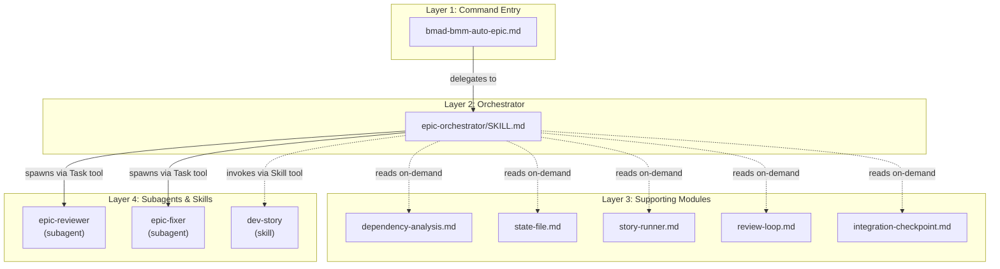
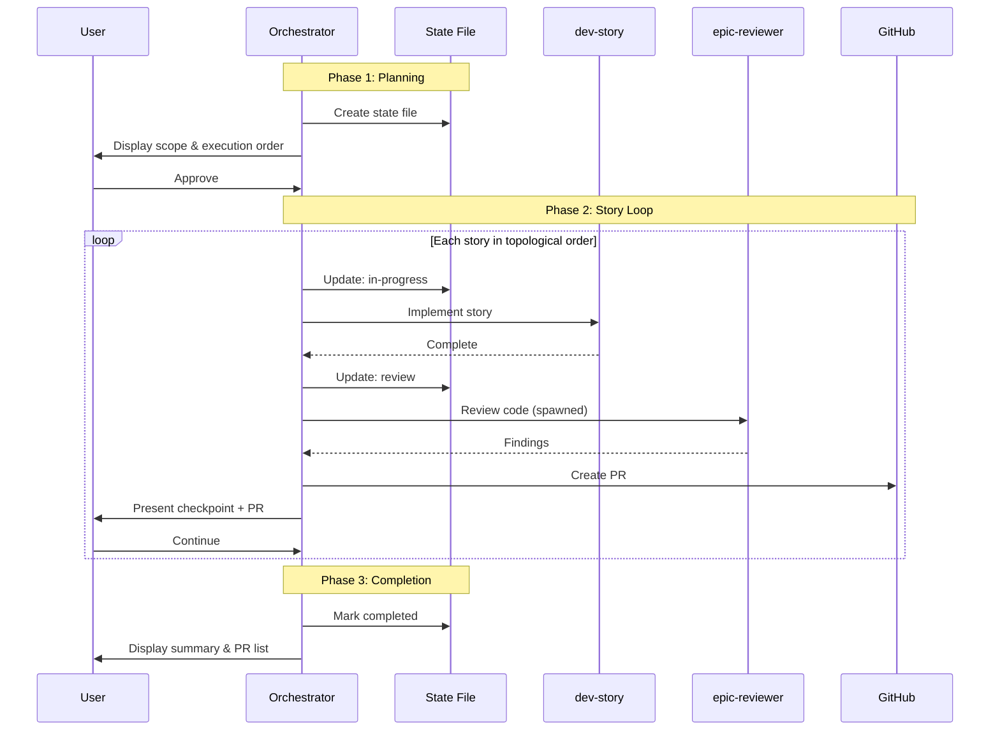
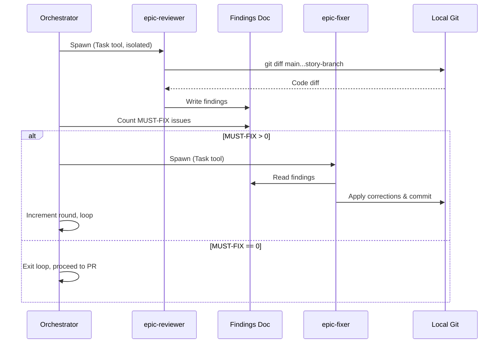
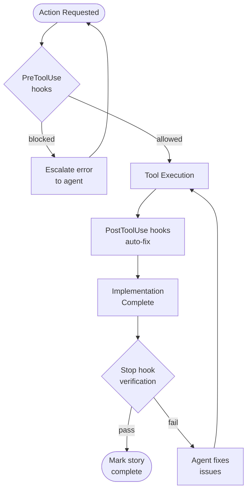
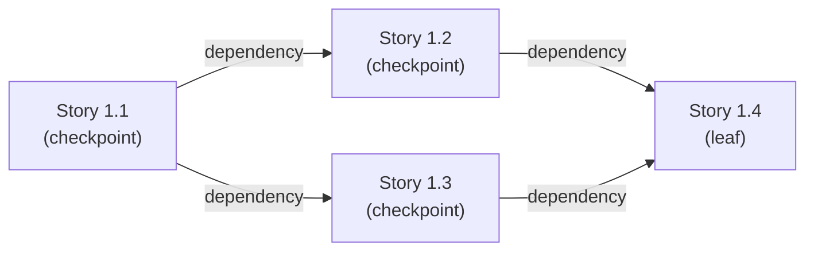

# How Auto Epic Works: System Architecture and Agent Flow

## Overview

Auto Epic autonomously implements complete epics by executing all stories in dependency order. The workflow analyzes story dependencies, runs multi-agent code review on each story (up to 3 reviews with 2 fix attempts before escalation), validates integration points when upstream changes affect downstream stories, and presents all work as pull requests for human approval before merge.

The system balances autonomy with control through clear boundaries. AI agents implement stories, run code review cycles, and enforce architectural constraints through hooks. Humans approve scope at workflow start, review each story's result, intervene at integration checkpoints when dependencies complete, and decide whether to merge the final PRs. No PR merges automatically — the workflow produces verified, ready-to-review pull requests, not uncontrolled commits to main.

Five stories with dependencies (Story 1.2 depends on 1.1, Story 1.4 depends on both 1.2 and 1.3) create coordination complexity that requires manual dependency tracking. Auto Epic eliminates this by computing the dependency graph, validating for cycles, executing in topological order, and running integration checks when dependencies complete.

**Note:** Throughout this document, "base branch" refers to the main development branch. Auto Epic assumes the base branch is `main`.

## Architecture Layers

Auto Epic uses a four-layer architecture that separates command parsing, orchestration logic, execution modules, and agent spawning.

### Layer 1: Command entry point

The `.claude/commands/bmad-bmm-auto-epic.md` file serves as a thin wrapper containing only argument parsing and a delegation instruction to load `.claude/skills/epic-orchestrator/SKILL.md`. The file parses arguments (`--epic`, `--stories`, `--resume`, `--dry-run`, `--epic-path`, `--no-require-merged`, and `--max-review-rounds`) and delegates to the orchestrator skill. This file contains no orchestration logic. It reads the skill definition and follows its instructions.

### Layer 2: Orchestrator skill

The `.claude/skills/epic-orchestrator/SKILL.md` file coordinates the three-phase workflow (planning, implementation loop, completion). The orchestrator reads supporting modules via the Read tool as it enters each phase, spawns subagents with isolated contexts for review and fixing, and enforces nine safety invariants throughout execution. This layer makes all control flow decisions: which story runs next, when to trigger integration checkpoints, when to request human approval.

### Layer 3: Supporting modules

Five modules provide specialized functionality loaded on-demand:

- `dependency-analysis.md` — builds dependency graph, detects cycles, performs topological sort (a graph algorithm that orders stories so all dependencies appear before their dependents)
- `state-file.md` — persists progress to YAML frontmatter, handles resume reconciliation
- `story-runner.md` — abstracts GitHub operations (issues, branches, PRs) for idempotent resume behavior
- `review-loop.md` — spawns reviewer/fixer subagents, counts MUST-FIX issues, manages loop termination (MUST-FIX issues are findings classified as Critical or Important severity by the reviewer — these block PR creation until resolved)
- `integration-checkpoint.md` — analyzes file overlap, detects type changes, reruns tests for stories with dependents

### Layer 4: Subagents and skills

Three agents/skills handle specialized tasks:

- `epic-reviewer` — spawns as an isolated subagent (fresh context via Task tool) with read-only tools to perform adversarial code review without implementation bias
- `epic-fixer` — spawns as an isolated subagent with edit tools to apply corrections based on reviewer findings
- `dev-story` — invokes as a skill (same context via Skill tool) to implement individual stories

#### The dev-story skill

The `dev-story` skill implements individual stories by reading story acceptance criteria, writing code to satisfy requirements, running tests, and committing changes. Unlike the reviewer/fixer subagents (which spawn with isolated contexts via the Task tool), dev-story shares the orchestrator's context and has full edit capabilities. This shared context allows dev-story to maintain awareness of the epic's overall progress and access state information maintained by the orchestrator.

When the orchestrator invokes dev-story for a specific story, dev-story executes a standard implementation workflow:

1. Read the story definition file (`docs/stories/{id}/story.md`) to load acceptance criteria and technical requirements
2. Analyze existing codebase to understand where changes are needed
3. Write code (or modify existing code) to implement the story's requirements
4. Run tests locally to verify the implementation works
5. Commit changes to the story branch with a conventional commit message

The dev-story skill does not perform code review or quality validation — those responsibilities belong to the epic-reviewer subagent. Dev-story focuses solely on implementation: translating story requirements into working code. After dev-story completes, the orchestrator takes over to run the review loop, create the PR, and handle integration checkpoints.

The relationship between orchestrator and dev-story is delegation within the same context. The orchestrator invokes dev-story via the Skill tool (which preserves context), waits for dev-story to complete implementation, then resumes control to execute the review loop and checkpoint logic. This differs from the reviewer/fixer spawning pattern, where the orchestrator uses the Task tool to spawn isolated subagents that cannot access orchestrator state.

The following diagram shows how these layers interact.

_System architecture showing four horizontal layers with delegation and spawning patterns_

<!-- Alt: Block diagram with four layers (Command, Orchestrator, Modules, Agents) showing arrows for delegation from Layer 1 to 2, on-demand loading from Layer 2 to 3, and spawning patterns from Layer 2 to 4 with Task/Skill tool labels -->

_Four-layer architecture showing delegation, on-demand loading, and agent spawning patterns_

<!-- Alt: Block diagram with four horizontal layers showing Command Entry at top delegating to Orchestrator, which loads five supporting modules on-demand and spawns three agents using different patterns -->



## Three-Phase Workflow

This section describes the orchestrator's three execution phases: planning and scope confirmation, story implementation loop, and completion reporting.

### Phase 1: Planning and scope

Phase 1 confirms scope before implementation begins.

1. Load epic metadata from `docs/epics/epic-{id}.md` and parse story list
2. Load each story's frontmatter from `docs/stories/{id}/story.md` to extract `depends_on` arrays
3. Build forward dependency graph (adjacency list) and inverse graph (dependents)
4. Run cycle detection — fatal error if cycles found
5. Perform topological sort to produce execution order that respects dependencies
6. Initialize story runner and create state file at `docs/progress/epic-{id}-auto-run.md`
7. Display scope to user: epic title, story count, execution order, stories with integration checkpoints
8. Wait for human approval to proceed or cancel

Phase 1 step 4 (cycle detection) enforces the never-silently-ignore-failures invariant by treating dependency cycles as fatal errors that stop execution immediately. The workflow will not proceed past scope confirmation until the user types "yes" — this checkpoint prevents unwanted autonomous work.

### Phase 2: Story implementation loop

The orchestrator checks dependency completion for the current story, runs implementation via `dev-story`, executes the review loop, creates a PR, runs integration checkpoint if the story has dependents, and requests human approval before continuing.

1. Fetch latest remote state (`git fetch origin main`) to ensure local remote-tracking refs are current for merge-base checks. For each dependency, check completion based on whether the dependency has dependents. If the dependency has dependents (`hasDependents === true`), verify code reached main via `git merge-base --is-ancestor` (stories with dependents need merge-base verification because downstream stories build on committed code, not just local state). If the dependency is a leaf story (no dependents), state file status "done" is sufficient (leaf stories have no downstream integration risk).
2. Update state to "in-progress" and persist
3. Invoke `dev-story` skill in same context to implement the story
4. Update state to "review" and run review loop
5. Commit and push story branch, create PR with conventional title format
6. If story has dependents (inverse graph non-empty), run integration checkpoint (which syncs the story branch with main as its first sub-step) before presenting the human checkpoint prompt in step 7:
   - Sync local branch with main to get latest upstream code
   - Check for file overlap with dependent stories (git diff analysis)
   - Detect type/interface changes in exported symbols
   - Rerun tests (`npm test`) against updated base
   - Classify result as Green (all clear), Yellow (warnings but tests pass), or Red (test failures)
7. Present checkpoint results to user with story summary, PR link, and next action options
8. If user approves, update state to "done" and continue to next story
9. If user pauses, persist state and exit workflow cleanly for later `--resume`
10. If user skips story, update state to "skipped" and immediately mark all dependents as "blocked" in the state file (blocked stories are skipped silently without human prompts — the workflow continues to the next non-blocked story in execution order)

Phase 2 repeats for each story in the topologically sorted list. The loop maintains the never-auto-merge invariant by creating PRs but leaving them open. Integration checkpoints run only for stories with dependents (identified during Phase 1 dependency analysis). A story with zero dependents (leaf node) skips integration checkpoint and proceeds directly to human approval.

The human checkpoint at step 7 folds integration checkpoint results into the approval prompt. Integration checkpoint results (Green/Yellow/Red) inform the user's decision but do not automatically block downstream stories. For Green results, the workflow shows "all checks passed" and recommends continuing. For Yellow results, the workflow shows warnings and lets the user decide. For Red results, the workflow escalates with failing test output and does not offer auto-continue — the user must pause to investigate, but can choose to continue if they understand the risk.

The following diagram illustrates the linear flow through planning, story loop, and reporting phases with key decision points.

_Linear flow through planning, story loop, and reporting phases_

<!-- Alt: Sequence diagram showing User, Orchestrator, State File, dev-story skill, and epic-reviewer as participants with approval gates at Phase 1 and Phase 2.7 -->

_Three-phase workflow showing automated execution and human approval gates_

<!-- Alt: Sequence diagram with six participants showing Phase 1 scope approval, Phase 2 story loop with review and PR creation repeating for each story, and Phase 3 completion report -->



### Phase 3: Completion and reporting

After all stories complete (or the user pauses the workflow), the orchestrator moves to Phase 3 to generate a summary report.

1. Collect all PR URLs from completed stories
2. Generate epic summary: total stories, completed count, skipped count, blocked count, review statistics
3. Update `docs/epics/epic-{id}.md` with completion status and link to auto-run state file
4. Mark state file as "completed" and persist final state
5. Display report to user with PR list and next steps

Phase 3 runs once per epic. After Phase 3, the workflow exits and control returns to the user for PR review and merge decisions.

## Execution Example

This section walks through a concrete four-story epic execution showing dependency ordering, integration checkpoints, and review loop mechanics. The example demonstrates the three phases from the previous section with actual story data and command output.

The example epic structure:

- Story 1.1 (no dependencies)
- Story 1.2 (depends on Story 1.1)
- Story 1.3 (depends on Story 1.1)
- Story 1.4 (depends on Story 1.2 and Story 1.3)

The following diagram shows the dependency relationships and execution order.

_Dependency graph showing four stories with execution order and checkpoint markers_

<!-- Alt: Graph with 4 nodes (Story 1.1, 1.2, 1.3, 1.4) with directed edges for dependencies, execution order annotations, and checkpoint indicators on Stories 1.1, 1.2, 1.3 -->

_One review loop round with isolated subagent spawning and conditional fixer execution_

<!-- Alt: Sequence diagram showing Orchestrator spawning epic-reviewer in isolation, reading findings document, conditionally spawning epic-fixer if MUST-FIX issues exist, with loop back or exit logic -->



### Phase 1: Planning

The orchestrator loads epic metadata and story files, builds the dependency graph, computes the inverse graph (dependents), runs cycle detection, and performs topological sort.

**Dependency graph (forward):**

- Story 1.1: `[]` (no dependencies)
- Story 1.2: `[1.1]`
- Story 1.3: `[1.1]`
- Story 1.4: `[1.2, 1.3]`

**Dependents graph (inverse):**

- Story 1.1: `[1.2, 1.3]` (has dependents → integration checkpoint needed)
- Story 1.2: `[1.4]` (has dependent → integration checkpoint needed)
- Story 1.3: `[1.4]` (has dependent → integration checkpoint needed)
- Story 1.4: `[]` (leaf story → no integration checkpoint)

**Topological sort produces:** `[1.1, 1.2, 1.3, 1.4]` or `[1.1, 1.3, 1.2, 1.4]` — topological sort can produce either order (both valid) depending on how the algorithm processes parallel nodes, because Story 1.2 and Story 1.3 are independent (neither depends on the other). Auto Epic's actual execution order may vary between runs when parallel stories exist.

Orchestrator displays scope:

```text
Epic: Authentication System Overhaul
Stories: 4 total
Execution order: 1.1 → 1.2 → 1.3 → 1.4
Integration checkpoints: Stories 1.1, 1.2, 1.3 (have dependents)

Proceed? (yes/no)
```

User types "yes". Orchestrator creates state file and initializes runner.

### Phase 2: Story implementation loop

**Story 1.1 execution:**

1. Check dependencies: `[]` (no dependencies) → proceed
2. Update state to "in-progress"
3. Invoke `dev-story` skill to implement Story 1.1
4. Update state to "review" and start review loop (see Multi-Agent Code Review Loop section for details):
   - Review 1: spawn `epic-reviewer` → finds 2 MUST-FIX issues (missing error handling in `auth.ts:45`, unused import in `token.ts:12`) → spawn `epic-fixer` → applies corrections → commits locally
   - Review 2: spawn `epic-reviewer` → finds 0 MUST-FIX issues → loop exits (no fixer spawned because review is clean)
5. Push story branch `story-1-1-jwt-token-service`, create PR "feat: implement JWT token service (#123)"
6. Run integration checkpoint (Story 1.1 has dependents `[1.2, 1.3]`):
   - File overlap: Story 1.1 modified `backend/auth/token.ts`, Stories 1.2 and 1.3 both declare `touches: [backend/auth]`
   - Type changes: exported interface `TokenPayload` added to `token.ts`
   - Sync with main and rerun tests: all tests pass
   - Result: **Yellow** (warnings but tests pass)
7. Present checkpoint to user:

   ```text
   Story 1.1 complete.
   PR: #123 (open)
   Integration checkpoint: YELLOW
   - File overlap detected with Stories 1.2, 1.3
   - Exported type 'TokenPayload' added
   - All tests pass

   Continue to Story 1.2? (yes/pause/skip)
   ```

8. User types "yes"
9. Update state to "done"

**Story 1.2 execution:**

1. Check dependencies: Story 1.1 status "done" with dependents `[1.2, 1.3]` → verify code reached main via `git merge-base --is-ancestor` → proceed
2. Invoke `dev-story`, run review loop (assume 0 MUST-FIX on first review), create PR #124
3. Run integration checkpoint (Story 1.2 has dependent `[1.4]`): assume result Green
4. Present checkpoint to user, user approves
5. Update state to "done"

**Story 1.3 execution:**

1. Check dependencies: Story 1.1 status "done" with dependents → verify via `git merge-base --is-ancestor` → proceed
2. Invoke `dev-story`, run review loop, create PR #125
3. Run integration checkpoint (Story 1.3 has dependent `[1.4]`): assume result Green
4. Present checkpoint, user approves
5. Update state to "done"

**Story 1.4 execution:**

1. Check dependencies: Stories 1.2 and 1.3 both status "done" with dependents → verify via `git merge-base --is-ancestor` → proceed
2. Invoke `dev-story`, run review loop, create PR #126
3. Skip integration checkpoint (Story 1.4 has no dependents)
4. Present completion to user:

   ```text
   Story 1.4 complete.
   PR: #126 (open)
   No integration checkpoint needed (leaf story)

   Continue to epic completion? (yes/pause)
   ```

5. User types "yes"
6. Update state to "done"

### Phase 3: Completion

Orchestrator generates summary:

```text
Epic: Authentication System Overhaul — COMPLETE
Stories completed: 4 / 4
PRs ready for review:
- #123 feat: implement JWT token service
- #124 feat: add token refresh endpoint
- #125 feat: implement session management
- #126 feat: integrate auth with user service

Review statistics: 5 reviews total (avg 1.25 per story)
Integration checkpoints: 3 run (1 Yellow, 2 Green)

Next steps: Review and merge PRs in order [#123, #124, #125, #126]
```

User reviews PRs and merges them manually. The workflow does not merge — it produces verified, review-ready work.

This example demonstrates dependency ordering (Story 1.1 completes before Story 1.2/1.3 start), integration checkpoints (run for Story 1.1/1.2/1.3 but not Story 1.4), review loop mechanics (2 reviews for Story 1.1), and human approval gates (after each story and at completion). For hook enforcement details, see Hook System Enforcement section. For resume behavior, see State Management and Resume section.

## Dependency Analysis

Stories declare dependencies in YAML frontmatter using `depends_on: [story-id-1, story-id-2]` format. The orchestrator reads these declarations to build a directed acyclic graph (DAG) that determines execution order and integration checkpoint triggers.

The dependency analysis module builds two graphs: a forward graph (adjacency list mapping each story to its dependencies) and an inverse graph (mapping each story to its dependents). The forward graph drives execution order via topological sort. The inverse graph identifies which stories need integration checkpoints (any story with non-empty dependents list).

Cycle detection runs before execution begins. If the dependency graph contains a cycle (Story A depends on Story B, Story B depends on Story C, Story C depends on Story A), the workflow halts with a fatal error and does not proceed. This enforces the never-silently-ignore-failures invariant at the planning stage.

Topological sort uses Kahn's algorithm or DFS-based topological sort. The algorithm initializes a queue with all zero-dependency stories, processes stories from the queue, decrements dependency counts for their dependents, and adds newly-zero-dependency stories to the queue. The result is a linear execution order that guarantees all dependencies complete before their dependents start. For the dependency graph `[1.1] ← [1.2, 1.3] ← [1.4]` (Story 1.2 and 1.3 depend on 1.1, Story 1.4 depends on both 1.2 and 1.3), the sort produces order `[1.1, 1.2, 1.3, 1.4]` or `[1.1, 1.3, 1.2, 1.4]` — both valid because Story 1.2 and Story 1.3 are independent.

The inverse graph computed during dependency analysis serves integration checkpoint identification. After completing Story 1.1, the orchestrator checks `story.dependents` — finds `[1.2, 1.3]` — and runs integration checkpoint. After completing Story 1.4, the orchestrator checks `story.dependents` — finds `[]` — and skips integration checkpoint.

Dependency completion policy varies based on whether the dependency has its own dependents. If Story 1.2 depends on Story 1.1 and Story 1.1 has dependents (Story 1.3), Story 1.2 can start after Story 1.1's code reaches main via `git merge-base --is-ancestor` verification — even if the PR is not yet merged. If the dependency is a leaf (has no other dependents), the dependent can start after the dependency's state is marked "done" — no merge-base check is required because leaf stories have no downstream integration risk.

## Multi-Agent Code Review Loop

The review loop runs up to 3 reviews by default with up to 2 fix attempts before escalation. A review consists of spawning the epic-reviewer and generating findings. If MUST-FIX issues are found, the orchestrator spawns a fixer — this does not increment the review counter. The default limit of 3 reviews allows up to 2 fix attempts before escalation: Review 1 → fix → Review 2 → fix → Review 3 → escalate if still unclean.

The `--max-review-rounds` flag allows override up to 5 reviews. The goal is zero MUST-FIX issues before proceeding to PR creation. MUST-FIX issues are findings classified as Critical or Important severity by the reviewer — these block PR creation until resolved. Each review spawns a fresh reviewer context, produces a findings document, counts MUST-FIX issues, spawns a fixer if needed, and commits corrections locally.

**Review execution:**

1. The orchestrator spawns `epic-reviewer` subagent via Task tool with isolated context
2. The reviewer diffs the local story branch against main using `git diff main...story-branch`
3. The reviewer analyzes implementation against story acceptance criteria, architectural constraints (ADRs), and code quality standards
4. The reviewer writes findings to `docs/stories/{id}/review-findings-round-{n}.md` with severity classifications: MUST-FIX (blocks PR), SHOULD-FIX (quality improvement), MINOR (polish)
5. The orchestrator reads findings document and counts MUST-FIX issues
6. If MUST-FIX count > 0 and reviews < max, the orchestrator spawns `epic-fixer` subagent via Task tool
7. The fixer reads findings document, applies corrections, commits changes locally with message referencing review number
8. The orchestrator increments the review counter and loops back to step 1

**Exit conditions:**

- MUST-FIX count reaches zero → exit cleanly, proceed to PR creation
- Review count exceeds max (3 by default) → escalate to user with last findings document, request intervention

Context isolation is critical to review quality. Each `epic-reviewer` spawn gets a fresh context with no knowledge of previous reviews, no implementation history, and no access to implementation conversation history. The reviewer has read-only access to: story definition file, ADR documents, and the current code diff. The reviewer does NOT have: previous review findings or orchestrator context about why implementation decisions were made. This adversarial review pattern prevents reviewer bias — the reviewer cannot rationalize implementation choices because it does not know why those choices were made.

The fixer operates in the opposite pattern: full context, edit tools enabled, reads findings document to understand what to fix. Fixer commits stay local during the loop. No push happens until the loop exits cleanly with MUST-FIX count zero. This local-only git workflow allows the orchestrator to abandon work if max reviews exceeded without polluting the remote branch.

The following diagram shows one complete review with spawning, findings generation, and conditional branching.

_One complete review with subagent spawning and decision points_

<!-- Alt: Sequence diagram showing Orchestrator, epic-reviewer (spawned), epic-fixer (spawned), Local Git, and Findings Doc as participants with conditional branching based on MUST-FIX count -->

_Hook firing timeline from action request through execution to completion verification_

<!-- Alt: Flowchart showing linear timeline with PreToolUse decision gate, Tool Execution, PostToolUse auto-fix, and Stop verification gate with feedback loops for blocked actions and failed verification -->



## Integration Checkpoints

Integration checkpoints run after completing stories with dependents to validate that upstream changes do not break downstream work. The checkpoint performs three analyses: file overlap detection, type/interface change detection, and test re-run.

**File overlap detection** compares actual changed files via `git diff` against the advisory `touches` field in dependent story frontmatter. The `touches` field is developer-declared guidance, not authoritative — actual conflict detection relies on git diff analysis. If the completed story modified `shared/db/src/client.ts` (determined by `git diff main...story-branch --name-only`) and a dependent story declares `touches: [shared/db]`, the checkpoint flags potential conflict.

**Type/interface change detection** scans TypeScript files in the diff for exported type definitions and interface changes. The module runs `git diff origin/main...story-branch -- '*.ts' '*.d.ts'` and uses regex to match `export (type|interface) <name>` patterns in the diff output. If the completed story modifies exported types that dependent stories import, the checkpoint flags integration risk.

**Test re-run** syncs the local branch with main (`git pull origin main`), rebases the story branch if needed, and runs `npm test` against the updated codebase. This catches integration failures before dependent stories start implementation. If the tests fail after syncing with main, the checkpoint result is Red and the workflow escalates to the user — no auto-continue offered.

**Result classification:**

- **Green** — no file overlap, no type changes detected, all tests pass → display results, fold into Phase 2 step 7 human checkpoint prompt, recommend continuing
- **Yellow** — file overlap or type changes detected but tests pass → display warnings, fold into prompt, let user decide
- **Red** — tests fail after sync-with-main → display failing test output, escalate to user without auto-continue option

Checkpoint results merge into the Phase 2 step 7 human approval prompt. For Green, the prompt shows "Integration checks passed. Continue to next story?" For Yellow, the prompt shows "Warnings detected: potential overlap with Stories 1.2, 1.3. Tests pass. Continue?" For Red, the prompt shows "Integration tests failing. You must pause to investigate."

Integration checkpoints enforce the never-skip-tests invariant by running the full test suite after syncing with main. This catches failures caused by concurrent main branch changes that occurred during story implementation.

## Hook System Enforcement

Eight hooks enforce quality gates and architectural constraints during Auto Epic execution. Hooks fire at three phases: PreToolUse (before tool execution, can block actions), PostToolUse (after tool execution, can auto-fix), and Stop (before agent marks task complete, verification prompt).

**PreToolUse hooks** (block or escalate before action):

- `bash-guard.js` — blocks catastrophic commands (`rm -rf /`, `git push --force`, `npm publish`) before execution
- `file-guard.js` — blocks modifications to critical files (`.claude/SKILL.md`, `package.json` dependencies, `CLAUDE.md`) without explicit approval
- `architecture-guard.sh` — enforces ADRs by checking patterns (lambda-to-lambda calls violate ADR-008, missing shared lib imports violate ADR-011) and blocking non-conforming code
- `import-guard.sh` — requires all Lambda handlers import from `@ai-learning-hub/*` shared libraries before using utilities
- `tdd-guard.js` — blocks implementation file edits when no corresponding test file exists or when test file has not been updated recently

**PostToolUse hooks** (auto-fix after action):

- `auto-format.sh` — runs Prettier and ESLint with `--fix` after file edits, commits formatting changes automatically
- `type-check.sh` — runs `tsc --noEmit` after TypeScript file edits, surfaces type errors before commit

**Stop hook** (verify before completion):

- Agent receives prompt to verify tests pass (`npm test`), linting succeeds (`npm run lint`), and build completes (`npm run build`) before marking story complete

Tests run at two points during the workflow: (1) during the Stop hook verification before marking story complete, and (2) during integration checkpoints after syncing with main. The review loop focuses on code quality findings, not test execution.

Hooks are self-correcting — they teach the correct pattern via error messages. When `architecture-guard.sh` blocks a Lambda-to-Lambda call, the error message includes the correct pattern: "Use API Gateway or EventBridge for inter-Lambda communication (ADR-008)." The agent reads the error, adjusts implementation, retries. User intervention is needed only if the agent violates the same hook more than 3 times (indicates the agent is not learning from feedback).

Hooks enforce the never-bypass-hooks invariant. The orchestrator cannot disable hooks during Auto Epic execution — all quality gates remain active throughout the workflow. This prevents the orchestrator from taking shortcuts that compromise code quality.

The following diagram shows hook firing points during the story implementation timeline.

_Hook firing points during story implementation with decision gates and auto-fix application_

<!-- Alt: Flowchart showing timeline from Action Requested through PreToolUse hooks (decision diamond for block/allow), Tool Execution, PostToolUse hooks (auto-fix), Implementation Complete, and Stop hook verification -->

_Dependency relationships showing execution order and integration checkpoint triggers_

<!-- Alt: Directed graph with four story nodes showing Story 1.1 has no dependencies, Stories 1.2 and 1.3 both depend on 1.1, Story 1.4 depends on both 1.2 and 1.3, with checkpoint annotations on non-leaf stories -->



## State Management and Resume

The state file at `docs/progress/epic-{id}-auto-run.md` uses YAML frontmatter for machine-readable state and markdown body for human-readable display. The state file is the primary source of truth for workflow control flow decisions. GitHub state (PR status, branch existence) is secondary.

**Seven story statuses:**

- `pending` — story not started yet
- `in-progress` — currently implementing
- `review` — in review loop
- `done` — implementation complete, PR created and merged (or intentionally closed)
- `blocked` — cannot start because dependency was skipped
- `paused` — user paused workflow at this story
- `skipped` — user explicitly skipped this story

**Resume reconciliation** handles the 7-case matrix of state file status versus GitHub reality:

| State File  | GitHub PR Status    | Reconciliation Action                               |
| ----------- | ------------------- | --------------------------------------------------- |
| done        | merged              | Skip story, already complete                        |
| done        | open                | Skip story, assume human intentionally left PR open |
| done        | closed (not merged) | Skip story, assume human closed intentionally       |
| in-progress | no PR               | Resume implementation from last state               |
| in-progress | PR exists           | Assume work complete, update state to done          |
| review      | PR exists           | Skip review loop, update state to done              |
| pending     | PR exists           | Treat as done, developer completed manually         |

When state file status conflicts with GitHub PR status, the state file takes precedence. If the state file marks a story "done" but GitHub shows PR closed (not merged), the workflow assumes the human closed the PR for a reason and skips the story. This prevents the workflow from re-implementing work the user intentionally canceled.

The atomic write pattern is specified in the design docs but not yet implemented in the codebase. The design specifies atomic writes using a `.tmp` file pattern: write new state to `epic-{id}-auto-run.tmp.md`, verify write succeeded, then `mv epic-{id}-auto-run.tmp.md epic-{id}-auto-run.md`. The `mv` operation is atomic on POSIX filesystems, preventing partial state writes if the process crashes mid-write. Currently, state writes use standard file I/O. Race conditions are not expected in normal usage because the orchestrator is the only writer, but the atomic pattern would eliminate this assumption.

Dependency completion policy during resume: if a dependency has status "done" and has dependents (`hasDependents === true`), verify code reached main via `git merge-base --is-ancestor`; if a dependency is a leaf (no dependents), state file status "done" is sufficient. If a dependency has status "skipped", all dependents are immediately marked "blocked" in the state file. Blocked stories are skipped silently without human prompts — the workflow continues to the next non-blocked story in execution order. To un-block stories, the user must manually edit the state file or restart the workflow after completing the skipped dependency.

## Safety Invariants and Human Checkpoints

Nine safety invariants are non-negotiable rules enforced throughout the workflow. Four human checkpoints provide intervention points where the user can pause, skip stories, or cancel execution.

**Nine safety invariants:**

1. **Never auto-merge** — all PRs remain open for human review before merge
2. **Never bypass hooks** — all quality gates remain active, cannot be disabled
3. **Never force push** — story branches use normal push, no `--force` flag
4. **Never push to main** — orchestrator only pushes to story branches
5. **Never skip tests** — `npm test` runs during Stop hook verification and integration checkpoints
6. **Never silently ignore failures** — cycles, test failures, and hook violations escalate to user
7. **Idempotent operations** — GitHub operations check for existence before creating (branch, PR, issue comment) to support clean resume after workflow interruption
8. **State persistence** — state file updates after every story status change
9. **Human checkpoints** — four approval gates where user controls workflow progression

**Four checkpoint types:**

1. **Scope confirmation** (Phase 1 step 8) — user approves epic scope, story list, execution order before implementation begins
2. **Per-story approval** (Phase 2 step 7) — user reviews story completion, PR link, integration checkpoint results (if applicable), and decides continue/pause/skip
3. **Integration checkpoints** (Phase 2 step 6 for stories with dependents) — automated validation results presented to user with Green/Yellow/Red classification
4. **Completion review** (Phase 3) — user receives final report with all PR links and merge recommendations

Human checkpoints provide four intervention points. At scope confirmation, the user can cancel if the execution order looks wrong or the story list is incorrect. At per-story approval, the user can pause to review the PR, skip a story that no longer makes sense, or continue to the next story. At integration checkpoints, the user sees validation results and can pause if Yellow or Red flags appear concerning. At completion review, the user has the full PR list and can merge selectively.

The workflow never takes destructive actions that could lose work. No force push (could lose commits), no auto-merge (could merge broken code), no automatic PR closes (user might want the branch preserved). These invariants ensure the workflow produces artifacts the user can review, modify, or discard without data loss risk.

---

## Next Steps

To run Auto Epic on your own epic:

- Ensure epic and story files follow the BMAD format with dependency declarations in `depends_on` arrays
- Run `bmad-bmm-auto-epic --epic N` where N is your epic number
- Review the scope confirmation prompt showing execution order and integration checkpoint stories
- Approve scope to begin implementation
- Monitor human checkpoints and approve/pause/skip as each story completes

For customization details, see `.claude/skills/epic-orchestrator/SKILL.md`. For hook configuration, see `.claude/hooks/README.md`. For dependency syntax and story file format, see BMAD documentation in `docs/bmad/`.
