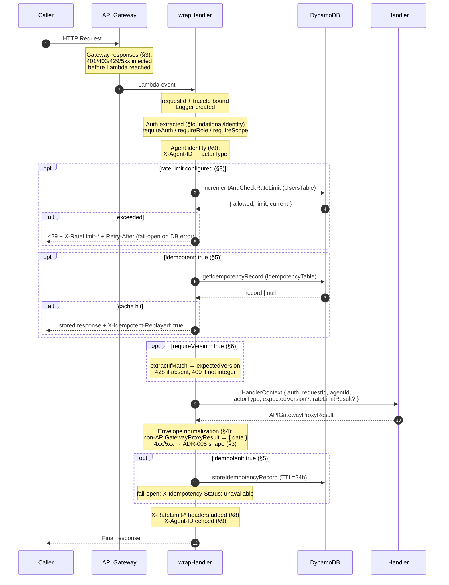
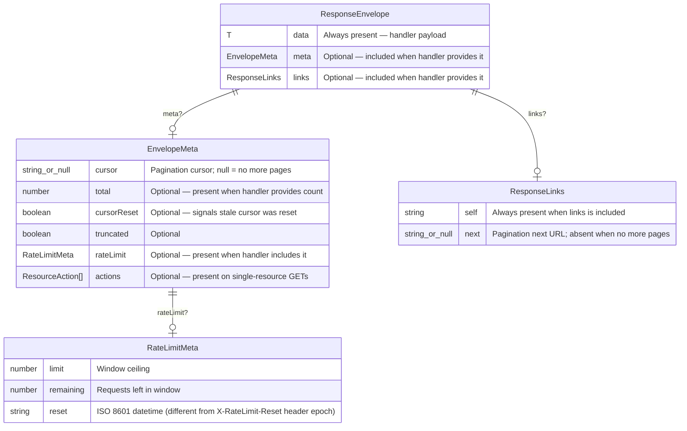

# API Contract Layer (Epic 3.2 Intent)

> **Source of truth:** `backend/shared/middleware/src/`, `backend/shared/types/src/`, `backend/shared/db/src/`, `backend/functions/`.
>
> **Verification commands run:** `npm test` (all tests pass -- 0 failures), `npm run type-check` (0 errors). Source inspection of `wrapper.ts`, `error-handler.ts`, `idempotency.ts`, `concurrency.ts`, `agent-identity.ts`, `rate-limit-headers.ts`, `action-registry.ts`, `action-registrations.ts`, `resource-actions.ts`, `pagination.ts`, `version-helpers.ts`, and handler files.
>
> **Smoke test:** A live E2E smoke suite at `scripts/smoke-test/` validates the contract invariants against a deployed environment. Relevant scenarios: AN1 (envelope), AN2 (idempotency replay), AN3 (VERSION_CONFLICT), AN4 (PRECONDITION_REQUIRED), AN5 (SCOPE_INSUFFICIENT), AN6 (rate limit headers on success), AN7 (cursor pagination), AN8 (X-Agent-ID), BA1-BA3 (batch), AC14 (429 + Retry-After -- conditional on `SMOKE_TEST_RATE_LIMIT_JWT`). The invariants table below cites both unit tests and smoke scenarios where applicable.

---

## 1. Purpose of the API Contract Layer

The API contract layer defines what every caller -- human or agent -- can rely on in any response from this system, regardless of which domain produced it. It answers: _"What invariants about shape, behavior, and semantics hold for every API response?"_ It builds on `docs/architecture/foundational-baseline.md` (infrastructure, `wrapHandler` mechanics, shared libraries) and `docs/architecture/identity-access-layer.md` (authentication, `AuthContext`, role and scope enforcement). Everything documented here is a cross-cutting transport and envelope contract, not domain behavior.

---

## 2. API Contract Layer Boundaries

### Belongs to the API contract layer

| Category                           | Examples                                                                                                              |
| ---------------------------------- | --------------------------------------------------------------------------------------------------------------------- |
| Response envelope                  | `ResponseEnvelope<T>`, `EnvelopeMeta`, `ResponseLinks`, `createSuccessResponse`                                       |
| Error contract                     | `ApiErrorBody`, `ApiErrorResponse`, `ErrorCode` enum, `AppError.toApiError`, gateway response templates               |
| Idempotency mechanism              | `Idempotency-Key` header, `IdempotencyTable` storage, `X-Idempotent-Replayed`, fail-open behavior                     |
| Optimistic concurrency             | `If-Match` header, `updateItemWithVersion`, `VERSION_CONFLICT` shape, `PRECONDITION_REQUIRED`                         |
| Cursor pagination                  | `encodeCursor`/`decodeCursor`, `DEFAULT_PAGE_SIZE`, `MAX_PAGE_SIZE`, `meta.cursor` (hard), `links.next` (optional)    |
| Rate limit signaling (best-effort) | `X-RateLimit-Limit/Remaining/Reset`, `Retry-After`, `meta.rateLimit`, fail-open behavior (when DynamoDB is reachable) |
| Agent identity                     | `X-Agent-ID` header, `AgentIdentity`, `ActorType`, echo in response                                                   |
| Action discoverability             | `meta.actions`, `GET /actions` catalog, `GET /states/{entityType}`, `ActionRegistry`, `buildResourceActions`          |
| Batch operations contract          | `POST /batch`, `BatchOperation`, `BatchResponse`, auth propagation, non-atomicity                                     |

### Does not belong to the API contract layer

- Authentication and authorization mechanics (covered in `docs/architecture/identity-access-layer.md`)
- Infrastructure provisioning, table encryption, CI/CD (covered in `docs/architecture/foundational-baseline.md`)
- What any specific endpoint does with its domain data (saves, projects, links, etc.)
- Domain-specific state machines or entity lifecycles
- Per-domain rate limit threshold values (those are domain-configured via `RateLimitMiddlewareConfig`)

### Classification rule

A capability belongs to the API contract layer if and only if it meets **all five** criteria below.

| #   | Criterion                              | Test                                                                                                                                                                                                                                                                                                                                                                                                                                                                                                                                          |
| --- | -------------------------------------- | --------------------------------------------------------------------------------------------------------------------------------------------------------------------------------------------------------------------------------------------------------------------------------------------------------------------------------------------------------------------------------------------------------------------------------------------------------------------------------------------------------------------------------------------- |
| 1   | **Client-observable**                  | It appears in an HTTP request header, response body, or response header. It is not an internal implementation detail. A caller can write a test against it without reading handler source code.                                                                                                                                                                                                                                                                                                                                               |
| 2   | **Cross-domain uniform**               | It applies identically to saves endpoints, projects endpoints, and any future domain. The behavior does not vary by entity type or domain. A caller observing two different endpoints sees the same pattern.                                                                                                                                                                                                                                                                                                                                  |
| 3   | **Contract-stable**                    | An agent or integration built against it does not need to change when a new domain is added or an existing domain is extended. The contract has two tiers: (a) _hard guarantees_ that hold for every response produced by `wrapHandler` (see Section 4, Hard Guarantees); and (b) _contract-defined optional extensions_ that are available via shared primitives but only present when a handler includes them (`meta.actions`, `links.next`, `meta.rateLimit`). Both tiers belong here; callers must know which tier each field belongs to. |
| 4   | **Handler-agnostic mechanism**         | A handler author implements the pattern via `wrapHandler` options or shared library primitives (`@ai-learning-hub/*`), not bespoke code. The mechanism is identical regardless of which domain the handler serves.                                                                                                                                                                                                                                                                                                                            |
| 5   | **Enforced or explicitly labeled gap** | There is either (a) automated enforcement (unit test, integration test, CDK synth assertion) that fails if the contract breaks, or (b) an explicit "Manual review" or "No automated enforcement" label in this document.                                                                                                                                                                                                                                                                                                                      |

**Corollary:** If a behavior is specific to what a particular endpoint does with a particular entity (e.g., "a save has a `status` field that transitions from `active` to `deleted`"), that is a domain contract belonging to that epic's documentation. The API contract layer defines transport and envelope mechanics, not payload semantics.

**Allowed exceptions:** A domain-specific example may appear in this document only to illustrate a cross-cutting pattern, not to document the domain feature. Label it "illustrative example" and do not imply it is the full specification of that behavior.

---

## API Contract Layer Architecture Overview

The diagram below shows the `wrapHandler` middleware chain as a sequence of contract checkpoints for a generic handler invocation. Each checkpoint corresponds to a section of this document.



The diagram below shows the response envelope structure.



---

## 3. Error Contract

### Error response shape

Every error that passes through `wrapHandler` is normalized to the ADR-008 shape. Source: `backend/shared/types/src/errors.ts`, `backend/shared/middleware/src/error-handler.ts`.

```typescript
// backend/shared/types/src/errors.ts

export interface ApiErrorBody {
  code: ErrorCode;
  message: string;
  requestId: string;
  details?: Record<string, unknown>;
  currentState?: string; // promoted from AppError.details when present
  allowedActions?: string[]; // promoted from AppError.details when present
  requiredConditions?: string[]; // promoted from AppError.details when present
}

export interface ApiErrorResponse {
  error: ApiErrorBody;
}
```

`AppError.toApiError(requestId)` performs the promotion: `currentState`, `allowedActions`, and `requiredConditions` are lifted from `details` to the top-level error object. All other `details` fields remain nested under `details`. The `requestId` is always present in error bodies (it is the same value echoed in the `X-Request-Id` response header).

`handleError` in `error-handler.ts` also sets:

- `Content-Type: application/json`
- `X-Request-Id: {requestId}`
- `Retry-After: {seconds}` when `error.code === ErrorCode.RATE_LIMITED` and `details.retryAfter` is set

### Field-level validation errors

```typescript
// backend/shared/types/src/api.ts

export interface FieldValidationError {
  field: string;
  message: string;
  code: string;
  constraint?: string;
  allowed_values?: string[];
}
```

Field validation errors are passed as `details.fields: FieldValidationError[]` on `AppError(ErrorCode.VALIDATION_ERROR, ...)` instances. Source: `backend/shared/middleware/src/error-handler.ts` (body serialization), `@ai-learning-hub/validation` (Zod error formatting via `formatZodErrors`).

### State and conflict errors

`currentState` and `allowedActions` are included in error responses when a handler explicitly constructs an error using the fluent builder:

```typescript
AppError.build(ErrorCode.CONFLICT, "message")
  .withState("paused", ["resume", "delete"])
  .withConditions(["confirm_action"])
  .create();
```

The `VERSION_CONFLICT` (409) error produced by `VersionConflictError` does NOT automatically include `currentState` or `allowedActions`. It provides `currentVersion` in `details`:

```json
{
  "error": {
    "code": "VERSION_CONFLICT",
    "message": "Resource has been modified",
    "requestId": "...",
    "details": { "currentVersion": 3 }
  }
}
```

Domain handlers may supplement this with `currentState` and `allowedActions` by re-throwing a custom `AppError.build(...)` after catching `VersionConflictError`. Whether they do so is a domain contract, not an API contract layer guarantee.

### Gateway-level error responses

Defined in `infra/lib/stacks/api/api-gateway.stack.ts`. These four gateway responses fire before any Lambda is invoked (e.g., missing auth token, API Gateway throttle).

| Gateway Response Type | HTTP Status | `code` in body   | Message                                            |
| --------------------- | ----------- | ---------------- | -------------------------------------------------- |
| `UNAUTHORIZED`        | 401         | `UNAUTHORIZED`   | Missing or invalid authentication credentials      |
| `ACCESS_DENIED`       | 403         | `FORBIDDEN`      | You do not have permission to access this resource |
| `THROTTLED`           | 429         | `RATE_LIMITED`   | Too many requests. Please try again later.         |
| `DEFAULT_5XX`         | 500         | `INTERNAL_ERROR` | An unexpected error occurred                       |

All four responses use this template shape:

```json
{
  "error": {
    "code": "<code>",
    "message": "<message>",
    "requestId": "$context.requestId"
  }
}
```

All four responses inject these CORS headers:

```
Access-Control-Allow-Origin: *
Access-Control-Allow-Headers: Content-Type,Authorization,x-api-key
Access-Control-Allow-Methods: GET,POST,PATCH,DELETE,OPTIONS
```

Gateway responses use the same `ErrorCode` values as handler-produced runtime errors. A caller observing a 401 receives `UNAUTHORIZED` whether it was produced by API Gateway (missing token) or by `handleError` inside a Lambda (invalid token after parsing). There is no divergence between gateway-layer and handler-layer error codes.

Verified: `infra/test/stacks/api/api-gateway.stack.test.ts`, `infra/test/architecture-enforcement/api-gateway-contract.test.ts`.

### `ErrorCode` enum

Full enum from `backend/shared/types/src/errors.ts`:

| Code                       | HTTP | Description                                                       |
| -------------------------- | ---- | ----------------------------------------------------------------- |
| `VALIDATION_ERROR`         | 400  | Request body or parameter failed schema validation                |
| `UNAUTHORIZED`             | 401  | Missing or invalid authentication credentials                     |
| `FORBIDDEN`                | 403  | Authenticated but insufficient role or permissions                |
| `NOT_FOUND`                | 404  | Requested resource does not exist                                 |
| `CONFLICT`                 | 409  | Request conflicts with current state (generic)                    |
| `DUPLICATE_SAVE`           | 409  | A save for the same URL already exists                            |
| `RATE_LIMITED`             | 429  | Per-operation rate limit exceeded                                 |
| `METHOD_NOT_ALLOWED`       | 405  | HTTP method not supported for this route                          |
| `EXPIRED_TOKEN`            | 401  | JWT has expired                                                   |
| `INVALID_API_KEY`          | 401  | API key not found or invalid                                      |
| `REVOKED_API_KEY`          | 401  | API key has been revoked                                          |
| `SUSPENDED_ACCOUNT`        | 403  | User account is suspended                                         |
| `SCOPE_INSUFFICIENT`       | 403  | API key lacks required operation scope                            |
| `INVITE_REQUIRED`          | 403  | JWT does not carry `inviteValidated` claim                        |
| `INVALID_INVITE_CODE`      | 400  | Invite code does not exist, is expired, or already redeemed       |
| `VERSION_CONFLICT`         | 409  | Optimistic concurrency check failed; resource was modified        |
| `PRECONDITION_REQUIRED`    | 428  | `If-Match` header required but absent                             |
| `IDEMPOTENCY_KEY_CONFLICT` | 409  | Same `Idempotency-Key` used for a different operation path        |
| `INVALID_STATE_TRANSITION` | 409  | Requested state transition is not valid from current entity state |
| `INTERNAL_ERROR`           | 500  | Unhandled server error                                            |
| `SERVICE_UNAVAILABLE`      | 503  | A required downstream service is unavailable                      |
| `EXTERNAL_SERVICE_ERROR`   | 502  | External service call failed (e.g., URL enrichment)               |

---

## 4. Response Envelope

### Hard guarantees

These hold for **every** response produced by a handler using `wrapHandler`, regardless of options configured. They are the minimum a caller can rely on unconditionally.

**On success (2xx):**

| Guarantee                        | Source                                                           |
| -------------------------------- | ---------------------------------------------------------------- |
| HTTP 2xx status code             | Handler returns success or `wrapHandler` wraps to 200 by default |
| JSON body with `data` field      | `createSuccessResponse` or `wrapHandler` normalization           |
| `X-Request-Id` response header   | `createSuccessResponse` always sets `X-Request-Id: {requestId}`  |
| `Content-Type: application/json` | Set by `createSuccessResponse` / `createErrorResponse`           |

**On failure (4xx/5xx):**

| Guarantee                                           | Source                                                          |
| --------------------------------------------------- | --------------------------------------------------------------- |
| JSON body `{ error: { code, message, requestId } }` | `handleError` + `AppError.toApiError` always produce this shape |
| `error.code` is a valid `ErrorCode`                 | `normalizeError` maps all unknown errors to `INTERNAL_ERROR`    |
| `error.requestId` matches `X-Request-Id` header     | Both set from the same `requestId` value                        |
| `X-Request-Id` response header                      | Set by `createErrorResponse`                                    |

**Always-on, regardless of success or failure:**

| Guarantee                     | Source                                                              |
| ----------------------------- | ------------------------------------------------------------------- |
| `X-Agent-ID` echoed if sent   | `echoAgentId` runs on both success and error paths in `wrapHandler` |
| `X-Request-Id` header present | Added by both `createSuccessResponse` and `createErrorResponse`     |

**Optional extensions (contract-defined but not universally present):**

`meta`, `links`, `meta.cursor`, `meta.rateLimit`, `meta.actions`, and `links.next` are part of the contract vocabulary but are not added automatically. Their presence depends on whether the handler passes them to `createSuccessResponse`. See the field presence rules table below.

### Types

Source: `backend/shared/types/src/api.ts`.

```typescript
export interface RateLimitMeta {
  limit: number;
  remaining: number;
  reset: string; // ISO 8601 datetime string
}

export interface EnvelopeMeta {
  cursor?: string | null;
  total?: number;
  cursorReset?: boolean;
  truncated?: boolean;
  rateLimit?: RateLimitMeta;
  actions?: ResourceAction[];
}

export interface ResponseLinks {
  self: string;
  next?: string | null;
}

export interface ResponseEnvelope<T> {
  data: T;
  meta?: EnvelopeMeta;
  links?: ResponseLinks;
}
```

### Field presence rules

| Field              | When present                                                                                                             |
| ------------------ | ------------------------------------------------------------------------------------------------------------------------ |
| `data`             | Always. Contains the handler's payload.                                                                                  |
| `meta`             | When the handler explicitly passes `meta` to `createSuccessResponse`. Not added automatically by `wrapHandler`.          |
| `links`            | When the handler explicitly passes `links` to `createSuccessResponse`. Not added automatically by `wrapHandler`.         |
| `links.self`       | Always present when `links` is included.                                                                                 |
| `links.next`       | Present (with a URL value) when there is a next page. Null or absent when no more pages.                                 |
| `meta.cursor`      | Present (non-null) on list responses when there is a next page. Null when the result set is exhausted.                   |
| `meta.total`       | Present when the handler provides a count via `buildPaginatedResponse({ total })`. Not universally present.              |
| `meta.rateLimit`   | Present when the handler explicitly calls `buildRateLimitMeta` and passes the result to `meta`. Not added automatically. |
| `meta.actions`     | Present on single-resource GET responses where the handler calls `buildResourceActions` and includes the result.         |
| `meta.cursorReset` | Optional field on `EnvelopeMeta`; not currently set by any handler in the codebase. **No automated enforcement.**        |

**Important:** `requestId` appears in the `X-Request-Id` response header and in error bodies. It does NOT appear in the success envelope `meta`. Handlers that want to surface `requestId` in the body must do so explicitly.

The `wrapHandler` catch-all normalization wraps any non-`APIGatewayProxyResult` return value in `{ data }` only (no `meta` or `links`). When a handler returns an `APIGatewayProxyResult` directly (i.e., by calling `createSuccessResponse`), the body is passed through as-is for 2xx responses.

Verification: `backend/shared/middleware/test/error-contract-envelope.integration.test.ts`, `backend/shared/middleware/test/error-handler.test.ts`.

### Versioned entities

Source: `backend/shared/types/src/entities.ts`.

```typescript
export type VersionedEntity<T> = T & { version: number };

export const INITIAL_VERSION = 1;

export function nextVersion(current: number): number {
  return current + 1;
}
```

Every entity written with `putItemWithVersion` starts at `version: 1`. Every update via `updateItemWithVersion` increments `version` by 1 atomically. The `version` value in the response body is the post-write version. Callers construct their `If-Match` header from this value before issuing an update.

---

## 5. Idempotency Contract

### Activation

`wrapHandler` option: `idempotent: true`.

**Handlers currently using `idempotent: true`** (from `grep -r "idempotent: true" backend/functions`):

| Handler file                                   | Route(s)                                              |
| ---------------------------------------------- | ----------------------------------------------------- |
| `backend/functions/api-keys/handler.ts`        | `POST /users/api-keys`, `DELETE /users/api-keys/:id`  |
| `backend/functions/saves/handler.ts`           | `POST /saves`                                         |
| `backend/functions/saves-update/handler.ts`    | `PATCH /saves/:id`, `POST /saves/:id/update-metadata` |
| `backend/functions/saves-delete/handler.ts`    | `DELETE /saves/:id`                                   |
| `backend/functions/saves-restore/handler.ts`   | `POST /saves/:id/restore`                             |
| `backend/functions/users-me/handler.ts`        | `PATCH /users/me`, `POST /users/me/update`            |
| `backend/functions/invite-codes/handler.ts`    | `POST /users/invite-codes`                            |
| `backend/functions/validate-invite/handler.ts` | `POST /auth/validate-invite`                          |
| `backend/functions/batch/handler.ts`           | `POST /batch`                                         |

### Request contract

| Aspect      | Contract                                                                                                                                                 |
| ----------- | -------------------------------------------------------------------------------------------------------------------------------------------------------- |
| Header name | `Idempotency-Key` (case-insensitive lookup; `idempotency-key`, `Idempotency-Key`, `IDEMPOTENCY-KEY` all accepted)                                        |
| Format      | `[a-zA-Z0-9_\-.]+`, 1-256 characters. Throws `VALIDATION_ERROR` (400) if absent or invalid.                                                              |
| Scope       | Per `userId` + key value + operation path (`${method} ${path}`). The same key used for a different method/path returns `IDEMPOTENCY_KEY_CONFLICT` (409). |
| Required    | Mandatory for all handlers with `idempotent: true`. Missing key throws `VALIDATION_ERROR`.                                                               |

Source: `backend/shared/middleware/src/idempotency.ts:extractIdempotencyKey`.

### On cache hit

The handler is not executed. The stored response is returned verbatim with an added header:

```
X-Idempotent-Replayed: true
```

All other stored headers are replayed as-is, including `X-Request-Id` from the original request. The `statusCode` is the original response status code.

**Deliberate semantic:** A caller sending request 2 will receive an `X-Request-Id` belonging to request 1 (the original execution). This is intentional dedup behavior: the replayed `X-Request-Id` identifies the canonical execution, not the replay. Observability tools should use `X-Idempotent-Replayed: true` to detect replays. If debugging is required, `X-Request-Id` from the replay response will locate the original execution in logs. **No automated enforcement** that callers tolerate a mismatched `X-Request-Id`.

### On cache miss

Normal handler execution. After a 2xx response, the result is stored in `IdempotencyTable` (platform primitive: `docs/architecture/foundational-baseline.md` Sections 3.1 and 5.8) with a 24-hour TTL. Only 2xx responses are cached; 4xx/5xx responses are not cached, so agents can safely retry failed requests.

### Oversized response handling

The response body is measured before storage. If `bodySize > 350 KB` (350 \* 1024 bytes, a safety margin below DynamoDB's 400 KB item limit), a tombstone record is stored with `oversized: true` and an empty `responseBody`. On subsequent requests matching that key, the tombstone causes the handler to re-execute (not replay). Source: `backend/shared/middleware/src/idempotency.ts:RESPONSE_SIZE_LIMIT`.

### Fail-open behavior

If DynamoDB is unavailable during either the check or the store:

- The request proceeds normally (fail-open).
- `idempotencyStatus.available` is set to `false`.
- After the handler completes, the response includes the header `X-Idempotency-Status: unavailable`.
- The caller receives no deduplication guarantee for that request.

### `IdempotencyRecord` type

Source: `backend/shared/types/src/api.ts`.

```typescript
export interface IdempotencyRecord {
  pk: string; // IDEMP#{userId}#{idempotencyKey}
  userId: string;
  operationPath: string; // "${method} ${path}"
  statusCode: number;
  responseBody: string; // empty string when oversized: true
  responseHeaders: Record<string, string>;
  createdAt: string;
  expiresAt: number; // Unix epoch seconds (TTL = 24h)
  oversized?: boolean;
}
```

Storage: `IdempotencyTable`. TTL attribute: `expiresAt`. Verified: `backend/shared/middleware/test/idempotency.test.ts`, `backend/shared/middleware/test/idempotency-concurrency.integration.test.ts`.

### Concurrent write handling

If two concurrent requests with the same key both miss the cache and both attempt to store, DynamoDB's conditional write ensures only one succeeds. The losing writer reads back the winning record and replays it, adding `X-Idempotent-Replayed: true`. Source: `backend/shared/middleware/src/idempotency.ts:storeIdempotencyResult`.

---

## 6. Optimistic Concurrency Contract

### Activation

`wrapHandler` option: `requireVersion: true`.

**Handlers currently using `requireVersion: true`** (from `grep -r "requireVersion: true" backend/functions`):

| Handler file                                | Route(s)                                              |
| ------------------------------------------- | ----------------------------------------------------- |
| `backend/functions/saves-update/handler.ts` | `PATCH /saves/:id`, `POST /saves/:id/update-metadata` |
| `backend/functions/users-me/handler.ts`     | `PATCH /users/me`, `POST /users/me/update`            |

### Request contract

| Aspect         | Contract                                                                                |
| -------------- | --------------------------------------------------------------------------------------- |
| Header name    | `If-Match` (case-insensitive: `if-match`, `If-Match`, `IF-MATCH`)                       |
| Value format   | Positive integer (the `version` value from the last GET response for that resource)     |
| If absent      | `PRECONDITION_REQUIRED` (428) -- "If-Match header is required for this operation"       |
| If not integer | `VALIDATION_ERROR` (400) -- "If-Match header must be a positive integer version number" |

Source: `backend/shared/middleware/src/concurrency.ts:extractIfMatch`. The parsed version is available in `HandlerContext.expectedVersion`.

### On match

Handler executes normally. `updateItemWithVersion` appends `SET #_ver = :_newVer` to the update expression and adds `ConditionExpression: #_ver = :_expectedVer`. On success, the new `version` value (old + 1) is returned in the response body.

### On conflict (409)

`VersionConflictError` is thrown by `updateItemWithVersion` when `ConditionalCheckFailedException` is returned by DynamoDB. The response shape is:

```json
{
  "error": {
    "code": "VERSION_CONFLICT",
    "message": "Resource has been modified",
    "requestId": "...",
    "details": { "currentVersion": 4 }
  }
}
```

`currentVersion` is extracted from `ReturnValuesOnConditionCheckFailure: "ALL_OLD"`. The caller should retry the operation by first fetching the current resource state (to obtain the current `version`) and then re-submitting with `If-Match: {currentVersion}`.

Domain handlers may add `currentState` and `allowedActions` to a conflict error using `AppError.build(...).withState(...)`, but this is a domain contract decision, not enforced by the contract layer.

### `VersionedEntity` type

Source: `backend/shared/types/src/entities.ts`.

```typescript
export type VersionedEntity<T> = T & { version: number };
export const INITIAL_VERSION = 1;
export function nextVersion(current: number): number {
  return current + 1;
}
```

DB helpers: `updateItemWithVersion` (`backend/shared/db/src/version-helpers.ts`), `putItemWithVersion` (same file) -- platform primitive: `docs/architecture/foundational-baseline.md` Section 5.9. Verified: `backend/shared/middleware/test/idempotency-concurrency.integration.test.ts`.

---

## 7. Cursor Pagination Contract

### Cursor opacity

Cursors are opaque strings. The internal encoding (base64url of JSON-serialized DynamoDB `LastEvaluatedKey`) is not part of the contract. Callers MUST NOT parse, construct, or modify cursors. Source: `backend/shared/db/src/pagination.ts`.

### Request contract

| Parameter | Location     | Default                  | Max                   | Description                                             |
| --------- | ------------ | ------------------------ | --------------------- | ------------------------------------------------------- |
| `cursor`  | query string | (absent = first page)    | N/A                   | Opaque cursor from `meta.cursor` of a previous response |
| `limit`   | query string | `DEFAULT_PAGE_SIZE = 25` | `MAX_PAGE_SIZE = 100` | Number of items per page                                |

Source: `backend/shared/db/src/pagination.ts:DEFAULT_PAGE_SIZE`, `MAX_PAGE_SIZE`.

A malformed cursor (non-base64url, non-JSON, nested object values) throws `VALIDATION_ERROR` (400). A cursor from a different endpoint may also throw `VALIDATION_ERROR` if the handler uses `validateCursor(cursor, expectedFields)`.

### Response contract

`meta.cursor` is the **hard** pagination control. `links.next` and `links.self` are optional HATEOAS sugar.

| Field         | Hard or optional | When present                                                                                   | Value when no more pages    |
| ------------- | ---------------- | ---------------------------------------------------------------------------------------------- | --------------------------- |
| `meta.cursor` | **Hard**         | Always present on responses built with `buildPaginatedResponse`                                | `null`                      |
| `links.next`  | Optional         | Present only when `requestPath` is passed to `buildPaginatedResponse` AND there is a next page | Absent entirely (not null)  |
| `links.self`  | Optional         | Present only when `requestPath` is passed to `buildPaginatedResponse`                          | Present (no `cursor` param) |
| `meta.total`  | Optional         | Present only when the handler provides a `total` count                                         | Not present by default      |

Callers MUST use `meta.cursor` to detect end-of-results. They MUST NOT rely on `links.next` being present; a handler that omits `requestPath` will not produce it. When `meta.cursor` is `null`, the result set is exhausted regardless of whether `links.next` is present.

**No offset or page numbers.** Only cursor-based navigation is supported. There is no `page`, `offset`, or `skip` query parameter. Verified: no such parameters in `paginationQuerySchema` in `@ai-learning-hub/validation`.

### `PaginatedResponse<T>` and `PaginationOptions` types

Source: `backend/shared/types/src/api.ts`.

```typescript
export interface PaginationOptions {
  limit?: number;
  cursor?: string;
}

export interface PaginatedResponse<T> {
  items: T[];
  cursor?: string; // present when there are more pages
}

export type CursorPayload = Record<string, unknown>;
```

`buildPaginatedResponse` (source: `backend/shared/db/src/pagination.ts`) builds the `{ data, meta, links? }` shape from items and a `nextCursor: string | null`. When `nextCursor` is null, `meta.cursor` is `null` and `links.next` is null. The `links` field is only included when `requestPath` is passed in options.

### `cursorReset` field

`meta.cursorReset` is declared in `EnvelopeMeta` but is not set by `buildPaginatedResponse` or any current handler. **No automated enforcement.** If implemented, it would signal that a previously valid cursor has been invalidated and pagination should restart.

---

## 8. Rate Limit Signaling (Best-Effort)

### Response headers

Rate limit headers appear on responses from a handler where `options.rateLimit` is configured **and** the DynamoDB check succeeds. If the DynamoDB check fails (fail-open), no rate limit headers are added. Callers MUST NOT treat the absence of `X-RateLimit-*` headers as confirmation that no rate limiting is active; it may mean rate limiting is configured but temporarily unavailable. Headers are added by `addRateLimitHeaders` in `backend/shared/middleware/src/rate-limit-headers.ts` (platform primitive: `docs/architecture/foundational-baseline.md` Section 5.7).

| Header                  | Value                                                               |
| ----------------------- | ------------------------------------------------------------------- |
| `X-RateLimit-Limit`     | The window ceiling (max requests allowed in the window)             |
| `X-RateLimit-Remaining` | Requests remaining in the current window (floor 0)                  |
| `X-RateLimit-Reset`     | Unix epoch seconds for end of current window (fixed-window aligned) |

### 429 response

When the rate limit is exceeded, `wrapHandler` returns 429 before executing the handler. The response body is the standard ADR-008 error shape with `code: "RATE_LIMITED"`. The `Retry-After` header contains the number of seconds until the window resets (set via `details.retryAfter` on the `AppError`). Additionally:

- `X-RateLimit-Limit`, `X-RateLimit-Remaining`, `X-RateLimit-Reset` are added to the 429 response.
- `X-Agent-ID` is echoed if present.

Source: `backend/shared/middleware/src/wrapper.ts` (429 path), `backend/shared/middleware/src/error-handler.ts:createErrorResponse` (Retry-After injection).

### `meta.rateLimit` in the envelope

`EnvelopeMeta.rateLimit` (type `RateLimitMeta`) is available for handlers to include in the response body. `buildRateLimitMeta(result, windowSeconds)` constructs it (source: `backend/shared/middleware/src/rate-limit-headers.ts`). Note: `meta.rateLimit.reset` is an ISO 8601 string; `X-RateLimit-Reset` in headers is Unix epoch seconds. These represent the same point in time in different formats.

`wrapHandler` does NOT automatically add `meta.rateLimit` to the response body. Handlers that want to expose rate limit state in the envelope must call `buildRateLimitMeta` and include the result explicitly.

### `identifierSource`

All current domain rate limit configs use `identifierSource: "userId"`. IP-based rate limits (`identifierSource: "sourceIp"`) are not implemented anywhere in the codebase. Cross-reference: `docs/architecture/identity-access-layer.md` Section 8 (NFR-S9). **No automated enforcement for this gap.**

### Fail-open behavior

If DynamoDB is unavailable during the rate limit check, `wrapHandler` logs a warning and allows the request to proceed. No rate limit headers are added and no error is returned. The caller receives a normal response with no indication that rate limiting was skipped.

This is a deliberate design choice: availability takes precedence over strict enforcement. Unlike the idempotency fail-open path (which adds `X-Idempotency-Status: unavailable`), rate limit fail-open has no corresponding signal header. Callers cannot distinguish a successful request from one where rate limiting was bypassed.

Source: `backend/shared/middleware/src/wrapper.ts` (catch block on `incrementAndCheckRateLimit`). **No automated enforcement** of fail-open observability gap.

---

## 9. Agent Identity and Actor Tracking

### Request contract

| Aspect                 | Contract                                                                                  |
| ---------------------- | ----------------------------------------------------------------------------------------- |
| Header name            | `X-Agent-ID` (case-insensitive: `x-agent-id` or `X-Agent-ID`)                             |
| Format                 | `[a-zA-Z0-9_\-.]{1,128}` -- alphanumeric with underscores, hyphens, and dots; 1-128 chars |
| If absent              | `actorType = "human"`, `agentId = null`. No error.                                        |
| If present and valid   | `actorType = "agent"`, `agentId = header value`.                                          |
| If present and invalid | Throws `VALIDATION_ERROR` (400) with `field: "X-Agent-ID"`.                               |

Source: `backend/shared/middleware/src/agent-identity.ts`.

### `AgentIdentity` and `ActorType` types

Source: `backend/shared/types/src/api.ts`, `backend/shared/types/src/events.ts`.

```typescript
export interface AgentIdentity {
  agentId: string | null;
  actorType: ActorType;
}

// backend/shared/types/src/events.ts
export type ActorType = "human" | "agent";
```

### What `actorType` means

`"human"` -- the caller did not send `X-Agent-ID`. Assumed to be a human (web client, browser, etc.).

`"agent"` -- the caller sent a valid `X-Agent-ID`. Assumed to be an AI agent or programmatic client identifying itself.

`actorType` is determined solely by the presence and validity of the `X-Agent-ID` header. There is no cryptographic or trust-level verification of the agent identity beyond format validation.

### Response

`X-Agent-ID` is echoed back in the response headers when present. Source: `backend/shared/middleware/src/wrapper.ts:echoAgentId`. The echo is added to both success and error responses.

### Event history recording

`actorType` is available in `HandlerContext` for every invocation via `ctx.actorType`. Domain handlers are responsible for passing it to `recordEvent`:

```typescript
await recordEvent(client, {
  entityType: "save",
  entityId: saveId,
  userId: auth.userId,
  eventType: "SAVE_CREATED",
  actorType: ctx.actorType,   // "human" | "agent"
  actorId: ctx.agentId,
  requestId: ctx.requestId,
  ...
});
```

The contract layer provides the value; it does not record events itself. Recording is a domain handler responsibility. Source: `backend/shared/db/src/event-history.ts:recordEvent` (event history primitive: `docs/architecture/foundational-baseline.md` Section 5.10).

### Scope

`extractAgentIdentity` is always-on in `wrapHandler`. No opt-in flag is required. `agentId` and `actorType` are always present in `HandlerContext` regardless of other options. Verification: `backend/shared/middleware/test/wrapper.test.ts`.

---

## 10. Action Discoverability

### `meta.actions` on single-resource GETs

Single-resource GET handlers include `meta.actions` by calling `buildResourceActions` from `@ai-learning-hub/middleware`:

```typescript
// backend/shared/middleware/src/resource-actions.ts
export function buildResourceActions(
  entityType: string,
  resourceId: string,
  currentState?: string
): ResourceAction[];
```

The result is passed as `meta: { actions: buildResourceActions(...) }` to `createSuccessResponse`. The contract layer provides the mechanism; domain handlers choose whether to include it.

```typescript
// backend/shared/types/src/api.ts

export interface ResourceAction {
  actionId: string;
  url: string; // urlPattern with :id replaced by actual resourceId
  method: HttpMethod;
  requiredHeaders: string[]; // header names only (not full HeaderDefinition)
}
```

**State-bearing entities:** When `currentState` is provided and a state graph is registered for the entity type, only legal transitions from `currentState` are returned. If no legal transitions exist from the current state, an empty array is returned.

**Non-state entities:** All instance-level actions (actions whose `urlPattern` contains `:id`) are returned.

### `GET /actions` catalog

Handler: `backend/functions/actions-catalog/handler.ts`. Requires authentication (`requireAuth: true`). No `requiredScope` is set; JWT callers and all scope tiers can access the catalog.

```typescript
// GET /actions?entity=saves&scope=read
// Returns: ActionDefinition[] (filtered by entity prefix AND/OR scope tier)
```

Optional query parameters:

| Parameter | Type   | Description                                                                                                                              |
| --------- | ------ | ---------------------------------------------------------------------------------------------------------------------------------------- |
| `entity`  | string | Filter by entity type prefix (e.g., `saves`, `users`, `discovery`)                                                                       |
| `scope`   | string | Filter by API key scope tier (e.g., `read`, `saves:write`). AND-combined with `entity`. Actions requiring `*` always pass scope filters. |

The catalog returns all registered `ActionDefinition[]` matching the filters. When `scope` filter is applied and the tier grants `"*"`, all actions are returned without filtering. If the scope tier is unrecognized (not in `SCOPE_GRANTS`), an empty array is returned.

### `GET /states/{entityType}` (state graph endpoint)

Handler: `backend/functions/state-graph/handler.ts`. Requires authentication (`requireAuth: true`).

The endpoint is implemented and reachable. It returns the `StateGraph` for the requested entity type, or `NOT_FOUND` (404) if no state graph is registered for that type.

**Current implementation state:** No state graphs are currently registered in `registerInitialActions`. The `stateGraphs` map in the singleton `ActionRegistry` is empty. All calls to `GET /states/{entityType}` return 404 at this time. Domain handlers in Epics 4+ register state graphs by calling `registry.registerStateGraph(graph)` at module load. **No automated enforcement** that any domain has a state graph registered.

### `ActionDefinition` type

Source: `backend/shared/types/src/api.ts`.

```typescript
export interface ActionDefinition {
  actionId: string; // entity:verb format, e.g. "saves:create"
  description: string;
  method: HttpMethod; // "GET" | "POST" | "PATCH" | "DELETE" | "PUT"
  urlPattern: string; // e.g. "/saves/:id"
  entityType: string;
  pathParams: ParamDefinition[];
  queryParams: ParamDefinition[];
  inputSchema: Record<string, unknown> | null;
  requiredHeaders: HeaderDefinition[];
  requiredScope: OperationScope;
  expectedErrors: ErrorCode[];
}

export interface HeaderDefinition {
  name: string;
  format: string; // regex pattern for valid values
  description: string;
}

export interface ParamDefinition {
  name: string;
  type: string;
  description: string;
  required?: boolean;
}
```

### `StateGraph` and `StateTransition` types

Source: `backend/shared/types/src/api.ts`.

```typescript
export interface StateTransition {
  from: string;
  to: string;
  command: string; // actionId that triggers this transition
  preconditions: string[];
}

export interface StateGraph {
  entityType: string;
  states: string[];
  initialState: string;
  terminalStates: string[];
  transitions: StateTransition[];
}
```

### Registration mechanism

Domain handlers call `registerInitialActions(getActionRegistry())` at module load time (cold start). `registerInitialActions` is idempotent (uses a `WeakSet` to skip already-registered instances). Source: `backend/shared/middleware/src/action-registrations.ts`.

**Currently registered actions** (from `action-registrations.ts`):

| Entity type | Count | Actions registered                                                                                                                  |
| ----------- | ----- | ----------------------------------------------------------------------------------------------------------------------------------- |
| `saves`     | 8     | `saves:create`, `saves:get`, `saves:list`, `saves:update`, `saves:delete`, `saves:restore`, `saves:update-metadata`, `saves:events` |
| `users`     | 3     | `users:get-profile`, `users:update-profile`, `users:update-profile-command`                                                         |
| `keys`      | 4     | `keys:create`, `keys:list`, `keys:revoke`, `keys:revoke-command`                                                                    |
| `invites`   | 3     | `invites:generate`, `invites:list`, `invites:validate`                                                                              |
| `discovery` | 2     | `discovery:actions`, `discovery:states`                                                                                             |
| `ops`       | 1     | `batch:execute`                                                                                                                     |

Total: 21 registered actions. Domains in Epics 4+ (projects, links, etc.) have no actions registered yet.

### Catalog filtering by entity and scope

`getActions({ entity, scope })` applies catalog filters, not authorization. The `scope` parameter is used to narrow the catalog to actions a given key tier can perform -- it is a discovery aid, not an access control gate. A caller passing `scope=read` sees only actions their key tier could use; they can still call `GET /actions` without the parameter and see all actions.

Filtering mechanics: `getActions({ scope })` resolves the scope tier via `SCOPE_GRANTS` and filters actions where `action.requiredScope` matches a granted operation or where `requiredScope === "*"`. The `discovery:actions` and `discovery:states` actions have `requiredScope: "*"` and always appear in filtered results (as long as the caller is authenticated). If the scope tier is unrecognized, the filter returns an empty array. Verification: `backend/shared/middleware/test/action-registry.test.ts`, `backend/shared/middleware/test/action-registrations.test.ts`.

---

## 11. Batch Operations Contract

### Endpoint

`POST /batch` -- handler at `backend/functions/batch/handler.ts`.

```typescript
wrapHandler(batchHandler, {
  requireAuth: true,
  idempotent: true,
  requiredScope: "batch:execute",
  rateLimit: { operation: "batch-execute", windowSeconds: 3600, limit: 60 },
});
```

### `BatchOperation` and `BatchResponse` types

Source: `backend/shared/types/src/api.ts`.

```typescript
export interface BatchOperation {
  method: "POST" | "PATCH" | "DELETE"; // GET is not supported
  path: string;
  body?: Record<string, unknown>;
  headers?: Record<string, string>;
}

export interface BatchOperationResult {
  operationIndex: number;
  statusCode: number;
  data?: unknown;
  error?: unknown;
}

export interface BatchResponse {
  results: BatchOperationResult[];
  summary: {
    total: number;
    succeeded: number; // statusCode 2xx-3xx
    failed: number; // statusCode 4xx-5xx or network error
  };
}
```

### Constraints

| Property                    | Value                                                                              |
| --------------------------- | ---------------------------------------------------------------------------------- |
| Supported methods           | `POST`, `PATCH`, `DELETE` only. `GET` is not a valid operation method.             |
| Maximum operations          | 25 per batch request (enforced by Zod schema `maxItems: 25`)                       |
| Per-operation timeout       | 4 seconds (`OPERATION_TIMEOUT_MS = 4000`). Timed-out ops return `statusCode: 504`. |
| Rate limit on `POST /batch` | 60 requests per hour per user                                                      |
| Scope required              | `batch:execute`                                                                    |

### Atomicity

Operations are **not atomic**. All operations execute concurrently via `Promise.allSettled`. Some may succeed and others may fail independently. The summary counts successes and failures. There is no rollback mechanism. Source: `backend/functions/batch/handler.ts:batchHandler`.

### Authentication propagation

The parent request's `Authorization` header is extracted from the event and injected as the `Authorization` header for every sub-operation HTTP call. The caller cannot override the `Authorization` header on individual sub-operations -- the parent auth is always last in the merge order:

```typescript
const fetchHeaders = {
  "Content-Type": "application/json",
  ...operation.headers,
  Authorization: authorizationHeader, // always last, cannot be overridden
};
```

This means all sub-operations execute under the same caller identity as the parent batch request.

### Idempotency on batch

The batch endpoint itself has `idempotent: true`. The batch-level `Idempotency-Key` deduplicates the entire batch request. **Each individual sub-operation must also include its own `Idempotency-Key` in `operation.headers`.**

If a sub-operation is missing `Idempotency-Key`, that operation returns `statusCode: 400` with a payload of:

```json
{
  "code": "MISSING_IDEMPOTENCY_KEY",
  "message": "Each batch operation must include an Idempotency-Key in headers"
}
```

This code is **not** an `ErrorCode` enum value and is not produced by `handleError`. It is a batch-internal validation result, set directly inside `executeOperation`. Sub-operation error payloads are not constrained to the `ErrorCode` enum; they are whatever the sub-request returns (or the batch handler produces internally). Callers should not rely on sub-operation errors conforming to ADR-008.

### Sub-operation response extraction

For sub-operations returning 2xx: `data` is set to `responseBody.data ?? responseBody` (unwraps the envelope if present). For sub-operations returning 4xx/5xx: `error` is set to `responseBody.error ?? responseBody`. 204 responses have no body; `data` is an empty object.

### Authentication requirement on `POST /batch`

`POST /batch` uses `requireAuth: true`. An unauthenticated request (missing or invalid `Authorization` header) is rejected by the API Gateway `RequestAuthorizer` **before** `wrapHandler` executes. The authorizer returns its own response shape, which may be a 401 (`UNAUTHORIZED`) from the JWT/API key authorizer code, or a 403 (`FORBIDDEN`) from API Gateway's `RequestAuthorizer` default deny behavior, depending on the authorizer configuration and the error path taken.

Smoke test BA3 asserts the error code `"UNAUTHORIZED"`. If the API Gateway authorizer falls through to a Gateway Response deny (HTTP 403) rather than returning the authorizer-generated 401 body, BA3 will fail in CI. This is a known potential mismatch between the test assertion and the actual gateway behavior, and should be verified live during the first smoke test run against a deployed environment.

---

## 12. API Contract Invariants

| #    | Invariant                                                                                                                                                                                                                                                                                        | Unit test enforcement                                                                                                                                         | E2E smoke coverage                                                                                                                                        | Gap                                                                                                    |
| ---- | ------------------------------------------------------------------------------------------------------------------------------------------------------------------------------------------------------------------------------------------------------------------------------------------------ | ------------------------------------------------------------------------------------------------------------------------------------------------------------- | --------------------------------------------------------------------------------------------------------------------------------------------------------- | ------------------------------------------------------------------------------------------------------ |
| I-1  | Every non-`APIGatewayProxyResult` return value from a `wrapHandler`-wrapped handler is normalized to `{ data }`. No bare scalar or object can reach the caller unwrapped.                                                                                                                        | `backend/shared/middleware/test/wrapper.test.ts`                                                                                                              | AN1 (`GET /users/me` → `assertResponseEnvelope`)                                                                                                          | None                                                                                                   |
| I-2  | Every 4xx/5xx response from a handler using `wrapHandler` conforms to `{ error: { code, message, requestId } }`. If a handler returns a non-conforming error response (missing `code` or `message`), `wrapHandler` normalizes it to `{ error: { code: "INTERNAL_ERROR", message, requestId } }`. | `backend/shared/middleware/test/wrapper.test.ts`, `backend/shared/middleware/test/error-contract-envelope.integration.test.ts`                                | AN3 (409), AN4 (428), AN5 (403), BA3 (401/403)                                                                                                            | None                                                                                                   |
| I-3  | A request with a previously-seen `Idempotency-Key` for the same `userId` and same operation path (`${method} ${path}`) returns the stored response and does not execute the handler again. The idempotency window is 24 hours.                                                                   | `backend/shared/middleware/test/idempotency.test.ts`, `backend/shared/middleware/test/idempotency-concurrency.integration.test.ts`                            | AN2 (replay → same `saveId` + `X-Idempotent-Replayed: true`)                                                                                              | Oversized responses (> 350 KB) cause re-execution, not replay. This is documented behavior, not a gap. |
| I-4  | A `POST /batch` request propagates the caller's `Authorization` header to every sub-operation. The `Authorization` header on individual sub-operations is always the parent request's auth; per-operation headers cannot override it.                                                            | `backend/functions/batch/handler.test.ts` (inferred from source). **Manual review required** if handler test does not explicitly assert override prevention.  | BA1, BA2 (sub-operations execute under parent auth)                                                                                                       | Manual review: no smoke test asserts override prevention directly                                      |
| I-5  | Every paginated list response uses an opaque cursor. No endpoint returns a numeric offset or page number. `paginationQuerySchema` in `@ai-learning-hub/validation` defines only `limit` and `cursor`.                                                                                            | `backend/shared/db/test/pagination.test.ts` (cursor encoding/decoding). **No automated check** that all list handlers use cursor-only pagination.             | AN7 (`GET /saves?limit=1` → `meta.cursor` + `links.next`)                                                                                                 | Manual review per handler                                                                              |
| I-6a | When a rate-limited endpoint returns a **successful response**, `X-RateLimit-Limit`, `X-RateLimit-Remaining`, and `X-RateLimit-Reset` headers are present (when the DynamoDB rate limit check succeeds).                                                                                         | `backend/shared/middleware/test/rate-limit-headers.test.ts`                                                                                                   | AN6 (`POST /saves` 201 → all three `X-RateLimit-*` headers)                                                                                               | None                                                                                                   |
| I-6b | When the rate limit is **exceeded (429)**, the response includes `Retry-After` (seconds to wait) and the three `X-RateLimit-*` headers. `X-RateLimit-Reset` is Unix epoch seconds; `Retry-After` is seconds remaining.                                                                           | `backend/shared/middleware/test/rate-limit-headers.test.ts`                                                                                                   | AC14 (`POST /users/api-keys` x11 → 429 + `Retry-After`). **Conditional:** AC14 throws `ScenarioSkipped` if `SMOKE_TEST_RATE_LIMIT_JWT` env var is absent. | None when `SMOKE_TEST_RATE_LIMIT_JWT` is set; unverified live otherwise                                |
| I-7  | The `version` field on a versioned entity response reflects the post-write version as returned by DynamoDB (`ReturnValues: "ALL_NEW"`). Handlers never manufacture a version number; it is always read from the database response.                                                               | `backend/shared/db/src/version-helpers.ts:updateItemWithVersion` uses `ReturnValues: "ALL_NEW"`. `backend/shared/db/test/version-helpers.test.ts` (inferred). | AN3 (409 body contains `details.currentVersion` as number)                                                                                                | Manual review if version-helpers test does not assert ALL_NEW behavior                                 |
| I-8  | An `Idempotency-Key` that was used for operation A (`POST /saves`) cannot be replayed as a different operation B (`DELETE /saves/:id`). The key is scoped to `(userId, key, operationPath)`. Reuse on a different path returns `IDEMPOTENCY_KEY_CONFLICT` (409).                                 | `backend/shared/middleware/test/idempotency.test.ts`                                                                                                          | None                                                                                                                                                      | None                                                                                                   |
| I-9  | `X-Agent-ID` values that do not match `[a-zA-Z0-9_\-.]{1,128}` are rejected with `VALIDATION_ERROR` (400). The agent identity extraction is always-on; a malformed header is never silently ignored.                                                                                             | `backend/shared/middleware/test/wrapper.test.ts` (agent-identity scenarios)                                                                                   | AN8 (valid `X-Agent-ID` accepted → 200)                                                                                                                   | No smoke test for malformed `X-Agent-ID` rejection                                                     |
| I-10 | All tests pass. `npm test` exits with 0 failures. (This document was produced under a green test suite.)                                                                                                                                                                                         | `npm test`: all test files pass, 0 failures. `npm run type-check`: 0 errors.                                                                                  | N/A (CI gate, not a smoke scenario)                                                                                                                       | None                                                                                                   |

---

## Appendix: FR and NFR Coverage (API Contract Layer)

Note: Route handlers that implement individual endpoints are domain-layer concerns. This table records which contract-layer capabilities each FR and NFR depends on, not the full feature implementation.

### Functional Requirements

| FR   | Exact statement (from `_bmad-output/planning-artifacts/epics.md`)    | Contract layer contribution                                                                                                                                                                                                                                                   | Status                                                                                                                                           |
| ---- | -------------------------------------------------------------------- | ----------------------------------------------------------------------------------------------------------------------------------------------------------------------------------------------------------------------------------------------------------------------------- | ------------------------------------------------------------------------------------------------------------------------------------------------ |
| FR64 | System provides visual confirmation when save completes successfully | The success envelope (`{ data }`) with HTTP 2xx status is the machine-readable confirmation signal for any completed operation. No domain-specific `confirmed` field is part of the contract layer.                                                                           | **Implemented** (`createSuccessResponse` in `backend/shared/middleware/src/error-handler.ts`)                                                    |
| FR65 | System displays clear error messages when operations fail            | The ADR-008 error contract (`{ error: { code, message, requestId } }`) ensures every failure from a `wrapHandler`-wrapped handler carries a structured, human-readable message and a machine-readable `ErrorCode`. Field-level errors include `FieldValidationError.message`. | **Implemented** (`handleError`, `AppError.toApiError` in `backend/shared/middleware/src/error-handler.ts`, `backend/shared/types/src/errors.ts`) |
| FR66 | System displays helpful empty states when no content exists          | A paginated list response with `meta.cursor: null` and `data: []` signals an empty or exhausted result set. The absence of `links.next` confirms no further pages. The contract layer provides this signal; the empty-state UI is a frontend concern.                         | **Implemented** (`buildPaginatedResponse` in `backend/shared/db/src/pagination.ts`)                                                              |
| FR67 | System indicates offline status when network unavailable             | Not within API contract scope. Offline detection is a frontend concern (Service Worker, navigator.onLine). The API contract layer operates on server-side HTTP responses only.                                                                                                | **Out of scope**                                                                                                                                 |

### Non-Functional Requirements

| NFR     | Exact statement                                                                                 | Contract layer contribution                                                                                                                                                                                                                                                                                                                                                                                                | Verification                                                                                                            | Status |
| ------- | ----------------------------------------------------------------------------------------------- | -------------------------------------------------------------------------------------------------------------------------------------------------------------------------------------------------------------------------------------------------------------------------------------------------------------------------------------------------------------------------------------------------------------------------- | ----------------------------------------------------------------------------------------------------------------------- | ------ |
| NFR-P2  | API response time (95th percentile) < 1 second (CloudWatch metrics)                             | Three contract features add latency on hot paths: idempotency DynamoDB read (pre-handler), rate limit DynamoDB write (pre-handler), and idempotency DynamoDB write (post-handler). All three are fail-open and do not block the response if DynamoDB is slow beyond their internal timeout. No performance tests are implemented for the contract layer specifically. CloudWatch metrics are not yet deployed.             | **No automated enforcement.** Manual review via CloudWatch when deployed.                                               |
| NFR-I3  | API contract stability -- OpenAPI spec from tests, additive changes only (Contract tests in CI) | The action catalog (`GET /actions`) serves as a machine-readable contract surface: `ActionDefinition` includes `inputSchema`, `requiredHeaders`, `expectedErrors`, and `requiredScope`. CI integration tests exist (`infra/test/architecture-enforcement/api-gateway-contract.test.ts`). No OpenAPI spec is generated from handler source; the action catalog is the closest analog.                                       | Partial. Test: `infra/test/architecture-enforcement/api-gateway-contract.test.ts`. **Gap:** No OpenAPI spec generation. |
| NFR-R7  | User data consistency -- User sees own writes immediately (Strong consistency on user reads)    | Strongly consistent reads are the responsibility of handlers via `getItem` with DynamoDB's default `ConsistentRead: false` per SDK default, OR explicitly via `consistentRead: true` on query helpers. The contract layer provides the `getItem`/`queryItems` primitives in `@ai-learning-hub/db`; enforcing `consistentRead` on user-scoped reads is a domain handler responsibility, not enforced by the contract layer. | **No automated enforcement** in the contract layer. Manual review required per handler.                                 |
| NFR-UX1 | Graceful degradation -- Clear error messages with retry option, no silent failures              | The error contract (ADR-008) ensures no silent failures: every 4xx/5xx has `code`, `message`, `requestId`. Fail-open behavior (idempotency, rate limiting) surfaces `X-Idempotency-Status: unavailable` instead of returning an error, which is graceful degradation. The `allowedActions` field in conflict errors provides retry guidance to callers.                                                                    | Implemented. Test: `backend/shared/middleware/test/error-contract-envelope.integration.test.ts`.                        |
