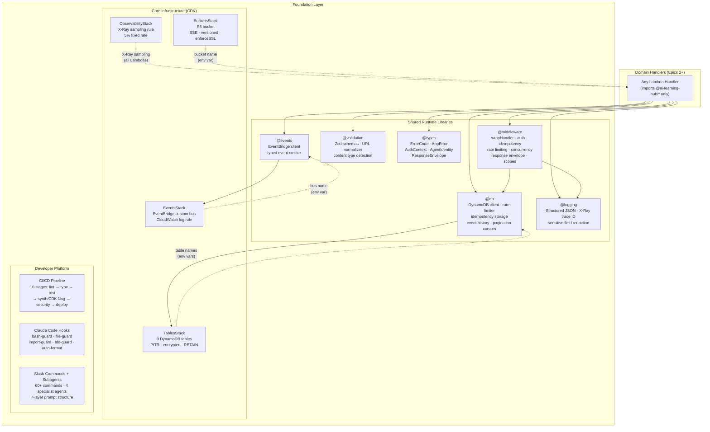
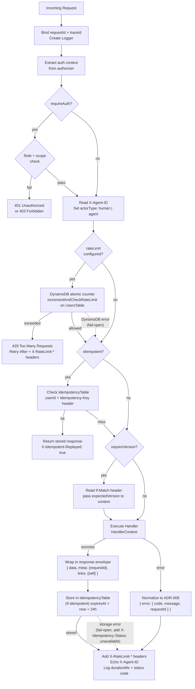

# Foundational Baseline (Epic 1 Intent)

> **Source of truth:** CDK source code under `infra/lib/stacks/` and shared libraries under `backend/shared/`.
> Resource names follow the pattern `{env}-ai-learning-hub-{suffix}` where `{env}` is the `environmentPrefix` CDK context variable.
> **Last validated:** commit `3ac9232` (Story 3.5.2 merged, all quality gates passing).

---

## 1. Purpose of the Foundation Layer

The foundation layer is the set of platform capabilities that every handler, route, and business domain in this system depends on. It provides no user-facing API behavior of its own. Its job is to make the platform safe, observable, consistent, and developer-productive before any domain work begins.

The foundation layer answers the question: _"What can every handler assume exists and rely on?"_

The answer is: durable, encrypted storage; a structured logging and tracing runtime; a shared middleware chain that enforces auth, rate limits, idempotency, and versioning; a CI/CD pipeline that enforces quality; and a developer tooling layer that keeps agents and humans on the same rails.

---

## 2. Foundation Layer Boundaries

### Belongs to the foundation layer

| Category                               | Examples                                                                        |
| -------------------------------------- | ------------------------------------------------------------------------------- |
| Core infrastructure stacks             | `TablesStack`, `BucketsStack`, `ObservabilityStack`, `EventsStack`              |
| Shared runtime libraries               | `@ai-learning-hub/logging`, `middleware`, `db`, `validation`, `types`, `events` |
| CI/CD pipeline and quality gates       | `.github/workflows/ci.yml`, coverage thresholds, CDK Nag                        |
| Developer tooling and repo conventions | `.claude/`, `CLAUDE.md`, `.cursor/rules/`, `.github/ISSUE_TEMPLATE/`            |
| Security and operational guardrails    | Encryption at rest, TLS enforcement, secrets management, import enforcement     |

### Does not belong to the foundation layer

- API route stacks (`AuthRoutesStack`, `SavesRoutesStack`, etc.)
- Route stacks and per-endpoint configuration
- Lambda handlers and domain business logic
- Endpoint behavior, request/response contracts
- Features specific to any single domain (auth, saves, projects, etc.)

### Classification rule

A capability belongs to the foundation layer if and only if it meets **all five** criteria below. This rule is used to audit this document and decide what to include.

| #   | Criterion                                  | Test                                                                                                                                                                                                                                 |
| --- | ------------------------------------------ | ------------------------------------------------------------------------------------------------------------------------------------------------------------------------------------------------------------------------------------ |
| 1   | **Cross-cutting dependency**               | At least one of: (a) used by two or more route stacks, (b) is a platform stack output consumed by a shared library, or (c) is an enforced repo-wide policy (CI pipeline, hooks, lint rules). "Expected to be used" does not qualify. |
| 2   | **Zero domain semantics**                  | Does not encode business rules for "auth", "saves", "projects", etc. It is a generic platform primitive (idempotency, rate limiting, event history, logging).                                                                        |
| 3   | **Handler-agnostic contract**              | Exposed as a shared library primitive (`@ai-learning-hub/*`) or a core stack output; consumable uniformly from any handler.                                                                                                          |
| 4   | **Operational baseline**                   | Without it, the platform's safety, consistency, or observability posture is materially worse — not just less convenient.                                                                                                             |
| 5   | **Enforceable or explicitly accepted gap** | There is either (a) automated enforcement (tests, synth assertions, lint), or (b) an explicit "Manual review" or "No automated enforcement" label in this document.                                                                  |

**Corollary:** If a capability fails any criterion above, it belongs to Epics 2+ (domain layer), even if it is implemented in a shared folder (e.g., `@ai-learning-hub/db` contains domain-specific helpers alongside platform primitives).

**Allowed exceptions:** A domain-owned resource may be documented here only to the extent it demonstrates a platform-standard template or a platform-enforced property. The resource is labeled "domain-owned" and its schema or business logic is not documented; only the platform property applied to it is documented.

---

## Platform Architecture Overview

The diagram below shows the three layers of the foundation and how domain handlers consume them. Arrows indicate a dependency or data flow relationship.



---

## 3. Core Infrastructure Primitives

### 3.1 DynamoDB Tables

Defined in `infra/lib/stacks/core/tables.stack.ts:TablesStack`.

All tables share these platform-wide properties:

| Property               | Value                                                                                      |
| ---------------------- | ------------------------------------------------------------------------------------------ |
| Billing mode           | `PAY_PER_REQUEST`                                                                          |
| Encryption             | `TableEncryption.AWS_MANAGED` (SSE with AWS-managed key)                                   |
| Point-in-time recovery | Enabled on all tables                                                                      |
| Removal policy         | `RETAIN` (stack deletion does not delete table data)                                       |
| Naming convention      | `{env}-ai-learning-hub-{suffix}` where `{env}` is the `environmentPrefix` context variable |

**Platform tables** (pass all five classification criteria — cross-cutting, zero domain semantics, handler-agnostic, operational baseline, enforced):

| Logical ID         | Key schema                                                              | TTL attribute         | Why it is a platform primitive                                                                                                                 |
| ------------------ | ----------------------------------------------------------------------- | --------------------- | ---------------------------------------------------------------------------------------------------------------------------------------------- |
| `IdempotencyTable` | PK: `IDEMP#{userId}#{idempotencyKey}` (no SK)                           | `expiresAt` (24h TTL) | Any handler with `idempotent: true` uses it. No domain semantics; purely a dedup store keyed on user + opaque key.                             |
| `EventsTable`      | PK: `EVENTS#{entityType}#{entityId}`, SK: `EVENT#{timestamp}#{eventId}` | `ttl` (90-day)        | Any handler calling `recordEvent` writes to it. Schema is entity-type-agnostic; domain identity is encoded in the PK, not the table structure. |

**Domain tables managed in this CDK stack** (fail criterion 1 and/or 2 — single domain owner, or encode domain-specific key schema, or both):

These tables are defined in `TablesStack` for CDK lifecycle management (shared PITR, encryption policy, naming convention, and stack output pattern), but they are owned by and documented with their respective domain epics.

| Logical ID         | Domain owner         | Epic   |
| ------------------ | -------------------- | ------ |
| `UsersTable`       | Auth and identity    | Epic 2 |
| `InviteCodesTable` | Invite flow          | Epic 2 |
| `SavesTable`       | Saves CRUD           | Epic 3 |
| `ProjectsTable`    | Projects             | Epic 4 |
| `LinksTable`       | Save-project linking | Epic 5 |
| `SearchIndexTable` | Search               | Epic 7 |
| `ContentTable`     | URL enrichment       | Epic 9 |

Each table's name and ARN are available as CloudFormation stack outputs (see `tables.stack.ts` for export key names). Cross-stack consumers import by output key, never by hardcoded name.

### 3.2 S3 Buckets

Defined in `infra/lib/stacks/core/buckets.stack.ts:BucketsStack`.

`BucketsStack` is a foundation concern in two ways: (1) it establishes the platform-standard bucket configuration (SSE, versioning, enforceSSL, RETAIN, lifecycle policy) that applies to all S3 buckets in the system, and (2) `AccessLogsBucket` is a cross-cutting operational resource. The content bucket defined here is domain-owned.

**Platform bucket** (passes all five criteria):

| Logical ID         | Purpose                                        | Key config                                           |
| ------------------ | ---------------------------------------------- | ---------------------------------------------------- |
| `AccessLogsBucket` | Server access logs for all platform S3 buckets | SSE-S3, `BLOCK_ALL`, `RETAIN`, 90-day object expiry. |

**Domain bucket managed in this CDK stack** (fails criterion 1 — single domain owner; fails criterion 2 — name encodes domain semantics):

| Logical ID           | Domain owner  | Epic   | Platform standards applied                                                                                                                                         |
| -------------------- | ------------- | ------ | ------------------------------------------------------------------------------------------------------------------------------------------------------------------ |
| `ProjectNotesBucket` | Project notes | Epic 6 | SSE-S3, `versioned: true`, `enforceSSL: true`, `BLOCK_ALL`, `RETAIN`. Lifecycle: IA after 30 days, Glacier after 90 days, noncurrent versions expire after 1 year. |

The `ProjectNotesBucket` configuration is documented here because it demonstrates the platform-standard template for any future S3 bucket added to this stack.

Bucket names and ARNs are available as CloudFormation stack outputs (see `buckets.stack.ts` for export key names).

### 3.3 Event Infrastructure

Defined in `infra/lib/stacks/core/events.stack.ts:EventsStack`.

| Resource           | Config                                                                                                                                                            |
| ------------------ | ----------------------------------------------------------------------------------------------------------------------------------------------------------------- |
| `EventBus`         | Custom EventBridge bus. All domain event publishes target this bus via the `EVENT_BUS_NAME` env var.                                                              |
| `EventLogGroup`    | CloudWatch log group for all events on the bus. Retention: 14 days (dev), 90 days (prod).                                                                         |
| `LogAllEventsRule` | EventBridge rule matching all events with a platform source prefix. Routes to `EventLogGroup`. Enables event capture and observability without a consumer Lambda. |

Bus name and ARN are available as CloudFormation stack outputs (see `events.stack.ts` for export key names).

### 3.4 Observability Primitives

Defined in `infra/lib/stacks/observability/observability.stack.ts:ObservabilityStack`.

| Resource             | Config                                                                                                                                                                                                 |
| -------------------- | ------------------------------------------------------------------------------------------------------------------------------------------------------------------------------------------------------ |
| `LambdaSamplingRule` | X-Ray sampling rule scoped to `AWS::Lambda` service type. `fixedRate: 0.05` (5%), `reservoirSize: 1`, `priority: 1000`. All Lambda functions independently enable `Tracing.ACTIVE` in their CDK props. |

**Note:** CloudWatch Dashboards and Alarms are not yet deployed. Only the sampling rule is active.

---

## 4. Shared Runtime Libraries

All libraries live under `backend/shared/` and are published as npm workspace packages under the `@ai-learning-hub/` scope. Every Lambda handler imports exclusively from these packages. Direct imports of `@aws-sdk/*`, `console.*`, or custom validation in handler code are blocked by ESLint and architecture enforcement tests.

### 4.1 `@ai-learning-hub/logging`

**Entry point:** `backend/shared/logging/src/index.ts`

Provides structured JSON logging with X-Ray trace correlation. All log output is JSON to stdout/stderr (CloudWatch-compatible). Sensitive fields are automatically redacted.

| Export                            | Purpose                                                                                                                     |
| --------------------------------- | --------------------------------------------------------------------------------------------------------------------------- |
| `Logger`                          | Class with `info`, `warn`, `error`, `debug`, `timed` methods. Accepts a `LogContext` and propagates it on every log line.   |
| `createLogger(context, minLevel)` | Factory for a new `Logger` instance.                                                                                        |
| `logger`                          | Default singleton logger.                                                                                                   |
| `LogEntry`                        | Shape of every emitted log line: `{ timestamp, level, message, requestId?, traceId?, userId?, durationMs?, error?, data? }` |

Log lines carry:

- `requestId`: from API Gateway request context or a generated UUID
- `traceId`: extracted from `_X_AMZN_TRACE_ID` (X-Ray root segment ID)
- `userId`: set via `logger.setRequestContext({ userId })` after auth

Redacted field names: `password`, `secret`, `token`, `apikey`, `authorization`, `credential`, plus API key patterns and bearer token patterns in values.

### 4.2 `@ai-learning-hub/middleware`

**Entry point:** `backend/shared/middleware/src/index.ts`

The central handler composition layer. Every API Lambda handler is wrapped with `wrapHandler`, which activates a configurable middleware chain before and after handler execution.

#### `wrapHandler(handler, options): APIGatewayProxyHandler`

```typescript
interface WrapperOptions {
  requireAuth?: boolean; // Enforce authenticated caller; reject 401 if absent
  requiredRoles?: string[]; // Enforce role membership (admin, analyst, user)
  requiredScope?: OperationScope; // Enforce API key scope; JWT callers bypass scope checks
  idempotent?: boolean; // Enable DynamoDB-backed idempotency (Idempotency-Key header)
  requireVersion?: boolean; // Enable optimistic concurrency (If-Match header)
  rateLimit?: RateLimitMiddlewareConfig; // Enable per-operation rate limiting (opt-in)
}
```

> **See also:** For the caller-facing contracts of each `WrapperOptions` option see `docs/architecture/api-contract-layer.md`: idempotency (`idempotent`) → Section 5; optimistic concurrency (`requireVersion`) → Section 6; rate limit headers (`rateLimit`) → Section 8. Auth options (`requireAuth`, `requiredRoles`, `requiredScope`) are documented in `docs/architecture/identity-access-layer.md` Section 4.

The flowchart below shows the middleware chain on every invocation. Fail-open paths (dashed) return a degraded-but-successful response rather than a hard failure.



Middleware chain executed by `wrapHandler` on every invocation:

| Stage                  | What it does                                                                                                                                                                                    |
| ---------------------- | ----------------------------------------------------------------------------------------------------------------------------------------------------------------------------------------------- |
| Request ID             | Extracts `x-request-id` header or `requestContext.requestId`; generates UUID if absent.                                                                                                         |
| Trace ID               | Reads `_X_AMZN_TRACE_ID`; extracts the `Root` segment.                                                                                                                                          |
| Structured logger      | Creates a `Logger` bound to `requestId` and `traceId`. Logs request received with method, path, and query param keys (no values).                                                               |
| Auth extraction        | Reads `parsedAuth` from authorizer context (injected by the JWT or API Key authorizer Lambda). Available even without `requireAuth: true`.                                                      |
| Auth enforcement       | When `requireAuth: true`: calls `requireAuth`, `requireRole`, `requireScope`, throwing `AppError` on failure.                                                                                   |
| Agent identity         | Always-on. Reads `X-Agent-ID` header; sets `actorType` (`human` or `agent`).                                                                                                                    |
| Rate limiting          | When `rateLimit` is set: calls `incrementAndCheckRateLimit` on `UsersTable`. Returns 429 with `Retry-After` and `X-RateLimit-*` headers on limit exceeded. Fail-open on DynamoDB error.         |
| Idempotency check      | When `idempotent: true`: reads `Idempotency-Key` header; checks `IdempotencyTable`. Returns cached response with `X-Idempotent-Replayed: true` if key exists. Skips handler execution entirely. |
| Optimistic concurrency | When `requireVersion: true`: reads `If-Match` header; passes `expectedVersion` to handler context.                                                                                              |
| Handler execution      | Calls the wrapped handler with a `HandlerContext` struct.                                                                                                                                       |
| Response normalization | Wraps non-envelope results in `{ data, meta: { requestId }, links: { self } }`. Normalizes any error response to ADR-008 `{ error: { code, message, requestId } }`.                             |
| Idempotency store      | On successful (2xx) response: stores result in `IdempotencyTable` with `expiresAt = now + 24h`. Adds `X-Idempotency-Status: unavailable` if storage fails (fail-open).                          |
| Rate limit headers     | Adds `X-RateLimit-Limit`, `X-RateLimit-Remaining`, `X-RateLimit-Reset` to every response when rate limiting is active.                                                                          |
| Timing log             | Logs request completed with `durationMs` and status code.                                                                                                                                       |

Additional exports from `@ai-learning-hub/middleware`:

| Export                                                                   | Purpose                                                                                                                                                                                                                                                                                   |
| ------------------------------------------------------------------------ | ----------------------------------------------------------------------------------------------------------------------------------------------------------------------------------------------------------------------------------------------------------------------------------------- |
| `extractAuthContext`                                                     | Reads `parsedAuth` from API Gateway authorizer context.                                                                                                                                                                                                                                   |
| `requireAuth`, `requireRole`, `requireScope`                             | Throw `AppError` if auth/role/scope requirements are unmet.                                                                                                                                                                                                                               |
| `generatePolicy`, `deny`                                                 | IAM policy document builders for authorizer Lambda responses.                                                                                                                                                                                                                             |
| `handleError`, `createSuccessResponse`, `createNoContentResponse`        | ADR-008 response builders.                                                                                                                                                                                                                                                                |
| `extractIdempotencyKey`, `checkIdempotency`, `storeIdempotencyResult`    | Idempotency middleware primitives (used internally by `wrapHandler`).                                                                                                                                                                                                                     |
| `extractIfMatch`                                                         | Reads `If-Match` header and parses version number.                                                                                                                                                                                                                                        |
| `extractAgentIdentity`                                                   | Reads `X-Agent-ID` header; determines `actorType`.                                                                                                                                                                                                                                        |
| `addRateLimitHeaders`, `buildRateLimitMeta`                              | Rate limit header helpers.                                                                                                                                                                                                                                                                |
| `SCOPE_GRANTS`, `VALID_SCOPES`, `resolveScopeGrants`, `checkScopeAccess` | API key scope enforcement primitives.                                                                                                                                                                                                                                                     |
| `ActionRegistry`, `getActionRegistry`, `buildResourceActions`            | Action discoverability registry. `ActionRegistry` is a platform primitive because it provides a generic action catalog mechanism without encoding any domain-specific actions — domain action definitions live in their respective epics and are registered into the registry at startup. |
| `buildPaginationLinks`                                                   | Constructs `links.self` / `links.next` from cursor and path.                                                                                                                                                                                                                              |
| `getClerkSecretKey`                                                      | SSM-backed Clerk secret with in-memory cache. Secret key path defined in `backend/shared/middleware/src/ssm.ts`.                                                                                                                                                                          |
| `AUTHORIZER_CACHE_TTL`                                                   | Shared constant (300 seconds) for authorizer cache TTL — used in both CDK and runtime.                                                                                                                                                                                                    |

### 4.3 `@ai-learning-hub/db`

**Entry point:** `backend/shared/db/src/index.ts`

DynamoDB client and platform-primitive data-access helpers. Handlers import from this package rather than instantiating the AWS SDK directly. The package also contains domain-specific helpers (Epic 2 and Epic 3) that are co-located for build convenience but are not foundation primitives.

**Platform primitive exports** (pass all five criteria — cross-cutting, zero domain semantics, handler-agnostic):

| Export group               | Key exports                                                                                    | Purpose                                                                                                                          |
| -------------------------- | ---------------------------------------------------------------------------------------------- | -------------------------------------------------------------------------------------------------------------------------------- |
| **Client**                 | `createDynamoDBClient`, `getDefaultClient`                                                     | DynamoDB Document Client factory and shared singleton.                                                                           |
| **Generic helpers**        | `getItem`, `putItem`, `deleteItem`, `queryItems`, `updateItem`, `requireEnv`                   | Thin wrappers over DynamoDB commands with typed params.                                                                          |
| **Rate limiting**          | `incrementAndCheckRateLimit`, `enforceRateLimit`, `RateLimitConfig`, `RateLimitResult`         | Atomic counter-based rate limiting via `UpdateItem` with condition expression. Returns `{ allowed, limit, current, remaining }`. |
| **Idempotency storage**    | `storeIdempotencyRecord`, `getIdempotencyRecord`, `IDEMPOTENCY_TABLE_CONFIG`                   | DynamoDB-backed idempotency record storage (backing `IdempotencyTable`).                                                         |
| **Optimistic concurrency** | `updateItemWithVersion`, `putItemWithVersion`, `VersionConflictError`                          | Versioned writes using condition expressions on a `version` attribute. Throws `VersionConflictError` on mismatch.                |
| **Event history**          | `recordEvent`, `queryEntityEvents`, `EVENTS_TABLE_CONFIG`                                      | Writes and reads event history records against `EventsTable`.                                                                    |
| **Pagination**             | `encodeCursor`, `decodeCursor`, `buildPaginatedResponse`, `DEFAULT_PAGE_SIZE`, `MAX_PAGE_SIZE` | Opaque cursor encoding wrapping DynamoDB `LastEvaluatedKey`. Cursor is base64-encoded JSON.                                      |
| **Transactional writes**   | `transactWriteItems`, `TransactionCancelledError`                                              | Wrapper for `TransactWriteItems` with typed error extraction.                                                                    |

**Domain-specific exports in this package** (fail criterion 2 — encode domain business logic; documented with their owning epic, not here):

| Export group                        | Exports                                                                                                                                                           | Domain owner                                     |
| ----------------------------------- | ----------------------------------------------------------------------------------------------------------------------------------------------------------------- | ------------------------------------------------ |
| User profile and API key operations | `getProfile`, `ensureProfile`, `updateProfile`, `updateProfileWithEvents`, `getApiKeyByHash`, `createApiKey`, `listApiKeys`, `revokeApiKey`, `USERS_TABLE_CONFIG` | Epic 2                                           |
| Per-operation rate limit configs    | `apiKeyCreateRateLimit`, `inviteGenerateRateLimit`, `inviteValidateRateLimit`, `profileUpdateRateLimit`                                                           | Epic 2 (domain thresholds encoded in the config) |
| Invite code operations              | `getInviteCode`, `redeemInviteCode`, `createInviteCode`, `listInviteCodesByUser`, `INVITE_CODES_TABLE_CONFIG`                                                     | Epic 2                                           |
| Saves operations                    | `SAVES_TABLE_CONFIG`, `savesWriteRateLimit`, `SAVES_WRITE_RATE_LIMIT`, `toPublicSave`                                                                             | Epic 3                                           |

### 4.4 `@ai-learning-hub/validation`

**Entry point:** `backend/shared/validation/src/index.ts`

Zod-based validation utilities. The package provides platform-primitive validation infrastructure and domain-specific schemas co-located for build convenience.

**Platform primitive exports** (pass all five criteria — reusable across any domain, zero domain semantics):

| Export group           | Key exports                                                                                                                                                                         |
| ---------------------- | ----------------------------------------------------------------------------------------------------------------------------------------------------------------------------------- |
| Primitive schemas      | `uuidSchema`, `urlSchema`, `emailSchema`, `nonEmptyStringSchema`, `isoDateSchema`, `sortDirectionSchema`, `paginationQuerySchema`                                                   |
| Event context          | `eventContextSchema` — validates `{ trigger, source, confidence, upstream_ref }` (platform agent-context metadata)                                                                  |
| URL normalization      | `normalizeUrl`, `NormalizeError` — normalizes and validates any URL before storage                                                                                                  |
| Content type detection | `detectContentType` — classifies any URL into a content type enum                                                                                                                   |
| Validation utilities   | `validate`, `safeValidate`, `validateJsonBody`, `validateQueryParams`, `validatePathParams`, `formatZodErrors` — parse and format Zod results into ADR-008 field-level error shapes |

**Domain-specific exports in this package** (fail criterion 2 — encode domain request/entity shapes; documented with their owning epic):

| Exports                                                                                                                | Domain owner  |
| ---------------------------------------------------------------------------------------------------------------------- | ------------- |
| `updateProfileBodySchema`, `validateInviteBodySchema`, `apiKeyIdPathSchema`, `apiKeyScopeSchema`, `apiKeyScopesSchema` | Epic 2        |
| `createSaveSchema`, `updateSaveSchema`, `updateMetadataCommandSchema`, `listSavesQuerySchema`, `saveIdPathSchema`      | Epic 3        |
| `projectStatusSchema`, `tagsSchema`                                                                                    | Epic 4        |
| `tutorialStatusSchema`                                                                                                 | Epic 8        |
| `contentTypeSchema`                                                                                                    | Epics 3 and 9 |

### 4.5 `@ai-learning-hub/types`

**Entry point:** `backend/shared/types/src/index.ts`

Shared TypeScript types. Zero runtime logic except `AppError` class and `ErrorCode` enum. The package contains platform-primitive types and domain entity types co-located for build convenience.

**Platform primitive types** (pass all five criteria — used across all handlers, zero domain semantics):

| Export group          | Key types                                                                    |
| --------------------- | ---------------------------------------------------------------------------- |
| **Error contract**    | `ErrorCode`, `AppError`, `ApiErrorBody`, `ApiErrorResponse`                  |
| **Response envelope** | `ResponseEnvelope<T>`, `EnvelopeMeta`, `RateLimitMeta`, `ResponseLinks`      |
| **Auth and identity** | `AuthContext`, `AgentIdentity`, `ActorType`, `ApiKeyScope`, `OperationScope` |
| **Pagination**        | `CursorPayload`, `PaginationOptions`, `PaginatedResponse`                    |
| **Idempotency**       | `IdempotencyRecord`                                                          |
| **Event history**     | `EntityEvent`, `EventEntityType`, `EventContext`, `RecordEventParams`        |
| **Discoverability**   | `ActionDefinition`, `ResourceAction`, `StateGraph`, `StateTransition`        |
| **Versioning**        | `VersionedEntity`, `INITIAL_VERSION`, `nextVersion`, `BaseEntity`            |

**Domain entity types in this package** (fail criterion 2 — encode domain entity shapes; documented with their owning epic):

| Types                                               | Domain owner |
| --------------------------------------------------- | ------------ |
| `User` (full profile shape), `ApiKey`, `InviteCode` | Epic 2       |
| `Save`, `SaveItem`, `PublicSave`                    | Epic 3       |
| `Project`, `Folder`, `ProjectStatus`                | Epic 4       |
| `Link`                                              | Epic 5       |
| `TutorialStatus`                                    | Epic 8       |
| `Content`, `ContentType`, `EnrichmentStatus`        | Epic 9       |

### 4.6 `@ai-learning-hub/events`

**Entry point:** `backend/shared/events/src/index.ts`

EventBridge client and typed event emission. The client and emitter are platform primitives; domain event catalogs are co-located in the package.

**Platform primitive exports** (pass all five criteria):

| Export                                        | Purpose                                                                                                          |
| --------------------------------------------- | ---------------------------------------------------------------------------------------------------------------- |
| `createEventBridgeClient`, `getDefaultClient` | EventBridge client factory and shared singleton.                                                                 |
| `emitEvent(entry, client?)`                   | Publishes a typed `EventEntry` to the platform event bus. Uses `EVENT_BUS_NAME` env var.                         |
| `requireEventBus()`                           | Validates `EVENT_BUS_NAME` is set; returns `{ busName, ebClient }`. Call once at module scope during cold start. |

**Domain-specific exports in this package** (fail criterion 2 — encode domain event semantics; documented with their owning epic):

| Exports                                                                                                                          | Domain owner |
| -------------------------------------------------------------------------------------------------------------------------------- | ------------ |
| `SAVES_EVENT_SOURCE`, `SavesEventDetail`, `SaveCreatedRestoredDetail`, `SaveUpdatedDetail`, `SaveDeletedDetail`, `SavesEventMap` | Epic 3       |

---

## 5. Platform Guardrails

These are capabilities the foundation layer provides to every part of the system. They are not opt-in features of individual handlers; they are properties of the platform itself.

### 5.1 Encryption at rest

All DynamoDB tables use `TableEncryption.AWS_MANAGED`. The `ProjectNotesBucket` uses `BucketEncryption.S3_MANAGED`. Set in CDK; verified by `infra/test/stacks/core/tables.stack.test.ts` and `infra/test/stacks/core/buckets.stack.test.ts`.

### 5.2 TLS in transit

`ProjectNotesBucket` has `enforceSSL: true` (bucket policy denies non-TLS requests). API Gateway enforces HTTPS by default (no plain HTTP endpoint is configured). Verified at synth time via CDK Nag.

### 5.3 Secrets management

No secrets appear in committed code. External secrets are stored in AWS Systems Manager Parameter Store and fetched at Lambda runtime via `getClerkSecretKey()` in `@ai-learning-hub/middleware` (see `backend/shared/middleware/src/ssm.ts` for the parameter path). SSM access is scoped by IAM to the exact parameter ARN. TruffleHog secrets detection runs on every push to a pull request. Enforced by `infra/test/secrets-scan.test.ts` and CI.

### 5.4 Data durability

All DynamoDB tables in `TablesStack` (including both platform and domain tables) have PITR enabled and `removalPolicy: RETAIN`. These are platform-enforced properties of the CDK stack, not domain-specific choices. Platform tables (`IdempotencyTable`, `EventsTable`) and domain tables alike inherit them. `ProjectNotesBucket` has `versioned: true`. Enforced by `infra/test/stacks/core/tables.stack.test.ts`.

### 5.5 Distributed tracing

All Lambda functions set `Tracing.ACTIVE` in their CDK props. The X-Ray sampling rule in `ObservabilityStack` governs sampling across all Lambda functions at 5% fixed rate. `wrapHandler` reads `_X_AMZN_TRACE_ID` and binds the trace ID to the request logger.

### 5.6 Structured logging with redaction

Every Lambda invocation creates a `Logger` bound to `requestId` and `traceId`. All log output is JSON. The logger automatically redacts values matching API key patterns, bearer tokens, and fields named `password`, `secret`, `token`, `apikey`, `authorization`, or `credential`. Enforced by `backend/shared/logging/test/`.

### 5.7 Rate limiting primitive

`@ai-learning-hub/db` exports `incrementAndCheckRateLimit`, which implements atomic per-user, per-operation rate limiting using a DynamoDB counter on `UsersTable`. Uses `UpdateItem` with a condition expression (no read-modify-write race). The result is `{ allowed, limit, current, remaining }`. `wrapHandler` exposes this via `options.rateLimit` and adds `X-RateLimit-*` and `Retry-After` headers automatically. Fail-open on DynamoDB error.

> **See also:** `docs/architecture/api-contract-layer.md` Section 8 for the caller-facing header contract and fail-open semantics. `docs/architecture/identity-access-layer.md` Section 7 for domain-specific rate limit threshold configurations.

### 5.8 Idempotency primitive

`IdempotencyTable` provides DynamoDB-backed idempotency storage with a 24-hour TTL. `wrapHandler` exposes this via `options.idempotent: true`. On cache hit, the handler is not invoked; the stored response is returned with `X-Idempotent-Replayed: true`. On first execution, the response is stored after the handler succeeds. Scoped per `userId` and `Idempotency-Key` header value. Fail-open on storage error.

> **See also:** `docs/architecture/api-contract-layer.md` Section 5 for the full caller-facing idempotency contract: key format requirements, replay headers, oversized response handling, and the fail-open signal.

### 5.9 Optimistic concurrency primitive

`@ai-learning-hub/db` exports `updateItemWithVersion` and `putItemWithVersion`, which add a condition expression on a `version` attribute. On mismatch, `VersionConflictError` is thrown. `wrapHandler` exposes this via `options.requireVersion: true`. Conflict responses include `currentState` and `allowedActions` per the ADR-008 error contract.

> **See also:** `docs/architecture/api-contract-layer.md` Section 6 for the caller-facing `If-Match` header contract, the exact `VERSION_CONFLICT` (409) response shape, and the distinction between what the primitive provides versus what domain handlers add.

### 5.10 Event history primitive

`EventsTable` stores immutable event records for any entity. `@ai-learning-hub/db` exports `recordEvent`, which writes: entity type, entity ID, event type, actor type (`human` | `agent`), actor ID, timestamp, before/after state changes, and optional event context. `@ai-learning-hub/middleware` exports `createEventHistoryHandler` to generate a query handler for `GET /:entity/:id/events`.

> **See also:** `docs/architecture/api-contract-layer.md` Section 9 for how `actorType` is derived from the `X-Agent-ID` request header and flows into `recordEvent` calls in domain handlers.

### 5.11 Shared library import enforcement

All API handler files must import from `@ai-learning-hub/*` exclusively. Enforcement layers:

1. ESLint rule `enforce-shared-imports` (blocks at lint time)
2. `infra/test/import-enforcement.test.ts` scans handler source files at test time

**Current status:** All handlers pass. Story 3.5.2 (`89bfe58`) updated the test handler map to reflect the per-method Lambda split. Enforcement is now comprehensive across all auth and saves handlers.

### 5.12 CDK Nag security gates

`AwsSolutionsChecks` is applied to the CDK app via `Aspects` in `infra/bin/app.ts`. ERROR-level findings block `cdk synth` and therefore block CI. Current state: all findings are resolved or suppressed with documented reasons.

---

## 6. Developer Platform and Tooling

### 6.1 CI/CD Pipeline

Defined in `.github/workflows/ci.yml`. Triggers on all branch pushes and pull requests to `main`.

| Stage | Job                            | Gate behavior                                                                                                                                                                                        |
| ----- | ------------------------------ | ---------------------------------------------------------------------------------------------------------------------------------------------------------------------------------------------------- |
| 1     | Lint and Format                | `npm run format:check && npm run lint`. Blocks stage 2 on failure.                                                                                                                                   |
| 2     | Type Check                     | `npm run type-check`. Blocks stage 3 on failure.                                                                                                                                                     |
| 3     | Unit Tests (80% coverage gate) | `npm test -- --coverage`. 80% threshold enforced per package in `vitest.config.ts`. Blocks stage 4.                                                                                                  |
| 4     | CDK Synth + CDK Nag            | `cdk synth`. CDK Nag ERROR findings fail the stage. Blocks stages 5 and 6.                                                                                                                           |
| 5     | Integration Tests              | Placeholder. Not blocking.                                                                                                                                                                           |
| 6     | Contract Tests                 | Placeholder. Not blocking.                                                                                                                                                                           |
| 7     | Security Scan                  | `npm audit --audit-level=high` (continue-on-error); TruffleHog on pull requests; ESLint SAST.                                                                                                        |
| 7b    | Code Review Gate               | On pull requests for `story-*` branches: checks that a completed code review artifact exists in `_bmad-output/`. Blocks merge if missing. Override via `skip-review-gate` label. Added in `c7cc902`. |
| 8     | Deploy to Dev                  | Runs on push to `main` only. Uses GitHub OIDC. Runs `cdk deploy --all`.                                                                                                                              |
| 9     | E2E Tests                      | Placeholder. 6 persona paths stubbed.                                                                                                                                                                |
| 10    | Deploy to Prod                 | Manual approval via GitHub environment gate.                                                                                                                                                         |

### 6.2 Claude Code Hooks

Defined in `.claude/hooks/` and `.claude/settings.json`. Hooks enforce platform rules at agent invocation time.

| Hook type   | Scripts                                                                    | What they enforce                                                                                                                   |
| ----------- | -------------------------------------------------------------------------- | ----------------------------------------------------------------------------------------------------------------------------------- |
| PreToolUse  | `bash-guard.cjs`                                                           | Blocks destructive shell commands (recursive deletes, force pushes to main, disk writes, credential exposure)                       |
| PreToolUse  | `file-guard.js`                                                            | Blocks auto-modification of protected files (`.env`, `package-lock.json`, `.git/`, planning artifacts, CDK stacks without approval) |
| PreToolUse  | `architecture-guard.sh`                                                    | Blocks Lambda-to-Lambda calls, non-standard key patterns, direct DynamoDB imports in handlers                                       |
| PreToolUse  | `import-guard.sh`                                                          | Blocks `console.*`, AWS SDK, or custom logger creation in handler code                                                              |
| PreToolUse  | `tdd-guard.js`                                                             | Reminds to write failing tests before implementation                                                                                |
| PostToolUse | `auto-format.sh`                                                           | Runs Prettier on edited files                                                                                                       |
| PostToolUse | `type-check.sh`                                                            | Runs TypeScript compiler after edits                                                                                                |
| Stop        | `pipeline-guard.cjs`, `commit-gate.cjs`, `dev-story-validator.cjs`, others | Enforce story completion criteria and quality gates before session end                                                              |

### 6.3 Slash Commands

Defined in `.claude/commands/` (60+ files):

| Category        | Pattern         | Purpose                                                                                                               |
| --------------- | --------------- | --------------------------------------------------------------------------------------------------------------------- |
| BMAD workflow   | `bmad-bmm-*.md` | Full BMAD lifecycle: story creation, implementation, code review, epic orchestration, sprint planning, retrospectives |
| Project utility | `project-*.md`  | Project helpers: start-story (branch + issue), fix-github-issue, create-lambda, create-component, run-tests, deploy   |

All commands follow the 7-layer prompt structure (role, context, goal, constraints, instructions, examples, output format) and include model selection guidance.

### 6.4 Subagent Library

Defined in `.claude/agents/`:

| Agent                   | Role                                                                                                                 |
| ----------------------- | -------------------------------------------------------------------------------------------------------------------- |
| `epic-reviewer.md`      | Adversarial code reviewer. Fresh context, read-only. Produces findings with Critical/Important/Minor classification. |
| `epic-fixer.md`         | Implements fixes from reviewer findings. Full edit access, guided by findings document.                              |
| `epic-dedup-scanner.md` | Scans handler files for cross-handler code duplication.                                                              |
| `epic-dedup-fixer.md`   | Extracts duplicated code to shared packages based on dedup findings.                                                 |

### 6.5 Progressive Disclosure Documentation

Defined in `.claude/docs/` (15 files). Loaded on demand, not at session start.

| Doc                            | Load when                                              |
| ------------------------------ | ------------------------------------------------------ |
| `architecture.md`              | Designing systems, adding stacks, understanding ADRs   |
| `database-schema.md`           | Writing DynamoDB access, adding GSIs                   |
| `api-patterns.md`              | Implementing handlers, error responses, middleware     |
| `testing-guide.md`             | Adding tests, checking coverage                        |
| `tool-risk.md`                 | Understanding operation risk levels and approval gates |
| `agent-system.md`              | Choosing between subagents and commands                |
| `branch-commit-conventions.md` | Branch naming, commit messages, issue references       |
| `secrets-and-config.md`        | Keeping secrets out of code; parameter store usage     |

### 6.6 GitHub Workflow Templates

- **Issue templates:** `.github/ISSUE_TEMPLATE/` — structured for agent consumption with scope, acceptance criteria, related files, and testing requirements.
- **PR template:** `.github/PULL_REQUEST_TEMPLATE.md` — checklist for agent-generated code review (security scan, test coverage, shared library usage, pattern compliance).

### 6.7 Repo Conventions

- **`CLAUDE.md`** — project manifest at repo root. Quick start commands, project structure, key patterns, NEVER/ALWAYS rules.
- **`.cursor/rules/`** — Cursor IDE rules mirroring Claude hooks (bash-guard, file-guard, quality-gates).
- **`backend/test-utils/`** — shared test scaffolding (`save-factories`, `mock-db`, `mock-events`, `mock-wrapper`, `assertADR008`).
- **`backend/functions/_template/`** — Lambda handler template used by `/project-create-lambda`.

---

## 7. Platform Invariants

The following statements must remain true for the foundation layer to function correctly.

| #    | Invariant                                                                                                                                     | Enforcement                                                                                                                                                                                                                                                                                                                                                                   |
| ---- | --------------------------------------------------------------------------------------------------------------------------------------------- | ----------------------------------------------------------------------------------------------------------------------------------------------------------------------------------------------------------------------------------------------------------------------------------------------------------------------------------------------------------------------------- |
| I-1  | All DynamoDB tables in `TablesStack` have `TableEncryption.AWS_MANAGED` and PITR enabled                                                      | Test: `infra/test/stacks/core/tables.stack.test.ts`                                                                                                                                                                                                                                                                                                                           |
| I-2  | All DynamoDB tables in `TablesStack` have `removalPolicy: RETAIN` and `PAY_PER_REQUEST` billing                                               | Test: `infra/test/stacks/core/tables.stack.test.ts`                                                                                                                                                                                                                                                                                                                           |
| I-3  | `IdempotencyTable` has TTL attribute `expiresAt` configured                                                                                   | Test: `infra/test/stacks/core/tables.stack.test.ts`                                                                                                                                                                                                                                                                                                                           |
| I-4  | `ProjectNotesBucket` has `versioned: true`, `enforceSSL: true`, and `BLOCK_ALL` public access                                                 | Test: `infra/test/stacks/core/buckets.stack.test.ts`                                                                                                                                                                                                                                                                                                                          |
| I-5  | `ObservabilityStack` deploys the X-Ray sampling rule with `fixedRate: 0.05` scoped to `AWS::Lambda`                                           | Test: `infra/test/stacks/observability/observability.stack.test.ts`                                                                                                                                                                                                                                                                                                           |
| I-6  | `EventsStack` deploys an EventBridge bus and a CloudWatch log rule covering all platform-source events                                        | Test: `infra/test/stacks/core/events.stack.test.ts`                                                                                                                                                                                                                                                                                                                           |
| I-7  | All Lambda functions set `Tracing.ACTIVE`                                                                                                     | Test (partial): auth stack Lambdas verified by `infra/test/stacks/auth/auth.stack.test.ts`; saves and ops route stacks not yet asserted. Gap remains for non-auth stacks.                                                                                                                                                                                                     |
| I-8  | Every Lambda using `idempotent: true` in `wrapHandler` has `IDEMPOTENCY_TABLE_NAME` env var and `GetItem`/`PutItem` IAM on `IdempotencyTable` | CDK test: `infra/test/stacks/auth/auth.stack.test.ts` asserts per-function idempotency IAM for 5 auth mutation functions (Story 3.5.2). Smoke test: `scripts/smoke-test/scenarios/saves-crud.ts` exercises idempotency end-to-end on saves mutations — missing IAM would surface as `AccessDeniedException`. CDK synth-time assertion gap: saves/ops stacks not yet covered.  |
| I-9  | Every Lambda calling `recordEvent` has `EVENTS_TABLE_NAME` env var and `PutItem` IAM on `EventsTable`                                         | CDK test: `infra/test/stacks/auth/auth.stack.test.ts` asserts per-function events table IAM for 5 auth mutation functions (Story 3.5.2). Smoke test: `scripts/smoke-test/scenarios/command-endpoints.ts` calls `GET /saves/:saveId/events` end-to-end — missing IAM would surface as `AccessDeniedException`. CDK synth-time assertion gap: saves/ops stacks not yet covered. |
| I-10 | No API handler imports `@aws-sdk/*` directly                                                                                                  | Test: `infra/test/import-enforcement.test.ts`. Fully passing as of Story 3.5.2 (`89bfe58`).                                                                                                                                                                                                                                                                                   |
| I-11 | All API handlers use `wrapHandler`                                                                                                            | Test: `infra/test/import-enforcement.test.ts`. Fully passing as of Story 3.5.2 (`89bfe58`).                                                                                                                                                                                                                                                                                   |
| I-12 | All non-public routes have `requireAuth: true`                                                                                                | Test: `backend/test/auth-consistency.test.ts`. Fully passing as of Story 3.5.2 (`89bfe58`).                                                                                                                                                                                                                                                                                   |
| I-13 | No hardcoded secrets or external resource identifiers in committed code                                                                       | Test: `infra/test/secrets-scan.test.ts`; CI: TruffleHog on every pull request                                                                                                                                                                                                                                                                                                 |
| I-14 | Rate limit counters use atomic `UpdateItem` with condition expression (no race condition)                                                     | Test: `backend/shared/db/test/rate-limiter.test.ts`                                                                                                                                                                                                                                                                                                                           |
| I-15 | `Logger` output is JSON with `requestId` and `traceId` fields on every line                                                                   | Test: `backend/shared/logging/test/`                                                                                                                                                                                                                                                                                                                                          |
| I-16 | Sensitive field values are replaced with `[REDACTED]` in log output                                                                           | Test: `backend/shared/logging/test/`                                                                                                                                                                                                                                                                                                                                          |
| I-17 | CDK Nag `AwsSolutionsChecks` runs at `cdk synth` time; ERROR-level findings block the build                                                   | Enforced: `infra/bin/app.ts:Aspects.of(app).add(new AwsSolutionsChecks(...))`                                                                                                                                                                                                                                                                                                 |
| I-18 | Each `@ai-learning-hub/*` package enforces 80% test coverage (statements, branches, functions, lines)                                         | Enforced: `thresholds` in each `vitest.config.ts`; CI stage 3 fails if missed                                                                                                                                                                                                                                                                                                 |

### Current quality gate status

Validated at commit `3ac9232` (Story 3.5.2 merged).

| Gate                 | Result | Notes                                                                                                                        |
| -------------------- | ------ | ---------------------------------------------------------------------------------------------------------------------------- |
| `npm run type-check` | PASS   | 0 errors                                                                                                                     |
| `npm run lint`       | PASS   | 0 errors                                                                                                                     |
| `npm test`           | PASS   | All tests passing. Previous 3 failures (I-10, I-11, I-12) resolved by Story 3.5.2 (`89bfe58`).                               |
| `cdk synth`          | PASS   | All stacks synthesize; no CDK Nag ERROR-level findings. IAM5 suppressions hardened with `appliesTo` constraints (`e544b9d`). |

---

## Appendix: FR and NFR Coverage

Epic 1 covers FR70-FR91 (developer/agentic platform) and a subset of infrastructure-level NFRs. The tables below show current implementation status against each requirement.

### 7.1 Functional Requirements (FR70-FR91)

| FR   | Statement                                                                          | Implementation                                                                                                             | Status                    |
| ---- | ---------------------------------------------------------------------------------- | -------------------------------------------------------------------------------------------------------------------------- | ------------------------- |
| FR70 | CLAUDE.md (<200 lines) with commands, structure, conventions, NEVER/ALWAYS rules   | `CLAUDE.md:` root file, ~180 lines                                                                                         | **Implemented**           |
| FR71 | `.claude/` directory with progressive disclosure docs by topic                     | `.claude/docs/` (15 files), `.claude/commands/` (60+ files)                                                                | **Implemented**           |
| FR72 | Custom slash commands for common workflows                                         | `.claude/commands/project-*.md`, `bmad-*.md`                                                                               | **Implemented**           |
| FR73 | Claude Code hooks: auto-format after edits, block dangerous commands               | `.claude/hooks/auto-format.sh`, `bash-guard.cjs`, `file-guard.js`, `import-guard.sh`, `tdd-guard.js`                       | **Implemented**           |
| FR74 | `progress.md` template per story; epic summary progress file                       | `docs/progress/epic-N.md`, `docs/stories/N.M/progress.md` pattern documented in `CLAUDE.md`                                | **Implemented**           |
| FR75 | `plan.md` files as technical specs persisting across sessions                      | Convention documented; plan.md files used in some stories but not universally enforced                                     | **Partially Implemented** |
| FR76 | GitHub issue templates structured for agent consumption                            | `.github/ISSUE_TEMPLATE/`                                                                                                  | **Implemented**           |
| FR77 | PR template with agent code review checklist                                       | `.github/PULL_REQUEST_TEMPLATE.md`                                                                                         | **Implemented**           |
| FR78 | Branch naming and commit conventions documented and enforced                       | `CLAUDE.md` documents conventions; `.claude/hooks/commit-gate.cjs` enforces at stop                                        | **Implemented**           |
| FR79 | CI pipeline with agent-specific security scanning (OWASP, secrets detection, SAST) | `.github/workflows/ci.yml` stages 7 (npm audit, TruffleHog, ESLint SAST)                                                   | **Implemented**           |
| FR80 | Shared library imports enforced via ESLint (`@ai-learning-hub/*` only)             | `.eslintrc.js` rule `enforce-shared-imports`; `infra/test/import-enforcement.test.ts`                                      | **Implemented**           |
| FR81 | Test requirements specified per story; minimum 80% coverage thresholds             | `vitest.config.ts` `thresholds` per package; CI stage 3                                                                    | **Implemented**           |
| FR82 | Operations classified by risk level (low/medium/high) based on reversibility       | `.claude/docs/tool-risk.md`; risk levels documented in hooks                                                               | **Implemented**           |
| FR83 | High-risk operations require explicit human approval before execution              | `bash-guard.cjs` (PreToolUse), `file-guard.js` (PreToolUse)                                                                | **Implemented**           |
| FR84 | Failure thresholds defined for automatic human escalation                          | `pipeline-guard.cjs` (Stop hook); per-hook blocking behavior. Systematic per-tool numeric thresholds are not defined.      | **Partially Implemented** |
| FR85 | Guardrails include relevance and safety classifiers in command prompts             | Hooks provide behavioral guardrails; formal ML-based classifiers are not implemented                                       | **Partially Implemented** |
| FR86 | Custom commands follow 7-layer prompt structure                                    | Verified in multiple commands under `.claude/commands/`                                                                    | **Implemented**           |
| FR87 | Complex commands include Chain of Thought (scratchpad) sections                    | `bmad-bmm-dev-story.md`, `bmad-bmm-auto-epic.md`, and other multi-step commands include `<thinking>` / scratchpad guidance | **Implemented**           |
| FR88 | Prompt evaluation tests defined per custom command with version changelog          | No automated prompt evaluation test suite exists                                                                           | **Not Implemented**       |
| FR89 | Model selection guidance per command (optimization for cost/quality tradeoff)      | `.claude/docs/agent-system.md` documents model selection guidance; not programmatically enforced per invocation            | **Partially Implemented** |
| FR90 | Specialist subagent library                                                        | `.claude/agents/` (reviewer, fixer, dedup-scanner, dedup-fixer)                                                            | **Implemented**           |
| FR91 | Architecture docs covering CDK patterns and context management                     | `.claude/docs/architecture.md`, `api-patterns.md`, `database-schema.md`; formal context budget management not implemented  | **Partially Implemented** |

### 7.2 Non-Functional Requirements

The foundation layer directly provides or enforces the following NFRs.

| NFR    | Statement                                                                                 | Implementation                                                                                                | Verification                                                                                                 | Status                    |
| ------ | ----------------------------------------------------------------------------------------- | ------------------------------------------------------------------------------------------------------------- | ------------------------------------------------------------------------------------------------------------ | ------------------------- |
| NFR-S1 | Data encryption at rest — all user data encrypted                                         | `TablesStack:TableEncryption.AWS_MANAGED`; `BucketsStack:BucketEncryption.S3_MANAGED`                         | Test: `infra/test/stacks/core/tables.stack.test.ts`, `buckets.stack.test.ts`                                 | **Implemented**           |
| NFR-S2 | Data encryption in transit — TLS 1.2+ everywhere                                          | `BucketsStack:enforceSSL: true`; API Gateway HTTPS default                                                    | Test: `buckets.stack.test.ts` asserts SSL policy; API Gateway TLS version: Manual review                     | **Partially Implemented** |
| NFR-S7 | Secrets management — all secrets in Parameter Store / Secrets Manager                     | `backend/shared/middleware/src/ssm.ts:getClerkSecretKey`; CDK Nag enforces no hardcoded creds                 | CDK Nag at synth; `infra/test/secrets-scan.test.ts`                                                          | **Implemented**           |
| NFR-S8 | API key redaction — keys never in logs                                                    | `backend/shared/logging/src/logger.ts:Logger` auto-redacts sensitive field names and patterns                 | Test: `backend/shared/logging/test/`                                                                         | **Implemented**           |
| NFR-R3 | Data durability — no data loss (DynamoDB PITR enabled)                                    | `TablesStack:pointInTimeRecoveryEnabled: true` on all 9 tables; `BucketsStack:versioned: true`                | Test: `infra/test/stacks/core/tables.stack.test.ts`                                                          | **Implemented**           |
| NFR-O1 | Request tracing — correlation IDs via X-Ray                                               | `ObservabilityStack:LambdaSamplingRule`; all Lambdas `Tracing.ACTIVE`; `wrapHandler` binds trace ID to logger | Test: `infra/test/stacks/observability/observability.stack.test.ts`; Manual review for Lambda props coverage | **Implemented**           |
| NFR-O2 | Structured logging — JSON logs with correlation IDs (CloudWatch Logs Insights compatible) | `backend/shared/logging/src/logger.ts:Logger` outputs JSON with `requestId`, `traceId`                        | Test: `backend/shared/logging/test/`                                                                         | **Implemented**           |
| NFR-C1 | Monthly infrastructure cost < $50 at boutique scale                                       | Architecture uses PAY_PER_REQUEST and serverless-first to minimize idle cost                                  | No automated cost gate. Manual review via AWS Cost Explorer.                                                 | **Unverified**            |
| NFR-C3 | Billing alerts at $30, $40, $50 (AWS Budgets)                                             | No AWS Budgets stack exists                                                                                   | No automated enforcement                                                                                     | **Not Implemented**       |
