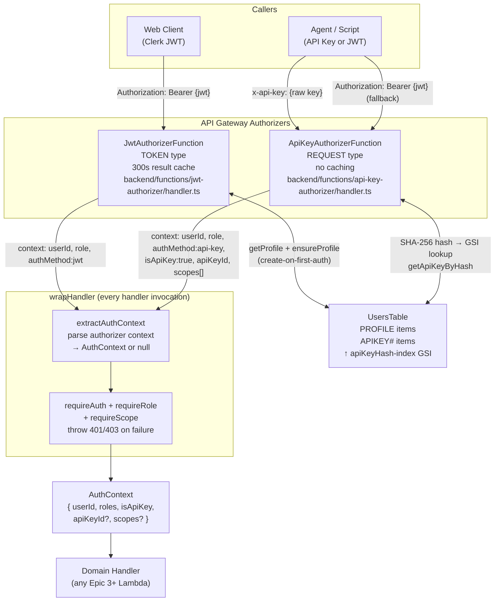

# Identity and Access Layer (Epic 2 Intent)

> **Source of truth:** CDK source in `infra/lib/stacks/auth/auth.stack.ts` and `infra/lib/stacks/api/api-gateway.stack.ts`; handler source in `backend/functions/jwt-authorizer/` and `backend/functions/api-key-authorizer/`; shared libraries `@ai-learning-hub/middleware` and `@ai-learning-hub/db`.

> **Verification commands run:** `npm test` (all tests pass), `npm run type-check` (0 errors), source inspection of auth stack, authorizer handlers, middleware, and DB helpers.
>
> **Smoke test:** A live E2E smoke suite at `scripts/smoke-test/` validates identity layer behavior against a deployed environment. Relevant scenarios: AC1 (valid JWT → 200), AC2 (malformed JWT → 401), AC3 (no auth → 401), AC4 (expired JWT → 401, conditional on `SMOKE_TEST_EXPIRED_JWT`), AC5 (valid API key → 200), AC6 (scope-insufficient key → 403 + error details), AC7 (revoked key → 401), AC8 (invalid key → 401), AC13 (full API key lifecycle). The invariants table below cites both unit tests and smoke scenarios where applicable.

---

## 1. Purpose of the Identity Layer

The identity layer is the set of platform capabilities that establishes WHO the caller is and WHETHER they are permitted to reach any handler before any domain logic runs. It builds on top of the foundational baseline (`docs/architecture/foundational-baseline.md`), which provides the DynamoDB storage substrate, structured logging, rate-limiting primitive, and the `wrapHandler` middleware chain. The identity layer populates `AuthContext` from two authentication paths (JWT and API key), enforces role and scope gates in `wrapHandler`, maintains the per-user data isolation contract, and stores the identity primitives (`UsersTable`, `InviteCodesTable`) that every downstream handler trusts without re-implementing.

---

## 2. Identity Layer Boundaries

### Belongs to the identity layer

| Category                                | Examples                                                                                            |
| --------------------------------------- | --------------------------------------------------------------------------------------------------- |
| Authorizer Lambdas                      | `JwtAuthorizerFunction`, `ApiKeyAuthorizerFunction`                                                 |
| Auth context extraction and enforcement | `extractAuthContext`, `requireAuth`, `requireRole`, `requireScope` in `@ai-learning-hub/middleware` |
| Trust model primitives                  | `AuthContext` type, `ApiKeyScope` and `OperationScope` enums, `SCOPE_GRANTS` mapping                |
| Identity storage tables                 | `UsersTable` (profiles + API key records), `InviteCodesTable` (invite gate)                         |
| API key lifecycle as identity primitive | Key creation (SHA-256 hash, never raw), GSI lookup, revocation, scope assignment                    |
| Invite gate                             | `redeemInviteCode` precondition on account creation; `inviteValidated` claim in JWT                 |
| Per-user data isolation contract        | `PK = USER#{userId}` key schema enforced on every user-scoped query                                 |
| Authorizer cache configuration          | TTL constants and CDK wiring in `ApiGatewayStack`                                                   |

### Does not belong to the identity layer

- HTTP endpoint behavior for `GET /users/me`, `PATCH /users/me`, `POST /users/api-keys`, `DELETE /users/api-keys/{id}`, `POST /users/invite-codes`, `GET /users/invite-codes` (these are domain route features)
- User profile business logic (what fields a profile exposes, validation rules for `displayName`)
- Invite code campaign logic, expiry UX, or issuance policies
- Domain permissions (what a `saves:write`-scoped key can do in the saves domain belongs to Epic 3)
- Rate limit thresholds for domain operations (those are domain-configured, see `@ai-learning-hub/db` per-operation configs)

### Classification rule

A capability belongs to the identity layer if and only if it meets **all five** criteria below.

| #   | Criterion                                    | Test                                                                                                                                                                                                                                                                                                                                                |
| --- | -------------------------------------------- | --------------------------------------------------------------------------------------------------------------------------------------------------------------------------------------------------------------------------------------------------------------------------------------------------------------------------------------------------- |
| 1   | **Pre-handler enforcement**                  | It runs before or as part of handler invocation, in an authorizer Lambda or `wrapHandler`, not inside business logic. Handlers receive its output as context; they do not compute it themselves.                                                                                                                                                    |
| 2   | **Caller-structural, not domain-structural** | It defines the identity and permission mechanism (roles, API key scope tiers, scope resolution). The meaning of a specific scope in a specific domain remains the responsibility of that domain. Scope names like `saves:write` appear here only as opaque permission tier identifiers; what they permit within the saves domain belongs to Epic 3. |
| 3   | **Domain-agnostic**                          | It works identically regardless of which domain endpoint is being called. Auth enforcement for `POST /saves` and `DELETE /projects/:id` behaves the same way.                                                                                                                                                                                       |
| 4   | **Access baseline**                          | Without it, the system cannot determine whether a caller has the right to perform any operation. The trust model collapses entirely, not just degrades.                                                                                                                                                                                             |
| 5   | **Enforced or explicitly labeled gap**       | There is either (a) automated enforcement (CDK synth assertion, unit test, lint rule) that fails if the requirement breaks, or (b) an explicit "Manual review" or "No automated enforcement" label in this document.                                                                                                                                |

**Corollary:** If a capability encodes what a specific identity is allowed to do in a specific domain (e.g., "a user with `saves:write` scope can create saves"), that is a domain permission rule belonging to that epic. The identity layer defines the trust model and enforces access gates. Domains define what passing those gates grants.

**Allowed exceptions:** A domain-owned resource may be documented here only to the extent it demonstrates an identity-layer-enforced property. `UsersTable` is documented here because Epic 2 owns it and it is the identity store. Its encryption and PITR properties are already covered by the foundational baseline (`docs/architecture/foundational-baseline.md` Section 3.1) and are not repeated.

---

## Identity Layer Architecture Overview



---

## 3. Trust Model

### 3.1 JWT Path

**Authorizer:** `JwtAuthorizerFunction` (`backend/functions/jwt-authorizer/handler.ts`), wired as a `TokenAuthorizer` (TOKEN type) in `ApiGatewayStack`. Reads the `Authorization` header.

**CDK wiring:** `resultsCacheTtl: Duration.seconds(300)` (5-minute result cache). Verified: `infra/test/stacks/api/api-gateway.stack.test.ts`.

**Validation steps:**

1. Strips `Bearer ` prefix from the `Authorization` header value.
2. Calls `verifyToken(token, { secretKey })` from `@clerk/backend` using the SSM-backed Clerk secret key.
3. Checks `publicMetadata.inviteValidated === true`. Returns `deny(clerkId, "INVITE_REQUIRED")` if absent.
4. Calls `getProfile(client, clerkId)`. If null, calls `ensureProfile(client, clerkId, publicMetadata)` then re-reads.
5. Checks `profile.suspendedAt`. Returns `deny(clerkId, "SUSPENDED_ACCOUNT")` if set.
6. Returns `Allow` with context `{ userId: clerkId, role, authMethod: "jwt" }`.

**Identity claims extracted:**

| Field in authorizer context | Source                                                     | Notes                                                        |
| --------------------------- | ---------------------------------------------------------- | ------------------------------------------------------------ |
| `userId`                    | `verified.sub` (Clerk `sub` claim)                         | Matches `PK = USER#{userId}` in DynamoDB                     |
| `role`                      | `profile.role` or `publicMetadata.role`, fallback `"user"` | String; `extractAuthContext` normalizes to `roles: string[]` |
| `authMethod`                | Hardcoded `"jwt"`                                          | Not exposed in `AuthContext`; informational only             |

**Scope behavior:** JWT context sets no `scopes` and does not set `isApiKey`. `requireScope` in `wrapHandler` short-circuits for JWT callers (see Section 4).

**Trust boundary:** The 5-minute cache means a revoked JWT (e.g., after `profile.suspendedAt` is set) can continue to pass the authorizer for up to 5 minutes. No mechanism exists to invalidate cached authorizer results mid-TTL.

**Smoke coverage:** AC1 (valid JWT → 200 + profile shape), AC2 (malformed JWT → 401 `UNAUTHORIZED`), AC3 (no `Authorization` header → 401 `UNAUTHORIZED` via Gateway Response), AC4 (expired JWT → 401 `EXPIRED_TOKEN` — conditional on `SMOKE_TEST_EXPIRED_JWT`).

Verification: `backend/functions/jwt-authorizer/handler.test.ts` (18 tests).

---

### 3.2 API Key Path

**Authorizer:** `ApiKeyAuthorizerFunction` (`backend/functions/api-key-authorizer/handler.ts`), wired as a `RequestAuthorizer` (REQUEST type) in `ApiGatewayStack`. Reads all request headers.

**CDK wiring:** `resultsCacheTtl: Duration.seconds(0)` (caching disabled). The REQUEST authorizer handles both `x-api-key` and `Authorization: Bearer` headers; caching is disabled because a single cache entry per identity source is insufficient for this dual-path logic. Verified: `infra/test/stacks/api/api-gateway.stack.test.ts`.

**Validation steps (API key present):**

1. Finds the `x-api-key` header (case-insensitive scan over all headers).
2. Hashes the raw key with `SHA-256` via `crypto.createHash("sha256").update(apiKey).digest("hex")`.
3. Queries the `apiKeyHash-index` GSI via `getApiKeyByHash`. Returns `Unauthorized` if not found.
4. Checks `apiKeyItem.revokedAt`. Returns `Unauthorized` if set.
5. Calls `getProfile(client, apiKeyItem.userId)`. Returns `Unauthorized` if not found.
6. Checks `profile.suspendedAt`. Returns `deny(userId, "SUSPENDED_ACCOUNT")` if set.
7. Fire-and-forget: `updateApiKeyLastUsed(client, userId, keyId)`. Non-blocking; dropped on cold-start context freeze.
8. Returns `Allow` with context `{ userId, role, authMethod: "api-key", isApiKey: "true", apiKeyId: keyId, scopes: JSON.stringify(apiKeyItem.scopes) }`.

**JWT fallback (no x-api-key header):** If no `x-api-key` header is found, the API Key authorizer falls back to JWT validation using the same logic as the JWT authorizer (invite check, `ensureProfile`, suspension check). Returns `Allow` with `authMethod: "jwt"` (no `isApiKey`, no `scopes`).

**Smoke coverage:** AC5 (valid `full`-scope key → `GET /users/me` 200 + profile shape), AC6 (`saves:write` key → `PATCH /users/me` 403 `SCOPE_INSUFFICIENT`), AC7 (revoked key → 401 — see Section 7 for error code note), AC8 (invalid key string → 401 `UNAUTHORIZED`), AC13 (full lifecycle: create → list → delete → verify absent).

Verification: `backend/functions/api-key-authorizer/handler.test.ts` (38 tests).

**Identity claims extracted (API key path):**

| Field in authorizer context | Source                              | Notes                                                                                          |
| --------------------------- | ----------------------------------- | ---------------------------------------------------------------------------------------------- |
| `userId`                    | `apiKeyItem.userId`                 | Matches `PK = USER#{userId}`                                                                   |
| `role`                      | `profile.role`, fallback `"user"`   | `extractAuthContext` normalizes to `roles: string[]`                                           |
| `isApiKey`                  | Hardcoded `"true"` (string)         | `extractAuthContext` normalizes to boolean                                                     |
| `apiKeyId`                  | `apiKeyItem.keyId`                  | ULID                                                                                           |
| `scopes`                    | `JSON.stringify(apiKeyItem.scopes)` | `extractAuthContext` deserializes, validates against `VALID_SCOPES`, drops unrecognized values |

---

### 3.3 Invite Gate

`InviteCodesTable` functions as an identity validity gate during account creation. Without a valid, unredeemed invite code, a Clerk-authenticated user's JWT will not pass the authorizer. This is a trust establishment precondition, not a post-authentication authorization rule: the authorizer rejects any JWT whose Clerk `publicMetadata.inviteValidated` is not `true` before populating `AuthContext`.

| Dimension                            | Contract                                                                                                                                                                      |
| ------------------------------------ | ----------------------------------------------------------------------------------------------------------------------------------------------------------------------------- |
| **Precondition**                     | `publicMetadata.inviteValidated === true` must be set on the Clerk user's public metadata before their first authenticated API request                                        |
| **What `redeemInviteCode` verifies** | Code exists (`attribute_exists(PK)`), has not been redeemed (`attribute_not_exists(redeemedBy)`), is not revoked (`isRevoked` absent or false)                                |
| **What the gate grants**             | The `inviteValidated` flag is set on the Clerk user (via the `POST /users/validate-invite` endpoint before signup completes); the JWT authorizer then allows the user through |
| **Atomicity**                        | DynamoDB conditional update prevents double-redemption under concurrent requests                                                                                              |
| **Enforcement location**             | JWT authorizer and API Key authorizer (JWT fallback path) both check `inviteValidated` before returning `Allow`                                                               |

Source: `backend/functions/validate-invite/handler.ts`, `backend/shared/db/src/invite-codes.ts:redeemInviteCode`. Verification: `backend/functions/validate-invite/handler.test.ts` (16 tests), `backend/functions/jwt-authorizer/handler.test.ts` (18 tests).

---

### 3.4 `AuthContext` Type

Defined in `backend/shared/types/src/api.ts`. This is the exact type shape passed to every handler via `wrapHandler`.

```typescript
export interface AuthContext {
  userId: string; // Clerk user ID (from JWT sub or API key owner)
  roles: string[]; // Normalized from authorizer context "role" string
  isApiKey: boolean; // true only for the API key validation path
  apiKeyId?: string; // Present only when isApiKey is true
  scopes?: ApiKeyScope[]; // Present only when isApiKey is true; validated against VALID_SCOPES
}
```

The `AuthContext` is available in every handler via `HandlerContext.auth`. When `requireAuth: true` is set on `wrapHandler`, the handler can rely on `auth` being non-null and `userId` being a validated, non-empty string.

---

## 4. Access Control Model

### 4.1 Roles

**Defined values:** `"user"` (default), `"admin"`. No other role values are used in the codebase. `ensureProfile` in `@ai-learning-hub/db` defaults `role` to `"user"` if `publicMetadata.role` is absent.

**Assignment:** Role is set on the `PROFILE` item in `UsersTable` at create-on-first-auth time from `publicMetadata.role`. Clerk's admin console is the management plane for role assignment; there is no in-API role promotion endpoint.

**Enforcement:** `wrapHandler` calls `requireRole(auth, requiredRoles)` when `WrapperOptions.requiredRoles` is set:

```typescript
export function requireRole(auth: AuthContext, requiredRoles: string[]): void {
  const hasRequiredRole = requiredRoles.some((role) =>
    auth.roles.includes(role)
  );
  if (!hasRequiredRole) {
    throw new AppError(ErrorCode.FORBIDDEN, "Insufficient permissions", {
      requiredRoles,
      userRoles: auth.roles,
    });
  }
}
```

Verification: `backend/shared/middleware/test/auth.test.ts`.

---

### 4.2 Scopes

**`OperationScope` enum** (defined in `backend/shared/types/src/api.ts`):

```typescript
export type OperationScope =
  | "saves:read"
  | "saves:write"
  | "saves:create"
  | "projects:read"
  | "projects:write"
  | "links:read"
  | "links:write"
  | "users:read"
  | "users:write"
  | "keys:read"
  | "keys:manage"
  | "invites:read"
  | "invites:manage"
  | "batch:execute"
  | "*";
```

**`ApiKeyScope` tier values** (the values stored on API key records and passed in `AuthContext.scopes`):

```typescript
export type ApiKeyScope =
  | "full"
  | "capture"
  | "read"
  | "saves:write"
  | "projects:write"
  | "*"
  | "saves:read";
```

**`SCOPE_GRANTS` mapping** (defined in `backend/shared/middleware/src/scope-resolver.ts`). This is the full, authoritative mapping. Changes to this map affect all existing keys using the modified tiers immediately on the next authorizer invocation.

| Tier (`ApiKeyScope`) | Grants (`OperationScope[]`)                                                  |
| -------------------- | ---------------------------------------------------------------------------- |
| `full`               | `["*"]`                                                                      |
| `*`                  | `["*"]`                                                                      |
| `capture`            | `["saves:create"]`                                                           |
| `read`               | `["saves:read", "projects:read", "links:read", "users:read", "keys:read"]`   |
| `saves:read`         | `["saves:read"]`                                                             |
| `saves:write`        | `["saves:read", "saves:write", "saves:create", "links:read", "links:write"]` |
| `projects:write`     | `["projects:read", "projects:write"]`                                        |

**Scope enforcement in `wrapHandler`:**

```typescript
export function requireScope(
  auth: AuthContext,
  requiredScope: OperationScope
): void {
  if (!auth.isApiKey) {
    return; // JWT callers bypass scope checks entirely
  }
  const scopes = auth.scopes ?? [];
  if (!checkScopeAccess(scopes, requiredScope)) {
    throw new AppError(
      ErrorCode.SCOPE_INSUFFICIENT,
      `API key lacks required scope: ${requiredScope}`,
      {
        required_scope: requiredScope,
        granted_scopes: scopes,
        allowedActions: ["keys:request-with-scope"],
      }
    );
  }
}
```

`checkScopeAccess` resolves tier names to operation permissions via `resolveScopeGrants`, then checks for `"*"` or an exact match. Unrecognized scope tier values are silently dropped during resolution (prevents privilege escalation via corrupted scope data). Source: `backend/shared/middleware/src/scope-resolver.ts`. Verification: `backend/shared/middleware/test/scope-resolver.test.ts` (41 tests), `backend/shared/middleware/test/auth.test.ts` (32 tests).

**Smoke coverage (AC6):** A `saves:write`-scoped API key attempting `PATCH /users/me` (which requires `users:write`) returns 403 `SCOPE_INSUFFICIENT`. AC6 additionally asserts that the error body contains `error.details.required_scope` and `error.details.granted_scopes`, confirming these fields are populated on live scope failures. This is the live E2E verification of the `AppError` details shape shown in the code block above.

**JWT bypass:** `auth.isApiKey` is `false` for all JWT-authenticated callers. `requireScope` returns immediately without checking `scopes`. This means a JWT-authenticated user can reach any endpoint regardless of `requiredScope`.

---

### 4.3 JWT vs API Key Authorization Model

These are two distinct access models that operate in parallel. Understanding the distinction is critical when designing new endpoints or debugging authorization failures.

| Auth method | `isApiKey` | Access model | Enforced by                                                    |
| ----------- | ---------- | ------------ | -------------------------------------------------------------- |
| JWT (Clerk) | `false`    | Role-based   | `requireRole` in `wrapHandler`; domain-level logic in handlers |
| API key     | `true`     | Scope-based  | `requireScope` in `wrapHandler` via `SCOPE_GRANTS` resolution  |

**Scope checks apply only to API key callers.** JWT callers rely on role enforcement (`requiredRoles`) and any domain-level authorization logic inside the handler. A JWT caller with `role: "user"` can reach an endpoint with `requiredScope: "saves:write"` because `requireScope` short-circuits when `isApiKey` is false.

**Role checks apply to both auth methods.** `requireRole` consults `auth.roles` regardless of `isApiKey`. A JWT user with `role: "user"` will be rejected from an admin-only endpoint the same way an API key caller would be.

**Implication for Epic 4+ handlers:** When adding a new endpoint:

- To restrict to authenticated users only: `requireAuth: true`
- To restrict to admins: `requiredRoles: ["admin"]`
- To restrict API key callers to a specific permission tier: `requiredScope: "projects:write"` (JWT callers bypass this check)
- Both role and scope can be set simultaneously; both must pass

---

## 5. Identity Storage Model

Both tables are defined in `infra/lib/stacks/core/tables.stack.ts:TablesStack`. Platform properties (PITR, encryption, removal policy, naming convention) are defined by that stack's standard configuration and are not repeated here; see `docs/architecture/foundational-baseline.md` Section 3.1.

### 5.1 `UsersTable`

| Property        | Value                                                     |
| --------------- | --------------------------------------------------------- |
| CDK logical ID  | `UsersTable`                                              |
| Naming pattern  | `{env}-ai-learning-hub-users`                             |
| PK              | `PK` (string)                                             |
| SK              | `SK` (string)                                             |
| TTL attribute   | `ttl` (unused by identity layer; reserved for future use) |
| GSI             | `apiKeyHash-index` (PK: `keyHash`, projection: ALL)       |
| CDK stack       | `TablesStack` (`infra/lib/stacks/core/tables.stack.ts`)   |
| Config constant | `USERS_TABLE_CONFIG` in `backend/shared/db/src/users.ts`  |

**Identity-relevant item types stored:**

| Item type      | PK              | SK               | Key identity fields                                   |
| -------------- | --------------- | ---------------- | ----------------------------------------------------- |
| User profile   | `USER#{userId}` | `PROFILE`        | `userId`, `role`, `suspendedAt`, `version`            |
| API key record | `USER#{userId}` | `APIKEY#{keyId}` | `keyId`, `keyHash` (SHA-256), `scopes[]`, `revokedAt` |

Profile `role` field is the authoritative role value consulted by both authorizer Lambdas. `version` enables optimistic concurrency on profile updates. `suspendedAt` (when set) causes both authorizer paths to deny access.

API key `keyHash` is the SHA-256 hex digest of the raw key. `scopes` is a string array of `ApiKeyScope` tier values. `revokedAt` (when set) causes the API Key authorizer to immediately return `Unauthorized` before reaching any handler.

> **See also:** `docs/architecture/api-contract-layer.md` Section 6 for the `If-Match` header contract callers use to issue versioned writes (e.g., `PATCH /users/me` uses `requireVersion: true`).

### 5.2 `InviteCodesTable`

| Property        | Value                                                                                           |
| --------------- | ----------------------------------------------------------------------------------------------- |
| CDK logical ID  | `InviteCodesTable`                                                                              |
| Naming pattern  | `{env}-ai-learning-hub-invite-codes`                                                            |
| PK              | `PK` (string)                                                                                   |
| SK              | `SK` (string)                                                                                   |
| TTL attribute   | None configured (codes do not auto-expire via DynamoDB TTL; `expiresAt` is application-checked) |
| GSI             | `generatedBy-index` (PK: `generatedBy`, projection: ALL)                                        |
| CDK stack       | `TablesStack` (`infra/lib/stacks/core/tables.stack.ts`)                                         |
| Config constant | `INVITE_CODES_TABLE_CONFIG` in `backend/shared/db/src/invite-codes.ts`                          |

**Identity-relevant item type:**

| Item type   | PK            | SK     | Key identity fields                                                             |
| ----------- | ------------- | ------ | ------------------------------------------------------------------------------- |
| Invite code | `CODE#{code}` | `META` | `code`, `generatedBy` (userId), `redeemedBy` (userId), `expiresAt`, `isRevoked` |

The table enforces the invite gate precondition. `redeemedBy` and `isRevoked` are the fields that determine whether a code is valid for redemption.

### 5.3 Identity Data Model

```mermaid
erDiagram
    UsersTable {
        string PK "USER#{userId}"
        string SK_PROFILE "PROFILE (identity record)"
        string userId
        string role "user | admin"
        string suspendedAt "(optional) ISO datetime"
        number version "optimistic concurrency"
        string email
        string displayName
        string createdAt
        string updatedAt
    }

    ApiKeyRecord {
        string PK "USER#{userId} (same as profile)"
        string SK_APIKEY "APIKEY#{keyId}"
        string keyId "ULID"
        string keyHash "SHA-256 hex digest (indexed)"
        string scopes "ApiKeyScope[] (tier names)"
        string revokedAt "(optional) ISO datetime"
        string lastUsedAt "(optional, best-effort)"
        string createdAt
        string updatedAt
    }

    InviteCodesTable {
        string PK "CODE#{code}"
        string SK "META"
        string code "16-char alphanumeric"
        string generatedBy "userId (indexed via generatedBy-index)"
        string redeemedBy "(optional) userId"
        string expiresAt "(optional) ISO datetime"
        boolean isRevoked "(optional)"
        string generatedAt
        string redeemedAt "(optional)"
    }

    UsersTable ||--o{ ApiKeyRecord : "same PK, SK prefix APIKEY#"
```

---

## 6. Per-User Data Isolation

**Guarantee:** Every DynamoDB query for user-owned data uses `PK = USER#{userId}` where `userId` is sourced from the validated `AuthContext`, not from a request path parameter or request body. No handler can read another user's data by key construction.

| Mechanism                     | How enforced                                                                                                                                                                                                                                           | Verification                                                                                                                 |
| ----------------------------- | ------------------------------------------------------------------------------------------------------------------------------------------------------------------------------------------------------------------------------------------------------ | ---------------------------------------------------------------------------------------------------------------------------- |
| Key schema design             | `UsersTable`, `SavesTable`, `ProjectsTable`, `LinksTable` all use `PK = USER#{userId}` as the user partition. A query that does not know the correct userId cannot reach another user's items.                                                         | Schema defined in `infra/lib/stacks/core/tables.stack.ts`. Test: `infra/test/stacks/core/tables.stack.test.ts`.              |
| Application-level enforcement | Handler code passes `auth.userId` (from validated `AuthContext`) as the partition key for all user-scoped queries. The `@ai-learning-hub/db` helpers require the caller to supply the key, with no mechanism for cross-user scans exposed to handlers. | Test: `backend/test/auth-consistency.test.ts` (3 tests verify all protected handlers require auth before reaching DB logic). |
| IAM conditions                | No IAM condition expressions scoping DynamoDB calls by `dynamodb:LeadingKeys` are configured. This dimension is **not** enforced at the IAM layer.                                                                                                     | No automated enforcement. Manual review required.                                                                            |

**Residual risk:** The design assumes application-level enforcement of `userId` partition keys. IAM `LeadingKey` conditions would provide additional defense-in-depth but are not currently configured. IAM policies on handler Lambdas grant `dynamodb:Query` and `dynamodb:GetItem` on the full table ARN without `LeadingKey` conditions. A bug in a handler that constructs a key from a request parameter rather than from `auth.userId` would not be caught by IAM.

---

## 7. API Key Model

API keys are identity credentials used for programmatic authentication. This section documents their structural properties as enforced by the identity layer.

### Storage

| Property       | Value                                                                                                                                                      | Source                                                                                                         |
| -------------- | ---------------------------------------------------------------------------------------------------------------------------------------------------------- | -------------------------------------------------------------------------------------------------------------- |
| Key generation | `crypto.randomBytes(32).toString("base64url")` (256 bits of entropy)                                                                                       | `backend/shared/db/src/users.ts:createApiKey`                                                                  |
| Hash algorithm | SHA-256 (`crypto.createHash("sha256").update(rawKey).digest("hex")`)                                                                                       | `backend/shared/db/src/users.ts:createApiKey` and `backend/functions/api-key-authorizer/handler.ts:hashApiKey` |
| Storage        | `keyHash` field on `APIKEY#{keyId}` item in `UsersTable`. Raw key is never written to DynamoDB.                                                            | `backend/shared/db/src/users.ts:createApiKey`                                                                  |
| Return policy  | Raw key returned once in the `createApiKey` response body. Never returned again (not stored; not recoverable). `listApiKeys` strips `keyHash` from output. | `backend/shared/db/src/users.ts:listApiKeys`                                                                   |

Verification: `backend/shared/db/test/users.test.ts` (28 tests, includes hash-not-stored and key-returned-once assertions).

### Lookup

| Property          | Value                                                 |
| ----------------- | ----------------------------------------------------- |
| GSI name          | `apiKeyHash-index`                                    |
| GSI partition key | `keyHash` (string)                                    |
| Projection        | ALL                                                   |
| Lookup function   | `getApiKeyByHash` in `backend/shared/db/src/users.ts` |
| Query pattern     | `keyHash = :keyHash` with `limit: 1`                  |

The `apiKeyHash-index` GSI is the only lookup path for API key validation. No full-table scan is used.

### Scopes

Scopes are stored on the API key record as a `string[]` of `ApiKeyScope` tier names (e.g., `["saves:write"]`). At authentication time, the API Key authorizer serializes them as `JSON.stringify(scopes)` into the authorizer context. `extractAuthContext` deserializes and validates each value against `VALID_SCOPES`; unrecognized values are dropped before populating `AuthContext.scopes`. Resolution from tier names to `OperationScope` operation permissions occurs in `requireScope` via `checkScopeAccess` (see Section 4.2).

### Revocation

| Property       | Value                                                                                                                               |
| -------------- | ----------------------------------------------------------------------------------------------------------------------------------- |
| Mechanism      | Soft delete: `revokedAt` field set to ISO datetime via `revokeApiKey` in `backend/shared/db/src/users.ts`                           |
| Condition      | `attribute_not_exists(revokedAt)` prevents double-revocation                                                                        |
| Enforcement    | API Key authorizer checks `apiKeyItem.revokedAt` immediately after GSI lookup; returns `Unauthorized` before any handler is reached |
| Cache behavior | API Key authorizer has TTL=0 (no caching), so revocation is effective on the next request                                           |

Verification: `backend/functions/api-key-authorizer/handler.test.ts` (38 tests, includes revoked-key rejection).

**Smoke coverage (AC7) and caller-visible error code:** AC7 creates a key, revokes it, then immediately uses the revoked key. The assertion is 401 `UNAUTHORIZED` — **not** a specific `REVOKED_API_KEY` code. The API Key authorizer throws `Error("Unauthorized")` for revoked keys, which API Gateway maps to the generic `UNAUTHORIZED` Gateway Response. Callers cannot distinguish a revoked-key rejection from an invalid-key rejection (`UNAUTHORIZED` in both AC7 and AC8) using the error code alone. This is intentional (avoids leaking revocation state to unauthenticated callers), but should be understood when handling errors programmatically.

### Rate Limiting on Key Operations

Per-operation rate limits for API key creation (`apiKeyCreateRateLimit`), invite generation (`inviteGenerateRateLimit`), invite validation (`inviteValidateRateLimit`), and profile updates (`profileUpdateRateLimit`) are defined in `backend/shared/db/src/users.ts` as `RateLimitMiddlewareConfig` instances. These use the platform rate limiting primitive (`incrementAndCheckRateLimit` on `UsersTable`) documented in `docs/architecture/foundational-baseline.md` Section 5.7. The mechanism is not repeated here. For the caller-facing rate limit response headers (`X-RateLimit-*`, `Retry-After`) and fail-open behavior, see `docs/architecture/api-contract-layer.md` Section 8.

---

## 8. Identity Layer Invariants

| #   | Invariant                                                                                                                                                                          | Unit test enforcement                                                                                                                                                                                 | E2E smoke coverage                                                                                                                                                                      | Status                                                                                |
| --- | ---------------------------------------------------------------------------------------------------------------------------------------------------------------------------------- | ----------------------------------------------------------------------------------------------------------------------------------------------------------------------------------------------------- | --------------------------------------------------------------------------------------------------------------------------------------------------------------------------------------- | ------------------------------------------------------------------------------------- |
| I-1 | Every request reaching a handler with `requireAuth: true` has a validated `userId` in `authContext`. There is no code path where `auth` is `null` after `requireAuth` is enforced. | `backend/shared/middleware/test/auth.test.ts`; `backend/test/auth-consistency.test.ts` (3 tests)                                                                                                      | AC1 (JWT → 200 + profile), AC5 (API key → 200 + profile), AC3 (no auth → 401)                                                                                                           | Verified                                                                              |
| I-2 | API keys are stored as one-way SHA-256 hashes. The raw key value is never written to DynamoDB, logs, or response bodies after the creation response.                               | `backend/shared/db/test/users.test.ts` (hash-not-stored, list-omits-hash); `backend/shared/logging/test/logger.test.ts` (redaction)                                                                   | AC13 (list after create — response exposes `id`/`scopes`/`name`, not `keyHash`)                                                                                                         | Verified                                                                              |
| I-3 | A revoked API key is rejected by the authorizer before reaching any handler.                                                                                                       | `backend/functions/api-key-authorizer/handler.test.ts` (revoked key returns `Unauthorized`)                                                                                                           | AC7 (revoked key → 401 `UNAUTHORIZED`). Note: API Gateway maps all authorizer denials to `UNAUTHORIZED`; callers cannot distinguish revoked from invalid by error code (see Section 7). | Verified                                                                              |
| I-4 | Scope enforcement occurs in `wrapHandler` before handler execution. A handler with `requiredScope` set cannot be reached by a caller whose API key does not carry that scope.      | `backend/shared/middleware/test/wrapper.test.ts`; `backend/shared/middleware/test/auth.test.ts` (32 tests)                                                                                            | AC6 (`saves:write` key → `PATCH /users/me` → 403 `SCOPE_INSUFFICIENT`, `details.required_scope` + `details.granted_scopes` validated)                                                   | Verified                                                                              |
| I-5 | Every DynamoDB query for user-owned data uses `PK = USER#{userId}` derived from the validated `authContext`, never from a request parameter alone.                                 | `backend/test/auth-consistency.test.ts` (partial). IAM `LeadingKey` condition absent. Full handler-level audit not automated.                                                                         | None                                                                                                                                                                                    | **Gap: No automated enforcement of key construction source.** Manual review required. |
| I-6 | The `apiKeyHash-index` GSI is the only lookup path for API key validation. No full-table scan is used.                                                                             | `backend/functions/api-key-authorizer/handler.ts:hashApiKey` + `backend/shared/db/src/users.ts:getApiKeyByHash` (queries GSI with `limit: 1`). `backend/functions/api-key-authorizer/handler.test.ts` | AC5 (valid key → 200, confirming GSI lookup succeeded), AC8 (invalid key → 401, confirming GSI returned nothing)                                                                        | Verified                                                                              |

### Current quality gate status

| Gate                 | Result | Notes                                                                                                                                                  |
| -------------------- | ------ | ------------------------------------------------------------------------------------------------------------------------------------------------------ |
| `npm test`           | PASS   | All test files pass as of this session. Previous failures (I-10, I-11, I-12 in foundational baseline) in the per-method export refactor were resolved. |
| `npm run type-check` | PASS   | 0 errors                                                                                                                                               |
| `npm run lint`       | PASS   | 0 errors                                                                                                                                               |
| `cdk synth`          | PASS   | All stacks synthesize; no CDK Nag ERROR-level findings                                                                                                 |

---

## Appendix: FR and NFR Coverage (Epic 2 Identity Layer)

### Functional Requirements

Note on scope: the route handlers that expose these features (`GET /users/me`, `POST /users/api-keys`, etc.) are domain route concerns, not identity layer concerns. This table records what the identity layer contributes to each FR, not the full feature implementation.

| FR  | Statement                                                              | Identity Layer Capability                                                                                                                   | Identity Layer Symbol(s)                                                                                 | Status                                                                                                         |
| --- | ---------------------------------------------------------------------- | ------------------------------------------------------------------------------------------------------------------------------------------- | -------------------------------------------------------------------------------------------------------- | -------------------------------------------------------------------------------------------------------------- |
| FR1 | Users can sign up using social authentication (Google)                 | JWT authorizer enforces invite precondition (`inviteValidated`); `ensureProfile` creates the identity record on first authenticated request | `backend/functions/jwt-authorizer/handler.ts:handler`, `backend/shared/db/src/users.ts:ensureProfile`    | **Partially Implemented** (identity gate enforced; Google OAuth and Clerk configuration are platform-external) |
| FR2 | Users can sign in using existing social authentication                 | JWT authorizer validates Clerk-issued tokens; profile lookup confirms the identity exists                                                   | `backend/functions/jwt-authorizer/handler.ts:handler`, `backend/shared/db/src/users.ts:getProfile`       | **Implemented** (token validation enforced; Clerk session management is platform-external)                     |
| FR3 | Users can sign out from all devices                                    | No identity-layer mechanism; 5-minute authorizer result cache means a signed-out JWT can still pass for up to 300 seconds                   | None in repo                                                                                             | **Not Implemented** (relies on Clerk platform; authorizer cache is a known trust gap)                          |
| FR4 | Users can view and edit their profile settings                         | `UsersTable` stores the identity record (`PROFILE` item) that is the authoritative user identity source                                     | `backend/shared/db/src/users.ts:getProfile`, `backend/shared/db/src/users.ts:updateProfileWithEvents`    | **Implemented** (identity store provides the profile; route handler is domain layer)                           |
| FR5 | Users can generate API keys for programmatic access                    | API key credential creation: 256-bit random key, SHA-256 hash stored, scopes assigned, raw key returned once                                | `backend/shared/db/src/users.ts:createApiKey`                                                            | **Implemented** (credential creation enforced; route handler is domain layer)                                  |
| FR6 | Users can revoke API keys immediately                                  | Soft-delete revocation sets `revokedAt`; API Key authorizer rejects revoked keys on the next request (TTL=0 cache)                          | `backend/shared/db/src/users.ts:revokeApiKey`, `backend/functions/api-key-authorizer/handler.ts:handler` | **Implemented**                                                                                                |
| FR7 | Users can generate capture-only API keys (limited to POST /saves only) | `capture` tier in `SCOPE_GRANTS` grants only `saves:create`; scope enforcement in `requireScope` prevents all other operations              | `backend/shared/middleware/src/scope-resolver.ts:SCOPE_GRANTS`                                           | **Implemented**                                                                                                |
| FR8 | Users can redeem invite codes during signup                            | `redeemInviteCode` atomically validates and redeems via conditional update; sets identity validity precondition for future JWT auth         | `backend/shared/db/src/invite-codes.ts:redeemInviteCode`                                                 | **Implemented** (identity gate mechanism; route handler is domain layer)                                       |
| FR9 | Existing users can generate invite codes to share                      | `InviteCodesTable` stores codes linked to the generating user's identity (`generatedBy` field indexed for lookup)                           | `backend/shared/db/src/invite-codes.ts:createInviteCode`                                                 | **Implemented** (identity store mechanism; route handler is domain layer)                                      |

### Non-Functional Requirements

| NFR    | Statement                                                   | Implementation                                                                                                                                                                                                                                                                                                   | Verification                                                                                                                                                                        | Status                                                                                                   |
| ------ | ----------------------------------------------------------- | ---------------------------------------------------------------------------------------------------------------------------------------------------------------------------------------------------------------------------------------------------------------------------------------------------------------- | ----------------------------------------------------------------------------------------------------------------------------------------------------------------------------------- | -------------------------------------------------------------------------------------------------------- |
| NFR-S3 | API key storage: one-way hash, not recoverable              | `createApiKey` stores `SHA-256(rawKey)` hex digest only. `listApiKeys` omits `keyHash`. Raw key returned once at creation, never again.                                                                                                                                                                          | Test: `backend/shared/db/test/users.test.ts` (key-not-stored and list-omits-hash assertions)                                                                                        | **Implemented**                                                                                          |
| NFR-S4 | Per-user data isolation: no cross-user data access possible | All user-scoped DynamoDB queries use `PK = USER#{auth.userId}` from validated `AuthContext`. No handler constructs cross-user keys.                                                                                                                                                                              | Test (partial): `backend/test/auth-consistency.test.ts` verifies auth gate. IAM `LeadingKey` condition absent. Integration tests not present. Manual review required for IAM layer. | **Partially Implemented**                                                                                |
| NFR-S8 | API key redaction: keys never in logs                       | Logger in `@ai-learning-hub/logging` auto-redacts fields named `apikey`, `token`, `authorization`, and values matching API key patterns. Cross-reference: `docs/architecture/foundational-baseline.md` Section 5.6.                                                                                              | Test: `backend/shared/logging/test/logger.test.ts`                                                                                                                                  | **Implemented** (enforced by foundational baseline; not re-documented here)                              |
| NFR-S9 | Rate limit abuse protection: IP-based secondary limits      | All per-operation rate limit configs (`apiKeyCreateRateLimit`, `inviteGenerateRateLimit`, `inviteValidateRateLimit`, `profileUpdateRateLimit`) use `identifierSource: "userId"`. No `identifierSource: "sourceIp"` configuration exists anywhere in the codebase. IP-based secondary limits are not implemented. | No automated enforcement                                                                                                                                                            | **Not Implemented** (IP-based secondary limits missing; user-based limits exist as a partial mitigation) |
