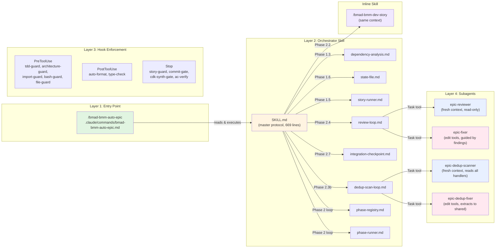
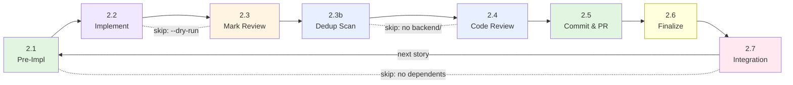
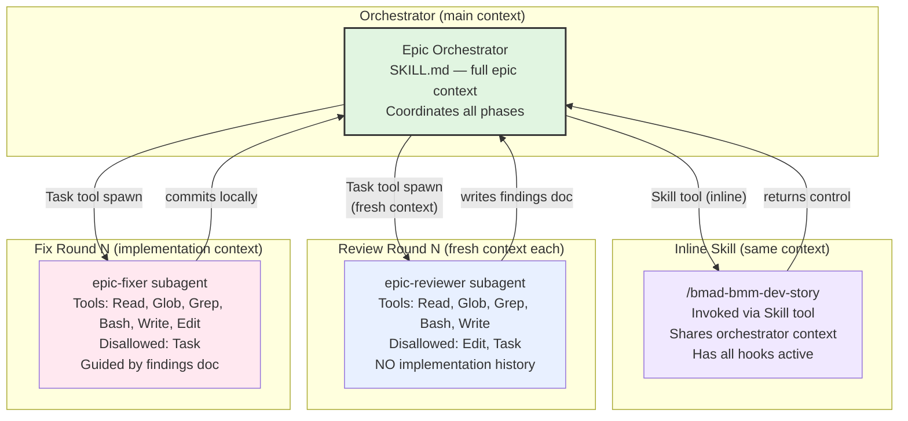
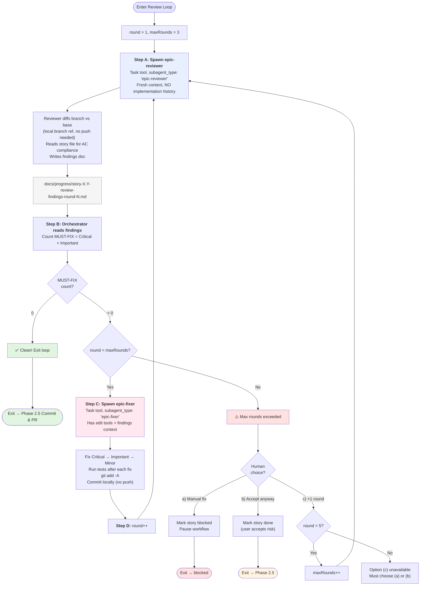
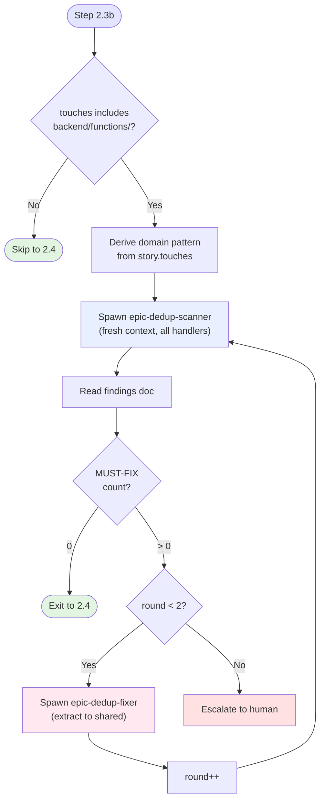
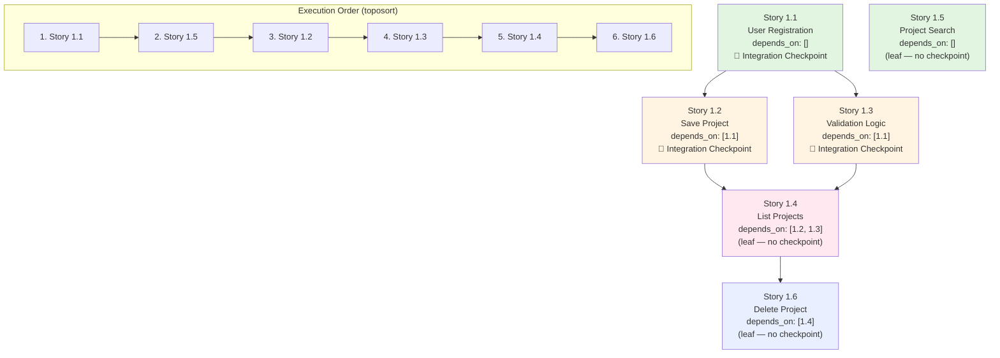
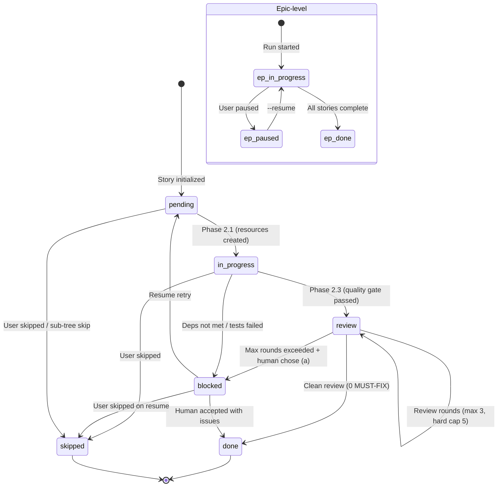
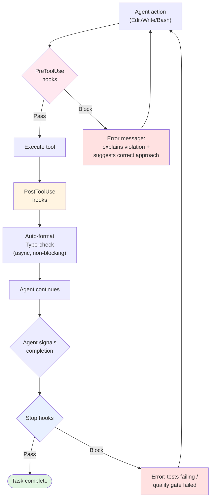
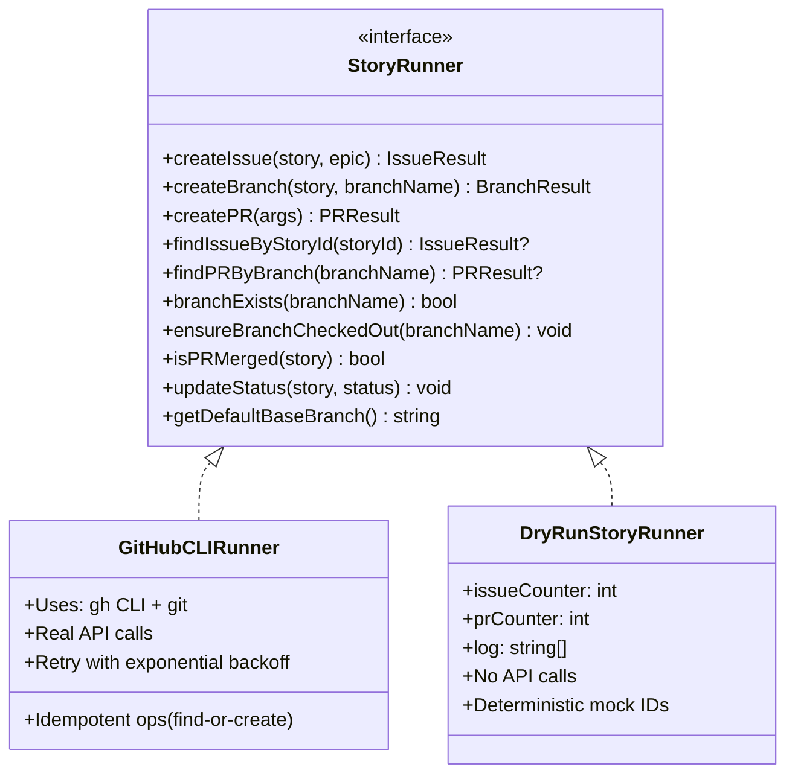
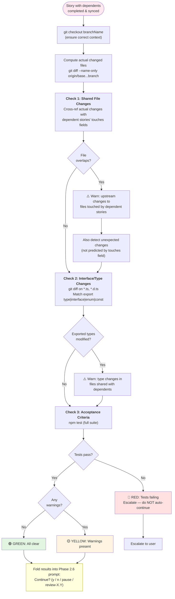

# Auto-Epic Architecture & Design

> Design rationale, component structure, and trade-offs for the autonomous epic implementation system.
>
> **Date:** 2026-02-25 | **Audience:** Engineers, architects
> **See also:** [How It Works](auto-epic-how-it-works.md) | [User Guide](auto-epic-guide.md)

---

## 1. Design Philosophy

An early design proposed separating orchestration into compiled TypeScript classes -- `EpicOrchestrator`, `DependencyAnalyzer`, `StoryRunner`, `StateManager` -- living in a `src/` directory with compiled adapters and a dedicated `package.json`. That design was abandoned. The production system uses a skill-based architecture where the orchestrator IS a set of markdown files loaded directly into the LLM context window. Five considerations drove this decision.

**Context-window native.** Skills are markdown files loaded directly into the LLM context. There is no compilation step, no runtime process, and no deployment artifact. The orchestrator does not exist as running software -- it exists as an instruction set that the LLM executes. This eliminates an entire category of infrastructure: no bundler configuration, no TypeScript compilation for the orchestrator itself, no runtime error handling for orchestrator code distinct from the code it produces. The LLM reads the protocol and follows it, the same way a developer reads a runbook.

**Modular loading.** The orchestrator is split across 9 files totaling 2,138 lines. If it were a single monolith, every phase would consume the full 2,138 lines of context regardless of whether those instructions were relevant. With modular loading, Phase 1.3 (dependency analysis) loads SKILL.md (669 lines) plus dependency-analysis.md (194 lines) for a total of 863 lines. Phase 2.2 (implementation) loads SKILL.md plus story-runner.md (371 lines) for 1,040 lines. The context budget savings compound across the full run -- a 6-story epic executes Phase 2 six times, and each iteration only loads the modules it needs.

**Crash-safe state.** The system's state lives in YAML frontmatter files written with an atomic protocol (write to `.tmp`, then `mv` to final path). If a session crashes mid-story, no running process state is lost because there is no running process. The `--resume` flag reads the state file, reconciles it with GitHub reality via a 7-case matrix, and continues from exactly where the workflow stopped. A compiled TypeScript orchestrator would need explicit serialization of in-memory state to achieve the same guarantee.

**Adversarial review via context isolation.** The review loop's core guarantee is that the reviewer sees the code with no implementation memory -- genuinely fresh eyes. This is a native LLM pattern: the Task tool spawns a subagent with a clean context window. Achieving the same isolation in compiled TypeScript would require complex IPC, process boundaries, or containerization to prevent the reviewer from accessing implementation-phase memory. In the skill-based architecture, context isolation is free.

**Zero infrastructure.** The orchestrator has no `package.json`, no build step, no test suite for orchestration logic. This is deliberate, not lazy. The orchestrator's correctness is validated by the hooks and quality gates it enforces on the code it produces. If the orchestrator misorders phases, stories will fail dependency checks. If it skips the review loop, the quality of the produced code degrades visibly. The orchestrator validates itself through the artifacts it creates, not through unit tests of its own logic.

---

## 2. System Architecture

The system decomposes into four layers, each with a distinct responsibility and failure mode.

**Layer 1: Command Entry Point.** The file `.claude/commands/bmad-bmm-auto-epic.md` (55 lines) is a thin CLI interface. It parses arguments (`epic_id`, `--stories`, `--resume`, `--dry-run`, `--epic-path`, `--no-require-merged`), validates required parameters, and delegates to the orchestrator skill. It contains zero business logic -- its only job is to bridge the slash command interface to the skill system.

**Layer 2: Orchestrator Skill.** The directory `.claude/skills/epic-orchestrator/` contains 9 files that encode all phases, invariants, and error recovery. SKILL.md is the master protocol (always loaded); the remaining 8 files are loaded on-demand as the workflow reaches each phase. This layer owns the execution order, state transitions, human checkpoints, and subagent coordination.

**Layer 3: Hook Enforcement.** The directory `.claude/hooks/` contains 21+ hooks spanning PreToolUse, PostToolUse, and Stop lifecycle points. Hooks are deterministic enforcement -- they block actions before they happen (PreToolUse), auto-correct after actions (PostToolUse), or validate at completion (Stop). The hooks encode architectural decisions from the project's ADRs and are not overridable by the orchestrator or any subagent.

**Layer 4: Subagents.** Four agent definition files in `.claude/agents/` define the fresh-context reviewers and implementation-context fixers. Subagents are spawned via the Task tool and communicate through findings documents written to disk. They have restricted tool access: reviewers cannot edit code; fixers cannot spawn further subagents.



---

## 3. Orchestrator Design

### 3.1 Module Decomposition

The orchestrator is split into 9 files. The split is not arbitrary -- it is driven by context budget management. Each module is loaded only when its phase is reached, keeping the active context window to 850-1,100 lines at any given point rather than the full 2,138.

| File                      | Lines | Purpose                                               | Loaded When   |
| ------------------------- | ----- | ----------------------------------------------------- | ------------- |
| SKILL.md                  | 669   | Master protocol -- phases, invariants, error recovery | Always        |
| dependency-analysis.md    | 194   | Graph building, toposort, cycle detection             | Phase 1.3     |
| state-file.md             | 184   | State format, resume semantics, 7-case matrix         | Phase 1.6     |
| story-runner.md           | 371   | StoryRunner interface, GitHub/DryRun adapters         | Phase 1.5     |
| review-loop.md            | 181   | 3-round review protocol, findings format              | Phase 2.4     |
| integration-checkpoint.md | 156   | File overlap, type changes, test validation           | Phase 2.7     |
| dedup-scan-loop.md        | 167   | 2-round dedup protocol, domain derivation             | Phase 2.3b    |
| phase-registry.md         | 91    | Step order, skip conditions, gate criteria            | Phase 2 entry |
| phase-runner.md           | 125   | Execution loop, dry-run, resume inference             | Phase 2 entry |

The design accepts that some combinations are heavier than others. Loading SKILL.md (669) + story-runner.md (371) = 1,040 lines for Phase 1.5 is acceptable. Loading all 2,138 lines at once is not -- it would leave insufficient context for the actual work of implementing stories, reviewing code, and reasoning about dependencies.

### 3.2 Phase Structure

The workflow is organized into 3 phases with strict ordering constraints.

**Phase 1: Planning & Scope** (steps 1.1-1.6). All planning must complete before any code is written. This phase validates that story files exist and are implementation-ready (Phase 1.2 + 1.2a), builds and validates the dependency graph (Phase 1.3), obtains human scope confirmation (Phase 1.4), initializes the StoryRunner adapter (Phase 1.5), and creates or resumes the state file (Phase 1.6). The ordering is deliberate: story readiness validation catches problems that would otherwise manifest as hallucinated implementations during Phase 2. Dependency analysis must precede scope confirmation so the user sees the execution order before approving. The StoryRunner must be initialized before the state file because the state file's resume logic queries GitHub via the runner.

**Phase 2: Story Implementation Loop** (steps 2.1-2.7). This is the core work. For each story in topological order, the system executes an 8-step pipeline (detailed in Section 3.3). Phase 2 is where all code is written, reviewed, committed, and presented for human approval. Each story iteration is self-contained: it creates resources, implements code, reviews it, pushes it, and checkpoints with the human before moving to the next story.

**Phase 3: Completion & Reporting** (after all stories). This phase is bookkeeping: finalize the completion report, update the epic file with timestamps and PR links, set the state file to `done` (or `paused`), and notify the user with a summary. Story completion report rows are populated incrementally during Phase 2.6, so Phase 3 only fills in aggregate metrics.

### 3.3 Phase 2 Step Pipeline

Phase 2 executes 8 steps per story. The step definitions are split across two files: `phase-registry.md` declares WHAT each step does (its purpose, skip conditions, and gate criteria), while `phase-runner.md` defines HOW to execute the loop (resume inference, dry-run behavior, escalation semantics). This separation means adding a new step -- say, a security scan step between 2.4 and 2.5 -- requires adding one row to the registry and one paragraph of prose to SKILL.md. The runner does not need restructuring.



**Step 2.1 (Pre-Implementation)** verifies dependencies are satisfied, creates GitHub issue and branch via the StoryRunner (idempotent find-or-create), and sets the story status to `in-progress`. Dependencies with dependents require `git merge-base --is-ancestor` verification; leaf dependencies only need state-file "done" status.

**Step 2.2 (Implementation)** invokes the `/bmad-bmm-dev-story` skill inline (same context, not a subagent) to write tests and code. After implementation, runs a quality gate: `npm run lint`, `npm run type-check`, `npm test -- --coverage`. Then runs AC verification, secrets scan, commit verification, and conditional CDK synth gate.

**Step 2.3 (Mark for Review)** transitions the story status to `review` in the state file. This is a lightweight bookkeeping step that exists so the state file reflects the transition precisely.

**Step 2.3b (Dedup Scan Loop)** detects cross-handler code duplication. Skipped entirely if the story does not touch `backend/functions/`. Runs up to 2 scan-fix rounds using fresh-context scanner and implementation-context fixer subagents.

**Step 2.4 (Code Review Loop)** runs adversarial code review. Up to 3 review rounds (2 fix attempts) using fresh-context reviewer and implementation-context fixer subagents. Hard cap of 5 rounds if the user extends.

**Step 2.5 (Commit & PR)** pushes the branch, creates a PR via StoryRunner, runs temp cleanup, and waits for CI to pass with `gh pr checks --watch`.

**Step 2.6 (Finalize Story)** is a human checkpoint. Syncs with the base branch via merge (never rebase), re-runs tests, updates the completion report, and prompts the user to continue, pause, or skip.

**Step 2.7 (Integration Checkpoint)** runs only for stories with dependents. Validates that dependent stories are still valid after upstream changes by checking file overlap, type/interface changes, and test health.

---

## 4. Multi-Agent Coordination

### 4.1 Context Isolation Strategy

The system uses three distinct context strategies, each chosen for a specific reason.

**Fresh-context subagents (reviewers, dedup scanners):** The `epic-reviewer` and `epic-dedup-scanner` are spawned via the Task tool with a clean context window. They have NO knowledge of how the code was implemented. This provides an adversarial guarantee: the reviewer cannot be biased by implementation decisions it watched happen. Each review round gets an independently fresh context -- the reviewer from round 2 does not see round 1's findings or the fixer's changes. It only sees the current state of the code. The trade-off is token cost: fresh context means the reviewer must re-read the story file, diff the branch, and build understanding from scratch each round. Empirically, this cost is justified by review quality.

**Implementation-context subagents (fixers, dedup fixers):** The `epic-fixer` and `epic-dedup-fixer` receive the findings document and implementation context. They need to understand the codebase to make correct fixes -- a fresh-context fixer would spend most of its token budget re-discovering the code structure. Fixers have Edit tools (reviewers do not) and are guided by the specific file paths and line numbers in the findings document. They cannot spawn further subagents (Task tool is disallowed), preventing recursive agent chains.

**Inline skill (dev-story):** The `/bmad-bmm-dev-story` skill runs in the orchestrator's own context via the Skill tool, not as a subagent. This is deliberate: the dev-story implementation needs access to the checked-out branch, active hook enforcement, and the orchestrator's awareness of which story is in progress. Spawning it as a subagent would lose branch context and hook state.



### 4.2 Reviewer-Fixer Loop

The review loop uses a convergence model with empirical bounds. During Epic 3.1, findings converged within an average of 1.3 rounds -- most stories reached 0 MUST-FIX findings after a single review-fix cycle. The default maximum of 3 rounds gives 2 fix attempts before escalation. A hard cap of 5 rounds (reachable via user override) prevents unbounded loops while still allowing for complex stories that need extra iteration.

Communication between agents is file-based: the reviewer writes findings to `docs/progress/story-{id}-review-findings-round-{round}.md`, and the fixer reads that file. This decouples the agents -- the orchestrator mediates by reading the findings document and counting MUST-FIX items to decide whether to spawn a fixer or exit the loop. Each reviewer round is independently fresh; the findings document is the only information that crosses the context boundary.

The fixer commits locally but does NOT push during the review loop. The reviewer diffs against the local branch ref using `origin/{base_branch}...{branch_name}`, which resolves `{branch_name}` as a local ref. This means fixer commits are visible to the next reviewer without any push. The push only happens in Step 2.5, after the review loop exits cleanly.



### 4.3 Dedup Scan Loop

The dedup scan runs BEFORE the adversarial review (Step 2.3b, before 2.4) for a specific reason: the reviewer diffs the branch against the base and catches functional issues in the changed code. The scanner reads ALL handler files in a domain to catch structural duplication that a diff-based reviewer would miss. A reviewer looking at the diff for `saves-update/handler.ts` would not see that `saves-delete/handler.ts` contains an identical Zod schema -- the delete handler is not in the diff. The scanner reads both files and flags the duplication.

Domain pattern derivation works by extracting handler directory paths from `story.touches`, stripping handler-specific suffixes (`-update`, `-delete`, `-get`, `-list`, `-restore`), and building a glob. For example, `backend/functions/saves-update/handler.ts` becomes the domain pattern `backend/functions/saves*/handler.ts`. If touches span multiple disjoint domains (e.g., both `saves*` and `auth*`), only the domain with the most touched files is scanned -- cross-domain dedup is deferred to avoid scanner context overload.

The loop runs up to 2 rounds (1 fix attempt before escalation), tighter than the review loop's 3 rounds. This reflects the empirical observation that dedup findings are more mechanical (replace local definition with shared import) and should resolve in a single fix cycle.



---

## 5. Dependency Analysis & Execution Order

The dependency system uses topological sort via Kahn's algorithm to determine serial execution order. Each story declares its dependencies in YAML frontmatter (`depends_on: [1.2, 1.3]`). A prose fallback detects dependencies from natural language patterns (e.g., "requires Story 1.2") but emits a warning urging explicit YAML frontmatter.

**Cycle detection is fatal.** If the dependency graph contains a cycle (e.g., Story 1.2 depends on 1.3, and 1.3 depends on 1.2), the orchestrator stops immediately. Cycles make topological sort impossible, and there is no meaningful way to "break" a cycle automatically -- it indicates a story design problem that requires human resolution.

**Inverse graph computation.** After building the dependency graph, the system computes the inverse: for each story, which other stories depend on it. This populates `story.dependents` and `story.hasDependents`. These fields drive two decisions: whether to run integration checkpoints (Step 2.7 only runs when `hasDependents === true`) and the dependency completion policy.

**Two-tier dependency completion policy.** Stories WITH dependents require their code to reach the base branch, verified via `git merge-base --is-ancestor ${commitSha} origin/${baseBranch}`. This is strict: downstream stories need the upstream code available on the base branch to build correctly. Leaf stories (no dependents) use a relaxed policy: state-file "done" is sufficient because no downstream story depends on their code. The `--no-require-merged` flag disables strict checking for all stories, useful when you understand the risk.

**Story selection validation.** When the user provides `--stories=1.1,1.2,1.5`, the system runs `validateStorySelection` before entering the sort. For each selected story, it checks whether its dependencies are either in the selected set or already "done" in the state file. Missing dependencies trigger a prompt: add them automatically, proceed anyway, or re-select.



---

## 6. State Management Design

**Dual representation.** The state file at `docs/progress/epic-{id}-auto-run.md` uses YAML frontmatter as the machine-readable source of truth and a markdown body as the human-readable display. The markdown table is regenerated from frontmatter on each update -- never parsed. This avoids the fragility of parsing markdown tables while keeping the file readable in a browser or editor.

**Seven story statuses.** A story can be `pending`, `in-progress`, `review`, `done`, `blocked`, `paused`, or `skipped`. All transitions go through `updateStoryStatus(story, newStatus)`, which updates the state file (primary source) and syncs to secondary sources (GitHub issue labels, sprint-status.yaml) via `runner.updateStatus()`. The state file is always authoritative for control flow decisions.

**Atomic write protocol.** State file updates use a two-step write: first write to `docs/progress/epic-{id}-auto-run.md.tmp`, then rename to the final path via `mv`. If the session crashes between steps 1 and 2, the `.tmp` file serves as a recovery source on resume. This is best-effort atomicity within the constraints of tool-based file operations -- not filesystem-level atomicity, but sufficient to prevent state file corruption from partial writes.

**Scope tracking.** The state file's `scope` field records the original `--stories` selection. On `--resume`, only stories in the recorded scope are processed. This prevents scope drift where a resume unexpectedly expands to implement stories the user did not originally select.

**Commit SHA tracking.** Each story's state entry includes the HEAD commit SHA after implementation. This SHA is used for dependency completion verification (`git merge-base --is-ancestor`), diff scope for code review, and precise identification of what code was produced during resume.

**Resume reconciliation.** The `--resume` flag triggers a 7-case matrix that maps (state file status, GitHub reality) to a recovery action:

| State File Status | GitHub Reality     | Action                                                       |
| ----------------- | ------------------ | ------------------------------------------------------------ |
| `done`            | PR merged          | Skip story (already complete)                                |
| `done`            | PR closed/unmerged | Keep "done" (state file wins; human closed PR intentionally) |
| `in-progress`     | PR exists          | Resume from post-commit (skip to review/finalization)        |
| `in-progress`     | Branch deleted     | Mark "blocked", require human decision                       |
| `in-progress`     | No PR/branch       | Reset to `pending`, restart from beginning                   |
| `pending`         | PR exists          | Treat as "review" (someone manually created PR)              |
| `pending`         | Branch exists      | Check out branch, resume from implementation                 |
| `paused`          | PR exists          | Resume from post-commit                                      |
| `paused`          | No PR/branch       | Reset to `pending`, restart from beginning                   |
| `blocked`         | Any                | Prompt user: retry / skip / keep blocked                     |
| `skipped`         | Any                | Skip story (respect previous decision)                       |

The state file always wins for control flow. GitHub reality informs recovery strategy but does not override orchestration decisions.



---

## 7. Hook Enforcement Model

Hooks form a deterministic enforcement layer that cannot be bypassed by the orchestrator or any subagent. They operate at three lifecycle points with distinct timing and behavior characteristics.

**PreToolUse hooks (<200ms, blocking).** These run BEFORE the tool executes and can block the action entirely. They are fast because they inspect only the tool input (file path, command, content), not the result. The system includes: `tdd-guard.js` (blocks implementation file writes when no failing tests exist), `architecture-guard.sh` (blocks ADR violations like Lambda-to-Lambda calls), `import-guard.sh` (enforces `@ai-learning-hub/*` shared library imports in Lambda code), `bash-guard.cjs` (blocks dangerous commands like force push, credential echo, and exfiltration), `file-guard.js` (protects CLAUDE.md, `.env`, lock files, and planning artifacts from modification), `story-guard.cjs` (blocks dev-story execution unless the story file passes readiness validation), and `pipeline-guard.cjs` (protects writing pipeline artifact integrity).

**PostToolUse hooks (1-10s, async, non-blocking).** These run AFTER the tool executes and auto-correct the result. They do not block the agent's flow -- the correction happens in the background. The system includes: `auto-format.sh` (runs Prettier and ESLint --fix on written files) and `type-check.sh` (runs `tsc --noEmit` and provides errors as context without blocking).

**Stop hooks (10-60s, blocking at completion).** These run when the agent signals it is done and validate the final state. They can block completion if quality gates fail. The system includes: `commit-gate.cjs` (verifies all changes are committed), `cdk-synth-gate.cjs` (runs CDK synth if infra files changed), `ac-verify-validator.cjs` (validates structured AC verification), and the built-in stop hook that verifies tests pass with 80%+ coverage, lint is clean, and build succeeds.

The self-correcting loop is the key behavioral pattern: a PreToolUse hook blocks an action and returns an error message explaining the violation and suggesting the correct approach. The agent reads this error, adjusts its approach, and retries. For example, if `import-guard.sh` blocks a Lambda handler that imports `DynamoDBClient` directly, the error message tells the agent to use `@ai-learning-hub/db` instead. The agent rewrites the import and the retry succeeds. No human intervention is needed unless the hook blocks repeatedly (>3 times for the same violation).



---

## 8. Safety Invariant Rationale

The orchestrator enforces 10 non-negotiable invariants. Each exists because of a specific risk that was either observed in practice or anticipated from the design.

| Invariant                            | Rationale (WHY)                                                                                                                                      | Enforcement Mechanism                                                                                                         |
| ------------------------------------ | ---------------------------------------------------------------------------------------------------------------------------------------------------- | ----------------------------------------------------------------------------------------------------------------------------- |
| Never auto-merge PRs                 | Human judgment on merge timing prevents premature deployment; the orchestrator cannot assess business readiness                                      | Workflow never calls `gh pr merge`; all PRs remain open for human review                                                      |
| Never bypass hooks                   | Hooks encode architectural decisions from ADRs that agents cannot override; bypassing them would allow ADR violations to accumulate silently         | All commits go through pre-commit hooks; no `--no-verify` flag used                                                           |
| Never force push                     | Force push destroys history and can overwrite others' work on shared branches; there is no recovery if history is rewritten                          | All pushes use standard `git push` only; `bash-guard` blocks `--force` and `--force-with-lease`                               |
| Never push to base branch            | Base branch protection is a team workflow requirement; direct pushes bypass PR review, CI checks, and the entire quality gate pipeline               | All story work happens on feature branches created from `origin/{baseBranch}`                                                 |
| Never skip tests                     | Test failures are the primary quality signal; skipping them means shipping code with unknown behavior                                                | Quality gate runs `npm test -- --coverage` before every review; Stop hook blocks completion if tests fail                     |
| Never silently ignore failures       | Silent failures accumulate into systemic problems; explicit failures get fixed or escalated                                                          | Auto-fix (max 2 attempts) then escalate to human with clear options (fix/skip/pause/debug)                                    |
| Idempotent operations                | Resume safety: re-running any step must not create duplicate issues, branches, or PRs                                                                | find-or-create pattern: `getOrCreateIssue`, `getOrCreateBranch`, `getOrCreatePR` check for existing resources before creating |
| State persistence                    | Session crashes should not lose progress; re-running should pick up where the workflow left off                                                      | Atomic writes (write to `.tmp`, then `mv`); `--resume` reads state file and reconciles with GitHub reality                    |
| Human checkpoints                    | Humans control scope (Phase 1.4), approve quality per story (Phase 2.6), review integration impact (Phase 2.7), and confirm completion (Phase 3)     | 4 mandatory gates where the workflow stops and waits for human input                                                          |
| Never implement without a real story | Planning summaries and epic descriptions lack the detail needed for implementation; using them produces hallucinated code that does not match intent | FATAL STOP if story files missing (Phase 1.2); readiness validation checks ACs, dev notes, and status (Phase 1.2a)            |

---

## 9. StoryRunner Abstraction

The StoryRunner interface isolates all GitHub and git operations behind a 10-method contract. This provides three properties: testability (DryRunStoryRunner exercises the full control flow without API calls), adapter extensibility (future JiraStoryRunner or LinearStoryRunner would implement the same interface), and idempotency (the find-or-create pattern is enforced at the interface level).

**Interface methods:**

| Method                               | Purpose                                             |
| ------------------------------------ | --------------------------------------------------- |
| `createIssue(story, epic)`           | Create a GitHub issue for the story                 |
| `createBranch(story, branchName)`    | Create a feature branch from `origin/{baseBranch}`  |
| `createPR(args)`                     | Create a pull request with title, body, base, head  |
| `findIssueByStoryId(storyId)`        | Find existing issue (for idempotency)               |
| `findPRByBranch(branchName)`         | Find existing PR (for idempotency)                  |
| `branchExists(branchName)`           | Check if branch exists locally or on remote         |
| `ensureBranchCheckedOut(branchName)` | Fetch and check out an existing branch              |
| `isPRMerged(story)`                  | Check if PR has been merged (for dependency policy) |
| `updateStatus(story, status)`        | Sync status to GitHub issue labels                  |
| `getDefaultBaseBranch()`             | Query the repo's default branch name                |

**GitHubCLIRunner** uses `gh` CLI and `git` commands. All create operations use idempotent find-or-create: before creating an issue, it searches for an existing one by story ID tag (`bmad:story={storyId}`). All API calls are wrapped in retry with exponential backoff (3 retries, 1s/2s/4s delays). Branches are always created from `origin/{baseBranch}` -- not from HEAD -- to prevent implementation from one story bleeding into another's branch.

**DryRunStoryRunner** returns deterministic mock data. It uses incrementing counters for issue and PR numbers, Maps for idempotency simulation, and logs all operations as `[DRY-RUN]` messages. No API calls are made, no branches are created, no files are modified. The state file IS created in dry-run mode, allowing the full control flow to be exercised.

**Why `gh` CLI over Octokit.** The `gh` CLI was chosen for v1 because it ships faster: no npm dependency, no auth token management (uses existing `gh auth` session), and the commands are human-readable in the protocol (a developer can reproduce any `gh` command manually). Octokit remains a future option for CI/CD integration where the CLI is not available.



---

## 10. Integration Checkpoints

Integration checkpoints run after completing a story where `story.hasDependents === true`. They validate that dependent stories remain viable after upstream changes. The checkpoint runs AFTER Phase 2.6 (sync with main) and BEFORE the user "Continue?" prompt, so the user sees integration results alongside the story completion summary.

**Three validation checks:**

**Check 1: Shared File Changes.** Uses `git diff --name-only origin/{baseBranch}...{branchName}` to get the actual files changed (not the advisory `touches` field). Cross-references these with each dependent story's `touches` to detect overlaps. Also detects "surprise" changes: files the completed story modified that were not predicted by its own `touches` field.

**Check 2: Interface/Type Changes.** Runs `git diff` on `*.ts` and `*.d.ts` files, matching against the pattern `export (type|interface|enum|const) (\w+)`. If exported types were added, removed, or modified, and dependent stories touch the same directories, the checkpoint warns that dependent implementations may need adjustment.

**Check 3: Acceptance Criteria Validation.** Re-runs the full test suite (`npm test`) to ensure the completed story's changes have not broken anything. Test failures at this point indicate the story introduced a regression, which would cascade to dependent stories.

**Result classification:**

- **Green (all clear):** No file overlaps, no type changes, tests pass. Results are shown to the user alongside the "Continue?" prompt but do not require special action.
- **Yellow (warnings):** File overlaps or type changes detected, but tests pass. Warnings are shown alongside the prompt for the user to consider.
- **Red (failures):** Tests failing. The system does NOT continue automatically -- it escalates to the user immediately. A red checkpoint blocks the workflow until the human resolves the issue.



---

## 11. Error Recovery Architecture

The error recovery system follows a 3-tier escalation model. Every error path terminates in a fix, a user decision, or a state update that enables `--resume`. There are no dead ends.

**Tier 1: Auto-fix (max 2 attempts).** When tests fail, lint fails, or type-check fails during implementation, the system analyzes the failure output and attempts an automatic fix. The hooks remain active during auto-fix, so the fix itself is subject to the same constraints. After each fix attempt, the quality gate re-runs. If 2 attempts fail, escalation to the next tier is automatic.

**Tier 2: Self-correct (agent reads hook error).** When a PreToolUse hook blocks an action, the hook returns an error message that explains the violation AND suggests the correct approach. The agent reads this message, adjusts its approach, and retries. For example, `import-guard.sh` blocking a direct `DynamoDBClient` import returns a message directing the agent to use `@ai-learning-hub/db`. This tier handles the majority of hook violations without any human involvement. If the same hook blocks the same pattern more than 3 times, the system escalates.

**Tier 3: Escalate to human.** When auto-fix and self-correction fail, the human decides. Every escalation prompt offers concrete options: fix manually (pause workflow), skip the story (mark as blocked), accept with risk, or debug (show full output). The story's state is updated before escalation so that `--resume` can pick up from the correct point regardless of what the human decides to do outside the workflow.

The key design principle is that **no failure is silent**. If a test fails, the system either fixes it or asks the human. If a hook blocks, the system either adjusts or escalates. If a merge conflicts, the system either auto-resolves simple cases or presents the conflict. The state file captures every transition, so the system's failure history is auditable.

---

## 12. Lessons Learned

These lessons were accumulated from Epics 2, 3, and 3.1. They are encoded in the orchestrator's protocol to prevent recurrence.

**1. Story files MUST exist before epic run.** During an early Epic 2 run, the orchestrator found zero standalone story files. Instead of stopping, it used a 30-line planning summary from a progress document as a substitute and proceeded to implement. The result was code based on guesswork that did not match the intended design. The fix: Phase 1.2 now issues a FATAL STOP on missing story files (same severity as dependency cycles), and Phase 1.2a validates story content readiness (at least 2 acceptance criteria, dev notes/task breakdown, `ready-for-dev` status) before any implementation begins.

**2. Use `npm run type-check` not `npm run build`.** CI runs `tsc --build` in project references mode, which is stricter than per-workspace `tsc`. Vitest strips types via esbuild, so tests pass even with TypeScript errors. The `type-check` script matches CI exactly. The quality gate now runs `npm run type-check` (or `npm run validate` which chains lint, type-check, and test).

**3. CDK entry paths need `process.cwd()` not `__dirname`.** With ESM and esbuild bundling, `__dirname` resolves to the bundled output directory, not the source directory. Lambda handlers using CDK path references must use `path.join(process.cwd(), 'backend/functions/...')` instead.

**4. Use `CLERK_SECRET_KEY_PARAM` env var + SSM runtime fetch.** CDK `ssm-secure` dynamic references for Lambda environment variables resolve at deploy time and get cached. The correct pattern: pass the SSM parameter name as an environment variable, then fetch the secret at runtime using `@aws-sdk/client-ssm`.

**5. Merge guard pre-commit hook is active.** The repository has a gitleaks pre-commit hook that blocks commits containing secrets. The orchestrator's secrets scan gate (Phase 2.2) runs before commit to catch secrets proactively, but the gitleaks hook provides a safety net.

**6. Always verify CI passes before presenting PR as ready.** After pushing a PR, the orchestrator runs `gh pr checks --watch` and waits for all checks to pass. The local quality gate (`npm run validate`) is necessary but not sufficient -- CI may run additional or stricter checks. Never tell the user a PR is ready without confirmed green CI.

---

## 13. Future Enhancements & Roadmap

### 13.1 Structured Event Log

**Status:** Recommended for v2.

The current activity log in the state file is prose, making it difficult to parse programmatically, generate metrics, debug failed runs, or build tooling. The proposed enhancement adds a machine-parseable JSON-lines event stream alongside the state file.

**Location:** `docs/progress/epic-{id}-events.jsonl`

**Schema:**

```typescript
interface WorkflowEvent {
  ts: string; // ISO 8601 timestamp
  event: EventType; // Event type (enum)
  story_id?: string; // Story ID (if applicable)
  [key: string]: any; // Event-specific fields
}

type EventType =
  | "epic.started"
  | "epic.completed"
  | "epic.failed"
  | "story.started"
  | "story.completed"
  | "story.failed"
  | "story.skipped"
  | "story.blocked"
  | "dependency.checked"
  | "dependency.failed"
  | "issue.created"
  | "issue.found"
  | "branch.created"
  | "branch.found"
  | "pr.created"
  | "pr.found"
  | "tests.started"
  | "tests.passed"
  | "tests.failed"
  | "hook.passed"
  | "hook.failed"
  | "checkpoint.started"
  | "checkpoint.passed"
  | "checkpoint.failed";
```

**Example events:**

```jsonl
{"ts":"2026-02-06T10:23:00Z","event":"epic.started","epic_id":"Epic-1","story_count":8}
{"ts":"2026-02-06T10:23:05Z","event":"story.started","story_id":"1.1","title":"User registration"}
{"ts":"2026-02-06T10:25:45Z","event":"tests.passed","story_id":"1.1","coverage":87,"duration_sec":15}
{"ts":"2026-02-06T10:28:45Z","event":"hook.failed","story_id":"1.2","hook":"tdd-guard","error":"No tests found"}
```

**Queryable via jq:**

```bash
# Failed stories
jq 'select(.event=="story.failed")' epic-1-events.jsonl

# Average story duration
jq -s 'map(select(.event=="story.completed")) | map(.duration_sec) | add / length' epic-1-events.jsonl

# Hook failure report
jq 'select(.event=="hook.failed") | {story: .story_id, hook: .hook, error: .error}' epic-1-events.jsonl
```

This enhancement enables post-mortem analysis, duration trend tracking, hook failure rate monitoring, and integration with observability tools (Grafana, Datadog, Splunk).

### 13.2 Parallel Story Implementation

The current system executes stories serially even when the dependency graph identifies parallelizable sets (e.g., Stories 1.1 and 1.5 have no dependencies on each other). A future version could use the Task tool to spawn multiple implementation agents on independent stories simultaneously.

The primary challenge is merge conflict prevention: two agents modifying overlapping files (identified by `story.touches` cross-referencing) would create conflicts at merge time. The solution would use the dependency graph and touches metadata to identify safe parallelization sets -- groups of stories with no shared file dependencies. Estimated time savings for a typical epic: 50-70% reduction in wall-clock time, depending on the degree of parallelism the dependency graph allows.

### 13.3 Multi-Epic Orchestration

A `/bmad-bmm-auto-project` command would orchestrate multiple epics in sequence with inter-epic dependency analysis. Epic-level dependencies (Epic 3 depends on Epic 2's authentication infrastructure) would be expressed in the epics file and validated before the project run begins. This would enable full project automation with daily progress reports and cross-epic integration testing.

### 13.4 Intelligent Scheduling

Beyond simple topological sort, intelligent scheduling would analyze dependencies to optimize execution order: identify critical path stories (those that block the most downstream work), detect blocking stories that should be prioritized, and reorder independent stories to front-load high-risk work. Combined with parallel execution (13.2), this would minimize the total wall-clock time for an epic by ensuring no agent is idle while parallelizable work remains.
