# /bmad-bmm-auto-epic — Workflow Diagram (v2)

This diagram reflects the decomposed skill-based architecture: thin command → orchestrator SKILL.md → supporting modules + subagents.

## Architecture Overview

## Main Workflow (All 3 Phases)

## Multi-Agent Code Review Loop (Phase 2.4)

```mermaid
flowchart TD
    Enter([Enter Review Loop]) --> InitRound["round = 1, maxRounds = 3"]

    InitRound --> SpawnReviewer["<b>Step A: Spawn epic-reviewer</b><br/>Task tool, subagent_type: 'epic-reviewer'<br/>Fresh context, NO implementation history"]
    SpawnReviewer --> ReviewerWork["Reviewer diffs branch vs base<br/>(local branch ref, no push needed)<br/>Reads story file for AC compliance<br/>Writes findings doc"]
    ReviewerWork --> FindingsDoc["docs/progress/story-X.Y-review-<br/>findings-round-N.md"]

    FindingsDoc --> ReadFindings["<b>Step B: Orchestrator reads findings</b><br/>Count MUST-FIX = Critical + Important"]
    ReadFindings --> Decision{MUST-FIX<br/>count?}

    Decision -->|"0"| Clean["✅ Clean! Exit loop"]
    Clean --> ExitSuccess([Exit → Phase 2.5 Commit & PR])

    Decision -->|"> 0"| CheckRound{"round < maxRounds?"}

    CheckRound -->|Yes| SpawnFixer["<b>Step C: Spawn epic-fixer</b><br/>Task tool, subagent_type: 'epic-fixer'<br/>Has edit tools + findings context"]
    SpawnFixer --> FixerWork["Fix Critical → Important → Minor<br/>Run tests after each fix<br/>git add -A<br/>Commit locally (no push)"]
    FixerWork --> Increment["<b>Step D:</b> round++"]
    Increment --> SpawnReviewer

    CheckRound -->|No| MaxRounds["⚠️ Max rounds exceeded"]
    MaxRounds --> HumanChoice{"Human<br/>choice?"}
    HumanChoice -->|"a) Manual fix"| Blocked["Mark story blocked<br/>Pause workflow"]
    HumanChoice -->|"b) Accept anyway"| Accepted["Mark story done<br/>(user accepts risk)"]
    HumanChoice -->|"c) +1 round"| CheckHardCap{round < 5?}
    CheckHardCap -->|Yes| BumpMax["maxRounds++"]
    CheckHardCap -->|No| ForcedChoice["Option (c) unavailable<br/>Must choose (a) or (b)"]
    BumpMax --> SpawnReviewer

    Blocked --> ExitBlocked([Exit → blocked])
    Accepted --> ExitAccepted([Exit → Phase 2.5])

    style Enter fill:#e1e5ff
    style ExitSuccess fill:#e1f5e1
    style ExitBlocked fill:#ffe1e1
    style ExitAccepted fill:#fff4e1
    style Clean fill:#e1f5e1
    style MaxRounds fill:#ffe1e1
    style SpawnReviewer fill:#e8f0ff
    style SpawnFixer fill:#ffe8f0
    style FindingsDoc fill:#f5f5f5,stroke:#999
```

## Integration Checkpoint (Phase 2.7)

```mermaid
flowchart TD
    Enter(["Story with dependents<br/>completed & synced"]) --> EnsureBranch["git checkout branchName<br/>(ensure correct context)"]

    EnsureBranch --> GetDiff["Compute actual changed files<br/>git diff --name-only origin/base...branch"]

    GetDiff --> Check1["<b>Check 1: Shared File Changes</b><br/>Cross-ref actual changes with<br/>dependent stories' touches fields"]
    Check1 --> Overlap{File<br/>overlaps?}
    Overlap -->|Yes| WarnOverlap["⚠️ Warn: upstream changes to<br/>files touched by dependent stories"]
    Overlap -->|No| Check2

    WarnOverlap --> Surprise["Also detect unexpected changes<br/>(not predicted by touches field)"]
    Surprise --> Check2

    Check2["<b>Check 2: Interface/Type Changes</b><br/>git diff on *.ts, *.d.ts<br/>Match export type|interface|enum|const"]
    Check2 --> TypeChanges{Exported types<br/>modified?}
    TypeChanges -->|Yes| WarnTypes["⚠️ Warn: type changes in<br/>files shared with dependents"]
    TypeChanges -->|No| Check3

    WarnTypes --> Check3

    Check3["<b>Check 3: Acceptance Criteria</b><br/>npm test (full suite)"]
    Check3 --> TestResult{Tests pass?}

    TestResult -->|No| Red["🔴 RED: Tests failing<br/>Escalate — do NOT auto-continue"]
    TestResult -->|Yes| Classify

    Classify{Any<br/>warnings?}
    Classify -->|No| Green["🟢 GREEN: All clear"]
    Classify -->|Yes| Yellow["🟡 YELLOW: Warnings present"]

    Green --> MergedPrompt
    Yellow --> MergedPrompt
    Red --> EscalateHuman["Escalate to user"]

    MergedPrompt["Fold results into Phase 2.6 prompt:<br/>Continue? (y / n / pause / review-X.Y)"]

    style Enter fill:#ffe8f0
    style Green fill:#e1f5e1
    style Yellow fill:#fff4e1
    style Red fill:#ffe1e1
    style MergedPrompt fill:#ffd,stroke:#aa0
```

## Agent Spawning & Context Isolation

```mermaid
graph TD
    subgraph "Orchestrator (main context)"
        ORC["Epic Orchestrator<br/>SKILL.md — full epic context<br/>Coordinates all phases"]
    end

    subgraph "Inline Skill (same context)"
        DEV["/bmad-bmm-dev-story<br/>Invoked via Skill tool<br/>Shares orchestrator context<br/>Has all hooks active"]
    end

    subgraph "Review Round N (fresh context each)"
        REVN["epic-reviewer subagent<br/>Tools: Read, Glob, Grep, Bash, Write<br/>Disallowed: Edit, Task<br/>NO implementation history"]
    end

    subgraph "Fix Round N (implementation context)"
        FIXN["epic-fixer subagent<br/>Tools: Read, Glob, Grep, Bash, Write, Edit<br/>Disallowed: Task<br/>Guided by findings doc"]
    end

    ORC -->|"Skill tool (inline)"| DEV
    DEV -->|"returns control"| ORC
    ORC -->|"Task tool spawn<br/>(fresh context)"| REVN
    REVN -->|"writes findings doc"| ORC
    ORC -->|"Task tool spawn"| FIXN
    FIXN -->|"commits locally"| ORC

    style ORC fill:#e1f5e1,stroke:#333,stroke-width:2px
    style DEV fill:#f0e8ff
    style REVN fill:#e8f0ff
    style FIXN fill:#ffe8f0
```

## State Transitions

```mermaid
stateDiagram-v2
    [*] --> pending: Story initialized

    pending --> in_progress: Phase 2.1 (resources created)
    in_progress --> review: Phase 2.3 (quality gate passed)
    review --> review: Review rounds (max 3, hard cap 5)
    review --> done: Clean review (0 MUST-FIX)
    review --> blocked: Max rounds exceeded + human chose (a)
    in_progress --> blocked: Deps not met / tests failed
    in_progress --> skipped: User skipped

    blocked --> pending: Resume retry
    blocked --> done: Human accepted with issues
    blocked --> skipped: User skipped on resume

    pending --> skipped: User skipped / sub-tree skip

    done --> [*]
    skipped --> [*]

    state "Epic-level" as epic {
        [*] --> ep_in_progress: Run started
        ep_in_progress --> ep_paused: User paused
        ep_paused --> ep_in_progress: --resume
        ep_in_progress --> ep_done: All stories complete
    }
```

## Dependency Graph & Execution Order Example

```mermaid
graph TD
    S11["Story 1.1<br/>User Registration<br/>depends_on: []<br/>🔲 Integration Checkpoint"]
    S12["Story 1.2<br/>Save Project<br/>depends_on: [1.1]<br/>🔲 Integration Checkpoint"]
    S13["Story 1.3<br/>Validation Logic<br/>depends_on: [1.1]<br/>🔲 Integration Checkpoint"]
    S14["Story 1.4<br/>List Projects<br/>depends_on: [1.2, 1.3]<br/>(leaf — no checkpoint)"]
    S15["Story 1.5<br/>Project Search<br/>depends_on: []<br/>(leaf — no checkpoint)"]
    S16["Story 1.6<br/>Delete Project<br/>depends_on: [1.4]<br/>(leaf — no checkpoint)"]

    S11 --> S12
    S11 --> S13
    S12 --> S14
    S13 --> S14
    S14 --> S16

    subgraph "Execution Order (toposort)"
        direction LR
        O1["1. Story 1.1"] --> O2["2. Story 1.5"]
        O2 --> O3["3. Story 1.2"]
        O3 --> O4["4. Story 1.3"]
        O4 --> O5["5. Story 1.4"]
        O5 --> O6["6. Story 1.6"]
    end

    style S11 fill:#e1f5e1
    style S15 fill:#e1f5e1
    style S12 fill:#fff4e1
    style S13 fill:#fff4e1
    style S14 fill:#ffe8f0
    style S16 fill:#e8f0ff
```

## StoryRunner Abstraction

## Safety Invariants

| Invariant                      | Enforcement                                                            |
| ------------------------------ | ---------------------------------------------------------------------- |
| Never auto-merge PRs           | Workflow NEVER calls `gh pr merge`; all PRs remain open                |
| Never bypass hooks             | All commits go through pre-commit hooks                                |
| Never force push               | Standard `git push` only (no `--force`)                                |
| Never push to base branch      | All work on feature branches                                           |
| Never skip tests               | Quality gate runs lint + build + test before review                    |
| Never silently ignore failures | Auto-fix (max 2) → escalate to human                                   |
| Idempotent operations          | find-or-create pattern for issues/branches/PRs                         |
| State persistence              | Atomic writes (tmp + mv); `--resume` picks up exactly                  |
| Human checkpoints              | Scope confirmation, per-story approval, integration checks, completion |

## Key Differences from v1 Diagram

1. **Decomposed architecture** — Thin command delegates to SKILL.md, which loads supporting modules on-demand (not a monolithic command file)
2. **Skill tool for dev-story** — Implementation invoked via `Skill("bmad-bmm-dev-story")` inline (same context), not as a subagent
3. **Task tool for review/fix** — Reviewer and fixer are proper subagents with `subagent_type` (not `/bmad-bmm-code-review`)
4. **Review loop operates on local changes** — No push until review loop exits cleanly; reviewer diffs local branch ref
5. **Dependency completion policy** — Stories WITH dependents require `git merge-base --is-ancestor` verification; leaf stories just need state-file "done"
6. **Merged human prompts** — Integration checkpoint results fold into the Phase 2.6 "Continue?" prompt instead of separate prompts
7. **State file atomic writes** — Write to `.tmp` then `mv` for crash safety
8. **Hard cap on review rounds** — Max 3 by default, override up to 5, then forced human decision
9. **StoryRunner abstraction** — All GitHub ops through interface; DryRunStoryRunner for `--dry-run` mode
10. **Explicit quality gate** — lint + build + test with coverage capture BEFORE review loop starts
