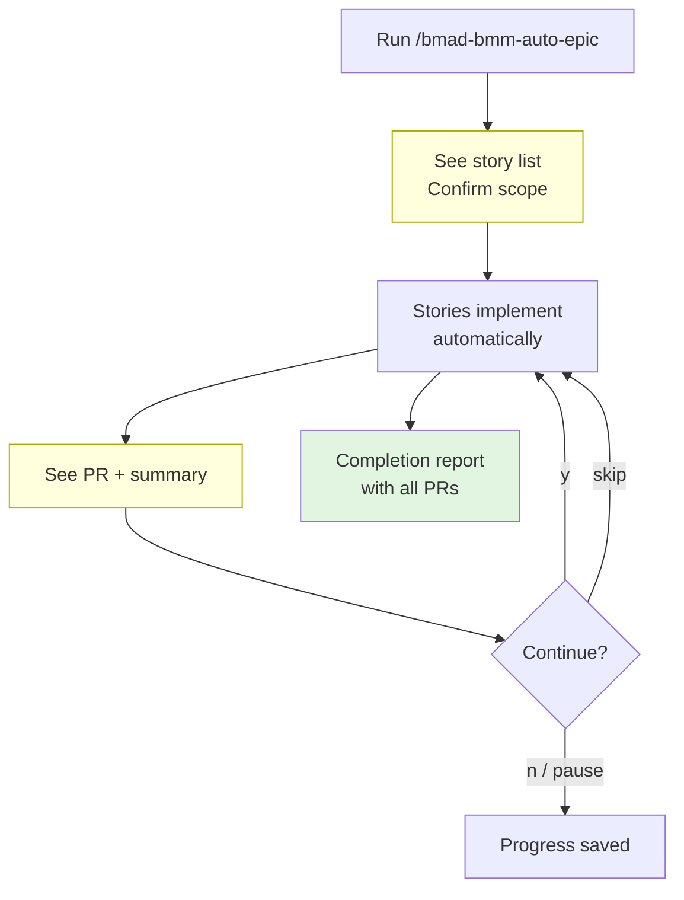
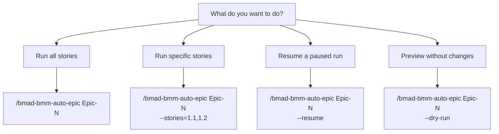

# Auto Epic User Guide

> Step-by-step guide to running autonomous epic implementation in Claude Code.
>
> **Date:** 2026-02-25 | **Audience:** Developers, users
> **See also:** [How It Works](auto-epic-how-it-works.md) | [Architecture](auto-epic-architecture.md)

---

## Quick Start

Run a single command and the system takes care of the rest:

```
/bmad-bmm-auto-epic Epic-1
```

What happens: The system loads your epic, shows you the story list and execution order, and asks you to confirm before writing any code. You stay in control at every step — nothing ships without your approval.

---

## Prerequisites

Before running your first auto-epic, make sure you have the following in place:

- **Claude Code with BMAD skills installed.** The auto-epic command is provided by the BMAD skill pack.

- **An epic file** at `_bmad-output/planning-artifacts/epics.md` (or specify a custom path with `--epic-path`).

- **Story files** in `_bmad-output/implementation-artifacts/` with:
  - YAML frontmatter including `id`, `title`, `depends_on`, and `touches`
  - At least 2 acceptance criteria
  - Dev notes or a task breakdown
  - Status set to `ready-for-dev`

- **A GitHub repository** with a `.github/` directory (needed for branch and PR creation).

If any of these are missing, the system will tell you exactly what needs to be fixed before it can proceed.

---

## Command Reference

### Basic Usage

```
/bmad-bmm-auto-epic Epic-1
```

### Flags

| Flag                  | Description                                  | Example                       |
| --------------------- | -------------------------------------------- | ----------------------------- |
| `--stories=1.1,1.2`   | Implement only specific stories              | `--stories=1.1,1.3,1.5`       |
| `--resume`            | Resume a previous run from where it left off |                               |
| `--dry-run`           | Simulate without creating branches or PRs    |                               |
| `--epic-path=path`    | Override the default epic file location      | `--epic-path=docs/my-epic.md` |
| `--no-require-merged` | Relax dependency checking                    |                               |

### Examples

```
# Run all stories in Epic 1
/bmad-bmm-auto-epic Epic-1

# Run only stories 1.1 and 1.2
/bmad-bmm-auto-epic Epic-1 --stories=1.1,1.2

# Resume a paused run
/bmad-bmm-auto-epic Epic-1 --resume

# Preview what would happen without making changes
/bmad-bmm-auto-epic Epic-1 --dry-run

# Use a custom epic file
/bmad-bmm-auto-epic Epic-1 --epic-path=_bmad-output/planning-artifacts/my-epic.md
```

---

## What to Expect

Here is what happens after you run the command, step by step.

### Step 1: Scope Confirmation

The system reads your epic and presents a summary: the epic name, the full story list, the execution order (based on dependencies), and which stories have integration checkpoints.

You choose one of three options:

- **(a) Implement all** — Run every story in order.
- **(b) Select specific stories** — Pick which stories to include.
- **(c) Cancel** — Exit without making any changes.

This is your chance to review the plan before anything is created.

### Step 2: Story Implementation

For each story in the queue, the system automatically:

1. Creates a GitHub issue describing the story.
2. Creates a feature branch from `main`.
3. Writes tests first, then implements the code.
4. Runs quality checks — lint, type checking, tests, and coverage.
5. Performs a code review using a separate reviewer persona.
6. Fixes any issues the review found.

You do not need to do anything during this step. The system handles the full cycle from issue to passing PR.

### Step 3: PR and Human Checkpoint

After each story completes, you see a summary:

- PR link
- Test results and coverage
- Number of review rounds
- Findings fixed

You are then asked: **"Continue to next story?"** Your options:

- **y** — Continue to the next story.
- **n** — Stop and save progress.
- **pause** — Save progress so you can resume later with `--resume`.
- **skip** — Skip the next story in the queue and move on.

### Step 4: Integration Check

This step only happens for stories that have downstream dependents.

After the completed story's PR is ready, the system checks for potential conflicts with the stories that depend on it. You see a result:

- **Green** — All clear, no conflicts detected.
- **Yellow** — Warnings worth reviewing, but not blocking.
- **Red** — Needs your attention before continuing.

You decide whether to continue, stop, or review the dependent story.

### Step 5: Completion

After all stories are finished, you get a completion report saved at `docs/progress/epic-{id}-completion-report.md`. It includes every PR link, test metrics, coverage numbers, and a summary of the full run.

### Flow Overview



The yellow boxes are where you interact. Everything else runs on its own.

---

## Resuming a Run

If your session ends unexpectedly, or you chose to pause at a checkpoint:

```
/bmad-bmm-auto-epic Epic-1 --resume
```

The system reads the saved state file, checks what has already been completed on GitHub (by looking at merged PRs and open branches), and picks up from the next incomplete story.

You will see a summary like:

> Resuming from Story 1.3. Progress: 2/6 complete.

From there, the normal flow continues — implementation, PR, checkpoint, repeat.

---

## Dry Run Mode

Preview the full execution plan without creating any branches, PRs, or commits:

```
/bmad-bmm-auto-epic Epic-1 --dry-run
```

This is useful for:

- **Validating your epic structure** — Confirms all story files exist and are well-formed.
- **Previewing execution order** — Shows how the system will sequence stories based on dependencies.
- **Checking metadata** — Verifies every story has the required frontmatter, acceptance criteria, and status.

A state file is created during a dry run, so you can inspect the planned scope afterward. No code is written and no GitHub resources are created.

---

## Troubleshooting

### "Story file not found"

The system cannot locate a story file in `_bmad-output/implementation-artifacts/`. Each story referenced in the epic needs a corresponding file — for example, story 1.2 expects a file like `1-2-save-project.md`.

**Fix:** Run `/bmad-bmm-create-story` to generate missing story files with the correct structure.

### "Story not ready"

A story is missing required content. The system needs at minimum:

- At least 2 acceptance criteria.
- Dev notes or a task breakdown.
- `status: ready-for-dev` in the YAML frontmatter.

**Fix:** Open the story file and add the missing sections. The error message will tell you exactly which fields are missing.

### "Dependency cycle detected"

Two or more stories depend on each other in a circle (A depends on B, B depends on A). The system cannot determine a valid execution order.

**Fix:** Check the `depends_on` fields in your story YAML frontmatter and remove the circular reference. Usually one of the dependencies is not actually required.

### "Tests failing after merge"

When syncing a story branch with `main`, new changes from previously merged stories caused test failures.

**What happens:** The system offers you options:

- Auto-fix the failures.
- Revert the merge and try again.
- Skip the story for now.
- Show debug output so you can investigate.

### "Review loop not converging"

After 3 review rounds, the reviewer is still finding issues. This is rare — most stories converge in 1 round.

**What happens:** The system asks you to choose:

- Fix the remaining issues manually.
- Accept the current state with the findings noted.
- Allow one more review round (up to 5 total).

---

## Quick Reference Card

**Command:** `/bmad-bmm-auto-epic <epic-id> [flags]`

### Human Checkpoints

| When               | Your Options                               |
| ------------------ | ------------------------------------------ |
| Scope confirmation | all / select / cancel                      |
| After each story   | continue / stop / pause / skip             |
| Integration check  | continue / stop / pause / review dependent |
| Epic completion    | Review PRs, merge, investigate blockers    |

### Key Files

| File                                           | Purpose                         |
| ---------------------------------------------- | ------------------------------- |
| `docs/progress/epic-{id}-auto-run.md`          | Progress state (for `--resume`) |
| `docs/progress/epic-{id}-completion-report.md` | Final metrics and PR list       |

### Safety Guarantees

The system never merges PRs, never force pushes, and never skips tests. The worst case from any failure is a paused workflow — never damaged code. You can always resume, skip, or start fresh.

### Decision Tree

Not sure which command to run? Start here:



---

## Tips

- **Start with a dry run.** It costs nothing and catches structural problems before you commit to a full run.

- **Let the system work.** During story implementation, resist the urge to intervene. The review cycle is thorough — most issues get caught and fixed automatically.

- **Use pause liberally.** If you need to step away, pause at any checkpoint. The resume feature picks up cleanly.

- **Run specific stories when iterating.** If you are refining one part of an epic, use `--stories` to target just those stories instead of re-running everything.

- **Check the completion report.** After a full run, the report at `docs/progress/epic-{id}-completion-report.md` gives you a single place to review all PRs, merge them, and track what shipped.

The auto-epic system handles the complexity of sequencing, branching, testing, and reviewing so you can focus on what matters — deciding what to build and whether it looks right.
