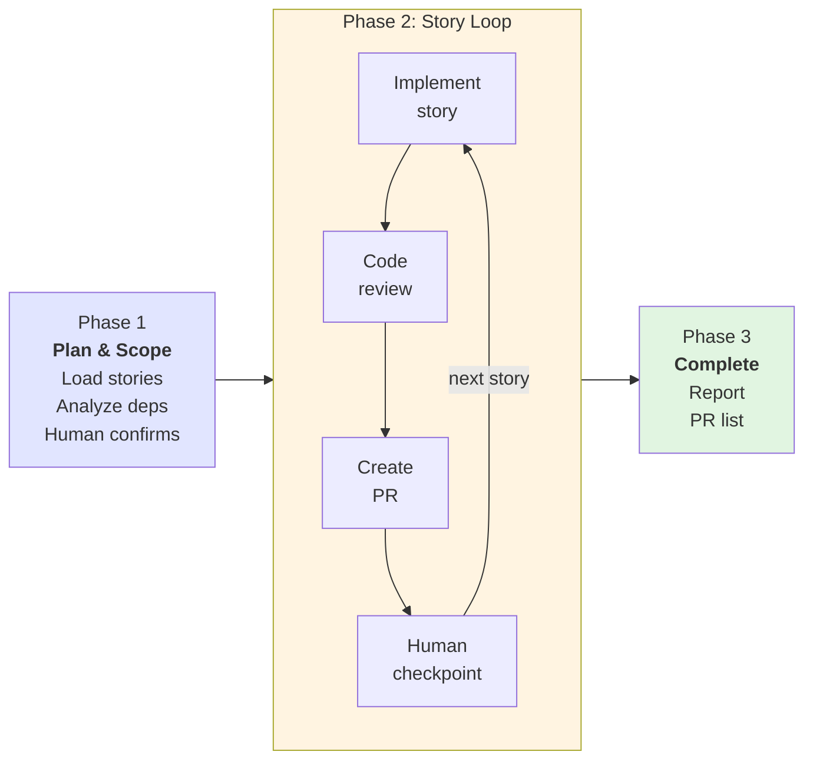
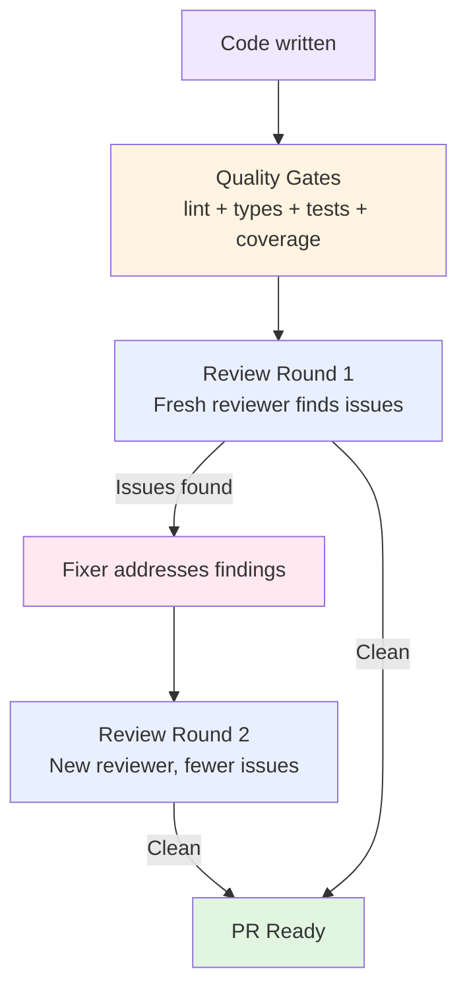
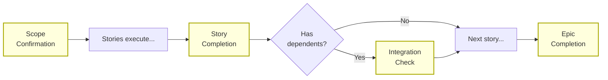
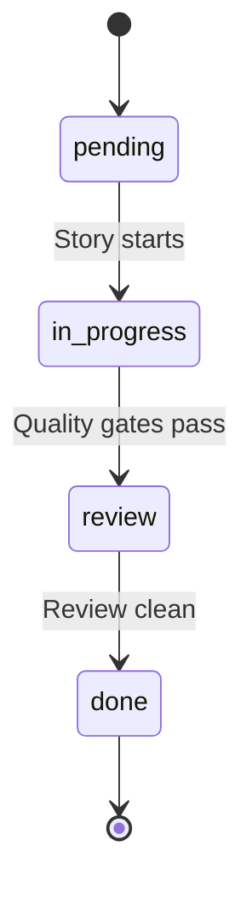

# How Auto Epic Works

> What the autonomous epic implementation system does, how it ensures quality,
> and where humans stay in control.
>
> **Date:** 2026-02-25 | **Audience:** Project managers, AI-assisted developers
> **See also:** [Architecture](auto-epic-architecture.md) | [User Guide](auto-epic-guide.md)

---

## 1. What Auto Epic Does

Auto Epic takes an epic definition -- a set of user stories with dependencies -- and implements every story autonomously. It creates GitHub branches, writes tested code, performs multi-agent code reviews, and opens pull requests. The entire workflow runs as a single long-lived Claude Code session, pausing at strategic checkpoints for human decisions. When it finishes, you have a set of PRs ready for human review and merge.

**Key outcomes:**

- Feature branches with tested, reviewed code for every story in the epic
- Pull requests with coverage metrics and review summaries attached
- A completion report with metrics, blockers, and recommended next steps
- A state file that enables pause and resume across sessions

---

## 2. The Three Phases

Auto Epic organizes its work into three sequential phases: planning, implementation, and completion. Each phase has a clear purpose and well-defined handoff to the next.

### 2.1 Planning and Scope

The system begins by loading the epic definition and reading each story file. It analyzes dependencies between stories -- which stories must complete before others can start -- and builds an execution order using topological sorting. The result is a plan: a sequenced list of stories with integration checkpoints marked where dependent stories converge.

Before writing any code, the system presents the plan to you. You see the full story list, execution order, and which stories trigger integration checks. At this point you can approve the full scope, select specific stories, or cancel entirely. If stories are missing required metadata or have circular dependencies, the system stops and explains what needs to be fixed.

### 2.2 Story Implementation Loop

For each story, in dependency order, the system executes a consistent cycle:

1. **Create resources** -- A GitHub issue and feature branch are created (or reused if they already exist from a previous run).
2. **Write tests and code** -- The system implements the story using test-driven development, guided by the story's acceptance criteria and developer notes.
3. **Run quality checks** -- Linting, type checking, and the full test suite must pass before proceeding.
4. **Code review** -- A separate reviewer agent examines the changes with no knowledge of how the code was written. If issues are found, a fixer agent addresses them, and a new reviewer checks again.
5. **Create a pull request** -- The branch is pushed, a PR is opened with review summaries and coverage metrics, and the branch is synced with main.
6. **Human checkpoint** -- You decide whether to continue to the next story, pause the workflow, or skip ahead.

This cycle repeats for every story in scope. Each iteration is self-contained: if you pause mid-epic, you can resume later and the system picks up exactly where it left off.

### 2.3 Completion and Reporting

After all stories complete (or you choose to stop), the system generates a completion report. The report includes a summary table of all stories, metrics such as review rounds and test coverage, a list of any blockers encountered, and recommended next steps. All open PRs are listed for your review and merge decisions.

---

## 3. Quality Assurance

Quality is enforced at three layers: multi-agent code review catches design and logic issues, automated quality gates enforce mechanical correctness, and architectural enforcement ensures project standards are followed.

### 3.1 Multi-Agent Code Review

After code is written, a separate reviewer agent examines the changes with fresh eyes. This reviewer has no memory of how the code was implemented -- it sees only the diff and the story's acceptance criteria. This separation prevents the common bias where the author of code overlooks their own mistakes.

If the reviewer finds issues, a fixer agent addresses them. The fixer reads the structured findings, makes corrections, and runs tests after each fix. Then a new reviewer (again with no prior context) checks the updated code. This cycle continues until the review comes back clean or a maximum number of rounds is reached.

In practice, most stories pass quickly. During Epic 3.1, 6 of 7 stories passed code review in a single round with zero findings. The average across all 7 stories was 1.3 review rounds. When a story does require multiple rounds, the findings converge: each round surfaces fewer issues than the last.

### 3.2 Automated Quality Gates

Before code review begins, every story passes through a series of automated checks. These gates are non-negotiable -- the system will not proceed until they pass:

- **Linting** -- Code style and formatting are enforced consistently across the codebase.
- **Type checking** -- TypeScript correctness is verified; type errors block progression.
- **Testing** -- All tests must pass. New code must include tests.
- **Coverage measurement** -- Test coverage is measured and tracked per story.
- **Acceptance criteria verification** -- Each criterion from the story is mapped to implementation and test evidence.
- **Secrets scanning** -- Changed files are checked for credentials, API keys, and private key material. Any match blocks the commit.

If tests fail, the system attempts automated fixes (up to two attempts). If the failures persist, the system escalates to you with options: fix manually, skip the story, or pause the workflow.

### 3.3 Architectural Enforcement

The system enforces project standards automatically throughout implementation. Three categories of rules are checked on every code change:

- **Test-driven development** -- Test files must exist before implementation files. The system blocks any attempt to write application code without corresponding tests.
- **Shared library usage** -- Code reuse is enforced. When shared libraries exist for common patterns (logging, database access, validation), the system requires their use rather than allowing duplicate implementations.
- **Architectural decision compliance** -- Project-level architectural decisions (such as API design patterns and database key conventions) are enforced automatically.

When the agent makes a mistake -- for example, writing implementation code before tests -- the system explains the violation and the correct approach. The agent reads the feedback, adjusts its approach, and retries. This self-correcting loop means most architectural violations are resolved without human involvement. If the same violation occurs repeatedly, the system escalates to you.

---

## 4. Human Checkpoints

The system pauses at four strategic points where human judgment matters most. These are the moments where your decisions shape the outcome.

| Checkpoint             | When                                       | What You Decide                                                                |
| ---------------------- | ------------------------------------------ | ------------------------------------------------------------------------------ |
| **Scope Confirmation** | Before any code is written                 | Approve the story list and execution order, select specific stories, or cancel |
| **Story Completion**   | After each story's PR is ready             | Continue to next story, pause the workflow, or skip a story                    |
| **Integration Check**  | After stories that other stories depend on | Whether upstream changes are acceptable for downstream work                    |
| **Epic Completion**    | After all stories finish                   | Review the PR list, investigate any blockers, decide what to merge             |

Between checkpoints, the system operates autonomously. It handles routine decisions (fixing lint errors, retrying flaky operations, self-correcting from hook violations) without interrupting you. The checkpoints are placed where your judgment genuinely matters: scoping decisions, continuation decisions, integration risk assessment, and final delivery review.

---

## 5. Dependency Management

Stories rarely exist in isolation. Story 1.4 might depend on the database schema from Story 1.2 and the validation logic from Story 1.3. Auto Epic handles these relationships automatically.

**Execution order.** The system analyzes each story's declared dependencies and computes a valid execution order. If Story 1.4 depends on Stories 1.2 and 1.3, the system guarantees that 1.2 and 1.3 complete before 1.4 begins. Circular dependencies (A depends on B, B depends on A) are detected early and reported as a fatal error before any code is written.

**Integration checkpoints.** After completing a story that other stories depend on, the system runs an integration checkpoint. This checkpoint examines three things:

1. **File overlap** -- Do the files changed by the completed story overlap with files that downstream stories plan to touch? If so, the system warns about potential conflicts.
2. **Type changes** -- Were any exported types, interfaces, or constants modified? Changes to shared contracts could affect downstream stories.
3. **Test regression** -- Does the full test suite still pass after syncing with main? Regressions surface immediately.

Results are classified into three levels:

- **Green** -- All clear, safe to proceed automatically.
- **Yellow** -- Warnings to consider. The system presents findings and asks you whether to continue.
- **Red** -- Test failures or serious problems detected. The system halts automatic progression and asks you to decide.

---

## 6. Safety Guarantees

The system is designed so that the worst possible outcome is a paused workflow, never damaged code. Nine built-in safety guarantees protect your codebase and your decision-making authority:

1. **Never merges PRs automatically.** All merge decisions are yours. The system creates pull requests and leaves them open for your review.
2. **Never bypasses code quality rules.** Architectural standards, linting, and test requirements are always enforced. The system cannot override them.
3. **Never force pushes.** Your git history is protected. All pushes use standard push operations.
4. **Never pushes to the base branch.** All work happens on feature branches. The main branch is never modified directly.
5. **Never skips tests.** Every story must pass the full test suite before its PR is created.
6. **Never ignores failures silently.** When something goes wrong, the system surfaces the problem immediately and presents you with options.
7. **All operations are resumable.** You can pause the workflow at any time and resume later with the `--resume` flag. The state file tracks exactly where you left off.
8. **All GitHub operations are idempotent.** If an operation is retried (due to a network error or a resumed session), it finds and reuses existing resources rather than creating duplicates.
9. **Human checkpoints are mandatory.** The four checkpoint gates cannot be skipped or automated away. Your approval is required at each one.

---

## 7. What a Typical Run Looks Like

A real execution of Auto Epic on Epic 3.1 provides a concrete picture of what to expect.

The epic contained 9 stories. The system loaded all story files, built the dependency graph, and presented the execution plan. After scope confirmation, it began implementing stories in dependency order.

The run completed 7 of the 9 stories in approximately 21 hours of agent time. Six of the seven stories passed code review in a single round with zero findings -- the reviewer examined the diff, found nothing requiring changes, and the PR was created immediately. One story (3.1.6: Saves CRUD smoke scenarios) required 3 review rounds to resolve 7 findings related to acceptance criteria gaps and input validation edge cases.

Test coverage was maintained at 97% throughout the run. The system created 7 PRs, each annotated with coverage metrics and review summaries, ready for human merge. The remaining 2 stories were left in a pending state with no blockers, available for the next run.

| Metric                | Value                                                            |
| --------------------- | ---------------------------------------------------------------- |
| Stories completed     | 7 of 9 (2 pending, no blockers)                                  |
| Average review rounds | 1.3                                                              |
| Test coverage         | 97% maintained                                                   |
| Common findings       | TypeScript portability, type narrowing, acceptance criteria gaps |

---

## 8. When to Use Auto Epic

Auto Epic is one of several workflows available for different situations. Choosing the right workflow depends on the scope and nature of your work.

| Scenario                                             | Recommended Workflow    |
| ---------------------------------------------------- | ----------------------- |
| Implement an entire epic (5-15 stories) autonomously | `/bmad-bmm-auto-epic`   |
| Implement a single story with full manual control    | `/bmad-bmm-dev-story`   |
| Review existing code changes                         | `/bmad-bmm-code-review` |
| Start a story with branch and issue tracking         | `/project-start-story`  |

**Best for:** Epics with well-defined stories that include structured metadata (dependencies, acceptance criteria, and developer notes). The more complete the story definitions, the better the system performs.

**Not suitable for:** Exploratory work where the requirements are still being discovered, stories without clear acceptance criteria, or single-story tasks where the overhead of the full orchestration workflow is not justified.

---

## 9. Outputs and Artifacts

The system produces several artifacts during a run. Each serves a specific purpose and is stored in a predictable location.

| Artifact          | Location                                                | Purpose                                     |
| ----------------- | ------------------------------------------------------- | ------------------------------------------- |
| Pull requests     | GitHub                                                  | Code changes for human review and merge     |
| State file        | `docs/progress/epic-{id}-auto-run.md`                   | Progress tracking; enables pause and resume |
| Completion report | `docs/progress/epic-{id}-completion-report.md`          | Metrics, blockers, and next steps           |
| Review findings   | `docs/progress/story-{id}-review-findings-round-{N}.md` | Detailed code review results per round      |

**Pull requests** are the primary output. Each PR corresponds to one story and contains the implementation, tests, and a description summarizing the review results and coverage metrics. PRs remain open until you merge them.

**The state file** is the system's memory. It records which stories are completed, in progress, blocked, or pending. When you resume a paused run, the system reads this file and reconciles it with the actual state of GitHub (checking whether branches, issues, and PRs still exist) before continuing. For the full state reconciliation protocol, see [State Management](auto-epic-architecture.md#state-management).

**The completion report** is generated after the run finishes. It provides a summary table, aggregate metrics, a list of blockers encountered, and recommendations for next steps. This is useful for sprint reviews and retrospectives.

**Review findings** are written during each code review round. They contain categorized findings (Critical, Important, Minor) with specific file and line references. These documents provide an audit trail of what was reviewed and what was changed. For more detail on finding categories, see [Review Protocol](auto-epic-architecture.md#42-reviewer-fixer-loop).

---

## Further Reading

- **[Architecture](auto-epic-architecture.md)** -- Technical deep-dive into the system's layers, hook enforcement, subagent protocols, and state management. For engineers who want to understand or modify the internals.
- **[User Guide](auto-epic-guide.md)** -- Practical instructions for running Auto Epic, including dry run mode, story selection, resume behavior, and troubleshooting. For anyone about to use the system.
