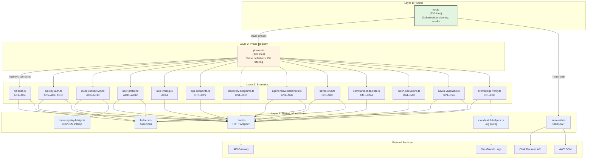
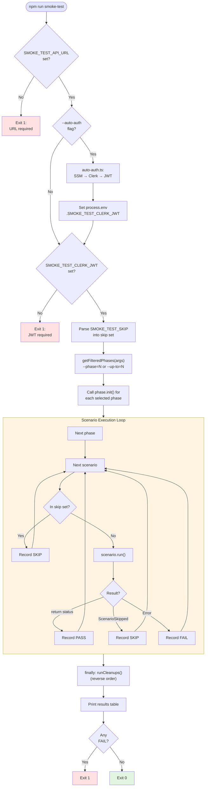
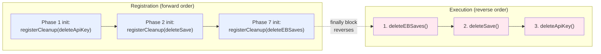
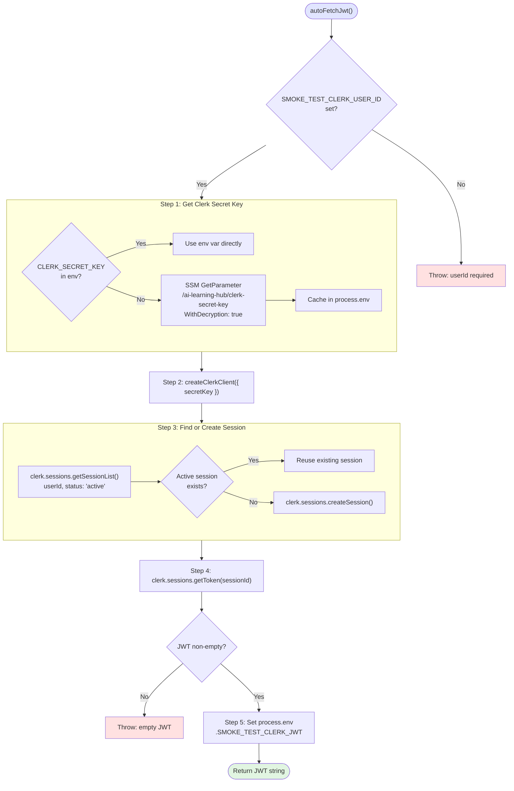
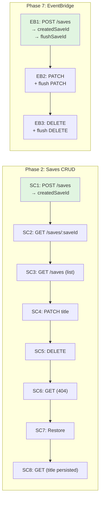
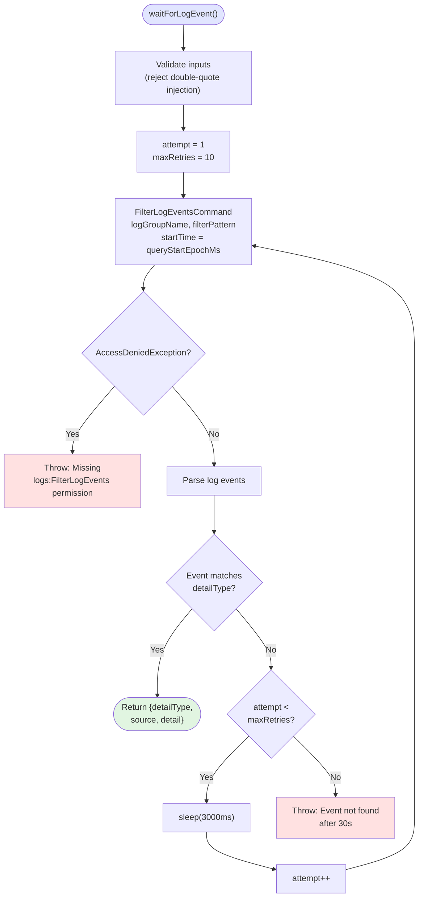
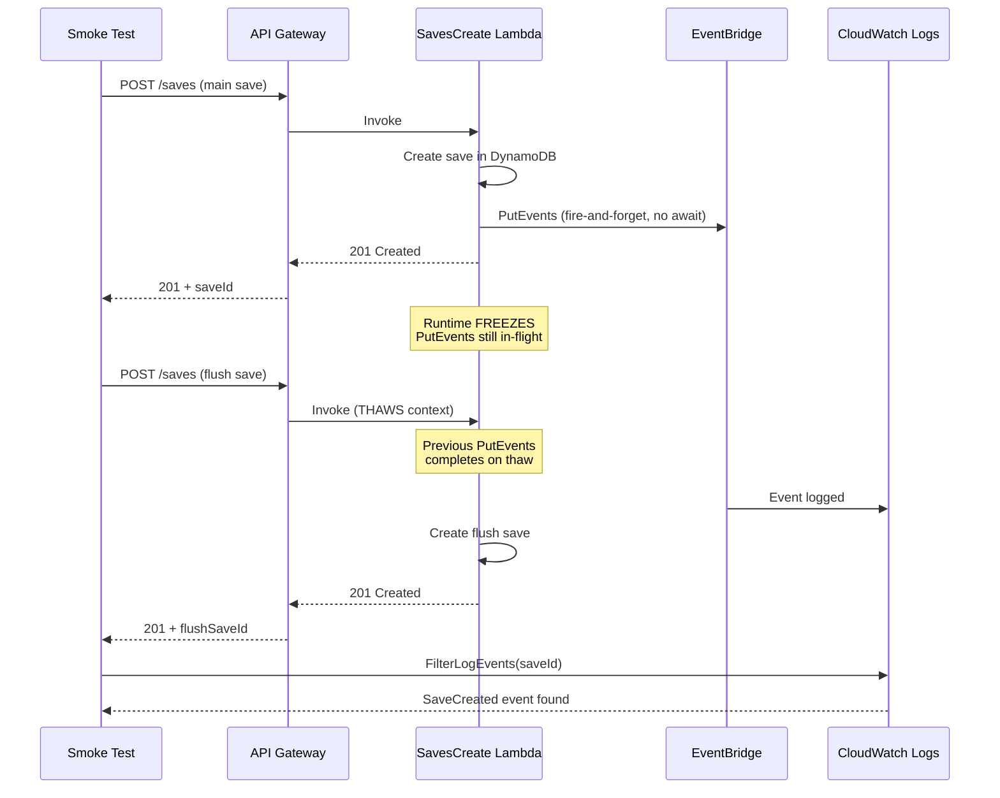

# Smoke Test Architecture & Design

> Design rationale, component structure, and trade-offs for the deployed-environment smoke test system.
>
> **Date:** 2026-02-25 | **Audience:** Engineers, architects
> **See also:** [How It Works](smoke-test-how-it-works.md) | [User Guide](smoke-test-guide.md)

---

## 1. Design Philosophy

The smoke test system was designed around a single principle: validate the real deployed environment the same way a user would interact with it -- via HTTP requests to the API Gateway. Five considerations shaped the implementation.

**No build step required.** The smoke test runs via `tsx` (TypeScript Execute), which compiles TypeScript on-the-fly. There is no separate build step, no `dist/` directory, and no compilation dependency chain. A developer can edit a scenario file and re-run the test immediately. This is deliberate: smoke tests are operational tools that need to run fast with minimal ceremony. The trade-off is that `tsx` is slower than compiled JavaScript for large codebases, but the smoke test is ~3,500 lines -- the compilation overhead is negligible.

**Standalone from the test suite.** The smoke test is NOT part of the vitest test suite (`npm test`). It lives in `scripts/smoke-test/`, not in `__tests__/`. It has its own entry point (`run.ts`), its own HTTP client, and its own assertion helpers. This separation is deliberate: unit tests mock AWS services and run without credentials; the smoke test requires a deployed environment and real AWS credentials. Mixing them would create confusion about what needs to be running for tests to pass.

**Phase-based grouping.** Scenarios are organized into numbered phases that execute sequentially. This provides three properties: dependency ordering (Phase 2 depends on Phase 1 confirming auth works), targeted execution (run only the phase relevant to your change), and extensibility (reserved phase numbers allow inserting new test categories without renumbering existing ones).

**Graceful degradation.** When an optional environment variable is missing, the affected scenario throws `ScenarioSkipped` instead of failing. This means the smoke test produces useful results even with minimal configuration. A developer who only sets `SMOKE_TEST_API_URL` and `SMOKE_TEST_CLERK_USER_ID` gets 46 of 48 scenarios executed -- the 2 common skips (AC4, AC14) are clearly marked with reasons.

**Self-cleaning.** Every phase that creates resources registers cleanup callbacks. Cleanups execute in reverse order in a `finally` block. The deployed environment is left in the same state it was found in, regardless of whether scenarios pass, fail, or crash.

---

## 2. System Architecture

The system decomposes into four layers, each with a distinct responsibility.

**Layer 1: Runner.** The file `scripts/smoke-test/run.ts` (210 lines) is the orchestration core. It validates startup requirements, handles auto-auth, registers cleanup callbacks, executes phases sequentially, handles scenario results (PASS/FAIL/SKIP), and prints the results table. It contains no scenario logic -- its only job is to coordinate execution.

**Layer 2: Phase Registry.** The file `scripts/smoke-test/phases.ts` (143 lines) defines the phase structure, registers scenarios into phases, and handles CLI filtering (`--phase=N`, `--up-to=N`). It is the canonical mapping from phase numbers to scenario arrays.

**Layer 3: Scenarios.** The directory `scripts/smoke-test/scenarios/` contains 14 scenario files (13 scenario definitions + 1 re-export index). Each file exports a `ScenarioDefinition[]` array. Scenarios are self-contained: each one makes HTTP calls, asserts results, and returns the HTTP status code.

**Layer 4: Shared Infrastructure.** Four support files provide the foundation: `client.ts` (HTTP client), `helpers.ts` (assertion helpers), `auto-auth.ts` (Clerk JWT generation), and `cloudwatch-helpers.ts` (CloudWatch Logs polling). These are used by scenarios but contain no test logic themselves.



---

## 3. Runner Design

### 3.1 Execution Pipeline

The runner follows a strict sequential pipeline: startup validation, auto-auth, phase initialization, scenario execution, cleanup, and results output.



### 3.2 Cleanup Registry

The cleanup registry is a simple but critical pattern. Phases register cleanup callbacks during `init()`, and scenarios can add additional cleanups during execution. All cleanups execute in reverse order in the `finally` block, guaranteeing resource cleanup even on crash.

The reverse ordering is important: if Phase 2 creates a save (registered second) and Phase 1 creates an API key (registered first), the save must be deleted before the API key because the save was created using the API key's authentication context. Reverse order ensures child resources are cleaned up before parent resources.



### 3.3 Skip Logic

The skip system operates at two levels:

**Explicit skip (SMOKE_TEST_SKIP).** The user provides a comma-separated list of scenario IDs. The runner checks each scenario against this set before execution. Explicitly skipped scenarios never call `run()` and are immediately recorded as SKIP.

**Conditional skip (ScenarioSkipped).** A scenario detects at runtime that it cannot execute (e.g., `SMOKE_TEST_EXPIRED_JWT` is not set for AC4). It throws `ScenarioSkipped` with a reason string. The runner catches this specific error class and records the scenario as SKIP with the reason displayed in the results table. This is distinct from a test failure -- it indicates a configuration gap, not a bug.

---

## 4. HTTP Client Design

### 4.1 SmokeClient

The `SmokeClient` class (139 lines) wraps the Node.js `fetch()` API with smoke-test-specific concerns:

**Auth injection.** The `request()` method examines `options.auth` and sets the appropriate header: `Authorization: Bearer {token}` for JWT, `x-api-key: {key}` for API keys, or no auth header for `type: "none"`.

**Origin header.** Every request includes `Origin: http://localhost:3000` to simulate a browser CORS preflight context. This is required for API Gateway CORS validation to function correctly.

**Response timing.** Each request measures elapsed time in milliseconds using `Date.now()` deltas. This timing appears in the results table.

**204 handling.** HTTP 204 No Content has no response body. The client special-cases this status to return an empty string instead of attempting JSON parse, which would throw.

**Content-type detection.** For non-204 responses, the client checks the `Content-Type` header. If it contains `application/json`, the body is parsed as JSON. Otherwise, it is returned as raw text. This handles both Lambda JSON responses and API Gateway HTML error pages.

**Singleton pattern.** The `getClient()` function returns a singleton instance, initialized once from `SMOKE_TEST_API_URL`. All scenarios share the same client instance.

### 4.2 Auth Helpers

The `helpers.ts` file provides two convenience functions that abstract auth configuration:

**`jwtAuth()`** reads `SMOKE_TEST_CLERK_JWT` from the environment and returns a typed auth object `{ type: "jwt", token: string }`. Scenarios call this instead of accessing `process.env` directly, which centralizes the env var name.

**`randomInvalidKey()`** generates a random string prefixed with `invalid-key-` for testing API key rejection. This avoids hardcoding a key string that could accidentally match a real key.

---

## 5. Assertion Helpers

The assertion helpers in `helpers.ts` (121 lines) are intentionally inlined rather than imported from the backend shared libraries. This is a deliberate isolation decision: the smoke test must run without `npm run build`, which means it cannot import from compiled backend packages. Inlining the helpers eliminates the build dependency chain.

### 5.1 ADR-008 Error Shape Validation

The `assertADR008(body, expectedCode?)` function validates that an error response matches the standardized error shape:

```typescript
{
  error: {
    code: string,      // e.g., "UNAUTHORIZED", "VALIDATION_ERROR"
    message: string,    // Human-readable description
    requestId: string   // Trace ID for debugging
  }
}
```

This is the single most commonly used assertion in the smoke test -- every error scenario validates this shape. The function checks for the presence of `code`, `message`, and `requestId`, and optionally validates that `code` matches an expected value.

### 5.2 Response Shape Validation

**`assertUserProfileShape(body)`** validates that a user profile response contains `data.userId`, `data.role`, and `data.createdAt`. The `email` field is intentionally not required because profiles created via `ensureProfile` (create-on-first-auth) may not have an email when the Clerk JWT does not include one.

**`assertSaveShape(body, options?)`** validates that a save response contains `data.saveId`, `data.url`, `data.normalizedUrl`, `data.urlHash`, `data.contentType`, `data.tags`, `data.createdAt`, and `data.updatedAt`. The optional `requireLastAccessedAt` flag adds `data.lastAccessedAt` to the required fields -- this field is only set after a GET request (SC2, SC8).

### 5.3 Status and Header Assertions

**`assertStatus(actual, expected, context)`** throws a descriptive error if the HTTP status does not match. The context string identifies which scenario and operation failed.

**`assertHeader(headers, name, context)`** throws if a response header is missing or empty. Used primarily for CORS header validation (AC10) and rate limiting headers (AC14).

---

## 6. Auto-Auth System

### 6.1 Flow

The auto-auth system (`auto-auth.ts`, 118 lines) eliminates manual JWT management by programmatically generating fresh Clerk tokens at startup.



### 6.2 Design Decisions

**SSM over environment variable for secrets.** The Clerk secret key is stored in AWS SSM Parameter Store (`/ai-learning-hub/clerk-secret-key`) rather than in the `.env.smoke` file. This prevents accidental commits of the secret key. The `CLERK_SECRET_KEY` env var is supported as an override for CI environments where SSM access may not be available.

**Session reuse.** The system looks for an existing active session before creating a new one. This avoids accumulating stale sessions in the Clerk dashboard. If an active session exists, it is reused; otherwise, a new one is created.

**~60-second JWT lifetime.** Clerk JWTs have a short lifetime (~60 seconds). This is acceptable because the smoke test completes in 15-30 seconds. If a longer-running test suite were needed, the auto-auth flow would need to be called periodically to refresh the token.

---

## 7. Phase Registry Design

### 7.1 Phase Interface

Each phase is defined by the `Phase` interface:

```typescript
interface Phase {
  id: number; // Phase number (1, 2, 4, 7, ...)
  name: string; // Human-readable name
  scenarios: ScenarioDefinition[]; // Scenarios in execution order
  init?: (registerCleanup: (fn: CleanupFn) => void) => void;
}
```

The `init` function is optional. When present, it is called before the phase's scenarios execute. Its sole purpose is to wire the phase's cleanup callbacks into the runner's cleanup registry. Not all phases need cleanup -- Phase 4 (validation errors) creates and cleans up resources within each scenario, so it has no phase-level `init`.

### 7.2 Phase Numbering

| Phase | Name                     | Scenarios                                  | Init                     | Reserved For         |
| ----- | ------------------------ | ------------------------------------------ | ------------------------ | -------------------- |
| 1     | Infrastructure & Auth    | AC1-AC14, OP1-OP2, DS1-DS2, AN1/5/6/8 (22) | `initApiKeyCleanup`      | --                   |
| 2     | Saves CRUD Lifecycle     | SC1-SC8, CM1-CM4, AN2/3/4/7 (16)           | `initSavesCrudCleanup`   | --                   |
| 3     | Batch Operations         | BA1-BA3 (3)                                | --                       | --                   |
| 4     | Saves Validation Errors  | SV1-SV4 (4)                                | --                       | --                   |
| 5     | (reserved)               | --                                         | --                       | Admin endpoints      |
| 6     | (reserved)               | --                                         | --                       | Multi-user scenarios |
| 7     | EventBridge Verification | EB1-EB3 (3)                                | `initEventBridgeCleanup` | --                   |

Phase gaps (5, 6) are reserved for future test categories. The numbering is designed so that `--up-to=2` always means "auth + basic CRUD" regardless of what phases are added later. This stability matters for CI scripts and developer workflows.

### 7.3 CLI Filtering

The `getFilteredPhases(args)` function parses CLI arguments to determine which phases to run:

- `--phase=N` returns only the phase with `id === N`. Errors if the phase does not exist.
- `--up-to=N` returns all phases with `id <= N`. Errors if no phases match.
- Neither flag returns all phases.
- Both flags together is an error.

The filtering happens before any scenario executes, so invalid phase numbers fail fast with a clear error message.

---

## 8. Scenario Design Patterns

### 8.1 Scenario Interface

Every scenario implements the `ScenarioDefinition` interface:

```typescript
interface ScenarioDefinition {
  id: string; // e.g., "AC1", "SC3", "EB2"
  name: string; // Human-readable description
  run(): Promise<number>; // Returns HTTP status or 0
}
```

The `run()` method is the scenario's entry point. It makes HTTP calls, asserts results, and returns the HTTP status code of the key assertion. If any assertion fails, it throws an error. The runner catches the error and records FAIL.

### 8.2 State Chaining

Some scenarios depend on resources created by earlier scenarios in the same phase. This is handled through module-level variables:



**Phase 2 chain.** SC1 creates a save and stores `createdSaveId` in a module-level variable. SC2-SC8 read this variable. If SC1 fails, SC2-SC8 will throw immediately with "requires SC1 (no saveId)".

**Phase 7 chain.** EB1 creates two saves: the main save (`createdSaveId`) and a flush save (`flushSaveId`). EB2 patches both, EB3 deletes both. If EB1 fails or is skipped, EB2-EB3 throw `ScenarioSkipped`.

This pattern is simple and predictable. The alternative -- independent setup per scenario -- would require 8 separate create/delete operations in Phase 2, tripling the API calls and test duration.

### 8.3 Retry-on-429 Resilience

The API key scenarios create multiple keys in rapid succession, which can trigger the rate limiter. The `createKey()` helper wraps key creation in a retry loop with exponential backoff (2s, 4s, 6s delays). This is a smoke test concern, not a bug: the rate limiter is working correctly; the smoke test just needs to work within its constraints.

Similarly, the API key list scenario (AC13) retries the list query up to 3 times with 1-second delays to account for DynamoDB GSI eventual consistency. A key written to the main table may not appear in the GSI immediately.

### 8.4 Resource Cleanup Within Scenarios

Some scenarios create and clean up resources within a single `run()` call using try/finally:

```typescript
// AC5: Create key, use it, delete it
const key = await createKey(jwt, ["*"], "smoke-valid-key");
try {
  const res = await getClient().get("/users/me", {
    auth: { type: "apikey", key: key.keyValue },
  });
  assertStatus(res.status, 200, "...");
  return res.status;
} finally {
  await deleteKey(key.id, jwt).catch(() => undefined);
}
```

The `.catch(() => undefined)` on cleanup calls prevents cleanup failures from masking the actual test result. If the scenario fails and cleanup also fails, the user sees the scenario failure, not the cleanup error.

---

## 9. CloudWatch Logs Polling

### 9.1 The Problem

EventBridge event delivery is fire-and-forget from the Lambda's perspective. The `emitEvent()` function in the backend calls `PutEvents` but does not await the result. This means the Lambda can return a 201 success to the API caller while the EventBridge event is still in-flight. To verify delivery, the smoke test must query the destination: CloudWatch Logs.

### 9.2 Polling Strategy

The `waitForLogEvent()` function (117 lines) implements a retry-based polling strategy:



**Filter pattern.** CloudWatch Logs filter patterns use a JSON-path-like syntax: `{ $.detail.saveId = "<saveId>" }`. This filters server-side, reducing the number of events returned. However, CloudWatch filter patterns do not support bracket notation for hyphenated keys like `detail-type`, so the detail-type match happens in application code after parsing.

**Time bounding.** The `startTime` parameter is set to `Date.now() - 30_000` (30 seconds before the API call). This excludes old log entries from previous test runs. Without this bound, the query might match a stale event from a prior run and produce a false positive.

**Input validation.** The function rejects `saveId` and `detailType` values containing double-quote characters. This prevents CloudWatch filter pattern injection: a crafted `saveId` like `" || true` could alter the filter semantics.

**Dynamic import.** The `@aws-sdk/client-cloudwatch-logs` package is imported dynamically (`await import(...)`) rather than statically. This prevents the smoke test from crashing when the package is not installed, which would break Phases 1-4 that do not need CloudWatch access.

### 9.3 The Lambda Context Thawing Pattern

The smoke test encounters a specific Lambda runtime behavior: fire-and-forget PutEvents calls may not complete before the runtime freezes the process.

**The problem.** Lambda freezes the process context after the handler returns. If `emitEvent()` fires a PutEvents call in a detached async IIFE (no await), the HTTP request may be in-flight when the freeze occurs. The request stays pending until the next invocation thaws the context.

**The solution.** After each main API call (create/update/delete), the smoke test immediately makes a second "flush" request to the same Lambda function. This second invocation thaws the frozen context, allowing the pending PutEvents call from the first invocation to complete.



The flush save is not wasted -- it is reused in EB2 (patched for flush) and EB3 (deleted for flush), ensuring each Lambda function type gets its context thawed before the smoke test polls for the event.

---

## 10. CJS/ESM Interop Bridge

### 10.1 The Problem

The smoke test runs as ESM (uses `import` statements, executed via `tsx`). The CDK infrastructure code compiles to CommonJS (no `"type": "module"` in `infra/package.json`, compiled to `infra/dist/`). The route connectivity scenarios (AC9, AC10) need to iterate over the `ROUTE_REGISTRY` constant from the infrastructure code.

Static ESM imports from a CJS module fail with named export resolution errors. Dynamic `import()` works but loses type information. Neither approach is clean.

### 10.2 The Solution

The `route-registry-bridge.ts` file (32 lines) uses Node.js `createRequire()` to create a CJS `require()` function within the ESM context:

```typescript
import { createRequire } from "module";

const _require = createRequire(import.meta.url);
const mod = _require(
  resolve(_dir, "../../infra/dist/config/route-registry.js")
);

export const ROUTE_REGISTRY = mod.ROUTE_REGISTRY;
```

This loads the compiled CJS output from `infra/dist/config/route-registry.js` into the ESM namespace. The bridge re-exports `ROUTE_REGISTRY` as a properly typed ESM export. Scenarios import from the bridge, not from the infrastructure code directly.

**Dependency on CDK build.** The bridge loads from `infra/dist/`, which means `npm run build` in the `infra/` workspace must have been run at least once. If `infra/dist/config/route-registry.js` does not exist, the bridge throws a clear error at import time.

---

## 11. Scenario ID Naming Conventions

Scenario IDs follow a consistent naming scheme that encodes the category and sequence:

| Prefix | Category                                  | Origin            |
| ------ | ----------------------------------------- | ----------------- |
| AC     | Acceptance Criteria (infrastructure/auth) | Story 3.1.2-3.1.5 |
| OP     | Ops endpoints (health/readiness)          | Story 3.2.9       |
| DS     | Discovery endpoints (actions/states)      | Story 3.2.10      |
| AN     | Agent-native behaviors                    | Story 3.2.11      |
| SC     | Saves CRUD                                | Story 3.1.6       |
| CM     | Command mutation endpoints                | Story 3.2.11      |
| BA     | Batch operations                          | Story 3.2.11      |
| SV     | Saves Validation                          | Story 3.1.6       |
| EB     | EventBridge                               | Story 3.1.9       |

The numbering within each prefix is sequential but not contiguous -- AC13 was added to the api-key-auth file alongside AC5-AC8 because it tests the full API key lifecycle, which logically belongs with the other API key scenarios. The number reflects the order within the story's acceptance criteria, not the execution order in the smoke test.

---

## 12. File Inventory

| File                                  | Purpose                                                       |
| ------------------------------------- | ------------------------------------------------------------- |
| `run.ts`                              | Runner: orchestration, cleanup, results table                 |
| `types.ts`                            | ScenarioDefinition, Result, CleanupFn, ScenarioSkipped        |
| `client.ts`                           | SmokeClient: HTTP wrapper with auth, timing, 204 handling     |
| `helpers.ts`                          | ADR-008, profile shape, save shape, status, header assertions |
| `phases.ts`                           | Phase registry, CLI filtering (--phase, --up-to)              |
| `auto-auth.ts`                        | Clerk JWT generation via SSM + Backend API                    |
| `cloudwatch-helpers.ts`               | CloudWatch Logs polling with retry                            |
| `route-registry-bridge.ts`            | CJS/ESM interop for ROUTE_REGISTRY                            |
| `scenarios/index.ts`                  | Re-exports all scenario arrays                                |
| `scenarios/jwt-auth.ts`               | AC1-AC4: JWT auth scenarios                                   |
| `scenarios/api-key-auth.ts`           | AC5-AC8, AC13: API key scenarios                              |
| `scenarios/route-connectivity.ts`     | AC9-AC10: Route and CORS validation                           |
| `scenarios/user-profile.ts`           | AC11-AC12: User profile CRUD                                  |
| `scenarios/rate-limiting.ts`          | AC14: Rate limiting                                           |
| `scenarios/ops-endpoints.ts`          | OP1-OP2: Health and readiness probes                          |
| `scenarios/discovery-endpoints.ts`    | DS1-DS2: Action catalog and state graph                       |
| `scenarios/agent-native-behaviors.ts` | AN1-AN8: Agent-native API behaviors                           |
| `scenarios/saves-crud.ts`             | SC1-SC8: Saves lifecycle                                      |
| `scenarios/command-endpoints.ts`      | CM1-CM4: Command mutation endpoints                           |
| `scenarios/batch-operations.ts`       | BA1-BA3: Batch operations                                     |
| `scenarios/saves-validation.ts`       | SV1-SV4: Validation errors                                    |
| `scenarios/eventbridge-verify.ts`     | EB1-EB3: EventBridge verification                             |
| **Total**                             | **22 files, 48 scenarios**                                    |

---

## 13. Integration with CDK Infrastructure

The smoke test validates infrastructure deployed by CDK stacks. Three integration points are critical:

**Route Registry (`infra/config/route-registry.ts`).** The canonical source of truth for all API routes. Each entry specifies `path`, `methods`, `authType`, `handlerRef`, and `epic`. Scenarios AC9 and AC10 iterate over this registry to validate every route is reachable and CORS-enabled. If a new route is added to the registry but not wired in CDK, AC9 catches it.

**Events Stack (`infra/lib/stacks/core/events.stack.ts`).** Creates the EventBridge bus (`ai-learning-hub-events`), CloudWatch Log Group (`/aws/events/ai-learning-hub-events`), and the rule that routes all events with source prefix `ai-learning-hub*` to the log group. Phase 7 queries this log group. The log group name is exposed as a CDK stack output (`AiLearningHub-EventLogGroupName`) and configured via `SMOKE_TEST_EVENT_LOG_GROUP`.

**Saves Routes Stack (`infra/lib/stacks/api/saves-routes.stack.ts`).** Creates 6 Lambda functions for saves CRUD and wires them to API Gateway routes. Phase 2 and Phase 4 exercise all 6 functions. The `EVENT_BUS_NAME` environment variable on each Lambda enables EventBridge event publishing, which Phase 7 verifies.

---

## 14. Lessons Learned

These lessons were accumulated during the development of Stories 3.1.2 through 3.1.9 and are encoded in the smoke test's design.

**1. Clerk JWTs expire in ~60 seconds.** Early smoke test runs used manually copied JWTs that expired mid-run. The auto-auth system was built to eliminate this friction. The JWT is fetched at startup and lasts long enough for the full 30-60 second run.

**2. DynamoDB GSIs are eventually consistent.** The API key lifecycle scenario (AC13) initially failed intermittently because a newly created key did not appear in the GSI list query. The fix: retry the list query up to 3 times with 1-second delays. This is not a bug -- it is expected DynamoDB behavior.

**3. Lambda freezes kill fire-and-forget events.** The `emitEvent()` function uses a detached async IIFE (no await). The Lambda runtime can freeze the process before PutEvents completes. The flush save pattern was designed specifically to work around this: a follow-up request thaws the frozen context and lets pending HTTP calls complete.

**4. CloudWatch filter patterns do not support bracket notation.** The initial filter pattern attempted to match `$["detail-type"]` to filter by event type. CloudWatch Logs does not support bracket notation for hyphenated JSON keys. The fix: filter only by `$.detail.saveId` server-side, then match `detail-type` in application code.

**5. API Gateway 403 vs Lambda 403 are distinguishable.** When a route is not wired in API Gateway, the gateway returns 403 without an `x-amzn-requestid` header. When a Lambda returns 403 (authorization failure), the `x-amzn-requestid` header is present. Scenario AC9 uses this distinction to detect unwired routes without false positives from legitimate Lambda 403s.

**6. Rate limiting tests need a dedicated user.** The rate limiting scenario (AC14) sends 11 rapid requests to trigger a 429. If the same JWT is used for other scenarios, their earlier traffic may pre-exhaust the token bucket, making AC14's behavior unpredictable. The fix: `SMOKE_TEST_RATE_LIMIT_JWT` uses a separate Clerk user dedicated to rate limiting tests.

---

## 15. Future Enhancements

### 15.1 CI Integration

**Status:** Recommended for next sprint.

The smoke test should run automatically after CDK deploys in CI. The pipeline would: deploy infrastructure, run `npm run smoke-test -- --auto-auth`, and fail the pipeline if any scenario fails. This catches deploy-time regressions before they reach developers.

**Requirements:** CI needs AWS credentials with `ssm:GetParameter` and `logs:FilterLogEvents`, plus a `SMOKE_TEST_CLERK_USER_ID` configured for the CI environment.

### 15.2 Parallel Phase Execution

Phases with no data dependencies could run in parallel. Phase 1 and Phase 4 are independent (Phase 4 creates its own temporary saves). Running them in parallel would reduce total duration by 1-2 seconds. However, the current sequential execution is simple and fast enough that the complexity of parallel coordination is not justified.

### 15.3 Performance Baseline

Each scenario records its duration. A future enhancement could store baseline durations and flag scenarios that regress beyond a threshold (e.g., >2x baseline). This would catch Lambda cold start regressions, DynamoDB capacity issues, or API Gateway integration latency changes.

### 15.4 Multi-Environment Support

The current smoke test targets a single environment via `SMOKE_TEST_API_URL`. A future enhancement could accept an `--env=staging` flag that loads environment-specific configuration, enabling the same scenarios to validate staging and production deployments.
