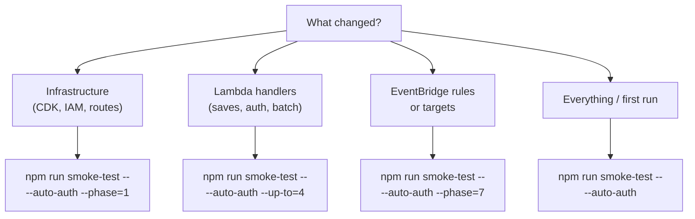

# Smoke Test User Guide

> Step-by-step guide to running, configuring, and extending the deployed-environment smoke test.
>
> **Date:** 2026-02-25 | **Audience:** Developers, users
> **See also:** [How It Works](smoke-test-how-it-works.md) | [Architecture](smoke-test-architecture.md)

---

## Quick Start

Run a single command and see results in 15-30 seconds:

```bash
source scripts/smoke-test/.env.smoke && npm run smoke-test -- --auto-auth
```

What happens: The runner fetches a fresh JWT from Clerk, executes all 48 scenarios across 5 phases against the deployed API, cleans up any resources it created, and prints a results table with pass/fail/skip status for every scenario.

---

## Prerequisites

Before running your first smoke test:

- **A deployed environment.** The smoke test hits real AWS infrastructure. Run `cd infra && cdk deploy` if you haven't deployed yet.

- **AWS credentials** with permissions for:
  - `ssm:GetParameter` (to fetch the Clerk secret key for auto-auth)
  - `logs:FilterLogEvents` (for Phase 7 EventBridge verification)

- **An `.env.smoke` file** with at minimum `SMOKE_TEST_API_URL` set. Copy the example:

  ```bash
  cp scripts/smoke-test/.env.smoke.example scripts/smoke-test/.env.smoke
  # Edit .env.smoke with your API Gateway URL and Clerk user ID
  ```

- **A Clerk test user** with `publicMetadata.inviteValidated === true` (for auto-auth mode).

---

## Command Reference

### Basic Usage

```bash
source scripts/smoke-test/.env.smoke && npm run smoke-test -- --auto-auth
```

### Flags

| Flag          | Description                                         | Example     |
| ------------- | --------------------------------------------------- | ----------- |
| `--auto-auth` | Fetch fresh JWT from Clerk at startup (recommended) |             |
| `--phase=N`   | Run only phase N                                    | `--phase=7` |
| `--up-to=N`   | Run phases 1 through N (inclusive)                  | `--up-to=2` |

### Examples

```bash
# Run all phases with auto-auth (recommended)
source scripts/smoke-test/.env.smoke && npm run smoke-test -- --auto-auth

# Run only Phase 1 (auth and infrastructure)
npm run smoke-test -- --auto-auth --phase=1

# Run only Phase 7 (EventBridge verification)
npm run smoke-test -- --auto-auth --phase=7

# Run Phases 1 and 2 (auth + saves CRUD)
npm run smoke-test -- --auto-auth --up-to=2

# Skip specific scenarios
SMOKE_TEST_SKIP=AC14,SV3 npm run smoke-test -- --auto-auth

# Manual JWT (not recommended — expires in ~60s)
export SMOKE_TEST_API_URL=https://...
export SMOKE_TEST_CLERK_JWT=eyJ...
npm run smoke-test
```

---

## Environment Variables

### Required

| Variable             | Description                                | How to Get                                            |
| -------------------- | ------------------------------------------ | ----------------------------------------------------- |
| `SMOKE_TEST_API_URL` | API Gateway invoke URL (no trailing slash) | AWS Console > API Gateway > Stages > dev > Invoke URL |

### Auto-Auth (recommended)

| Variable                   | Description                                           | How to Get                 |
| -------------------------- | ----------------------------------------------------- | -------------------------- |
| `SMOKE_TEST_CLERK_USER_ID` | Clerk user ID for the test user                       | Clerk Dashboard > Users    |
| `CLERK_SECRET_KEY`         | (Optional) Clerk secret key -- skips SSM fetch if set | Clerk Dashboard > API Keys |

### Optional

| Variable                     | Description                              | Default Behavior         |
| ---------------------------- | ---------------------------------------- | ------------------------ |
| `SMOKE_TEST_EXPIRED_JWT`     | Real Clerk-signed expired JWT            | AC4 skips gracefully     |
| `SMOKE_TEST_RATE_LIMIT_JWT`  | JWT for a dedicated rate-limit test user | AC14 skips gracefully    |
| `SMOKE_TEST_EVENT_LOG_GROUP` | CloudWatch Log Group name                | Phase 7 skips gracefully |
| `SMOKE_TEST_SKIP`            | Comma-separated scenario IDs to skip     | No scenarios skipped     |

---

## What to Expect

### Step 1: Authentication

If using `--auto-auth`, the runner fetches the Clerk secret key from AWS SSM, finds or creates an active session, and generates a fresh JWT. You see output like:

```
🔑 Auto-auth: Fetching fresh JWT...
  ⬇  Fetching Clerk secret key from SSM: /ai-learning-hub/clerk-secret-key
  👤 User: user_2abc...
  ♻  Reusing active session: sess_2xyz...
  ✅ JWT obtained (1247 chars, expires in ~60s)
```

### Step 2: Phase Execution

The runner executes phases sequentially. Each phase prints a header and runs its scenarios:

```
── Phase 1: Infrastructure & Auth ──
── Phase 2: Saves CRUD Lifecycle ──
── Phase 4: Saves Validation Errors ──
── Phase 7: EventBridge Verification ──
```

You do not need to interact during execution. The runner handles everything autonomously.

### Step 3: Results Table

After all scenarios complete, you see a summary table:

```
 ID     │ Scenario                                                  │ Status   │   HTTP │       ms
────────┼───────────────────────────────────────────────────────────┼──────────┼────────┼──────────
 AC1    │ Valid JWT → GET /users/me → 200 + profile shape           │ ✅ PASS   │    200 │      342
 AC2    │ Malformed JWT → GET /users/me → 401 UNAUTHORIZED          │ ✅ PASS   │    401 │      128
 ...
────────┼───────────────────────────────────────────────────────────┼──────────┼────────┼──────────

  30/30 scenarios passed  (0 failed, 0 skipped)  18240ms total
```

### Step 4: Exit Code

- **Exit 0** -- All scenarios passed (skips are not failures).
- **Exit 1** -- At least one scenario failed.

---

## Scenario Reference

### Phase 1: Infrastructure & Auth (22 scenarios)

| ID   | Scenario                                           | Validates                         |
| ---- | -------------------------------------------------- | --------------------------------- |
| AC1  | Valid JWT → 200 + profile shape                    | JWT authentication works          |
| AC2  | Malformed JWT → 401 UNAUTHORIZED                   | Authorizer rejects bad tokens     |
| AC3  | No auth header → 401 UNAUTHORIZED                  | Gateway Response for missing auth |
| AC4  | Expired JWT → 401 EXPIRED_TOKEN                    | Token expiry detection (optional) |
| AC13 | API key lifecycle: create → list → delete → verify | Full CRUD for API keys            |
| AC5  | Valid API key → 200 + profile                      | API key authentication works      |
| AC6  | Scoped API key → 403 SCOPE_INSUFFICIENT            | Scope enforcement                 |
| AC7  | Revoked key → 401                                  | Revoked keys rejected             |
| AC8  | Invalid key → 401                                  | Unknown keys rejected             |
| AC9  | All routes reachable                               | API Gateway wiring validated      |
| AC10 | CORS preflight → 200/204 + headers                 | CORS configuration validated      |
| AC11 | PATCH displayName → 200 + updated                  | User profile update works         |
| AC12 | Invalid PATCH body → 400                           | Validation rejects bad input      |
| AC14 | 11 rapid requests → 429                            | Rate limiting active (optional)   |
| OP1  | GET /health → 200 + healthy status                 | Health probe works                |
| OP2  | GET /ready → 200 + DynamoDB ok                     | Readiness probe works             |
| DS1  | GET /actions → 200 + non-empty catalog             | Action discoverability works      |
| DS2  | GET /states/saves → 404 (no state graph)           | State graph endpoint wired        |
| AN1  | GET /users/me → response envelope (data, links)    | ADR-008 response envelope         |
| AN5  | saves:read key → POST /saves → 403                 | Scope enforcement on mutations    |
| AN6  | POST /saves → X-RateLimit-\* headers               | Rate limit transparency           |
| AN8  | GET /users/me with X-Agent-ID → 200                | Agent identity accepted           |

### Phase 2: Saves CRUD Lifecycle (16 scenarios)

| ID  | Scenario                                           | Validates                        |
| --- | -------------------------------------------------- | -------------------------------- |
| SC1 | POST /saves → 201 + ULID                           | Save creation, DynamoDB write    |
| SC2 | GET /saves/:saveId → 200                           | Save read, lastAccessedAt update |
| SC3 | GET /saves → list contains save                    | List endpoint, GSI query         |
| SC4 | PATCH /saves/:saveId → title updated               | Save update, updatedAt           |
| SC5 | DELETE /saves/:saveId → 204                        | Soft-delete                      |
| SC6 | GET deleted save → 404                             | Deleted saves hidden             |
| SC7 | POST /saves/:saveId/restore → 200                  | Restore from soft-delete         |
| SC8 | GET restored save → title persisted                | Data survives delete/restore     |
| CM1 | POST /saves/:saveId/update-metadata → 200          | Command mutation endpoint        |
| CM2 | GET /saves/:saveId/events → 200 + events           | Event history retrieval          |
| CM3 | POST /users/me/update → 200                        | Profile command endpoint         |
| CM4 | POST /users/api-keys/:id/revoke → 204              | API key revocation command       |
| AN2 | POST /saves twice with same Idempotency-Key → same | Idempotency                      |
| AN3 | PATCH with stale If-Match → 409                    | Optimistic concurrency           |
| AN4 | PATCH without If-Match → 428                       | Precondition required            |
| AN7 | GET /saves?limit=1 → cursor pagination             | Cursor pagination + links.next   |

### Phase 3: Batch Operations (3 scenarios)

| ID  | Scenario                                        | Validates                |
| --- | ----------------------------------------------- | ------------------------ |
| BA1 | POST /batch with 2 POST /saves → 200 + 2 ok     | Batch success            |
| BA2 | POST /batch with 1 ok + 1 bad → partial success | Partial failure handling |
| BA3 | POST /batch unauthenticated → 401/403           | Batch auth enforcement   |

### Phase 4: Saves Validation Errors (4 scenarios)

| ID  | Scenario                          | Validates                  |
| --- | --------------------------------- | -------------------------- |
| SV1 | POST /saves invalid URL → 400     | URL validation             |
| SV2 | GET /saves/not-a-ulid → 400       | Path parameter validation  |
| SV3 | GET /saves/nonexistent → 404      | Not found handling         |
| SV4 | PATCH immutable field (url) → 400 | Immutable field protection |

### Phase 7: EventBridge Verification (3 scenarios)

| ID  | Scenario                                         | Validates             |
| --- | ------------------------------------------------ | --------------------- |
| EB1 | POST /saves → SaveCreated event in CloudWatch    | Create event delivery |
| EB2 | PATCH /saves → SaveUpdated event + updatedFields | Update event delivery |
| EB3 | DELETE /saves → SaveDeleted event                | Delete event delivery |

---

## Phase Selection

Not sure which phase to run? Use this guide:



---

## Adding a New Scenario

To add a scenario to an existing phase:

1. **Open the scenario file** for the phase (e.g., `scripts/smoke-test/scenarios/saves-crud.ts`).

2. **Add a scenario object** to the exported array:

   ```typescript
   {
     id: "SC9",
     name: "Description of what the scenario tests",
     async run() {
       const client = getClient();
       const auth = jwtAuth();
       const res = await client.get("/your/endpoint", { auth });
       assertStatus(res.status, 200, "SC9: context");
       return res.status;
     },
   }
   ```

3. **Register cleanup** if the scenario creates resources. Use the phase's `registerCleanup` callback to ensure resources are deleted even if the scenario fails.

4. **Test locally** by running the specific phase:
   ```bash
   npm run smoke-test -- --auto-auth --phase=2
   ```

To add a new phase, see the [Architecture doc](smoke-test-architecture.md#phase-registry) for the Phase interface and registration pattern.

---

## Troubleshooting

### "SMOKE_TEST_API_URL is required"

The runner cannot find the API Gateway URL.

**Fix:** Ensure you sourced the `.env.smoke` file before running:

```bash
source scripts/smoke-test/.env.smoke && npm run smoke-test -- --auto-auth
```

### "Auto-auth failed"

The runner could not fetch a JWT from Clerk.

**Common causes:**

- `SMOKE_TEST_CLERK_USER_ID` not set or invalid
- AWS credentials missing `ssm:GetParameter` permission
- SSM parameter `/ai-learning-hub/clerk-secret-key` does not exist
- Clerk test user does not have `publicMetadata.inviteValidated === true`

**Fix:** Check the error message -- it tells you exactly which step failed.

### "AC9 FAILED -- route(s) not reachable"

One or more routes in the route registry are not wired in API Gateway.

**Common causes:**

- A new route was added to `infra/config/route-registry.ts` but the CDK stack was not deployed
- The Lambda function for the route was not created or wired to the API Gateway integration

**Fix:** Run `cd infra && npm run build && cdk deploy` to deploy the latest routes.

### "EventBridge event not found in CloudWatch Logs after 30s"

Phase 7 polling timed out waiting for an event.

**Common causes:**

- Lambda cold start: the fire-and-forget `emitEvent` may not complete before the runtime freezes (the flush save pattern mitigates this, but cold starts can still cause issues)
- CloudWatch Logs ingestion delay: events may take longer than 30 seconds to appear
- EventBridge rule misconfigured or disabled
- Missing `events:PutEvents` permission on the Lambda execution role

**Fix:** Re-run Phase 7 in isolation (`--phase=7`). If it fails consistently, check the EventBridge rule in the AWS Console and verify the Lambda has the `EVENT_BUS_NAME` environment variable set.

### "Key not found in list after creation (3 retries)"

The API key lifecycle scenario (AC13) cannot find a newly created key in the list.

**Cause:** DynamoDB GSI eventual consistency. The key was written to the main table but has not propagated to the GSI yet.

**Fix:** This usually resolves on retry. If persistent, check the GSI status in DynamoDB.

### Scenario times out or hangs

**Cause:** The Lambda function is cold-starting or the API Gateway integration has high latency.

**Fix:** Run Phase 1 first (`--phase=1`) to warm up the Lambdas, then run the full suite.

---

## Quick Reference Card

**Command:** `source scripts/smoke-test/.env.smoke && npm run smoke-test -- [flags]`

### Phase Summary

| Phase | Name                     | Scenarios                                  | Duration |
| ----- | ------------------------ | ------------------------------------------ | -------- |
| 1     | Infrastructure & Auth    | AC1-AC14, OP1-OP2, DS1-DS2, AN1/5/6/8 (22) | 5-12s    |
| 2     | Saves CRUD Lifecycle     | SC1-SC8, CM1-CM4, AN2/3/4/7 (16)           | 5-10s    |
| 3     | Batch Operations         | BA1-BA3 (3)                                | 2-4s     |
| 4     | Saves Validation Errors  | SV1-SV4 (4)                                | 1-2s     |
| 7     | EventBridge Verification | EB1-EB3 (3)                                | 10-30s   |

### Key Files

| File                                    | Purpose                                |
| --------------------------------------- | -------------------------------------- |
| `scripts/smoke-test/run.ts`             | Main entry point (runner)              |
| `scripts/smoke-test/.env.smoke`         | Environment configuration (gitignored) |
| `scripts/smoke-test/.env.smoke.example` | Example env file (checked in)          |
| `scripts/smoke-test/scenarios/*.ts`     | Scenario definitions by category       |

### Skip Specific Scenarios

```bash
# Skip rate limiting and one validation scenario
SMOKE_TEST_SKIP=AC14,SV3 npm run smoke-test -- --auto-auth
```

### Exit Codes

| Code | Meaning                             |
| ---- | ----------------------------------- |
| 0    | All scenarios passed (skips are OK) |
| 1    | At least one scenario failed        |

---

## Tips

- **Use auto-auth.** Manual JWTs expire in ~60 seconds. Auto-auth eliminates this friction entirely.

- **Start with Phase 1.** If auth or routes are broken, later phases will fail too. Running `--phase=1` first diagnoses infrastructure issues quickly.

- **Skip flaky scenarios in shared environments.** Rate limiting (AC14) can be flaky when multiple developers share a dev environment. Add it to `SMOKE_TEST_SKIP` if needed.

- **Run after every deploy.** The smoke test takes 30-60 seconds and catches an entire class of deploy-time failures that unit tests cannot detect.

- **Use phase selection for faster iteration.** If you only changed EventBridge rules, run `--phase=7` instead of the full suite.

The smoke test validates the real deployed environment so you can catch integration failures before users hit them.
