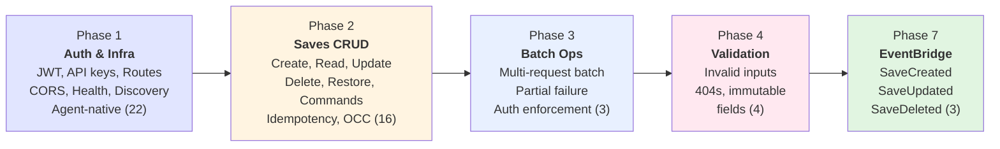
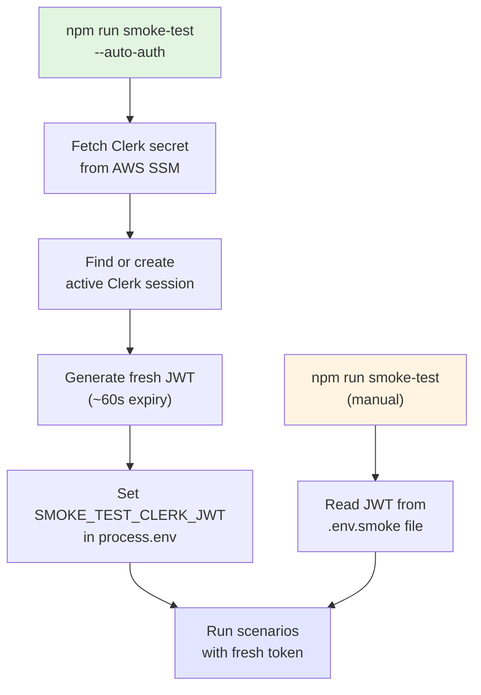

# How the Smoke Test System Works

> What the deployed-environment smoke test does, what it validates,
> and how it catches problems that unit tests cannot.
>
> **Date:** 2026-02-25 | **Audience:** Project managers, developers
> **See also:** [Architecture](smoke-test-architecture.md) | [User Guide](smoke-test-guide.md)

---

## 1. What the Smoke Test Does

The smoke test validates the real deployed environment end-to-end. It calls the actual API Gateway, which triggers real Lambda functions, which read and write real DynamoDB tables, and publish real EventBridge events. It catches an entire category of failures that unit tests and CDK synth cannot: misconfigured IAM permissions, missing environment variables, broken API Gateway integrations, CORS misconfigurations, and silent EventBridge delivery failures.

**Key outcomes:**

- Validates that every route in the API is reachable and correctly wired
- Confirms both JWT and API key authentication work against the real Clerk authorizer
- Exercises the full saves CRUD lifecycle (create, read, list, update, delete, restore)
- Verifies EventBridge events actually arrive in CloudWatch Logs
- Produces a summary table showing pass/fail/skip status for every scenario

---

## 2. The Five Phases

The smoke test organizes 48 scenarios into 5 active phases. Each phase tests a distinct layer of the deployed system, and phases execute sequentially so that foundational checks (auth works, routes exist) complete before business logic checks (saves CRUD, batch operations, event delivery).



### 2.1 Phase 1: Infrastructure and Authentication (22 scenarios)

Phase 1 answers the most fundamental question: can the API be reached, and does authentication work? It validates JWT tokens (valid, malformed, missing, expired), API key lifecycle (create, use, revoke, invalid), route connectivity for every entry in the route registry, CORS preflight headers on all routes, user profile CRUD, rate limiting behavior, health/readiness probes, action discoverability, agent-native response envelopes, scope enforcement, rate limit header transparency, and agent identity headers.

If Phase 1 fails, there is no point running later phases -- the infrastructure itself is broken.

### 2.2 Phase 2: Saves CRUD Lifecycle (16 scenarios)

Phase 2 exercises the primary business operation: saving and managing content. It creates a save with a unique URL, reads it back, verifies it appears in the list, updates its title, soft-deletes it, confirms deletion returns 404, restores it, and verifies the title persisted through the delete/restore cycle. It also validates command endpoints (update-metadata, event history, profile update, API key revocation) and agent-native behaviors (idempotency, optimistic concurrency, precondition enforcement, cursor pagination).

This phase tests the full DynamoDB read/write path including TransactWriteItems for soft-delete and restore operations.

### 2.3 Phase 3: Batch Operations (3 scenarios)

Phase 3 validates the batch endpoint that allows multiple API operations in a single request. It tests successful batch execution, partial failure handling (one operation succeeds while another fails), and authentication enforcement on the batch endpoint.

### 2.4 Phase 4: Saves Validation Errors (4 scenarios)

Phase 4 verifies that the API rejects invalid input correctly. It sends malformed URLs, invalid ULID path parameters, requests for nonexistent resources, and attempts to mutate immutable fields. Each scenario validates that the error response follows the ADR-008 standard error shape.

### 2.5 Phase 7: EventBridge Verification (3 scenarios)

Phase 7 is the most technically complex. After creating, updating, and deleting saves, it queries CloudWatch Logs to verify that the corresponding EventBridge events (SaveCreated, SaveUpdated, SaveDeleted) were actually delivered. This catches a class of silent failures -- events that never arrive due to missing IAM permissions, wrong bus names, or broken rule targets -- that no other test can detect.

---

## 3. What It Catches That Unit Tests Cannot

Unit tests validate code logic in isolation. The smoke test validates the integration between all deployed components. Here are specific failure modes that only the smoke test detects:

| Failure Mode                             | Why Unit Tests Miss It                                                   |
| ---------------------------------------- | ------------------------------------------------------------------------ |
| IAM permission missing on Lambda         | Unit tests mock the SDK; permissions are a deploy-time concern           |
| API Gateway route not wired to Lambda    | CDK synth validates syntax, not whether the route actually resolves      |
| CORS headers missing on a route          | CORS is configured at the API Gateway level, not in Lambda code          |
| Environment variable missing in Lambda   | Unit tests set their own env vars; deployed Lambda has different config  |
| EventBridge event never delivered        | Unit tests mock PutEvents; the real call may fail silently               |
| Clerk authorizer rejecting valid JWTs    | Unit tests mock auth; the real authorizer depends on Clerk configuration |
| DynamoDB GSI eventually consistent delay | Unit tests use synchronous mocks; real GSIs have propagation delay       |
| Rate limiter configuration               | Unit tests cannot test WAF rate limiting rules                           |

---

## 4. Authentication

The smoke test supports two authentication modes: auto-auth (recommended) and manual JWT.

**Auto-auth** fetches a fresh Clerk JWT programmatically at startup. It reads the Clerk secret key from AWS SSM Parameter Store, creates or reuses an active Clerk session for the configured test user, and generates a JWT with approximately 60 seconds of validity. This eliminates the manual token copy-paste workflow that breaks every 60 seconds.

**Manual JWT** requires you to sign into the deployed frontend, extract the JWT from browser DevTools, and paste it into the environment file. This is fragile because Clerk JWTs expire quickly, but it works without AWS credentials.



---

## 5. Scenario Results

After all scenarios execute, the runner prints a results table with the status of every scenario.

Each scenario results in one of three outcomes:

- **PASS** -- The scenario ran and all assertions succeeded.
- **FAIL** -- The scenario ran and at least one assertion failed. The error message appears below the row.
- **SKIP** -- The scenario was intentionally skipped, either because an optional environment variable was not set (e.g., expired JWT for AC4) or because the user added it to the skip list.

The exit code is 0 if all scenarios pass, 1 if any fail. Skips do not count as failures. This makes the smoke test suitable for CI pipelines where a nonzero exit code blocks deployment.

A typical results table looks like this:

```
 ID     | Scenario                                          | Status | HTTP |    ms
────────┼───────────────────────────────────────────────────┼────────┼──────┼─────────
 AC1    | Valid JWT → GET /users/me → 200 + profile shape   | ✅ PASS |  200 |    342
 AC2    | Malformed JWT → 401 UNAUTHORIZED                  | ✅ PASS |  401 |    128
 ...
 AC14   | 11 rapid requests → at least one 429              | ⏭  SKIP |    — |      —
         ↳ SMOKE_TEST_RATE_LIMIT_JWT not set
 SC1    | POST /saves — create → 201 + save shape           | ✅ PASS |  201 |    567
 ...
────────┼───────────────────────────────────────────────────┼────────┼──────┼─────────

  46/48 scenarios passed  (0 failed, 2 skipped)  60725ms total
```

---

## 6. Cleanup and Safety

The smoke test creates real resources in the deployed environment (saves, API keys). Every phase that creates resources registers cleanup callbacks that delete them after the run completes, regardless of whether scenarios pass or fail. Cleanups execute in reverse order in a `finally` block, so even a crash mid-run leaves the environment clean.

Cleanup errors are non-fatal -- if a delete call fails (e.g., the resource was already cleaned up by a scenario), the runner logs nothing and continues.

---

## 7. Design Decisions

Three design decisions shape how the smoke test works and why.

**Sequential execution, not parallel.** Scenarios within a phase run sequentially because later scenarios depend on state created by earlier ones. SC2 (read save) depends on SC1 (create save). EB2 (verify update event) depends on EB1 (create save). Running them in parallel would require independent setup for each scenario, increasing test duration and API load.

**Phase gaps are intentional.** Phases 5 and 6 are reserved for future test categories (e.g., Phase 5 for admin endpoints, Phase 6 for multi-user scenarios). The numbering leaves room to insert phases without renumbering existing ones, which would break `--phase=N` commands in CI scripts and developer muscle memory.

**Graceful skipping over hard failure.** When an optional environment variable is missing (expired JWT, rate limit JWT, EventBridge log group), the scenario throws `ScenarioSkipped` instead of failing. This means a developer can run the full suite without configuring every optional variable and still see a clean pass for the scenarios that ran.

---

## 8. What a Typical Run Looks Like

A complete smoke test run against the dev environment typically executes 48 scenarios across 5 phases in 30-60 seconds. Most of the time is spent on Phase 7 (EventBridge verification), where CloudWatch Logs polling waits up to 30 seconds for events to appear.

| Metric                            | Typical Value                            |
| --------------------------------- | ---------------------------------------- |
| Total scenarios                   | 48                                       |
| Scenarios run (with all env vars) | 46-48                                    |
| Common skips                      | AC4 (expired JWT), AC14 (rate limit JWT) |
| Total duration                    | 30-60 seconds                            |
| Phase 1 duration                  | 5-12 seconds                             |
| Phase 2 duration                  | 5-10 seconds                             |
| Phase 7 duration                  | 10-30 seconds (CloudWatch polling)       |

---

## 9. When to Run the Smoke Test

| Scenario                                     | Run Smoke Test?                                   |
| -------------------------------------------- | ------------------------------------------------- |
| After deploying infrastructure changes (CDK) | Yes -- validates IAM, routes, integrations        |
| After deploying new Lambda code              | Yes -- validates env vars, permissions, wiring    |
| After changing Clerk configuration           | Yes -- validates authorizer behavior              |
| After changing EventBridge rules             | Yes, with `--phase=7` -- validates event delivery |
| During local development (no deploy)         | No -- use `npm test` for unit/integration tests   |
| In CI after a deploy step                    | Yes -- gate deployments on smoke pass             |

---

## Further Reading

- **[Architecture](smoke-test-architecture.md)** -- Technical deep-dive into the runner design, client architecture, assertion helpers, CloudWatch polling, and the Lambda context thawing pattern. For engineers who want to understand or extend the system.
- **[User Guide](smoke-test-guide.md)** -- Practical instructions for running the smoke test, configuring environment variables, adding new scenarios, and troubleshooting failures.
