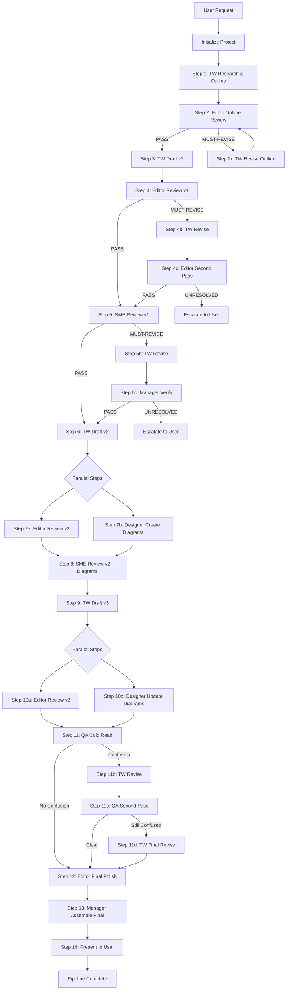

# Tech Writing Pipeline

**Multi-agent documentation system with evidence-based review and systematic quality gates**

[]() []()

---

## What This Is

The Tech Writing Pipeline is a **standalone multi-agent system** that produces publication-quality technical documentation through systematic collaboration between specialized AI agents. It transforms a simple request like "Write a User Guide for the Auto Epic Command" into a polished, technically accurate document with diagrams, through a structured 14-step workflow.

### Why It Matters

- **Multi-agent collaboration**: Six specialized agents (Tech Writer, Editor, SME, Designer, QA Reader, Manager) work together, each with distinct expertise
- **Evidence-based review**: All technical findings require verification with file paths, command outputs, or documentation URLs
- **Systematic quality gates**: MUST items block progress; everything else is guidance or polish
- **File-based architecture**: Every draft, review, and revision is a versioned artifact in git—fully observable and reproducible
- **Exportable to any project**: Self-contained design with no external dependencies beyond Claude Code

### Pipeline Flow at a Glance


---

## Quick Start

### Prerequisites

- **Claude Code CLI** installed and configured
- Access to your project codebase
- Basic familiarity with markdown and git

### Installation

No installation needed—the pipeline already exists in `docs/writing-pipeline/`. The hooks are configured in `.claude/hooks/`.

### Your First Pipeline Run

```bash
/doc-pipeline "Write a User Guide for the Auto Epic Command"
```

**What happens:**

1. Pipeline creates project directory: `docs/writing-pipeline/projects/auto-epic-user-guide/`
2. Tech Writer researches the command and creates outline
3. Editor reviews outline structure (gate: PASS/MUST-REVISE)
4. Tech Writer produces Draft v1
5. Editor reviews Draft v1 → SME verifies technical accuracy → Tech Writer creates Draft v2 with diagram suggestions
6. Designer creates diagrams while Editor reviews Draft v2 (parallel)
7. SME validates Draft v2 + diagrams → Tech Writer produces Draft v3
8. Editor reviews Draft v3 while Designer updates diagrams (parallel)
9. QA Reader performs cold-read comprehension test
10. Editor does final comprehensive review and polish
11. Manager assembles final document with diagrams inline
12. Final output: `21-final-with-diagrams.md`

**Expected duration:** 15-30 minutes for a 1000-word guide (varies with complexity)

**First-time tips:**

- Start with a simple, well-scoped task (user guide, explainer, tutorial)
- Specify your target audience clearly ("senior developers", "beginners", "DevOps engineers")
- Review the final output in `projects/{project-slug}/21-final-with-diagrams.md`
- Check `state.yaml` to see pipeline progression and gate decisions

---

## How It Works

### Architecture Overview

The pipeline is a **multi-agent system** where specialized agents collaborate through file-based communication. No conversation state passes between agents—everything happens through markdown files on disk.

#### Agent Roles

**Tech Writer** — Content Producer
- Researches topics using codebase, docs, and web
- Creates structural outlines
- Produces all draft versions (v1, v2, v3)
- Addresses review feedback in revisions
- Suggests diagram concepts

**Editor** — Quality Authority
- Reviews outlines for structural soundness
- Reviews drafts for style compliance and clarity
- Categorizes feedback as MUST/SHOULD/MINOR
- Makes inline edits on second pass (convergence mechanism)
- Performs final comprehensive review

**SME (Subject Matter Expert)** — Technical Accuracy Verifier
- Performs independent research from original goal (not anchored to draft)
- Verifies factual claims with evidence
- Flags hyperbole, unsubstantiated claims, overstatements
- Reviews diagrams for technical correctness
- Conservative judgment bias (only claim what's provable)

**Designer** — Diagram Creator
- Creates mermaid diagrams from Tech Writer's suggestions
- Updates diagrams based on SME feedback
- Enforces complexity limits (max 9 nodes per diagram)
- Auto-decomposes complex diagrams into overview + detail

**QA Reader** — Cold Reader
- Reads draft with zero context (intentional blank slate)
- Identifies confusion points where comprehension broke down
- Self-assesses severity: "Could not proceed" | "Recovered with effort" | "Minor friction"
- Provides specific location and suggested fix

**Manager (You)** — Pipeline Orchestrator
- Reads `manager.md` and executes state machine
- Spawns subagents with correct prompts and inputs
- Evaluates gates and makes PASS/MUST-REVISE decisions
- Enforces convergence limits (max 2 per gate, max 5 global)
- Handles parallel execution and escalations

#### Three Guides

**Style Guide** (`guides/style-guide.md`)
- Voice, tone, structure, formatting rules
- `[MUST]`, `[SHOULD]`, `[MINOR]` enforcement levels
- Loaded by: Tech Writer, Editor

**Review Taxonomy** (`guides/review-taxonomy.md`)
- Three-tier severity classification (MUST/SHOULD/MINOR)
- Evidence requirements for each tier
- Outsider test for severity integrity
- Loaded by: All review agents (Editor, SME, Tech Writer, QA Reader context)

**Diagram Guide** (`guides/diagram-guide.md`)
- Mermaid diagram standards and complexity limits
- Max 9 nodes per diagram (target: 5-7)
- Per-type limits (flowchart, sequence, state, ER, block)
- Mandatory decomposition rules
- Loaded by: Designer

---

### Pipeline Flow (7 Phases, 14+ Steps)

#### Phase 1: Foundation

**Step 1: Tech Writer → Research + Outline**
- Researches topic using codebase, docs, web sources
- Creates structural outline
- Output: `01-research.md` + `02-outline.md`

**Step 2: Editor → Outline Review**
- Validates outline structure against style guide
- Categorizes feedback as MUST/SHOULD/MINOR
- Gate: PASS → Step 3 | MUST-REVISE → revision loop (max 2 rounds)
- Output: `03-outline-review.md`

---

#### Phase 2: First Draft

**Step 3: Tech Writer → Draft v1**
- Produces first complete draft from outline + editor feedback
- Output: `04-draft-v1.md`

**Step 4: Editor → Review Draft v1**
- Reviews for style compliance, clarity, structure
- Gate: PASS → Step 5 | MUST-REVISE → Step 4b
- Output: `05-editorial-review-v1.md`

**Step 4b (conditional): Tech Writer → Revise**
- Addresses MUST items from editorial review
- Output: `06-draft-v1r1.md`

**Step 4c (conditional): Editor → Second Pass**
- Makes inline edits (Task C) instead of review loop
- Output: Corrected draft (no review doc if zero MUSTs remain) | Escalate if MUSTs persist
- Convergence limit: max 2 rounds at this gate

---

#### Phase 3: Technical Depth

**Step 5: SME → Technical Review (Fresh Research)**
- Performs independent research from original goal
- Verifies factual claims with evidence (file paths, command output, doc URLs)
- Reviews for accuracy, not style
- Gate: PASS → Step 6 | MUST-REVISE → Step 5b
- Output: `07-sme-review-v1.md`

**Step 5b (conditional): Tech Writer → Revise**
- Addresses SME MUST items specifically
- Output: `06-draft-v1r2.md` (revision of v1)

**Step 5c (conditional): Manager → Verification**
- Manager spot-checks SME MUST items resolved (no SME re-spawn)
- PASS → Step 6 | Unresolved → Escalate

**Step 6: Tech Writer → Draft v2 + Diagram Suggestions**
- Produces second draft incorporating SME feedback
- Adds "Diagram Suggestions" section for Designer
- Output: `08-draft-v2.md`

---

#### Phase 4: Technical Validation (PARALLEL)

**Step 7a: Editor → Review Draft v2** (parallel with 7b)
- Reviews for style, clarity, structure
- Gate: PASS → Step 8 | MUST-REVISE → addressed in Step 9
- Output: `09-editorial-review-v2.md`

**Step 7b: Designer → Create Diagrams** (parallel with 7a)
- Creates mermaid diagrams from suggestions in Draft v2
- Enforces complexity limits (max 9 nodes)
- Auto-decomposes if too complex
- Output: `10-diagrams-v1.md`

**Step 8: SME → Review Draft v2 + Diagrams**
- Reviews Draft v2 for technical accuracy
- Reviews diagrams for correctness
- Gate: PASS → Step 9 | MUST-REVISE → addressed in Step 9
- Output: `11-sme-review-v2.md`

---

#### Phase 5: Polish (PARALLEL)

**Step 9: Tech Writer → Draft v3**
- Incorporates SME + Editor feedback from Steps 7a and 8
- Addresses all MUST items
- Output: `12-draft-v3.md`

**Step 10a: Editor → Review Draft v3** (parallel with 10b)
- Reviews for final style, clarity, structure
- Gate: PASS → Step 11 | MUST-REVISE → addressed before Step 12
- Output: `13-editorial-review-v3.md`

**Step 10b: Designer → Update Diagrams** (parallel with 10a)
- Updates diagrams based on SME feedback
- Corrects MUST items, addresses SHOULD items
- Output: `14-diagrams-v2.md`

---

#### Phase 6: QA Validation

**Step 11: QA Reader → Cold Read**
- Reads Draft v3 with zero prior context
- Documents confusion points with severity self-assessment
- Gate: Zero confusion → Step 12 | "Could not proceed" → Step 11b | Other severities → Step 12
- Output: `15-qa-read-v1.md`

**Step 11b (conditional): Tech Writer → Revise**
- Addresses "Could not proceed" confusion points
- Output: `16-draft-v3r1.md`

**Step 11c (conditional): QA Reader → Second Pass**
- Re-reads revised draft
- Gate: Zero confusion → Step 12 | Persistent issues → Step 11d
- Output: `17-qa-read-v2.md`

**Step 11d (conditional): Tech Writer → Final Revise**
- Last chance to address confusion points before escalation
- Output: `18-draft-v3r2.md`
- After this step: advance to Step 12 regardless (present remaining issues as informational)

---

#### Phase 7: Final

**Step 12: Editor → Final Comprehensive Review + Polish**
- Reviews latest draft comprehensively
- Makes all inline edits for final polish
- Output: `19-final-review.md` + `20-final.md`

**Step 13: Manager → Assemble Final with Diagrams**
- Reads `20-final.md` and latest diagrams
- Inserts diagrams at placement notes (after section headings)
- Output: `21-final-with-diagrams.md`

**Step 14: Present to User**
- Shows final document path
- Summarizes pipeline execution (steps, revision rounds, escalations)
- Lists any remaining informational notes

---

### Visual: Complete Pipeline Flow



---

### Key Principles

#### 1. File-Based Communication

All agents communicate exclusively via markdown files:
- Every draft, review, revision is a versioned artifact
- Full git history of pipeline progression
- No conversation state passes between agents
- Each artifact is immutable (revisions create new files)

Example artifact sequence for Step 4 gate with revision:
- `04-draft-v1.md` (Tech Writer produces Draft v1)
- `05-editorial-review-v1.md` (Editor reviews, finds MUST items)
- `06-draft-v1r1.md` (Tech Writer revises to address MUSTs)
- Editor second-pass produces corrected draft or escalates

#### 2. Fresh Context Per Agent

Each subagent spawns with clean context:
- Must read required guides before producing output
- Reads input artifacts from previous steps
- Writes output to numbered artifact file
- No memory of previous agent conversations

This prevents context pollution and ensures each agent applies its expertise freshly.

#### 3. Gate-Driven Advancement

**MUST items block progress** — factual errors, missing critical info, comprehension blockers, security issues

**SHOULD items** improve quality but don't block — clarity improvements, structural fixes, consistency issues

**MINOR items** never block — polish, word choice, optional examples

**Convergence limits prevent infinite loops:**
- Max 2 revision rounds per gate
- Max 5 revision rounds globally across pipeline
- Max 3 draft versions (v1, v2, v3 — no v4)

#### 4. Evidence-Based Review

All MUST findings require evidence:
- File path with line number: `File: backend/auth.ts:47`
- Command output: `Command: npm test → Output: FAIL`
- Documentation URL: `Doc: [AWS Lambda Docs](https://...)`
- API response: `API: /users/123 → Response: {"error": "not found"}`

SHOULD findings strongly encouraged to have evidence (not mandatory but increases quality).

SME performs independent research (not anchored to draft claims) to verify accuracy.

#### 5. Parallel Execution

**Steps 7a+7b (parallel):** Editor reviews Draft v2 while Designer creates diagrams — no dependency between them

**Steps 10a+10b (parallel):** Editor reviews Draft v3 while Designer updates diagrams — same principle

Manager spawns both agents in a single message with multiple Task tool calls for efficiency.

#### 6. Convergence Enforcement

**Max 2 rounds per gate:** After 2 revision attempts at same gate, escalate to user

**Second-pass editor:** Uses Task C (inline edits) instead of review loop — produces corrected draft directly if no unresolved MUSTs

**Global limit:** Max 5 revision rounds total across pipeline — prevents excessive back-and-forth

**Escalation format:** Shows specific disagreement, revision attempts, continued objection, and requests user decision

---

## Usage Guide

### Basic Usage

```bash
/doc-pipeline "Write a Getting Started Guide for New Contributors"
```

**What the pipeline does:**

1. Creates project directory: `docs/writing-pipeline/projects/getting-started-guide-for-new-contributors/`
2. Initializes `state.yaml` with step tracking
3. Creates `00-request.md` with task definition
4. Executes 14-step workflow with quality gates
5. Produces final output: `21-final-with-diagrams.md`

### Advanced Usage

#### Specify Target Audience

```bash
/doc-pipeline "Write an API Reference for the DynamoDB Helper Functions (audience: senior backend developers)"
```

Including audience in the request ensures the Tech Writer and QA Reader calibrate appropriately.

#### Specify Document Type

```bash
/doc-pipeline "Create a Tutorial: Building Your First Lambda Function (step-by-step tutorial for beginners)"
```

Document types: User Guide, Tutorial, API Reference, Architecture Doc, Explainer, Troubleshooting Guide

#### Complex Multi-Section Documents

```bash
/doc-pipeline "Write a comprehensive Architecture Decision Record for ADR-015: Event-Driven Architecture with EventBridge (include diagrams for event flow and integration patterns)"
```

The pipeline handles complex documents with multiple sections and technical diagrams.

---

### Document Types Supported

**User Guides** — Task-oriented, how-to-accomplish-X
- Example: "User Guide for the Auto Epic Command"
- Focus: Practical instructions for achieving a goal
- Structure: Prerequisites → Quick Start → Detailed Usage → Troubleshooting

**Tutorials** — Step-by-step learning paths
- Example: "Tutorial: Building Your First Lambda Function"
- Focus: Teaching concepts through progressive exercises
- Structure: Learning objectives → Step 1 → Step 2 → ... → Summary

**API References** — Technical specifications and usage
- Example: "API Reference for DynamoDB Helper Functions"
- Focus: Complete specification of functions, parameters, returns
- Structure: Overview → Function A → Function B → ... → Error Handling

**Architecture Docs** — System design, ADRs, technical deep-dives
- Example: "Architecture Decision Record: Event-Driven Architecture"
- Focus: Technical decisions, trade-offs, rationale
- Structure: Context → Decision → Consequences → Alternatives Considered

**Explainers** — Concept clarification, background knowledge
- Example: "Explainer: How the Multi-Agent Pipeline Works"
- Focus: Understanding concepts, not performing tasks
- Structure: What → Why → How → When to Use

**Troubleshooting Guides** — Problem diagnosis and resolution
- Example: "Troubleshooting Guide: Lambda Cold Start Issues"
- Focus: Identifying and fixing common problems
- Structure: Symptoms → Diagnosis → Solution → Prevention

---

### Understanding Pipeline Output

All artifacts live in `docs/writing-pipeline/projects/{project-slug}/`:

| File | Agent | Description |
|------|-------|-------------|
| `state.yaml` | Manager | Pipeline state (current step, revision count, gate status) |
| `00-request.md` | Manager | Original task and audience |
| `01-research.md` | Tech Writer | Research findings and background |
| `02-outline.md` | Tech Writer | Structural plan for document |
| `03-outline-review.md` | Editor | Editorial review of outline |
| `04-draft-v1.md` | Tech Writer | First complete draft |
| `05-editorial-review-v1.md` | Editor | Editorial review of Draft v1 |
| `06-draft-v1r1.md` | Tech Writer | Draft v1 revision 1 (if needed) |
| `07-sme-review-v1.md` | SME | SME technical review of Draft v1 |
| `08-draft-v2.md` | Tech Writer | Second draft with diagram suggestions |
| `09-editorial-review-v2.md` | Editor | Editorial review of Draft v2 |
| `10-diagrams-v1.md` | Designer | Initial mermaid diagrams |
| `11-sme-review-v2.md` | SME | SME review of Draft v2 + diagrams |
| `12-draft-v3.md` | Tech Writer | Third draft (polish) |
| `13-editorial-review-v3.md` | Editor | Editorial review of Draft v3 |
| `14-diagrams-v2.md` | Designer | Updated diagrams from SME feedback |
| `15-qa-read-v1.md` | QA Reader | QA cold-read feedback |
| `16-draft-v3r1.md` | Tech Writer | Draft v3 revision 1 (if needed) |
| `17-qa-read-v2.md` | QA Reader | QA second pass (if needed) |
| `18-draft-v3r2.md` | Tech Writer | Draft v3 revision 2 (if needed) |
| `19-final-review.md` | Editor | Final review notes |
| `20-final.md` | Editor | Final text (no diagrams) |
| **`21-final-with-diagrams.md`** | **Manager** | **FINAL OUTPUT (use this one)** |

**Tip:** Review `state.yaml` to see current pipeline status, step history, and revision count.


---

## Configuration

### Configuration File

All pipeline parameters live in `docs/writing-pipeline/config.yaml` (869 lines).

#### Key Configurable Parameters

**Pipeline Flow:**

```yaml
flow:
  max_draft_versions: 3 # v1, v2, v3 (no v4)
  max_sme_passes: 2 # Steps 5 and 8
  max_revision_rounds_global: 5 # Total revisions across pipeline
  max_revision_rounds_per_gate: 2 # Convergence limit per gate
```

**Document Constraints:**

```yaml
document:
  diagrams:
    max_nodes_per_diagram: 9
    target_nodes_per_diagram: [5, 6, 7]
  text:
    code_blocks:
      max_lines: 30
    overview:
      max_paragraphs: 2
  thresholds:
    qa_skip_word_count: 500 # Skip QA Reader if doc < 500 words
```

**Gate Behavior:**

```yaml
gates:
  default_behavior:
    must_items: "MUST-REVISE" # Any MUST item triggers revision
    conditional_pass: "PASS" # CONDITIONAL-PASS defaults to PASS
  convergence:
    max_rounds_per_gate: 2
    second_pass_behavior: "inline_edits"
    escalation: "user"
```

**Skip Rules:**

```yaml
skip_rules:
  - step: 11
    condition: "document_word_count < 500"
    description: "Skip QA Reader if document < 500 words after Step 9"

  - step: "7b"
    condition: "diagram_suggestions_count == 0"
    description: "Skip Designer if no diagram suggestions in Draft v2"
```

### Modifying Configuration

**To modify configuration:** Edit `config.yaml` directly. Changes take effect on next pipeline run.

**⚠️ Warning:** The config file is currently **descriptive** (documents behavior) rather than **prescriptive** (drives behavior). Agent definitions and `manager.md` contain the actual logic. Future versions may implement config-driven behavior.

---

## Guides and Standards

### Style Guide (`guides/style-guide.md`)

The Style Guide is the **editorial authority** for all writing. It defines:

**Voice and Tone:**
- Second person ("you") for instructions
- Active voice for clarity
- Present tense for procedures

**Structure Rules:**
- Task-based sections before reference material
- Prerequisites before procedures
- "What you'll do" orientation at section starts

**Formatting:**
- Heading hierarchy (H1 → H2 → H3, no H4+)
- Code block conventions (language tags, max 30 lines)
- List vs prose thresholds

**Naming:**
- Commands: backticks + exact syntax
- UI elements: bold for buttons, italic for labels
- Config values: code format

**Length Constraints:**
- Max paragraph length: 4 sentences (conceptual), 2 sentences (procedural)
- Max section before splitting: 40 lines (H2), 25 lines (H3)

**Prohibited Patterns:**
- Marketing language ("revolutionary", "cutting-edge")
- Passive voice for instructions
- Hedging without purpose ("may", "might", "could" without rationale)

**Enforcement Levels:**
- `[MUST]` rules — violations block gates
- `[SHOULD]` rules — violations expected to be fixed
- `[MINOR]` rules — polish only

**Who loads this:** Tech Writer (enforcement), Editor (enforcement), SME (reference only)

---

### Review Taxonomy (`guides/review-taxonomy.md`)

Defines the **3-tier severity classification** for all review feedback.

#### MUST

**Definition:** Factually wrong, misleading, blocks comprehension, violates `[MUST]` style rules

**Requires evidence:** YES (file path, command output, doc URL)

**Blocks gate:** YES

**Examples:**
- Factual errors: "Command `git push` downloads code" (wrong—it uploads)
- Missing critical information: Tutorial omits required prerequisite
- Comprehension blockers: Ambiguity that changes reader's action
- Security issues: Credential exposure risk, data loss instructions
- Diagram inaccuracies: Wrong arrow direction, missing critical node

#### SHOULD

**Definition:** Improves clarity significantly, fixes structural issues, addresses ambiguity

**Requires evidence:** Strongly encouraged (not mandatory)

**Blocks gate:** NO (but requires justification if declined)

**Examples:**
- Clarity improvements: Dense paragraph → bullet list conversion
- Structural improvements: Prerequisite buried mid-procedure
- Consistency fixes: Same concept called different names
- Tone/voice issues: Marketing language in technical guide
- Missing context: Why-explanation for non-obvious step

#### MINOR

**Definition:** Polish, word choice, optional improvements

**Requires evidence:** Optional

**Blocks gate:** NO

**Examples:**
- Preference-level style: "use" vs "utilize" (both correct)
- Word choice alternatives: "click" vs "select"
- Optional examples: Illustrative but not needed for understanding
- Minor formatting: Extra whitespace, bullet style choice
- Reordering non-sequential lists

---

### Severity Defaults

**Between MUST and SHOULD:** Default to SHOULD unless reader harm plausible

**Between SHOULD and MINOR:** Default to SHOULD (asymmetric safety—cost of addressing SHOULD is low; cost of shipping unclear content is high)

**Outsider test:** "Would someone not familiar with the draft agree with this severity based on reader impact?"

---

### Diagram Guide (`guides/diagram-guide.md`)

Defines **mermaid diagram standards** and complexity limits.

**Max 9 nodes per diagram** (target: 5-7) — approximates Miller's Law (7±2 items in working memory)

**Mandatory decomposition:** If >9 nodes, create overview + detail diagrams

**Per-Type Limits:**

| Diagram Type | Max Nodes | Additional Limits |
|--------------|-----------|-------------------|
| Flowchart | 9 | Max 3 decision diamonds |
| Sequence | 5 participants | Max 12 messages |
| State | 9 states | Max 2 nesting levels |
| ER | 7 entities | Max 12 relationships |
| Block/C4 | 9 blocks | Max 3 nesting levels |

**Caption Requirements:**
- Every diagram MUST have a caption
- Max 15 words per caption
- Target: 8-12 words
- Format: Italic text on line immediately before mermaid code block

**Decomposition Strategy:**
1. Create overview diagram (5-7 high-level nodes)
2. Create detail diagrams per subsystem (≤9 nodes each)
3. Use consistent naming across overview and detail
4. Mark external references in detail diagrams

**When to use diagrams:**
- Flowchart: Decision logic, process flows, algorithms
- Sequence: API interactions, authentication flows, request/response patterns
- State: Lifecycle management, workflow states, UI navigation
- ER: Database schema, data relationships
- Block/C4: System architecture, service dependencies, component structure

**Who loads this:** Designer (primary), Editor (validation)

---

## Agent Roles

### Tech Writer

**Role:** Content Producer

**Responsibilities:**
- Research topic using codebase, docs, and web sources
- Create structural outline
- Produce all draft versions (v1, v2, v3)
- Address review feedback in revisions
- Suggest diagram concepts for Designer (in v2+)

**Loaded Guides:**
- `style-guide.md` (enforcement)
- `review-taxonomy.md` (severity handling)
- Project request (`00-request.md`)
- Previous reviews and drafts

**Handling Rules:**
- **MUST items:** Required—address every MUST item or apply alternative fix that resolves the issue
- **SHOULD items:** Expected—address unless clear reason not to (requires justification if declined)
- **MINOR items:** Optional—address at discretion (no response needed if skipped)

**Key Constraint:** Must address all MUST items, should address SHOULD items (with justification if declined).

---

### Editor

**Role:** Quality Authority

**Responsibilities:**
- Review outlines for structural soundness
- Review drafts for style compliance, clarity, structure
- Categorize feedback as MUST/SHOULD/MINOR
- Make inline edits on second pass (Task C) instead of feedback loop
- Perform final comprehensive review and polish

**Loaded Guides:**
- `style-guide.md` (enforcement, fresh read every time)
- `review-taxonomy.md` (severity framework)
- `diagram-guide.md` (diagram conformance)
- Project request (`00-request.md`)

**Second-Pass Behavior (Task C):**
- Mode: Inline edits
- Produces: Corrected draft directly (no review loop)
- Condition: Only if no unresolved MUST items
- If MUSTs persist: Escalate to user

**Key Constraint:** Must separate accuracy (SME's job) from style/clarity (Editor's job). Editor does not verify technical claims.

---

### SME (Subject Matter Expert)

**Role:** Technical Accuracy Verifier

**Responsibilities:**
- Perform **independent research** from original goal (not anchored to draft)
- Verify factual claims with evidence
- Flag hyperbole, unsubstantiated claims, overstatements
- Review diagrams for technical accuracy
- Conservative judgment bias (only claim what's provable)

**Loaded Guides:**
- `review-taxonomy.md` (primary framework)
- `style-guide.md` (reference only, not enforcement)
- Project request (`00-request.md`)
- Planning artifacts (PRD, Architecture, Epics) if available

**Evidence Requirements:**
- **Every MUST finding REQUIRES evidence field:** File path:line, command output, doc URL, API response
- **SHOULD findings:** Evidence strongly encouraged
- **Unverifiable claims:** Classify as SHOULD with `[UNVERIFIED]` label; state what's needed to verify
- **Safety claims:** Classify as MUST even when unverified (data loss, credentials, destructive ops)

**Key Constraint:** SME does NOT review for style/structure unless it causes technical misunderstanding. Focus is accuracy only.

---

### Designer

**Role:** Diagram Creator

**Responsibilities:**
- Create mermaid diagrams from Tech Writer's suggestions
- Update diagrams based on SME feedback
- Enforce complexity limits (max 9 nodes)
- Auto-decompose into overview + detail if too complex

**Loaded Guides:**
- `diagram-guide.md` (primary standard)
- Project request (`00-request.md`)
- Draft v2's "Diagram Suggestions" section
- SME review diagram items

**Handling Rules:**
- **MUST items:** Required—diagram must be corrected exactly as specified
- **SHOULD items:** Expected—improve or explain why current version is preferred
- **MINOR items:** Optional

**Key Constraint:** Diagrams must conform to guide limits. MUST items from SME are corrected exactly. No creative license with MUST items.

---

### QA Reader

**Role:** Cold Reader

**Responsibilities:**
- Read draft with **zero context** (intentional blank slate)
- Identify confusion points where comprehension broke down
- Self-assess severity: "Could not proceed" | "Recovered with effort" | "Minor friction"
- Provide specific location and suggested fix

**Loaded Guides:**
- **NONE** (intentionally zero context)

**Allowed Context:**
- `00-request.md` (audience profile ONLY—no guides, no previous reviews, no explanations)

**Output Format:**
Each confusion point documented as:
```
### Confusion Point: "Section Title" — Short description
**What I was trying to understand:** ...
**Where I got confused:** ...
**What I thought it meant:** ...
**What would have helped:** ...
**Severity self-assessment:** Could not proceed | Recovered with effort | Minor friction
```

**Gate Behavior:**
- **"Could not proceed"** → Blocks gate, triggers revision
- **"Recovered with effort"** → Does not block (SHOULD-equivalent)
- **"Minor friction"** → Does not block (MINOR-equivalent)

**Key Constraint:** Only "Could not proceed" severity blocks gates. Everything else is informational.

---

### Manager (You)

**Role:** Pipeline Orchestrator

**Responsibilities:**
- Read `manager.md` and execute state machine
- Spawn subagents with correct prompts and inputs
- Read output artifacts and evaluate gates
- Make PASS/MUST-REVISE decisions based on review summaries
- Enforce convergence limits (max 2 per gate, max 5 global)
- Handle parallel execution (7a+7b, 10a+10b)
- Escalate to user when limits reached or blocked

**NOT a subagent:** Manager instructions run in main Claude Code context, not as spawned agent.

**Key Decisions:**
- Parse review summaries to count MUST items
- Apply gate logic (PASS, MUST-REVISE, CONDITIONAL-PASS)
- Decide when to escalate vs continue
- Verify SME MUST items resolved without re-spawning SME (Step 5c)
- Assemble final document with diagrams inline (Step 13)


---

## Troubleshooting

### Common Issues

#### Pipeline Stuck at a Gate

**Symptom:** Pipeline loops between same two steps (e.g., 4 ↔ 4b ↔ 4c)

**Cause:** Unresolved MUST items after max 2 revision rounds

**Solution:**
1. Read the latest review artifact (e.g., `05-editorial-review-v1.md`)
2. Read the latest draft (e.g., `06-draft-v1r1.md`)
3. Identify specific MUST items still unresolved
4. User intervention: decide whether to accept draft as-is or provide explicit guidance to Tech Writer on how to resolve
5. Manager can override gate decision and advance if user approves

---

#### Hook Blocks Write Operation

**Symptom:** Error: "Write denied by pipeline-guard hook"

**Cause:** One of four guardrails triggered:

1. **Infrastructure protection** — attempted write to `guides/`, `agents/`, `tasks/`, `templates/`, `config.yaml`, `README.md`
2. **Artifact immutability** — attempted overwrite of previous artifact
3. **Naming validation** — filename doesn't match expected pattern
4. **Guide loading verification** — agent hasn't read required guides

**Solution:**
1. Check error message for specific reason
2. **If guide loading:** Ensure agent reads required guides before writing output (Manager must provide guide paths in subagent prompt)
3. **If immutability:** Create new numbered file instead of overwriting (e.g., `06-draft-v1r1.md` not `04-draft-v1.md`)
4. **If infrastructure:** Don't modify pipeline files during runs (only modify artifacts in project directory)
5. **If naming:** Use expected pattern: `{NN}-{artifact-type}-{version}.md`

---

#### QA Reader Flags Many Confusion Points

**Symptom:** Step 11 produces long list of confusion points

**Cause:** Draft may be too technical, assumes too much knowledge, or lacks definitions

**Solution:**
1. Review audience profile in `00-request.md` — is it accurate?
2. Tech Writer applies "audience-plausibility filter": Would target audience actually be confused?
3. Address "Could not proceed" points (blocking)
4. Optionally address "Recovered with effort" points (not blocking but improves quality)
5. If QA Reader seems miscalibrated (flags things the audience would know), consider skipping Step 11c/11d and escalating to user for decision

---

#### Diagrams Don't Appear in Final Output

**Symptom:** `21-final-with-diagrams.md` missing diagrams or has placeholder text

**Cause:** Step 13 (Manager assembles final) didn't merge diagrams correctly

**Solution:**
1. Check if `10-diagrams-v1.md` or `14-diagrams-v2.md` exists
2. Verify diagrams use proper mermaid syntax and have placement notes (section headings)
3. Manually merge diagrams into `20-final.md` if needed
4. Report issue for Manager logic improvement (should be automated)

---

#### Pipeline Takes Too Long

**Symptom:** 14 steps taking 45+ minutes for simple document

**Cause:** Multiple revision loops, complex research, or long documents

**Solution:**
1. Check `state.yaml` to see how many revision rounds occurred
2. Review gate decisions — are MUST items overly strict?
3. Consider simplifying scope or splitting into multiple documents
4. For simple docs (<500 words), QA Reader is skipped automatically
5. If Designer was skipped (no diagrams), pipeline should be faster
6. If stuck in loops, use convergence limit escalations to advance

---

#### SME Review Fails to Load Planning Artifacts

**Symptom:** SME can't find PRD, Architecture, or Epics files

**Cause:** Paths in Manager prompt point to wrong location or files don't exist

**Solution:**
1. Check if planning artifacts exist at expected paths:
   - `_bmad-output/planning-artifacts/prd.md`
   - `_bmad-output/planning-artifacts/architecture.md`
   - `_bmad-output/planning-artifacts/epics.md`
2. Update Manager prompt for Step 5/8 to provide correct paths or omit if files don't exist
3. If artifacts don't exist, SME performs web/codebase research only (still valid)

---

### Getting Help

- **Pipeline design questions:** Read `plan.md` for full architecture rationale
- **Agent behavior questions:** Read specific agent file in `agents/{agent}.md`
- **Gate logic questions:** Read `agents/manager.md` gate decision section
- **Style questions:** Read `guides/style-guide.md`
- **Review severity questions:** Read `guides/review-taxonomy.md`
- **Diagram questions:** Read `guides/diagram-guide.md`
- **Task instructions:** Read specific task file in `tasks/{task}.md`

---

## Customization

### Modifying Agents

To change agent behavior:

1. Edit agent file in `docs/writing-pipeline/agents/{agent}.md`
2. Modify role, responsibilities, key constraints
3. Next pipeline run uses updated instructions

**Example:** Make Editor more lenient with SHOULD items:

```
Edit: docs/writing-pipeline/agents/editor.md
Add rule: "Classify as SHOULD only if clarity improvement is significant (not minor preference)"
Save and run pipeline
```

---

### Modifying Guides

To update style rules, review taxonomy, or diagram standards:

1. Edit guide file in `docs/writing-pipeline/guides/{guide}.md`
2. Add/remove/modify rules with clear `[MUST]`, `[SHOULD]`, `[MINOR]` tags
3. Agents will load updated guides on next run

**Example:** Add new prohibited pattern to Style Guide:

```
Edit: docs/writing-pipeline/guides/style-guide.md
Add under "Prohibited Patterns":
[MUST] Never use "simply" or "just" to minimize complexity
Save and run pipeline
```

---

### Modifying Tasks

To change how agents execute specific steps:

1. Edit task file in `docs/writing-pipeline/tasks/{task}.md`
2. Modify instructions, add new requirements, change output format
3. Next step using that task will follow updated instructions

**Example:** Require diagram suggestions earlier (in Draft v1 instead of v2):

```
Edit: docs/writing-pipeline/tasks/draft-v1.md
Add section: "Diagram Suggestions (if applicable)"
Save and run pipeline
```

---

### Adding New Agents

To add a custom agent (e.g., "Accessibility Reviewer"):

1. Create `docs/writing-pipeline/agents/accessibility-reviewer.md`
2. Define role, responsibilities, loaded guides, key constraints
3. Create task file: `docs/writing-pipeline/tasks/accessibility-review.md`
4. Update `agents/manager.md` state machine table to insert new step (e.g., Step 8.5 between SME review and Draft v3)
5. Update `config.yaml` to include new agent in agent configuration
6. Run pipeline — Manager will spawn new agent at appropriate step

---

### Exporting to Another Project

The pipeline is **self-contained and portable**:

1. Copy entire `docs/writing-pipeline/` directory to new project
2. Copy `.claude/hooks/pipeline-guard.cjs` and `pipeline-read-tracker.cjs`
3. Copy `.claude/commands/doc-pipeline.md`
4. Update paths in config.yaml if needed (e.g., planning artifacts location)
5. Run `/doc-pipeline` in new project

**No dependencies on AI Learning Hub** — this system works in any Claude Code project. It has no external dependencies beyond Claude Code CLI.

---

## Maintenance

### Version Control

**Commit all artifacts:** Every pipeline run produces git-trackable files

```bash
# View progression of a pipeline run
git log -- docs/writing-pipeline/projects/auto-epic-user-guide/

# Compare draft versions
git diff docs/writing-pipeline/projects/auto-epic-user-guide/04-draft-v1.md \
         docs/writing-pipeline/projects/auto-epic-user-guide/08-draft-v2.md

# Restore previous artifact version
git checkout HEAD^ -- docs/writing-pipeline/projects/auto-epic-user-guide/12-draft-v3.md
```

**Pipeline artifacts are perfect for git:**
- Small text files (markdown)
- Sequential versioning built-in
- Full audit trail of changes
- Easy to diff, rollback, or cherry-pick

---

### Pipeline Metrics

Track over time to improve:

**Revision rounds per project** — Lower is better (target: <3 globally)
- Check `state.yaml` after each run
- Count total revision steps (4b, 5b, 11b, 11d, etc.)

**Gate pass rate** — Higher is better (target: >70% first-pass)
- Track how often gates pass on first attempt
- High failure rate may indicate misaligned agents or unclear guides

**Average duration** — Track time from start to final output
- Simple guides: 15-20 minutes
- Complex references: 25-35 minutes
- Tutorial with diagrams: 30-45 minutes

**Skip rule usage** — How often QA Reader or Designer skipped
- High QA skip rate → producing short documents (good if intentional)
- High Designer skip rate → not enough diagram suggestions

**Future enhancement:** Add metrics tracking to `state.yaml`

---

### Updating the Pipeline

To update pipeline infrastructure:

1. **Before updating:** Commit all current work
   ```bash
   git add docs/writing-pipeline/
   git commit -m "snapshot: pipeline state before update"
   ```

2. **Test changes:** Run pipeline with simple task first
   ```bash
   /doc-pipeline "Write a Quick Start Guide (test run after pipeline update)"
   ```

3. **Review output:** Ensure quality hasn't degraded
   - Check final output quality
   - Review revision count
   - Verify gates worked correctly

4. **Update docs:** Keep `README.md` in sync with changes

---

### Hook Maintenance

The two hooks protect pipeline integrity:

#### `pipeline-guard.cjs` (PreToolUse on Edit|Write)

**Responsibilities:**
1. **Infrastructure protection** — Denies writes to `guides/`, `agents/`, `tasks/`, `templates/`, `config.yaml`, `README.md`
2. **Artifact immutability** — Denies overwrites of previous pipeline artifacts by reading `state.yaml`
3. **Naming validation** — Warns when a write targets a project directory with unexpected filename
4. **Guide loading verification** — Denies artifact writes if agent hasn't read required guides (uses breadcrumbs from read tracker)

**How it works:**
- Reads `state.yaml` to determine current agent and completed steps
- Checks breadcrumb file (`.claude/.pipeline-reads.json`) for guide reads
- Validates write paths against protection rules
- Returns `{"allowed": false, "reason": "..."}` if validation fails

#### `pipeline-read-tracker.cjs` (PostToolUse on Read)

**Responsibilities:**
1. Records guide reads with timestamps
2. Maintains `.claude/.pipeline-reads.json`
3. Supports guide loading verification by pipeline-guard
4. Breadcrumbs expire after 2 hours

**How it works:**
- Intercepts Read tool results
- If file is a pipeline guide, records: `{file_path, timestamp, agent}`
- Writes breadcrumbs to `.claude/.pipeline-reads.json`
- pipeline-guard reads breadcrumbs to verify compliance

**To disable hooks temporarily:** Rename `.cjs` files (not recommended in production—removes safety guarantees)

---

## Reference

### Pipeline Steps Quick Reference

| Step | Phase | Agent | Input | Output | Gate |
|------|-------|-------|-------|--------|------|
| 1 | Foundation | Tech Writer | `00-request.md` | `02-outline.md` | — |
| 2 | Foundation | Editor | `02-outline.md` | `03-outline-review.md` | ✓ |
| 3 | First Draft | Tech Writer | `02-outline.md`, `03-outline-review.md` | `04-draft-v1.md` | — |
| 4 | First Draft | Editor | `04-draft-v1.md` | `05-editorial-review-v1.md` | ✓ |
| 4b | First Draft | Tech Writer | `04-draft-v1.md`, `05-editorial-review-v1.md` | `06-draft-v1r1.md` | — |
| 5 | Tech Depth | SME | Latest draft | `07-sme-review-v1.md` | ✓ |
| 6 | Tech Depth | Tech Writer | Latest draft, `07-sme-review-v1.md` | `08-draft-v2.md` | — |
| 7a | Tech Valid. | Editor | `08-draft-v2.md` | `09-editorial-review-v2.md` | ✓ |
| 7b | Tech Valid. | Designer | `08-draft-v2.md` | `10-diagrams-v1.md` | — |
| 8 | Tech Valid. | SME | `08-draft-v2.md`, `10-diagrams-v1.md` | `11-sme-review-v2.md` | ✓ |
| 9 | Polish | Tech Writer | `08-draft-v2.md`, reviews | `12-draft-v3.md` | — |
| 10a | Polish | Editor | `12-draft-v3.md` | `13-editorial-review-v3.md` | ✓ |
| 10b | Polish | Designer | `10-diagrams-v1.md`, SME feedback | `14-diagrams-v2.md` | — |
| 11 | QA | QA Reader | `12-draft-v3.md` | `15-qa-read-v1.md` | ✓ |
| 12 | Final | Editor | Latest draft, all reviews | `20-final.md` | — |
| 13 | Final | Manager | `20-final.md`, diagrams | `21-final-with-diagrams.md` | — |
| 14 | Final | — | — | Present to user | — |

---

### Review Severity Cheat Sheet

| Severity | Blocks Gate? | Requires Evidence? | Examples |
|----------|--------------|-------------------|----------|
| **MUST** | ✅ YES | ✅ YES | Factual errors, missing critical info, comprehension blockers, security issues |
| **SHOULD** | ❌ NO | ⚠️ Strongly encouraged | Clarity improvements, structural fixes, consistency issues |
| **MINOR** | ❌ NO | ❌ NO | Polish, word choice, optional examples |

---

### Agent Context Loading

| Agent | Required Guides | Reference Guides | Other Context |
|-------|----------------|------------------|---------------|
| Tech Writer | `style-guide.md`, `review-taxonomy.md` | — | `00-request.md`, previous reviews |
| Editor | `style-guide.md`, `review-taxonomy.md`, `diagram-guide.md` | — | `00-request.md` |
| SME | `review-taxonomy.md` | `style-guide.md` | `00-request.md`, planning artifacts |
| Designer | `diagram-guide.md` | — | `00-request.md` |
| QA Reader | — | — | `00-request.md` (audience ONLY) |

---

### Configuration Limits

| Parameter | Default Value | Description |
|-----------|--------------|-------------|
| Max draft versions | 3 | v1, v2, v3 (no v4) |
| Max SME passes | 2 | Steps 5 and 8 only |
| Max revision rounds (global) | 5 | Total across pipeline |
| Max revision rounds (per gate) | 2 | Convergence limit |
| Max diagram nodes | 9 | Force decomposition if exceeded |
| Target diagram nodes | 5-7 | Sweet spot for comprehension |
| QA skip threshold | 500 words | Skip if doc < 500 words |
| Code block max lines | 30 | Prefer 10-20 lines |

---

## About

### Version

**Current Version:** 1.0.0  
**Release Date:** 2026-02-08  
**Status:** Production Ready

### Credits

**Designed for:** AI Learning Hub project  
**Architecture:** Multi-agent file-based pipeline with evidence-based review  
**Built with:** Claude Code, Claude Agent SDK, markdown, YAML, JavaScript (hooks)

### License

This pipeline is part of the AI Learning Hub project. It is **standalone and exportable** — you may copy and adapt it for your own projects.

### Contributing

To improve this pipeline:

1. Open an issue describing the enhancement
2. Propose changes to agents, guides, or tasks
3. Test changes with real documents
4. Submit PR with updated documentation

---

## Success Checklist

Use this pipeline confidently when:

✅ You need publication-quality technical documentation  
✅ Technical accuracy is critical (SME verification required)  
✅ Multiple review perspectives improve quality (style, accuracy, comprehension)  
✅ You want full audit trail of drafts and revisions  
✅ You need diagrams that follow complexity standards  
✅ You value systematic gates over ad-hoc review

**This README is your definitive guide.** Bookmark it, reference it, extend it. The pipeline is yours to use and adapt.

**Ready to create great documentation? Run `/doc-pipeline "Your Task Here"` and let the agents collaborate.**
