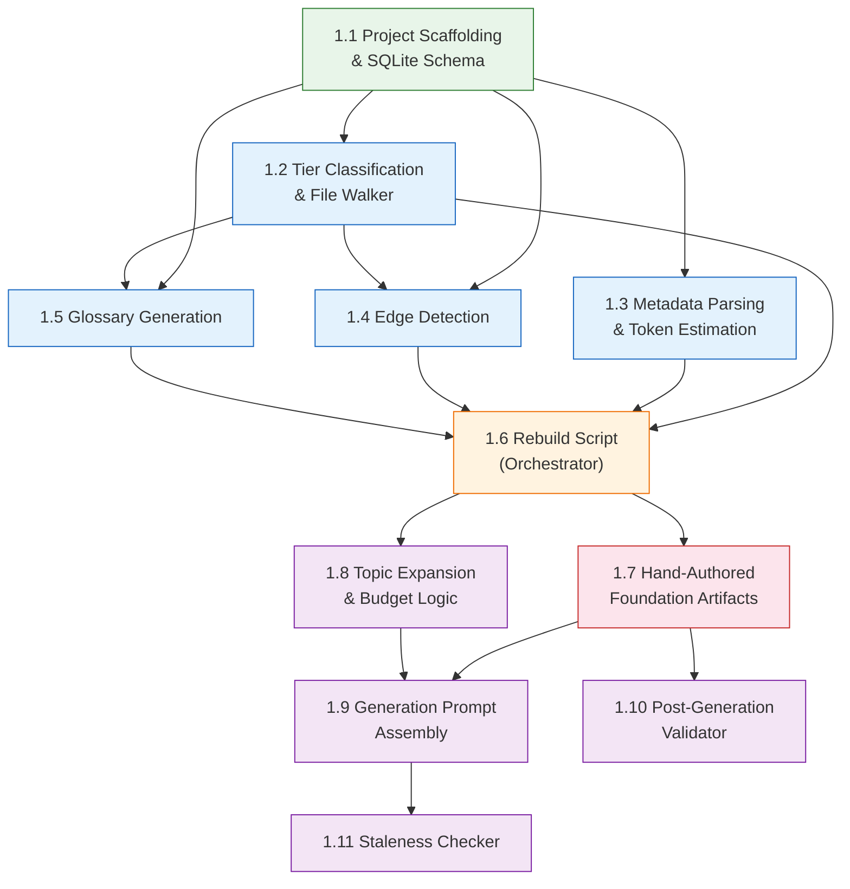

# Documentation Generation System - Epic Breakdown

## Overview

The Documentation Generation System is a Python-based tooling project that generates high-quality documentation from raw source files in the ai-learning-hub repository. It builds a SQLite repository index mapping every file's tier, metadata, relationships, and token cost, then uses that index to expand documentation topics into precise file sets that fit within context budgets. When a topic exceeds the budget, the system narrows breadth (splitting into subtopics) rather than reducing depth -- every generated document covers its scope at full fidelity across all tiers of source material.

The system comprises: a repository index (SQLite), tier classification rules, metadata parsing, edge detection (7 relationship types), a canonical glossary with three-tier terminology discipline, hand-authored archetypes and style guide, a topic expansion engine with budget-aware split strategies, generation prompt assembly, a deterministic post-generation validator, and a staleness checker. The entire pre-generation pipeline is deterministic -- the only LLM call is the document generation itself.

## Epic Rationale

The dependency chain follows a bottom-up build order. The SQLite schema and project scaffolding must come first since every subsequent component writes to or reads from the database. The four index-population modules (tier classification, metadata parsing, edge detection, glossary generation) depend on the schema but are largely independent of each other, with the caveat that edge detection benefits from tier classification being in place (edges reference nodes) and glossary generation operates on Tier 1 files identified by the classifier. The rebuild script orchestrates all four modules and must come after them. Hand-authored artifacts (tier rules, style guide, archetypes) have no code dependencies but are placed after the rebuild script so the full pipeline can be tested with real configuration. Topic expansion queries the populated index. Generation prompt assembly needs both the topic expansion results and the hand-authored artifacts. The validator needs archetypes for heading structure checks and can be developed in parallel with prompt assembly. The staleness checker needs generated documents with metadata frontmatter, so it comes last.

## Epic Dependency Diagram

## Epic List

### Epic 1: Documentation Generation System

**Goal:** Build a Python-based documentation generation toolchain that indexes the repository into a SQLite database, maintains a canonical glossary, expands topics into budget-aware file sets, assembles generation prompts from archetypes and source material, validates generated output deterministically, and detects staleness in previously generated documents.

**Deliverables:**

- Python project with `pyproject.toml`, test infrastructure, and `scripts/lib/` module layout
- SQLite schema (nodes, edges, glossary tables) in `docs/_docgen/repo-index.db`
- Tier classification engine with configurable glob rules (`tier_classifier.py`, `tier-rules.yaml`)
- Metadata parser for YAML frontmatter, JSON configs, and file headers (`metadata_parser.py`)
- Edge detector implementing 7 relationship types (`edge_detector.py`)
- Rule-based glossary generator with three-tier output (`glossary_generator.py`, `glossary.yaml`)
- Rebuild orchestrator script with full and incremental modes (`rebuild-doc-index.py`)
- Hand-authored style guide, tier rules, and 4 archetype YAML files
- Topic expansion engine with depth-capped traversal and 4 split strategies (`graph_queries.py`)
- Generation prompt assembler with metadata frontmatter generation
- Deterministic post-generation validator (`doc_validator.py`, `validate-doc.py`)
- Staleness checker comparing source hashes against generated document metadata (`check-staleness.py`)

**Stories:**

| Story | Description                                                                            | Depends On         |
| ----- | -------------------------------------------------------------------------------------- | ------------------ |
| 1.1   | Project scaffolding & SQLite schema                                                    | None               |
| 1.2   | Tier classification & file walker                                                      | 1.1                |
| 1.3   | Metadata parsing & token estimation                                                    | 1.1                |
| 1.4   | Edge detection (7 relationship types)                                                  | 1.1, 1.2           |
| 1.5   | Glossary generation (rule-based templates, three-tier output)                          | 1.1, 1.2           |
| 1.6   | Rebuild script (orchestrator with full/incremental modes)                              | 1.2, 1.3, 1.4, 1.5 |
| 1.7   | Hand-authored foundation artifacts (tier rules, style guide, archetypes)               | 1.6                |
| 1.8   | Topic expansion & budget logic (graph traversal, split strategies)                     | 1.6                |
| 1.9   | Generation prompt assembly (archetype + glossary + style guide + source files)         | 1.7, 1.8           |
| 1.10  | Post-generation validator (glossary compliance, heading structure, abstraction checks) | 1.7                |
| 1.11  | Staleness checker (source hash comparison against generated document metadata)         | 1.9                |

---

## Epic 1: Documentation Generation System

### Story 1.1: Project Scaffolding & SQLite Schema

As a developer,
I want a Python project structure with the SQLite database schema defined and test infrastructure in place,
so that all subsequent stories have a consistent foundation to build on.

**Acceptance Criteria:**

1. Given the repo root, when I inspect the project structure, then `scripts/lib/` exists as a Python package with `__init__.py`, and `docs/_docgen/` exists with the expected directory layout.
2. Given the SQLite schema, when I run the schema creation script, then `nodes`, `edges`, `glossary_canonical`, `glossary_variants`, and `glossary_forbidden` tables are created with all columns and foreign keys matching the design doc.
3. Given the test infrastructure, when I run `pytest`, then the test suite executes and the schema creation tests pass.
4. Given the project configuration, when I inspect `pyproject.toml`, then Python dependencies (at minimum: `pytest`, `pyyaml`) are declared and the project is installable.

---

### Story 1.2: Tier Classification & File Walker

As a documentation author,
I want the system to walk the repository and classify every file into Tier 1, 2, 3, or 4 based on configurable glob rules,
so that the index knows which files are definitional, structural, implementation, or excluded.

**Acceptance Criteria:**

1. Given `tier-rules.yaml` with glob patterns, when I run the tier classifier against a directory tree, then each file receives a tier assignment (1-4) based on the first matching rule.
2. Given Tier 4 exclusion patterns (node_modules, dist, .git, lockfiles, binaries), when the file walker encounters these paths, then they are skipped entirely and not indexed.
3. Given a file matching Tier 1 detection rules (YAML frontmatter with id/title/role, `.claude/skills/**/*.md`, `docs/adr/*`, etc.), when classified, then it receives tier 1.
4. Given a file matching Tier 2 detection rules (`package.json`, `tsconfig.json`, `.d.ts`, `index.ts`, CI config), when classified, then it receives tier 2.
5. Given a file matching no specific Tier 1 or Tier 2 rule but matching Tier 3 patterns (`.ts`, `.js`, `.tsx`, `.jsx`), when classified, then it receives tier 3.

---

### Story 1.3: Metadata Parsing & Token Estimation

As a documentation author,
I want the system to extract metadata from files and estimate their token cost,
so that the index contains rich node information for topic expansion and budget calculations.

**Acceptance Criteria:**

1. Given a markdown file with YAML frontmatter, when parsed, then the frontmatter fields are extracted and stored as JSON in the `frontmatter` column.
2. Given a JSON config file (e.g., `package.json`, `settings.json`), when parsed, then key metadata fields are extracted.
3. Given any indexed file, when the token estimator runs, then it produces a `token_estimate` using the word count x 1.3 heuristic.
4. Given a file with a human-readable name in frontmatter or filename, when parsed, then the `name` field is populated.
5. Given a file, when parsed, then the `last_modified` field contains the ISO timestamp from the filesystem.

---

### Story 1.4: Edge Detection

As a documentation author,
I want the system to detect 7 types of relationships between files,
so that the graph of file connections enables accurate topic expansion.

**Acceptance Criteria:**

1. Given a story file with YAML frontmatter containing `depends_on` fields, when edges are detected, then `depends_on` edges are created from the story to its dependencies.
2. Given a story file with `touches` predictions pointing to directories or files, when edges are detected, then `touches` edges are created.
3. Given a markdown file containing backtick-quoted file paths, when edges are detected, then `references` edges are created to the referenced files.
4. Given a TypeScript/JavaScript file with import/require statements, when edges are detected, then `imports` edges are created to the imported modules.
5. Given `.claude/settings.json` with hook-to-tool-type mappings, when edges are detected, then `intercepts` edges are created from hooks to tool types.
6. Given hook files that enforce architectural constraints, when edges are detected, then `enforces` edges link hooks to the ADRs they implement.

---

### Story 1.5: Glossary Generation

As a documentation author,
I want the system to generate a canonical glossary from Tier 1 definitional files using rule-based templates,
so that every generated document uses consistent terminology.

**Acceptance Criteria:**

1. Given Tier 1 files with YAML frontmatter, when the glossary generator runs, then canonical terms are created using the correct template per entity type (agent, hook, skill, story, adr).
2. Given a generated glossary, when exported, then `glossary.yaml` contains entries with `term`, `definition`, `source_file`, `allowed_variants`, and `forbidden_synonyms` fields.
3. Given the SQLite database, when the glossary generator runs, then `glossary_canonical`, `glossary_variants`, and `glossary_forbidden` tables are populated.
4. Given a Tier 1 file where a template produces an incomplete definition (e.g., missing `purpose` field), when processed, then the entry is flagged for manual review rather than guessing.
5. Given a full rebuild, when the glossary generator completes, then the exported YAML and database tables are consistent with each other.

---

### Story 1.6: Rebuild Script (Orchestrator)

As a documentation author,
I want a single command (`python scripts/rebuild-doc-index.py`) that regenerates the repository index and glossary from current repo state,
so that I can refresh the index before documentation generation sessions.

**Acceptance Criteria:**

1. Given the command `python scripts/rebuild-doc-index.py`, when executed, then the script performs all steps in order: walk repository, parse metadata, estimate tokens, detect edges, populate SQLite, generate glossary.
2. Given the `--incremental` flag, when executed, then only files modified since the last run are re-processed.
3. Given the `--verbose` flag, when executed, then detailed output shows what was indexed, how many nodes/edges were created, and what glossary entries changed.
4. Given a successful run, when completed, then `docs/_docgen/repo-index.db`, `docs/_docgen/glossary.yaml`, and `docs/_docgen/rebuild.log` are all written.
5. Given a full rebuild, when the script completes, then the database is deterministic -- running it twice on the same repo state produces identical results.

---

### Story 1.7: Hand-Authored Foundation Artifacts

As a documentation author,
I want the tier rules, style guide, and archetype YAML files authored and committed,
so that the generation pipeline has the configuration artifacts it needs.

**Acceptance Criteria:**

1. Given `docs/_docgen/tier-rules.yaml`, when inspected, then it contains glob patterns for Tier 1, 2, 3, and 4 classification matching the detection rules in the design doc, calibrated for the ai-learning-hub repository.
2. Given `docs/_docgen/style-guide.md`, when inspected, then it covers voice/tone, formatting rules, file path conventions, command formatting, and anti-patterns as specified in the design doc.
3. Given `docs/_docgen/archetypes/system-architecture.yaml`, when inspected, then it defines audience, total_words, source_budget_ratio, and sections with level/words/include/exclude matching the design doc example.
4. Given `docs/_docgen/archetypes/blog-post.yaml`, `how-to-guide.yaml`, and `troubleshooting.yaml`, when inspected, then each matches its respective design doc archetype specification.
5. Given the rebuild script from Story 1.6, when run with these artifacts in place, then the tier classification uses the authored tier-rules.yaml and produces correct results.

---

### Story 1.8: Topic Expansion & Budget Logic

As a documentation author,
I want to specify a topic and archetype and receive a list of relevant source files that fit within the token budget, with split proposals when the topic is too broad,
so that I can generate focused, full-depth documents.

**Acceptance Criteria:**

1. Given a topic string and the populated index, when seed files are identified, then glossary lookup and keyword matching against node names and types return directly relevant files.
2. Given seed files, when graph traversal expands the topic, then each edge type respects its depth cap (`depends_on`: 1, `touches`: 1, `references`: 2, `imports`: 1-2, `intercepts`: 1, `enforces`: 1, `defines`: 1).
3. Given the expanded file set, when the token budget is computed, then it equals the archetype's `source_budget_ratio` multiplied by `total_words`.
4. Given a topic that exceeds the budget, when split strategies are applied, then the system proposes subtopics using the priority order: component boundary, edge-type family, directory boundary, lifecycle phase.
5. Given a topic expansion, when the traversal log is produced, then it records seed files with match reasons, expansion paths with edge types and depths, the final file set with tiers and token estimates, and the budget comparison.

---

### Story 1.9: Generation Prompt Assembly

As a documentation author,
I want the system to assemble a complete generation prompt from archetype, glossary, style guide, and source files,
so that I can pass it to an LLM for single-shot document generation.

**Acceptance Criteria:**

1. Given a topic expansion result and an archetype, when the prompt is assembled, then it contains (in order): style guide, glossary as terminology constraint, archetype with section structure and rules, full raw source files labeled with file paths, and the generation task instruction.
2. Given a split proposal with multiple subtopics, when the user chooses option A (single doc covering N subtopics) or option B (N separate docs), then the assembler produces the correct number of prompts with the appropriate file sets.
3. Given a generated document, when metadata frontmatter is produced, then it contains `generated_by`, `generated_at`, `index_rebuilt_at`, `archetype`, `archetype_hash`, `topic`, `source_files` (with path and hash per file), `glossary_hash`, and `style_guide_hash`.
4. Given the source files for a topic, when included in the prompt, then every file's full content is included uncompressed and unsummarized.

---

### Story 1.10: Post-Generation Validator

As a documentation author,
I want a deterministic validator that checks generated documents for glossary compliance, heading structure, abstraction violations, and word budget adherence,
so that I get a quality report before human review.

**Acceptance Criteria:**

1. Given a generated document, when the validator runs, then it scans for forbidden synonyms from `glossary_forbidden` and flags any found.
2. Given a generated document, when the validator checks allowed variant discipline, then it verifies allowed variants only appear after their canonical form has been introduced in the same document.
3. Given a generated document and its archetype, when the validator checks heading structure, then it verifies section names and hierarchy match the archetype definition, flagging missing or extra sections.
4. Given a generated document and its archetype, when the validator checks abstraction violations, then it detects file paths in L1 sections, exact commands in L2 sections, and architectural rationale in L4-only how-to steps using regex patterns.
5. Given a generated document, when the validator checks word budget compliance, then it counts words per section and flags sections exceeding their budget by more than 15%.
6. Given validation results, when the report is produced, then it outputs pass/fail per check with line numbers and specific violations, matching the report format in the design doc.

---

### Story 1.11: Staleness Checker

As a documentation author,
I want to run a staleness check across all generated documents to see which ones need regeneration,
so that I can keep documentation current with minimal effort.

**Acceptance Criteria:**

1. Given a generated document with metadata frontmatter containing `source_files` with hashes, when `check-staleness.py` runs, then it compares each source file hash against the current file hash in the repository.
2. Given a source file that has changed since generation, when the staleness check runs, then the document is flagged as stale with the specific changed files listed.
3. Given the `archetype_hash`, `glossary_hash`, and `style_guide_hash` in metadata, when any of these artifacts have changed, then the document is flagged as stale with the reason.
4. Given multiple generated documents, when the staleness checker runs, then it produces a summary report showing which documents are current and which need regeneration, with reasons.
5. Given the staleness checker, when run on the full set of generated documents, then it completes in under 5 seconds (hash comparisons only, no file content analysis).
