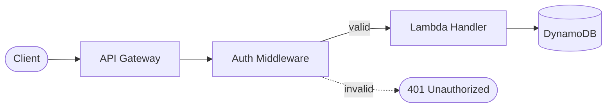
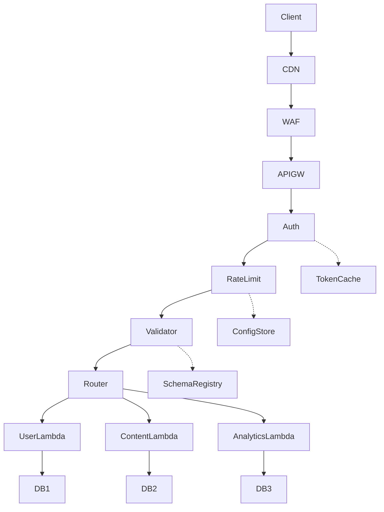
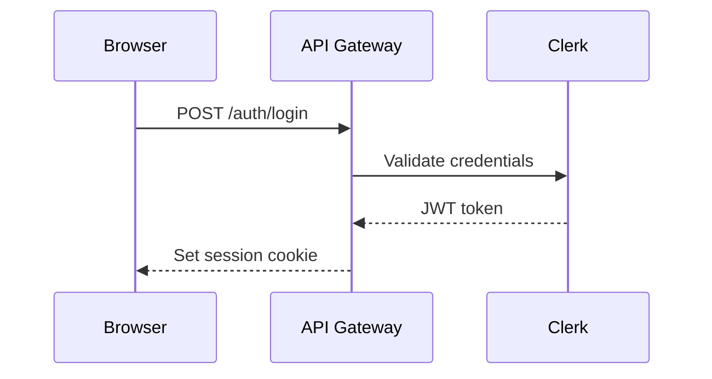

# Diagram Guide

This document defines the standards for all diagrams produced by the pipeline. The Designer agent loads this as primary context on every run. The SME references it when reviewing diagrams for technical accuracy. The Editor references it when reviewing diagrams for conformance.

Rules are tagged with their review taxonomy severity: **[MUST]** violations block the gate; **[SHOULD]** violations are expected to be fixed but do not independently block; **[MINOR]** items are polish. See `review-taxonomy.md` for full severity definitions and handling rules.

---

## Governing principle

Diagrams are compression artifacts. Their purpose is to reduce cognitive load by making spatial relationships, flows, and boundaries visible — not to decorate the document or restate what prose already handles. If a diagram requires more explanation than the prose it supplements, it is too complex or the wrong type.

---

## Diagram format

**[MUST]** All diagrams must render natively on GitHub without external tooling, plugins, or build steps. The reader sees a rendered diagram in the browser — not source code.

**[MUST]** Use mermaid as the default diagram format. Mermaid renders natively in GitHub markdown, VS Code, and most documentation platforms. The syntax standards in this guide (direction conventions, node shapes, edge styles, subgraphs) apply to mermaid diagrams.

**[SHOULD]** If mermaid cannot adequately express a concept (e.g., a diagram type mermaid does not support), the Designer may use another text-based format that GitHub renders natively. As of this writing, mermaid is the only diagram syntax GitHub renders in markdown code blocks — verify GitHub rendering support before using an alternative.

**[MUST]** Do not use ASCII art, text-box diagrams, or any hand-drawn text representation of visual concepts. These are low-fidelity, inaccessible, and unmaintainable. If a concept warrants a diagram, it warrants a rendered one.

---

## Diagram types and when to use them

### Type selection

**[MUST]** Use the correct mermaid diagram type for the concept being illustrated. The following table defines the mapping:

| Concept                                                                 | Diagram type     | Mermaid keyword                            | Example use                                         |
| ----------------------------------------------------------------------- | ---------------- | ------------------------------------------ | --------------------------------------------------- |
| Process, workflow, decision tree                                        | Flowchart        | `flowchart LR` or `flowchart TB`           | CI/CD pipeline, request handling, branching logic   |
| API calls, service-to-service communication, request/response sequences | Sequence diagram | `sequenceDiagram`                          | Auth flow between client, API Gateway, and Lambda   |
| Lifecycle, status transitions                                           | State diagram    | `stateDiagram-v2`                          | Order states (pending → paid → shipped → delivered) |
| Data relationships, entity structure                                    | ER diagram       | `erDiagram`                                | DynamoDB table relationships, data model            |
| System architecture, component boundaries                               | Block/C4 diagram | `block-beta` or `flowchart` with subgraphs | High-level architecture, service topology           |

**[SHOULD]** When a concept could fit multiple diagram types (e.g., an auth flow could be a flowchart or sequence diagram), choose the type that best represents the primary relationship:

- If the key information is **who talks to whom and in what order** → sequence diagram
- If the key information is **what happens and what decisions branch the flow** → flowchart
- If the key information is **what states exist and what triggers transitions** → state diagram

### When to include a diagram

**[SHOULD]** Include a diagram when the concept involves 3+ components interacting, has branching logic, or describes a flow that prose alone would require the reader to mentally reconstruct.

**[SHOULD]** Do not include a diagram when the concept can be explained clearly in 2-3 sentences of prose. A diagram that restates what the text already says without adding spatial or relational clarity is noise.

**[MUST]** Diagrams must not introduce new system components or behaviors absent from the prose. Structural relationships between components already described in the text may be clarified visually — that is the point of a diagram. But if removing the diagram would leave the reader unaware of a component or flow, the prose is incomplete.

---

## Complexity and decomposition

### Node limits

**[MUST]** A single diagram contains no more than 9 nodes. This limit approximates Miller's law (7±2) — the upper bound of items human working memory can process simultaneously. Count every discrete element: boxes, circles, diamonds, actors, states, entities. Subgraph containers do not count as nodes; their contents do.

**[MUST]** If a concept requires more than 9 nodes, decompose it into:

1. **Overview diagram** — high-level view with 5-7 nodes, where each node represents a subsystem or group
2. **Detail diagram(s)** — one per subsystem, each with ≤9 nodes showing internal structure

**[MUST]** Overview diagrams show subsystem boundaries and hide internal implementation. No internal nodes from a subsystem appear in the overview.

**[MUST]** Detail diagrams reuse the subsystem name from the overview as their title or root node. References to other subsystems are labeled "external" (e.g., `Auth Service [external]`).

**[SHOULD]** Use consistent node names across overview and detail diagrams. If the overview calls a subsystem "Auth Service", the detail diagram's title or root node must also use "Auth Service."

**[SHOULD]** Each detail diagram must answer a narrower question than its parent. If the detail diagram shows the same information as the overview with more boxes added, it is not decomposition — it is clutter. The detail must reveal internal structure, decision logic, or interaction patterns that the overview deliberately hides.

### Per-type complexity limits

| Diagram type     | Max elements   | Additional constraint                |
| ---------------- | -------------- | ------------------------------------ |
| Flowchart        | 9 nodes        | Max 3 decision diamonds per diagram  |
| Sequence diagram | 5 participants | Max 12 messages (arrows) per diagram |
| State diagram    | 9 states       | Max 2 levels of nesting              |
| ER diagram       | 7 entities     | No constraint on relationship count  |
| Block/C4         | 9 blocks       | Max 3 nesting levels                 |

**[SHOULD]** Apply the squint test: if the diagram's main point is not recognizable when the text is too small to read (only shapes and layout visible), the diagram is too complex. Concrete indicator: if the primary flow path crosses other edges more than twice, the layout needs restructuring or the diagram needs decomposition.

### Diagram smells

These anti-patterns signal a diagram needs rework, even if it technically passes the node count:

| Smell               | Description                                                                                         | Fix                                               |
| ------------------- | --------------------------------------------------------------------------------------------------- | ------------------------------------------------- |
| Everything is a box | All nodes are the same shape — shape carries no information                                         | Apply the node shape conventions                  |
| Kitchen sink        | Diagram tries to show the entire system in one view                                                 | Decompose into overview + detail                  |
| Spaghetti arrows    | 3+ edges cross each other; flow is not traceable                                                    | Reorder nodes or split into separate diagrams     |
| Label novel         | More edge labels than nodes, or edge labels exceed 5 words                                          | Move detail to prose; simplify labels             |
| Orphan node         | A node with no incoming or outgoing edges                                                           | Remove it or connect it to the flow               |
| Hidden hierarchy    | Flat layout when the concept has clear layers or phases                                             | Switch direction (TB for layers) or use subgraphs |
| Mixed abstraction   | High-level subsystems alongside low-level implementation details (e.g., "AWS" next to "parse JSON") | Pick one level; push detail into a child diagram  |

---

## Mermaid syntax standards

### Direction conventions

**[SHOULD]** Use `LR` (left-to-right) for processes, workflows, and data flows — these imply progression through time or stages.

**[SHOULD]** Use `TB` (top-to-bottom) for hierarchies, architectures, and containment relationships — these imply layers or levels.

### Primary path and spatial layout

**[SHOULD]** Every flowchart has one visually dominant path — the happy path or primary flow. This path follows the declared direction (left-to-right or top-to-bottom) without reversals. Error paths, optional branches, and async flows diverge from the primary path, not the other way around.

**[SHOULD]** Place inputs and triggers on the leading edge (left in LR, top in TB) and outputs or terminal states on the trailing edge. Place external actors on the diagram's perimeter, not embedded between internal components.

### Node shapes

**[SHOULD]** Use node shapes consistently to encode meaning:

| Shape             | Mermaid syntax | Meaning                          |
| ----------------- | -------------- | -------------------------------- |
| Rectangle         | `[Label]`      | Process, service, component      |
| Rounded rectangle | `(Label)`      | Start/end point, external system |
| Diamond           | `{Label}`      | Decision point                   |
| Cylinder          | `[(Label)]`    | Database, persistent storage     |
| Stadium           | `([Label])`    | User action, manual trigger      |

**[MUST]** Do not use multiple shapes to mean the same thing within a single diagram. If rectangles represent services, every service is a rectangle.

### Edge styles

**[SHOULD]** Use solid arrows (`-->`) for primary/synchronous flows. Use dotted arrows (`-.->`) for optional or asynchronous flows. Use thick arrows (`==>`) only when emphasizing a critical path and only one per diagram.

**[MUST]** Arrow direction must match the actual direction of the flow or dependency. An arrow from A to B means A initiates, sends to, or depends on B.

### Subgraphs

**[SHOULD]** Use subgraphs to group related nodes when the grouping adds information (e.g., "VPC", "Browser", "AWS Account"). Do not use subgraphs for visual decoration.

**[SHOULD]** Subgraph labels use the same naming conventions as node labels (short, noun-based).

### Syntax hygiene

**[MUST]** Use consistent indentation: 4 spaces per nesting level inside subgraphs.

**[MINOR]** Place one node definition or one edge definition per line. Do not chain multiple edges on a single line.

**[MUST]** Do not use mermaid features that render inconsistently across platforms: `click` events, `style` tags with hex colors, `classDef` with complex CSS, `linkStyle` with pixel values. Use mermaid's built-in theming only.

---

## Labeling and captions

### Diagram captions

**[MUST]** Every diagram has a caption placed as italic text on the line immediately before the mermaid code block. The caption states what the diagram shows in concrete terms.

Acceptable caption: _Request flow from API Gateway through auth middleware to DynamoDB_

Unacceptable caption: _Architecture Diagram_ / _System Overview_ / _Flow_

**[SHOULD]** Captions are one sentence, no terminal period, under 15 words.

### Node labels

**[SHOULD]** Node labels are concise noun or verb phrases, typically 1-4 words. Use noun phrases for components ("API Gateway", "Auth Service") and verb phrases for processes ("Validate Token", "Write Record"). Avoid clauses or compound descriptions. Labels over 4 words are acceptable when the system name requires it (e.g., "Identity Provider (Clerk)") but signal that the label may need abbreviation.

**[MUST]** Node labels must match the terminology used in the surrounding prose. If the text calls it "auth middleware", the node is not labeled "Authentication Layer."

### Edge labels

**[SHOULD]** Label edges when the relationship is not obvious from context. An arrow from "Client" to "API Gateway" in an HTTP flow does not need a label. An arrow from "API Gateway" to "Lambda" should be labeled if multiple invocation types are possible (e.g., "POST /users").

**[SHOULD]** Edge labels are 1-5 words. If an edge needs more explanation, the prose should carry that detail.

### Annotations

**[MINOR]** Use mermaid `note` syntax in sequence diagrams when a step requires context that does not fit in a message label. Limit notes to one per diagram.

---

## Styling conventions

### Color usage

**[SHOULD]** Use mermaid's default theme with no custom colors. The default theme renders acceptably across light and dark backgrounds and requires no maintenance.

**[SHOULD]** If a diagram requires color to distinguish paths (e.g., success vs error flow), use at most 2 custom colors and define them in mermaid `classDef` statements at the top of the diagram. Color must encode meaning:

| Color purpose                            | Allowed                        |
| ---------------------------------------- | ------------------------------ |
| Distinguish success path from error path | Yes                            |
| Distinguish async from sync              | No — use line styles instead   |
| Make the diagram "look nicer"            | No                             |
| Highlight a specific node for discussion | Yes, if referenced in the text |

**[MUST]** Every diagram must be understandable without color. Color supplements line styles and labels — it does not replace them. A reader viewing the diagram in grayscale (or a screen reader describing it) must get the same information.

### Decorative elements

**[MUST]** Every visual element in the diagram carries information. No decorative borders, background fills, icons, or emoji in node labels.

---

## Diagram-text integration

### Placement

**[MUST]** A diagram appears after the prose that introduces the concept it illustrates. The preceding paragraph must reference the diagram: "The following diagram shows the request flow" or equivalent.

**[SHOULD]** The paragraph after the diagram references specific elements shown in it: "As the diagram shows, the auth middleware validates the token before the request reaches the handler." This anchors the visual to the narrative.

### Prose independence

**[MUST]** The prose must be fully understandable without the diagram. Diagrams supplement explanation — they do not replace it. If removing a diagram from the document would leave a gap in the reader's understanding, the prose is incomplete.

### Alt text

**[SHOULD]** Include an HTML comment above the mermaid block as alt text for accessibility:

```markdown
<!-- Alt: Flowchart showing request flow from client through API Gateway, auth middleware, Lambda handler, to DynamoDB, with an error path returning 401 from auth middleware -->
```

The alt text describes the diagram's structure and key relationships in one sentence.

---

## Review criteria

### SME evaluation (accuracy — MUST level)

The SME reviews diagrams for technical correctness. A diagram fails SME review if:

| Defect                                         | Severity | Example                                                                      |
| ---------------------------------------------- | -------- | ---------------------------------------------------------------------------- |
| Wrong arrow direction                          | MUST     | Diagram shows Lambda calling API Gateway (reversed)                          |
| Missing node in a depicted flow                | MUST     | Auth middleware exists in the system but is absent from the flow diagram     |
| Incorrect cardinality or relationship          | MUST     | ER diagram shows one-to-one where one-to-many exists                         |
| Node label contradicts prose terminology       | MUST     | Prose says "DynamoDB", diagram says "database" (ambiguous — which database?) |
| Diagram depicts behavior that does not exist   | MUST     | Shows a retry loop that the system does not implement                        |
| Detail diagram adds no insight beyond overview | SHOULD   | Detail is the overview with more boxes, not a deeper view of a subsystem     |

### Editor evaluation (conformance — SHOULD level)

The Editor reviews diagrams against this guide. A diagram fails Editor review if:

| Defect                                              | Severity | Rule reference                  |
| --------------------------------------------------- | -------- | ------------------------------- |
| ASCII art or non-rendering diagram format           | MUST     | Diagram format                  |
| Does not render natively on GitHub                  | MUST     | Diagram format                  |
| More than 9 nodes                                   | MUST     | Complexity: Node limits         |
| Wrong diagram type for the concept                  | SHOULD   | Type selection                  |
| Missing caption                                     | MUST     | Labeling: Diagram captions      |
| Caption is generic ("Architecture Diagram")         | SHOULD   | Labeling: Diagram captions      |
| Node labels verbose or clause-like                  | SHOULD   | Labeling: Node labels           |
| Missing edge labels where relationship is ambiguous | SHOULD   | Labeling: Edge labels           |
| Inconsistent node shapes within a diagram           | MUST     | Syntax: Node shapes             |
| Uses click events, inline styles, or hex colors     | MUST     | Syntax: Syntax hygiene          |
| No prose introduction before the diagram            | MUST     | Integration: Placement          |
| Prose is not understandable without the diagram     | MUST     | Integration: Prose independence |
| Color used without meaning                          | SHOULD   | Styling: Color usage            |
| Diagram not understandable in grayscale             | MUST     | Styling: Color usage            |
| No alt text                                         | SHOULD   | Integration: Alt text           |

---

## Examples

### Good: flowchart within limits

_Request flow from API Gateway through auth to DynamoDB_

<!-- Alt: Flowchart showing left-to-right request flow: Client sends request to API Gateway, which routes to Auth Middleware, then to Lambda Handler, which reads/writes DynamoDB. Auth Middleware returns 401 on failure. -->



This diagram has 5 nodes, uses `LR` for a process flow, uses shape conventions consistently (rounded rectangles for external/terminal, rectangles for services, cylinder for storage), labels the branching edges, and stays under 9 nodes.

### Bad: overloaded diagram



This diagram has 15 nodes. The main flow is buried under infrastructure detail. A reader cannot identify the primary path. Fix: decompose into an overview (Client → API Layer → Services → Data) and detail diagrams for each subsystem.

### Good: sequence diagram with bounded participants

_Authentication handshake between client and Clerk_

<!-- Alt: Sequence diagram with three participants: Browser, API Gateway, and Clerk. Browser sends login request to API Gateway, which forwards to Clerk for token validation, receives a JWT response, and returns the session to Browser. -->



Four participants, four messages. Each message is labeled with the specific action. Async responses use dashed arrows.

---

## Quick reference

### Type selection

| Concept type                     | Diagram type | Direction |
| -------------------------------- | ------------ | --------- |
| Process, workflow, pipeline      | Flowchart    | LR        |
| Hierarchy, architecture layers   | Flowchart    | TB        |
| API calls, service interactions  | Sequence     | n/a       |
| Lifecycle, status transitions    | State        | n/a       |
| Data model, entity relationships | ER           | n/a       |

### Hard limits (MUST)

| Constraint                          | Limit                                    |
| ----------------------------------- | ---------------------------------------- |
| Format                              | Mermaid (default); must render on GitHub |
| ASCII/text-art diagrams             | Prohibited                               |
| Nodes per diagram                   | 9 max                                    |
| Sequence diagram participants       | 5 max                                    |
| Sequence diagram messages           | 12 max                                   |
| State diagram nesting               | 2 levels max                             |
| Node label length                   | 1-4 words typical (SHOULD)               |
| Caption required                    | Yes, every diagram                       |
| Prose introduction required         | Yes, before every diagram                |
| Prose must work without diagram     | Yes                                      |
| Diagram understandable in grayscale | Yes                                      |

### Decomposition checklist

1. Count nodes. Over 9 → decompose.
2. Apply the squint test. Illegible at arm's length → decompose.
3. Check participant/message counts against per-type limits.
4. Ensure overview and detail diagrams use matching node names.

### Designer workflow

**Phase 4 (creation):** Read Tech Writer's diagram suggestions. For each suggestion: select diagram type from the type table, draft mermaid code, verify against hard limits, write caption + alt text, confirm node labels match prose terminology.

**Phase 5 (revision):** Read SME feedback on diagrams. For each MUST item: correct the technical error. For each SHOULD item: improve or justify keeping the current version. Re-verify against hard limits after changes.
