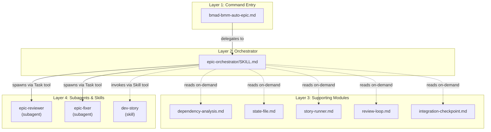
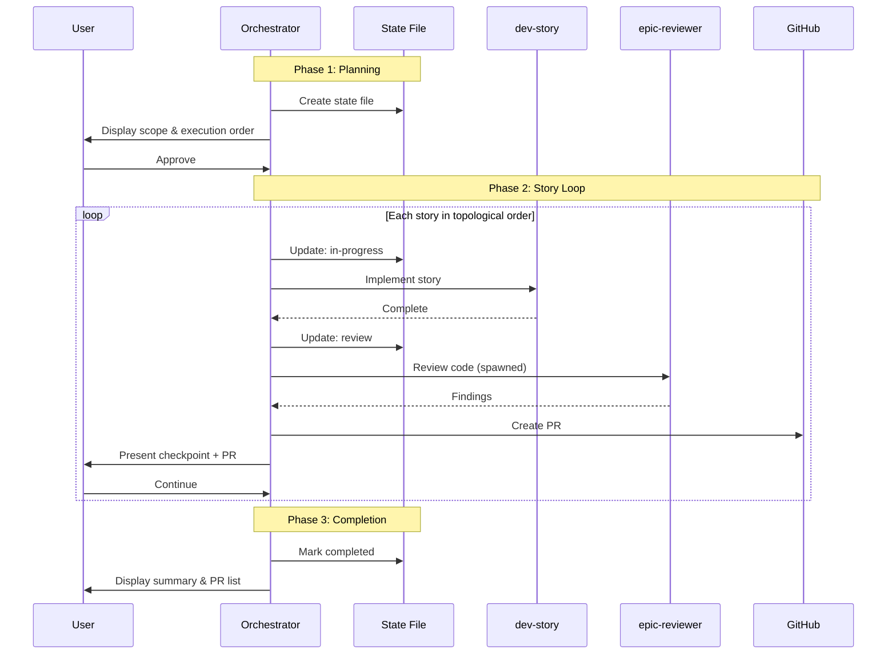
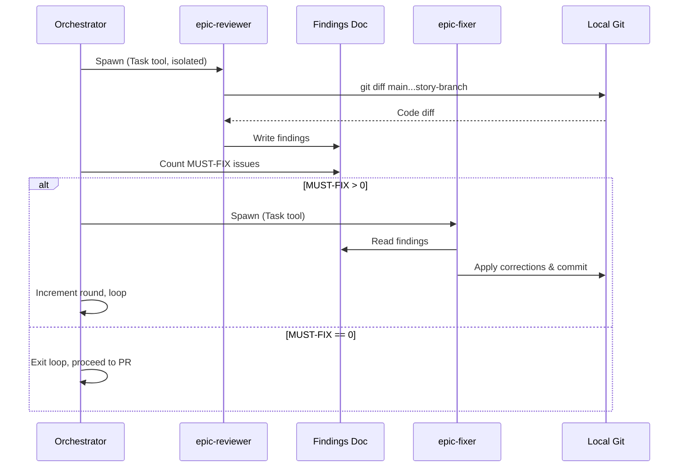
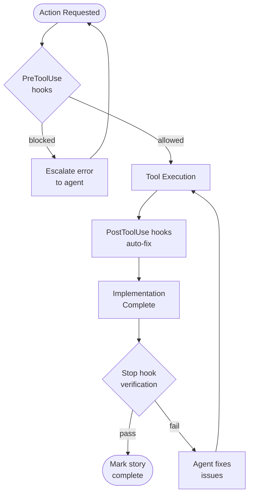
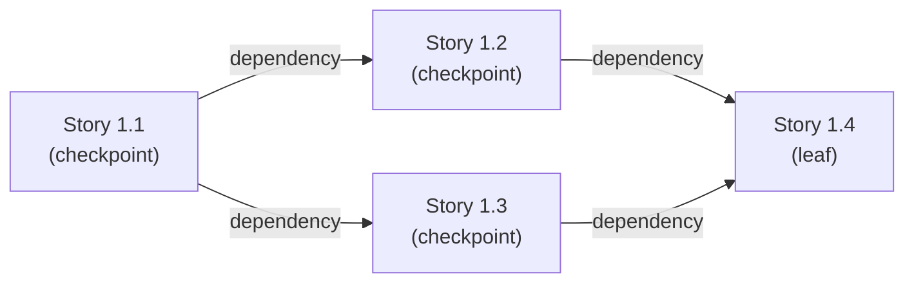

# Diagrams v2

## Diagram 1: System Architecture (4-Layer Structure)

**Placement:** After "Architecture Layers" section introduction (line 13), before "Layer 1: Command entry point" subsection (line 15)

_Four-layer architecture showing delegation, on-demand loading, and agent spawning patterns_

<!-- Alt: Block diagram with four horizontal layers showing Command Entry at top delegating to Orchestrator, which loads five supporting modules on-demand and spawns three agents using different patterns -->

---

## Diagram 2: Command Flow Sequence (Phase 1/2/3)

**Placement:** After "Three-Phase Workflow" section introduction (line 50), before "Phase 1: Planning and scope" subsection (line 53)

_Three-phase workflow showing automated execution and human approval gates_

<!-- Alt: Sequence diagram with six participants showing Phase 1 scope approval, Phase 2 story loop with review and PR creation repeating for each story, and Phase 3 completion report -->

---

## Diagram 3: Agent Interaction (Review Loop)

**Placement:** After "Multi-Agent Code Review Loop" section introduction (line 266), before "Round execution" subsection (line 269)

_One review loop round with isolated subagent spawning and conditional fixer execution_

<!-- Alt: Sequence diagram showing Orchestrator spawning epic-reviewer in isolation, reading findings document, conditionally spawning epic-fixer if MUST-FIX issues exist, with loop back or exit logic -->

---

## Diagram 4: Hook Lifecycle (When Hooks Fire)

**Placement:** After "Hook System Enforcement" section introduction (line 318), before "PreToolUse hooks" subsection (line 321)

_Hook firing timeline from action request through execution to completion verification_

<!-- Alt: Flowchart showing linear timeline with PreToolUse decision gate, Tool Execution, PostToolUse auto-fix, and Stop verification gate with feedback loops for blocked actions and failed verification -->

---

## Diagram 5: Dependency Graph (Stories 1.1-1.4)

**Placement:** After "Execution Example" section introduction (line 113), before the bullet list showing story structure (line 116)

_Dependency relationships showing execution order and integration checkpoint triggers_

<!-- Alt: Directed graph with four story nodes showing Story 1.1 has no dependencies, Stories 1.2 and 1.3 both depend on 1.1, Story 1.4 depends on both 1.2 and 1.3, with checkpoint annotations on non-leaf stories -->

**Execution order note:** Valid orders are `[1.1, 1.2, 1.3, 1.4]` or `[1.1, 1.3, 1.2, 1.4]` because Stories 1.2 and 1.3 are independent.

---

## Change Log

### Diagram 2: Command Flow Sequence

**Change:** Added `loop Each story in topological order` wrapper around Phase 2 message sequence (lines 70-79 in original v1 diagram).

**Reason:** SME Review v2 finding (MUST item, line 188-208) identified that the diagram showed Phase 2 as a single story execution when it actually loops N times (once per story in topological order). The loop wrapper visually indicates that Phase 2 repeats for each story, which matches the prose description in Draft v2 line 70 ("For each story in topological order...") and the Execution Example showing sequential Story 1.1 → 1.2 → 1.3 → 1.4 execution.

**Implementation:** Inserted `loop Each story in topological order` after the Phase 2 note and before the first Phase 2 message (`Orchestrator->>StateFile: Update: in-progress`). Closed the loop after the final Phase 2 message (`User->>Orchestrator: Continue`). This wraps the entire story implementation cycle in a loop indicator that shows the sequence repeats N times.

### Diagrams 1, 3, 4, 5

**Change:** No changes from v1.

**Reason:** No SME review findings targeted these diagrams for revision. All four diagrams received confirmation of technical accuracy in SME Review v2 summary (lines 284-291). SME noted SHOULD items for Diagrams 3 and 4 (round counter visualization, PostToolUse hook coverage) but these were classified as presentation improvements, not accuracy corrections requiring MUST-level changes.
