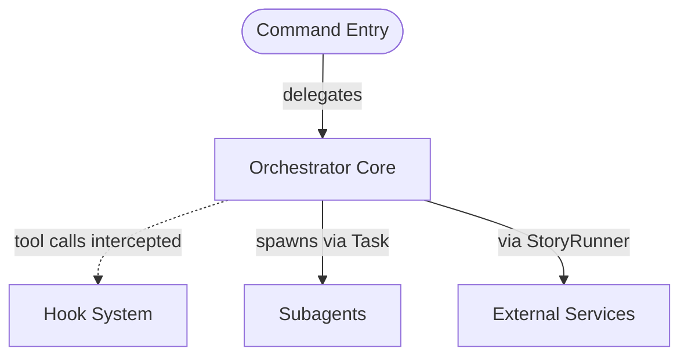
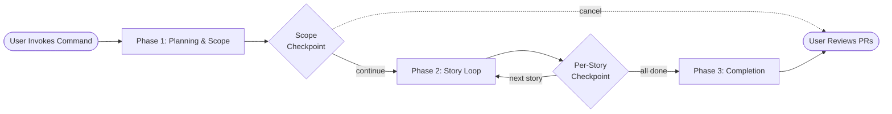
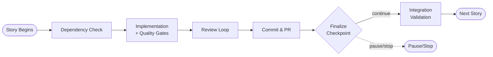
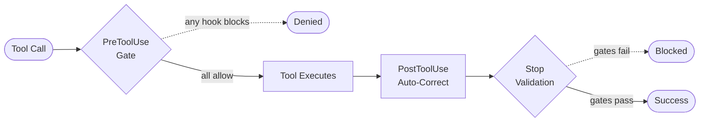
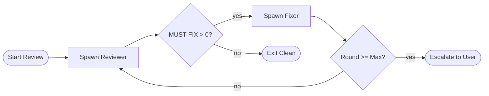
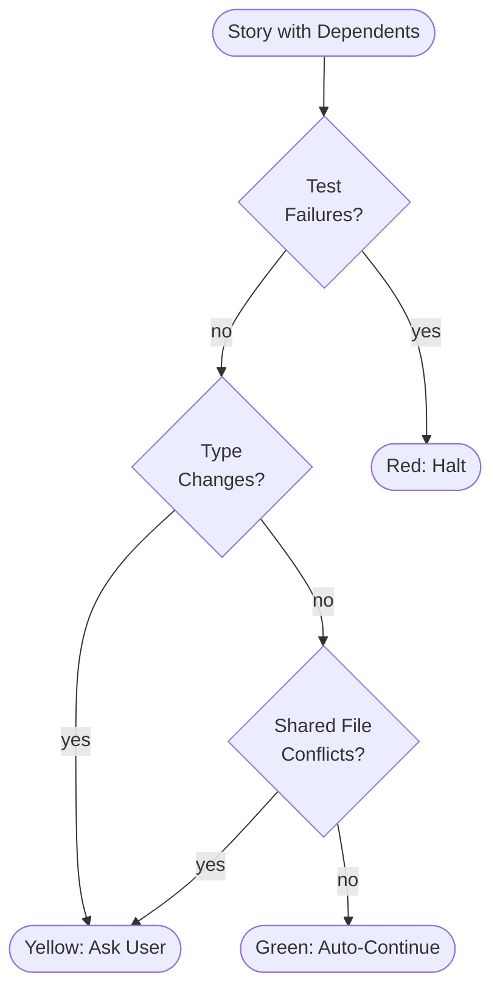
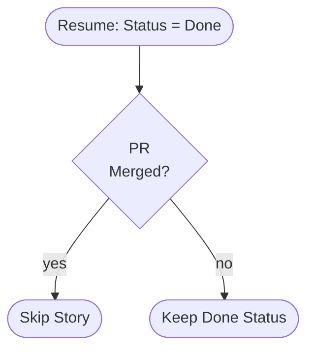
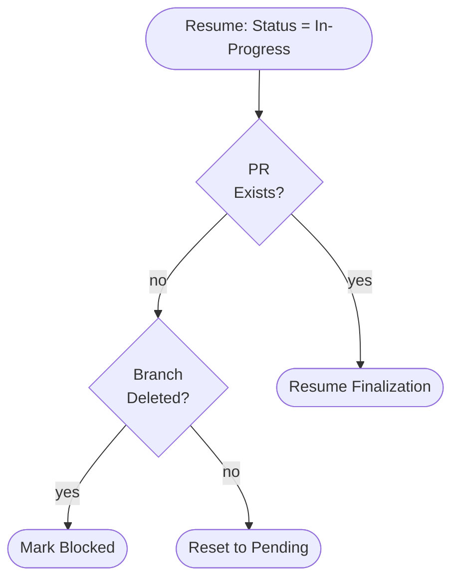
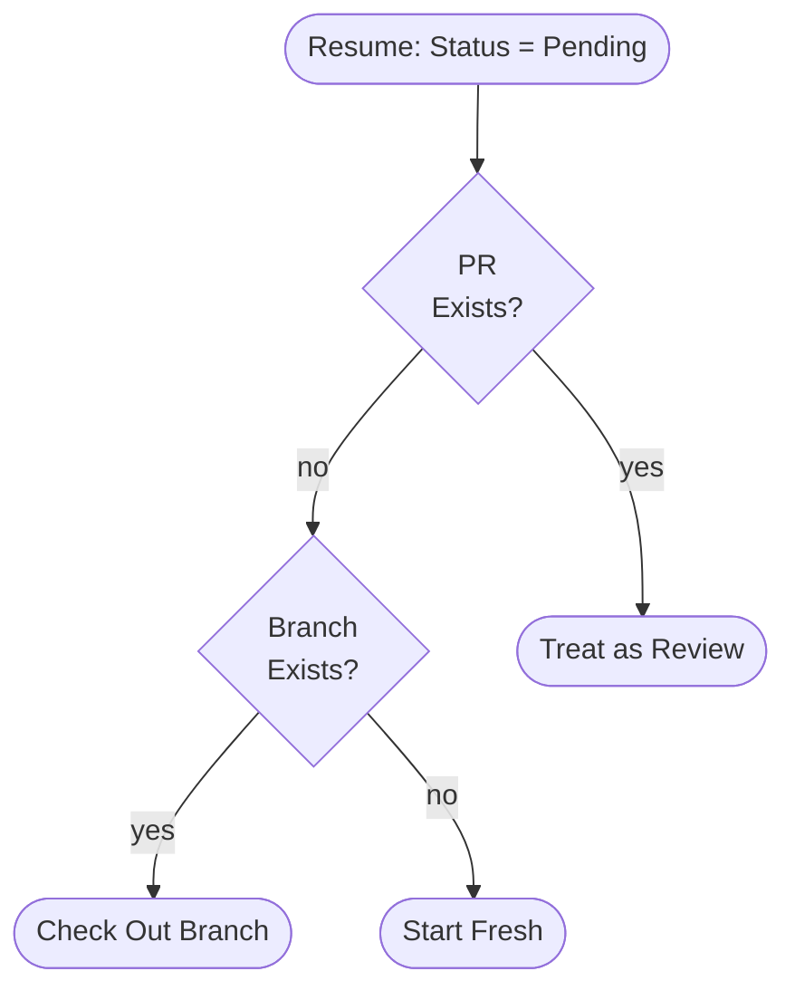

# Diagrams v1 - How Auto Epic Command Works

## Diagram 1: System Architecture (High-Level Components)

**Placement:** Immediately after the "Architecture Layers" section opener (before Layer 1 subsection)

_Four architectural layers showing command delegation, hook interception, and subagent spawning_

<!-- Alt: Block diagram showing top-to-bottom hierarchy with four layers: Command Entry at top delegates to Orchestrator Core, which connects to Hook System (intercepting tool calls) and spawns Subagents, with External Services at the bottom -->

---

## Diagram 2a: Command Flow Overview (Three Phases)

**Placement:** At the beginning of "Command Flow and Phases" section, before the three phase subsections

_High-level execution flow through Planning, Story Loop, and Completion phases_

<!-- Alt: Flowchart showing left-to-right progression from command invocation through three phases: Phase 1 Planning with scope checkpoint, Phase 2 Story Loop with per-story processing, and Phase 3 Completion with reporting -->

---

## Diagram 2b: Phase 2 Story Loop Detail

**Placement:** In the "Command Flow and Phases > Phase 2" section after the seven-substep introduction

_Seven substeps per story from dependency check through integration validation_

<!-- Alt: Flowchart showing left-to-right story processing: dependency check, implementation with quality gates, review loop, commit and PR creation, finalization checkpoint, and integration validation for stories with dependents -->

---

## Diagram 3: Hook Lifecycle (Three Interception Points)

**Placement:** In "Architecture Layers > Layer 3" after the hook category descriptions

_Hook execution sequence showing PreToolUse gates, PostToolUse auto-correction, and Stop validation_

<!-- Alt: Flowchart showing left-to-right tool execution lifecycle: tool call attempt passes through PreToolUse gate (blocks if denied), executes tool, runs PostToolUse auto-correction, and validates at Stop with quality gates -->

---

## Diagram 4: Review Loop Protocol (Multi-Round Convergence)

**Placement:** In "Subagent Orchestration" section after the Reviewer and Fixer protocol descriptions

_Iterative review-fix cycle with convergence on zero MUST-FIX findings or max rounds_

<!-- Alt: Flowchart showing left-to-right review loop: spawn reviewer, count MUST-FIX findings, spawn fixer if needed, increment round, loop back to reviewer, exit when clean or escalate at max rounds -->

---

## Diagram 5: Integration Checkpoint Classification

**Placement:** In "Command Flow and Phases > Phase 2" after Step 2.7 (Integration checkpoint) description

_Decision logic classifying integration results as Green, Yellow, or Red based on validation checks_

<!-- Alt: Flowchart showing top-to-bottom integration validation: test suite runs first, then checks type changes and shared file conflicts, resulting in Red (halt on test failure), Yellow (ask user on warnings), or Green (auto-continue) -->

---

## Diagram 6a: State Resume - Done Status

**Placement:** In "State Management and Resume > Resume Reconciliation" subsection after the prose description of the 7-case matrix

_Resume reconciliation for stories marked 'done' in state file_

<!-- Alt: Flowchart showing decision tree for done status: if PR merged, skip story; if PR not merged but done marked, keep done status and continue -->

---

## Diagram 6b: State Resume - In-Progress Status

**Placement:** In "State Management and Resume > Resume Reconciliation" subsection, immediately after Diagram 6a

_Resume reconciliation for stories marked 'in-progress' in state file_

<!-- Alt: Flowchart showing decision tree for in-progress status: if PR exists, resume finalization; if branch deleted, mark blocked; if branch exists but no PR, reset to pending -->

---

## Diagram 6c: State Resume - Pending Status

**Placement:** In "State Management and Resume > Resume Reconciliation" subsection, immediately after Diagram 6b

_Resume reconciliation for stories marked 'pending' in state file_

<!-- Alt: Flowchart showing decision tree for pending status: if PR exists, treat as review state; if branch exists but no PR, check out branch; otherwise start fresh -->

---

## Design Notes

### Decomposition Decisions

**Diagram 2 (Command Flow):** Decomposed into overview + detail because the original suggestion included 12+ components (all Phase 1 steps, all Phase 2 substeps, Phase 3 steps). The overview shows the three-phase structure with checkpoints (5 nodes). The detail diagram focuses only on Phase 2's seven substeps (9 nodes), which is the most complex phase.

**Diagram 6 (State Resume):** Decomposed into three separate diagrams (6a, 6b, 6c) because the original suggestion described a 7-case decision matrix with nested conditionals. Each diagram shows one state file status (done, in-progress, pending) and its GitHub reconciliation sub-cases. This preserves the decision tree structure while keeping each diagram at 3-5 nodes.

### Type Overrides

None. All suggested types matched the spatial relationships in the content.

### Node Count Compliance

All diagrams meet the 9-node maximum:

- Diagram 1: 5 nodes
- Diagram 2a: 7 nodes
- Diagram 2b: 9 nodes
- Diagram 3: 8 nodes
- Diagram 4: 7 nodes
- Diagram 5: 8 nodes
- Diagram 6a: 4 nodes
- Diagram 6b: 5 nodes
- Diagram 6c: 5 nodes

### Shape Conventions

Applied consistently across all diagrams:

- **Rounded rectangles (parentheses):** Start/end points, external actors (User Invokes Command, User Reviews PRs)
- **Rectangles (square brackets):** Processes, services, components (Orchestrator Core, Implementation)
- **Diamonds (curly braces):** Decision points (Scope Checkpoint, MUST-FIX > 0?, Test Failures?)
- **Dotted arrows:** Optional/error paths (cancel flow, denied flow, blocked outcomes)
- **Solid arrows:** Primary/happy paths

### Grayscale Readability

All diagrams use shape and line style (solid vs. dotted) to convey meaning. Color is not required for comprehension.
