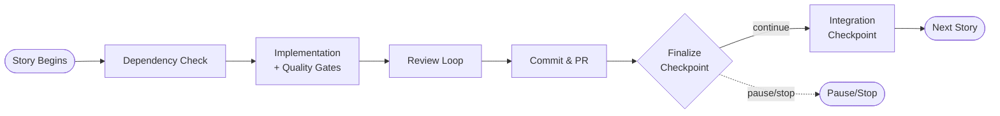
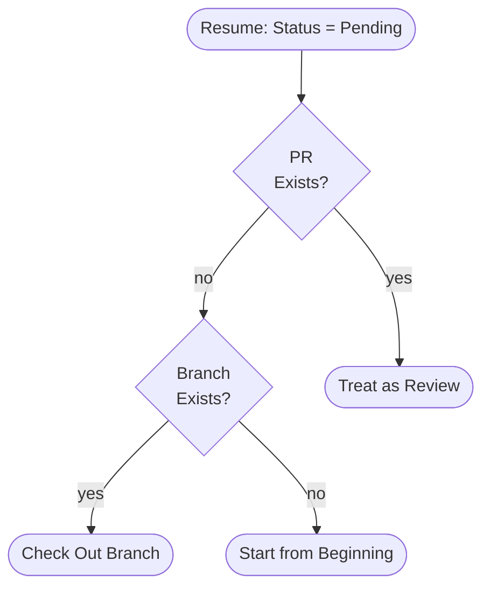

# How Auto Epic Command Works: Agent Flow and System Architecture

## Overview

You run Auto Epic to autonomously implement entire epics with code review loops and human checkpoints.

Auto Epic (`/bmad-bmm-auto-epic`) is a Claude Code command that starts a long-lived orchestration session within Claude Code's agent runtime. It implements entire epics in dependency order.

Key benefits:

- **Autonomous supervised execution**: Human checkpoints at scope confirmation and per-story completion only
- **Quality convergence**: Adversarial review exits when 0 MUST-FIX findings remain, or after 3 rounds
- **Dependency-aware execution**: Topological sort ensures prerequisites complete first
- **Resumability**: Interrupted runs continue from last completed story
- **Safety by design**: Hooks enforce quality gates and prevent destructive operations

Use Auto Epic for implementing entire epics (5-15 stories) with defined dependencies. Use `/bmad-bmm-dev-story` for single stories. Use `/bmad-bmm-code-review` for one-shot reviews without epic orchestration.

For each story, Auto Epic creates a git branch, implements via `/bmad-bmm-dev-story`, runs quality gates (lint/build/test), performs multi-agent code review with fresh-context reviewers, commits locally, and opens a pull request. Human checkpoints occur at scope confirmation (Phase 1.4) and per-story completion (Phase 2.6), with a conditional third checkpoint for integration validation (Phase 2.7) when stories have dependents (`.claude/skills/epic-orchestrator/SKILL.md:61, 264, 325`).

## Architecture Layers

The per-story workflow above is coordinated through four architectural layers: command entry point, orchestrator skill, hook system, and subagents.

_Four architectural layers showing command delegation, hook interception, and subagent spawning_

<!-- Alt: Block diagram showing top-to-bottom hierarchy with four layers: Command Entry at top delegates to Orchestrator Core, which connects to Hook System (intercepting tool calls) and spawns Subagents, with External Services at the bottom -->


### Layer 1: Command entry point

The command file at `.claude/commands/bmad-bmm-auto-epic.md` (54 lines) parses arguments (`Epic-1`, `--stories=1.1,1.2`, `--resume`, `--dry-run`) and delegates to the orchestrator skill. This thin layer handles only argument validation and skill invocation, not business logic.

### Layer 2: Orchestrator skill

The orchestrator at `.claude/skills/epic-orchestrator` consists of six modules. The orchestrator instructs Claude to read each module file using the Read tool when entering the corresponding phase, adding it to the active context. Once loaded, module content remains in Claude's context for the remainder of the session. Each module is explicitly loaded by instruction in SKILL.md when entering the relevant phase (`.claude/skills/epic-orchestrator/SKILL.md:48`):

- `SKILL.md`: Core workflow definition (Phases 1-3), always loaded (464 lines)
- `dependency-analysis.md`: Topological sort algorithm (193 lines), loaded at Phase 1.3
- `story-runner.md`: GitHub CLI vs. dry-run adapter selection (370 lines), loaded at Phase 1.5
- `state-file.md`: State persistence and resume logic (183 lines), loaded at Phase 1.6
- `review-loop.md`: Multi-round code review protocol (175 lines), loaded at Phase 2.4
- `integration-checkpoint.md`: Dependent validation (155 lines), loaded at Phase 2.7

This modular decomposition keeps each agent invocation under context limits while providing deep protocol documentation when needed.

### Layer 3: Hook system and safety enforcement

Ten hooks enforce safety and quality. Nine are script-based hooks; the Stop hook is prompt-based. The nine scripts consist of six PreToolUse hooks and three PostToolUse hooks (`.claude/hooks/README.md:8-20`).

#### Hook execution mechanics

Claude Code's runtime intercepts tool calls and executes matching hook scripts before or after the tool runs. When Claude attempts to use a tool (Bash, Write, Edit), the runtime checks for registered hooks at the corresponding lifecycle point. Hooks execute as separate processes, returning exit codes and output that Claude Code reads to decide whether to proceed, block, or ask the user. This interception happens transparently to the orchestrator agent.

Hooks communicate decisions through two channels:

- **Exit codes:** Code 0 (allow), code 1 (soft error, log but continue), code 2 (hard block, prevent tool execution)
- **JSON responses:** For escalation scenarios, hooks exit with code 0 and write JSON to stdout containing `permissionDecision: 'ask'`, which Claude Code presents to the user

The orchestrator reads hook responses indirectly through Claude Code's tool execution results. When a hook blocks an operation, the orchestrator sees a tool execution failure with the hook's error message. When a hook escalates for permission, the orchestrator pauses until user approval is granted or denied (`.claude/hooks/README.md:29-49`, bash-guard.js:31-45).

From the operator's perspective, hook blocks appear in Claude Code's output as tool execution errors with the hook name and reason. Hook escalations present as permission prompts in the Claude Code interface.

#### PreToolUse hooks (gate enforcement)

- `bash-guard.js`: Implements tiered safety (critical/high/strict via `CLAUDE_SAFETY_LEVEL` env var, lines 16-18). Tiers are cumulative: strict includes high and critical checks; high includes critical checks; critical is the minimal baseline. The default is high. Critical level blocks catastrophic commands (lines 63-105). High level adds blocks for destructive git operations and credential exposure (lines 110-215). Strict level adds blocks for any force push (lines 220-244). Escalates 6 high-risk patterns for human approval (lines 249-285): git push main, npm publish, cdk deploy, aws delete, rm -rf, terraform destroy. These 6 escalation patterns apply uniformly across all safety levels; only block rules are tiered.
- `file-guard.js`: Validates file paths and permissions before Write/Edit operations.
- `tdd-guard.js`: Enforces test-first development by blocking implementation file writes unless failing tests exist in test.json. Test file writes always allowed.
- `architecture-guard.sh`: Enforces ADR-007 (no Lambda-to-Lambda calls), ADR-006 (DynamoDB key patterns), ADR-014 (handlers use @ai-learning-hub/db).
- `import-guard.sh`: Denies Lambda/backend files using DynamoDB/Logger/Zod/middleware without @ai-learning-hub/\* shared library imports.
- `pipeline-guard.cjs`: Protects writing pipeline integrity: denies writes to guides/, agents/, templates/; denies overwrites of previous artifacts; warns on non-standard filenames (e.g., files without numeric prefixes in pipeline artifacts directory) (`.claude/hooks/README.md:15`).

#### PostToolUse hooks (auto-correction)

- `auto-format.sh`: Runs Prettier + ESLint auto-fix asynchronously after file changes.
- `type-check.sh`: Runs tsc --noEmit and reports TypeScript errors without blocking.
- `pipeline-read-tracker.cjs`: Records breadcrumbs when pipeline guide files are Read for verification by pipeline-guard (`.claude/hooks/README.md:16`).

#### Stop hook (quality validation)

Validates quality gates when agent attempts completion: runs npm test, npm run lint, npm run build. If any gate fails, blocks agent completion and requires fixes.

_Hook execution sequence showing PreToolUse gates, PostToolUse auto-correction, and Stop validation_

<!-- Alt: Flowchart showing left-to-right tool execution lifecycle: tool call attempt passes through PreToolUse gate (blocks if denied), executes tool, runs PostToolUse auto-correction, and validates at Stop with quality gates -->


### Layer 4: Subagents

Two specialized agents spawn via Task tool with fresh contexts:

- `epic-reviewer` (`.claude/agents/epic-reviewer.md`): Read-only analysis, tools: Read/Glob/Grep/Bash/Write. Disallowed: Edit (prevents code modification), Task (prevents agent chains).
- `epic-fixer` (`.claude/agents/epic-fixer.md`): Full edit capabilities, tools: Read/Glob/Grep/Bash/Write/Edit. Disallowed: Task (prevents unbounded sub-subagents).

Tool restrictions are defined in the agent frontmatter (`disallowedTools` field). When spawning a subagent, the Task tool configures the agent's runtime to disable the specified tools. If a subagent attempts to use a disallowed tool, Claude Code returns an error and blocks execution; the tool is not invoked (epic-reviewer.md:5, epic-fixer.md:5).

## Command Flow and Phases

You trace execution through three phases: Planning & Scope (Phase 1), Story Implementation Loop (Phase 2), and Completion & Reporting (Phase 3).

_High-level execution flow through Planning, Story Loop, and Completion phases_

<!-- Alt: Flowchart showing left-to-right progression from command invocation through three phases: Phase 1 Planning with scope checkpoint, Phase 2 Story Loop with per-story processing, and Phase 3 Completion with reporting -->


### Phase 1: Planning & Scope

1. **Load epic file (1.1):** Read epic file from `_bmad-output/planning-artifacts/epics/epic-{id}.md` containing title, description, story references.
2. **Load story files (1.2):** Read story files from `_bmad-output/implementation-artifacts/stories/{story_id}.md` with YAML frontmatter:
   ```yaml
   ---
   id: "1.2"
   title: "Implement auth middleware"
   depends_on: ["1.1"]
   touches: ["backend/middleware/", "shared/types/"]
   risk: high
   ---
   ```
3. **Dependency analysis (1.3):** Parse YAML frontmatter, build adjacency list, apply topological sort to determine execution order. Cycle detection runs during this phase before any story work begins; circular dependencies cause immediate termination with error: `❌ Dependency Cycle Detected\n\nStory 1.2 depends on Story 1.3\nStory 1.3 depends on Story 1.2\n\nThis epic cannot be implemented until dependencies are resolved.` Ensure story dependencies form a directed acyclic graph before running Auto Epic (`.claude/skills/epic-orchestrator/dependency-analysis.md:32-131, 104-115`).
4. **Scope confirmation checkpoint (1.4):** Human chooses: implement all stories, select specific stories (with dependency validation), or cancel.
5. **Initialize StoryRunner (1.5):** Select DryRunStoryRunner for `--dry-run` flag (simulates branch creation, PRs, and commits without git push or GitHub CLI calls) or GitHubCLIRunner for real repos with `.github/` directory (`.claude/skills/epic-orchestrator/story-runner.md:70-84`).
6. **Create or resume state file (1.6):** State file at `docs/progress/epic-{id}-auto-run.md` uses YAML frontmatter (primary source of truth) with regenerated markdown table (human display). Resume reconciles with GitHub (see State Management section).

### Phase 2: Story Implementation Loop

_Seven substeps per story from dependency check through integration validation_

<!-- Alt: Flowchart showing left-to-right story processing: dependency check, implementation with quality gates, review loop, commit and PR creation, finalization checkpoint, and integration checkpoint for stories with dependents -->



1. **Pre-implementation dependency check (2.1):** Stories with dependents require PR merged OR commit reachable from base via `git merge-base --is-ancestor ${commitSha} origin/${baseBranch}`. Leaf stories only need open PR with passing tests. Rationale: downstream stories need code on base branch to build correctly. Override flag `--no-require-merged` relaxes dependency checking to accept state file 'done' status for all stories, bypassing the merge-base verification for stories with dependents. Use this flag when implementing dependent stories on a feature branch where merging to main isn't practical yet, accepting that dependent stories may build against stale prerequisite code (`.claude/skills/epic-orchestrator/state-file.md:158, 143-158`).
2. **Hook-protected implementation (2.2):** Run `/bmad-bmm-dev-story` skill. All tool calls intercepted by hooks. Run three quality gates: lint, build, test with 80% coverage. Coverage parsed from Jest "All files" summary line. If coverage cannot be parsed (regex match fails), the orchestrator logs a warning and uses 'N/A' in the PR body. This fallback handles test runners without Jest's standard output format. Secrets scan checks for AWS credentials, API keys, private keys, resource IDs, connection strings before review (`.claude/skills/epic-orchestrator/SKILL.md:176-179, 160-199`).
3. **Mark for review (2.3):** Update state file status to "review".
4. **Code review loop (2.4):** Multi-round review with up to 3 review rounds: 1 initial review + 2 fix attempts (hard cap of 5 rounds, after which the orchestrator requires user decision to continue). Each round: spawn fresh-context reviewer → reviewer writes findings → count MUST-FIX (Critical + Important) → if MUST-FIX > 0 spawn fixer → fixer commits locally → increment round. Exit when MUST-FIX = 0 or max rounds reached (`.claude/skills/epic-orchestrator/review-loop.md:9-13`). The Task tool starts a new isolated agent session (separate API call) with its own context window, ensuring the reviewer has no memory of orchestrator decisions or previous rounds. The reviewer only sees the git diff output and story file (review-loop.md:16-36).
5. **Commit & PR creation (2.5):** Pre-stage validation for sensitive extensions (.env, .pem, .key). Stage all changes, commit with issue reference, record HEAD SHA, push branch (standard push, never force), create PR idempotently.
6. **Finalize story (2.6):** Merge main into feature branch to ensure the PR reflects latest base branch state. If conflicts occur, the orchestrator pauses for manual resolution. Re-run tests, update PR description with review summary, mark story done. Human checkpoint: continue/stop/pause/skip.
7. **Integration checkpoint (2.7):** For stories with dependents, validate shared file overlaps and type changes, re-run full test suite. Results classified as:
   - **Green**: All quality gates pass (tests, lint, type check) with no new warnings — auto-continue
   - **Yellow**: Quality gates pass but new warnings detected (ESLint warnings, type widening, "as any" usage) — ask user
   - **Red**: Any quality gate fails (test failures, TypeScript errors, build failures) — halt
     (`.claude/skills/epic-orchestrator/integration-checkpoint.md:11-156`)

_Decision logic classifying integration results as Green, Yellow, or Red based on validation checks_

<!-- Alt: Flowchart showing top-to-bottom integration validation: test suite runs first, then checks type changes and shared file conflicts, resulting in Red (halt on test failure), Yellow (ask user on warnings), or Green (auto-continue) -->


### Phase 3: Completion & Reporting

1. **Generate completion report:** Story summary table and metrics (average story time, test pass rate, review convergence, common issue categories).
2. **Update epic file:** Add timestamps and PR links.
3. **Update state file:** Mark done/paused status.
4. **Notify user:** Provide all PR links for review.

## Subagent Orchestration

You spawn two subagent types during the review loop: epic-reviewer (fresh context, read-only) and epic-fixer (implementation context, full edit).

### Reviewer Spawning and Protocol

The orchestrator passes context parameters to epic-reviewer: story ID, branch name, base branch, story file path, review round number, output path for findings document (`.claude/skills/epic-orchestrator/review-loop.md:16-34`).

The reviewer executes three steps:

1. Diff branch against base: `git diff origin/{base}...{branch}`
2. Read story file for acceptance criteria
3. Write structured findings document with Critical/Important/Minor categories to specified output path

Fresh context isolation ensures adversarial review. The reviewer has NO knowledge of implementation decisions or previous review rounds (`.claude/skills/epic-orchestrator/review-loop.md:32-36`).

### Fixer Spawning and Protocol

The orchestrator spawns epic-fixer via Task tool with context: findings document path, story file path, branch name, round number (`.claude/skills/epic-orchestrator/review-loop.md:125-145`).

The fixer executes five steps:

1. Read findings document
2. Address Critical findings first, then Important, then Minor if time permits
3. Run `npm test` after each fix group
4. The fixer creates a single commit per round addressing all MUST-FIX findings, using the format: `fix: address code review round {N} - {description}`
5. Validate no secrets introduced before each commit

The fixer commits locally during the review loop. No push until loop exits cleanly with 0 MUST-FIX findings (`.claude/skills/epic-orchestrator/review-loop.md:153-165`).

### File-Based Communication

Agents communicate via filesystem, not shared memory. The reviewer writes findings to disk. The fixer reads from disk. The orchestrator counts MUST-FIX findings by parsing the file. This keeps agents decoupled and allows independent spawning without context leakage.

_Iterative review-fix cycle with convergence on zero MUST-FIX findings or max rounds_

<!-- Alt: Flowchart showing left-to-right review loop: spawn reviewer, count MUST-FIX findings, spawn fixer if needed, increment round, loop back to reviewer, exit when clean or escalate at max rounds -->


## State Management and Resume

You persist state in a YAML frontmatter file that serves as the primary source of truth for orchestration decisions.

### State File Format

Location: `docs/progress/epic-{id}-auto-run.md`

Structure: YAML frontmatter (machine-readable source of truth) + regenerated markdown table (human-readable display). Seven story statuses: `pending`, `in-progress`, `review`, `done`, `blocked`, `paused`, `skipped`.

Status transitions use `updateStoryStatus()` which updates the state file then syncs to GitHub issue labels. Conflicts favor the state file.

### Write Protocol

Best-effort atomicity: write to `.tmp` file using Write tool, rename to final path using Bash `mv` command. If interrupted, `.tmp` serves as recovery source (`.claude/skills/epic-orchestrator/state-file.md:162-168`).

### Resume Reconciliation

Resume (`--resume` flag) reconciles state file status with GitHub using base case logic:

| State File Status | GitHub State   | Action                                                                                                                            |
| ----------------- | -------------- | --------------------------------------------------------------------------------------------------------------------------------- |
| done              | PR merged      | Skip (already complete)                                                                                                           |
| done              | PR closed      | Keep done (state file wins)                                                                                                       |
| in-progress       | PR exists      | Resume from finalization                                                                                                          |
| in-progress       | Branch deleted | Mark blocked (no recovery)                                                                                                        |
| in-progress       | No PR/branch   | Reset to pending                                                                                                                  |
| pending           | PR exists      | Treat as review (manual PR) — skip implementation and proceed to code review, assuming PR was created manually or by previous run |
| pending           | Branch exists  | Check out branch, resume                                                                                                          |

The matrix handles interrupted sessions, manual GitHub actions, and state corruption gracefully. Done stories already completed implementation, so PR closure is post-completion cleanup. In-progress stories with deleted branches have lost work and require recreation. The complete reconciliation matrix includes 13 total cases: the 7 base cases above plus additional handling for paused (3 cases), blocked (2 cases), and skipped (1 case). If a pending story has no PR and no branch, the workflow starts the story from the beginning (`.claude/skills/epic-orchestrator/state-file.md:121-135`).

_Resume reconciliation for stories marked 'done' in state file_

<!-- Alt: Flowchart showing decision tree for done status: if PR merged, skip story; if PR not merged but done marked, keep done status and continue -->


_Resume reconciliation for stories marked 'in-progress' in state file_

<!-- Alt: Flowchart showing decision tree for in-progress status: if PR exists, resume finalization; if branch deleted, mark blocked; if branch exists but no PR, reset to pending -->


_Resume reconciliation for stories marked 'pending' in state file_

<!-- Alt: Flowchart showing decision tree for pending status: if PR exists, treat as review state; if branch exists but no PR, check out branch; if no PR or branch exists, start story from beginning -->



### Commit SHA Tracking

Record HEAD SHA after each story using `git rev-parse HEAD` (`.claude/skills/epic-orchestrator/state-file.md:172-183`). Store in `stateFile.stories[story.id].commit`. Use for dependency verification and review scope.

### Scope Tracking

The `scope` field records original `--stories` selection. Resume restores this scope to prevent scope drift where resume unexpectedly expands to unselected stories.

## Quick Reference

### Command Syntax

```bash
# All stories
/bmad-bmm-auto-epic Epic-1

# Specific stories with dependency validation
/bmad-bmm-auto-epic Epic-1 --stories=1.1,1.2,1.5

# Resume previous run
/bmad-bmm-auto-epic Epic-1 --resume

# Simulate without GitHub
/bmad-bmm-auto-epic Epic-1 --dry-run

# Custom epic file location
/bmad-bmm-auto-epic Epic-1 --epic-path=custom-epics/epic-1.md

# Relaxed dependency checking
/bmad-bmm-auto-epic Epic-1 --no-require-merged
```

### Key File Paths

| Component       | Path                                        |
| --------------- | ------------------------------------------- |
| Command         | `.claude/commands/bmad-bmm-auto-epic.md`    |
| Orchestrator    | `.claude/skills/epic-orchestrator/SKILL.md` |
| Reviewer agent  | `.claude/agents/epic-reviewer.md`           |
| Fixer agent     | `.claude/agents/epic-fixer.md`              |
| Hooks directory | `.claude/hooks/`                            |
| State files     | `docs/progress/epic-{id}-auto-run.md`       |

---

<!-- Word count: 2,179 words | Target: 2,400 words | Δ: -221 (-9%) -->
